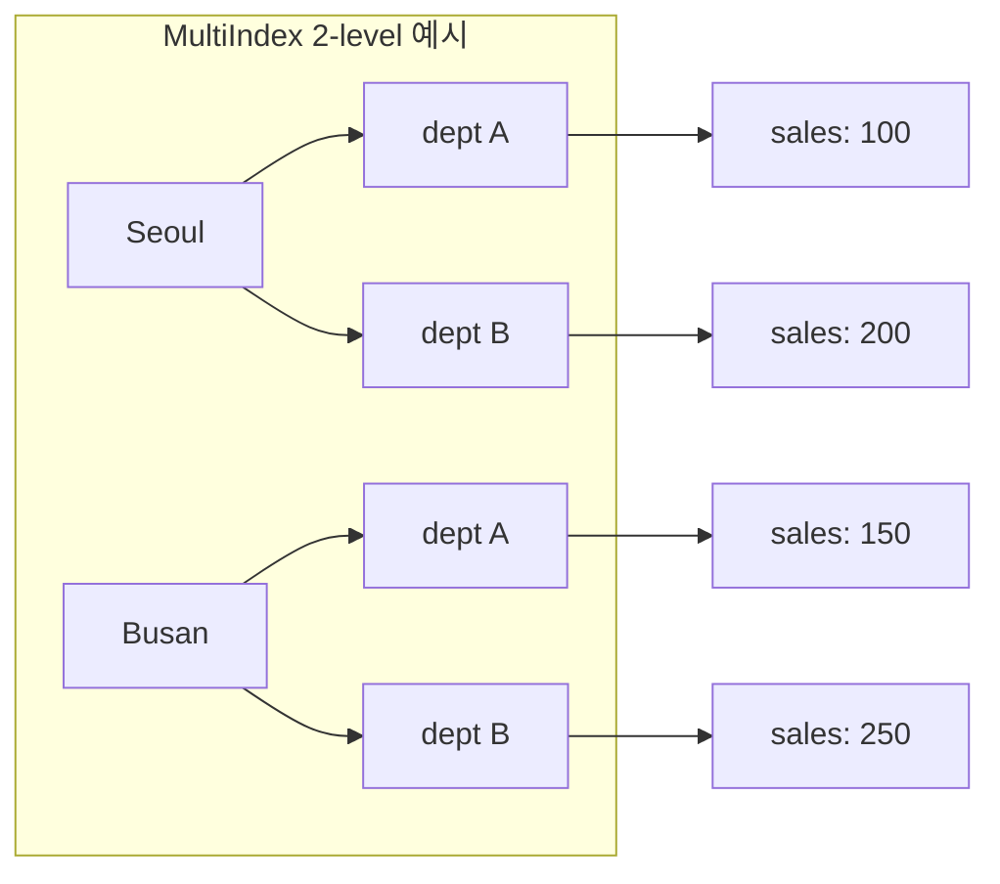

## 정의

**MultiIndex** 는 여러 단계(level)의 라벨로 구성된 [[Pandas Index]]. SQL의 composite key와 비슷하며, 그룹화된 데이터를 자연스럽게 표현한다. `groupby`, `pivot_table`, `stack` 등이 자동으로 생성하는 인덱스 형태.

## 사용 상황

MultiIndex가 자연스럽게 등장하는 상황:

- **`groupby` 집계**: `df.groupby(['city', 'dept']).sum()` 결과는 `(city, dept)` MultiIndex 행
- **`pivot_table`**: `index=['year', 'quarter']` 조합 시 MultiIndex 행 생성
- **`stack`**: DataFrame 컬럼을 행 레벨로 내릴 때 자동 생성
- **패널 데이터**: 날짜 + 종목 같은 2차원 식별자 구조
- **계층 보고서**: 지역 > 부서 > 제품 같은 계층적 집계 결과

데이터가 평탄한 구조면 MultiIndex 없이 일반 컬럼으로 두는 게 간단하다. 행/열 변환이 필요하거나, 계층 구조를 그대로 보존해야 할 때 MultiIndex가 빛난다.

## 구조 시각화



## 생성

```python
import pandas as pd

# from_tuples
mi = pd.MultiIndex.from_tuples(
    [('Seoul', 'A'), ('Seoul', 'B'), ('Busan', 'A')],
    names=['city', 'dept']
)

# from_product (직교곱): 모든 조합 자동 생성
mi = pd.MultiIndex.from_product(
    [['Seoul', 'Busan'], ['A', 'B']],
    names=['city', 'dept']
)

# from_arrays
mi = pd.MultiIndex.from_arrays(
    [['Seoul', 'Seoul', 'Busan'], ['A', 'B', 'A']],
    names=['city', 'dept']
)

# groupby 결과: 자동으로 MultiIndex
df.groupby(['city', 'dept']).sum().index
```

## 인덱싱

<CodeWithOutput
  language="python"
  outputLanguage="text"
  code={`import pandas as pd
mi = pd.MultiIndex.from_tuples(
    [('Seoul','A'),('Seoul','B'),('Busan','A'),('Busan','B')],
    names=['city','dept']
)
df = pd.DataFrame({'sales':[100,200,150,250]}, index=mi)
print(df)
print('---')
print(df.loc['Seoul'])           # outer level
print('---')
print(df.loc[('Seoul','A')])     # tuple 로 양쪽 level`}
  output={`             sales
city  dept
Seoul A        100
      B        200
Busan A        150
      B        250
---
      sales
dept
A       100
B       200
---
sales    100
Name: (Seoul, A), dtype: int64`}
/>

| city | dept | sales |
|---|---|---|
| Seoul | A | 100 |
| Seoul | B | 200 |
| Busan | A | 150 |
| Busan | B | 250 |

## slice / cross-section

```python
df.xs('Seoul', level='city')          # cross-section
df.xs('A', level='dept')

# IndexSlice: 더 직관적인 다차원 슬라이스
idx = pd.IndexSlice
df.loc[idx[:, 'A'], :]                # 모든 city 의 dept='A'
df.loc[idx['Seoul':, 'A':'B'], :]     # city 범위 + dept 범위
```

## stack / unstack 으로 변환

```python
df.unstack('dept')                    # dept 가 컬럼 level 로
df.unstack()                          # 가장 안쪽 index level -> 컬럼
df.stack()                            # 컬럼 -> index (역변환)
```

상세 사용법: [[Pandas stack-unstack]]

## level 조작

```python
df.reset_index()                              # MultiIndex 해제 -> 일반 컬럼
df.reset_index(level='dept')                  # 일부만 해제
df.swaplevel('city', 'dept')                  # level 순서 바꿈
df.sort_index(level=['city', 'dept'])         # level 별 정렬
df.droplevel('dept')                          # level 제거
df.rename_axis(index=['도시', '부서'])        # level 이름 변경
```

## groupby 와의 자연스러운 결합

```python
# groupby 결과는 자동 MultiIndex
result = df.groupby(['city', 'dept'])['sales'].sum()
result.unstack('dept')              # 시각화에 좋은 wide format

# agg 결과도 MultiIndex
agg = df.groupby(['city', 'dept']).agg({'sales': ['sum', 'mean']})
# 컬럼이 ('sales', 'sum'), ('sales', 'mean') MultiIndex
```

## MultiIndex 컬럼

행뿐 아니라 컬럼도 multi-level 가능.

```python
df.pivot_table(index='city', columns=['dept', 'quarter'], values='sales')
# 컬럼이 (dept, quarter) MultiIndex
```

## 평탄화

```python
# 컬럼 MultiIndex -> 단일 컬럼명
df.columns = ['_'.join(map(str, c)) for c in df.columns]
# ('sales', 'A') -> 'sales_A'

# reset_index 로 행 MultiIndex 해제
df_flat = df.reset_index()
```

## 실전 패턴

### 교차 집계 후 wide 변환

```python
import pandas as pd

data = {
    'city': ['Seoul', 'Seoul', 'Busan', 'Busan', 'Seoul', 'Busan'],
    'dept': ['A', 'B', 'A', 'B', 'A', 'B'],
    'q': ['Q1', 'Q1', 'Q1', 'Q1', 'Q2', 'Q2'],
    'sales': [100, 200, 150, 250, 120, 180],
}
df = pd.DataFrame(data)

# groupby -> MultiIndex -> unstack 으로 wide format
pivot = (
    df.groupby(['city', 'dept', 'q'])['sales']
    .sum()
    .unstack('q')
    .fillna(0)
)
print(pivot)
```

### 특정 level 필터 후 집계

```python
# dept='A' 인 행만 선택 후 city 별 합계
df_mi = df.groupby(['city', 'dept'])['sales'].sum()
dept_a = df_mi.xs('A', level='dept')
# 결과: city 별 A dept 합계 Series
```

### IndexSlice 로 범위 선택

```python
df_mi = df.groupby(['city', 'dept'])['sales'].sum()
df_mi = df_mi.sort_index()

idx = pd.IndexSlice
# Seoul 만, 모든 dept
seoul_sales = df_mi.loc[idx['Seoul', :]]
```

### 두 기간 MultiIndex 비교

```python
# pandas 2.x 스타일: 작년 vs 올해 비교
this_year = (
    df[df['year'] == 2025]
    .groupby(['city', 'dept'])['sales']
    .sum()
)
last_year = (
    df[df['year'] == 2024]
    .groupby(['city', 'dept'])['sales']
    .sum()
)

diff = this_year.subtract(last_year, fill_value=0)
pct  = diff / last_year.replace(0, float('nan')) * 100
```

### MultiIndex 컬럼 평탄화 후 저장

```python
result = df.groupby(['region', 'dept']).agg({'sales': ['sum', 'mean', 'std']})
# 컬럼: ('sales', 'sum'), ('sales', 'mean'), ('sales', 'std')

result.columns = ['_'.join(c) for c in result.columns]
# 'sales_sum', 'sales_mean', 'sales_std'

result.reset_index().to_csv('output.csv', index=False)
```

## 성능

| 상황 | 권장 |
|:---|:---|
| 정렬되지 않은 MultiIndex 슬라이스 | `sort_index()` 선행 필수, `PerformanceWarning` 방지 |
| `xs()` vs `loc[idx]` | `xs()` 가독성 좋으나 `loc[]` 가 약간 빠름 |
| `unstack()` 후 sparse한 경우 | NaN 폭증 주의, `fillna()` 또는 long-format 유지 |
| 수백만 행 MultiIndex | `reset_index()` 후 일반 컬럼 처리가 간편한 경우 많음 |
| 반복 필터 | `IndexSlice` 캐싱보다 `reset_index()` 후 boolean mask 가 빠를 수 있음 |

```python
# PerformanceWarning 방지: 슬라이스 전 반드시 정렬
df = df.sort_index()
df.loc['Seoul':'Busan']

# 대용량: reset_index 후 boolean mask 가 더 빠를 수 있음
df_flat = df.reset_index()
df_flat[(df_flat['city'] == 'Seoul') & (df_flat['dept'] == 'A')]
```

## 함정

### 1. tuple vs list

```python
df.loc[('Seoul', 'A')]      # 단일 인덱스 -> Series
df.loc[[('Seoul', 'A')]]    # 리스트 -> DataFrame 유지
df.loc['Seoul', 'A']        # 행 라벨 + 컬럼 라벨로 해석 (다른 의미!)
```

### 2. SettingWithCopyWarning / ChainedAssignmentError

> [!WARNING]
> MultiIndex에서 체이닝 인덱싱 사고가 더 자주 발생한다. pandas 2.x 에서는 `ChainedAssignmentError` 로 바뀐다. `.loc[idx, col] =` 한 줄로 처리해야 한다.

```python
# ❌ 체이닝 인덱싱 (pandas 2.x: ChainedAssignmentError)
df.loc['Seoul']['sales'] = 999

# ✓ 단일 loc
df.loc[('Seoul', 'A'), 'sales'] = 999
```

### 3. 정렬 안 된 MultiIndex 슬라이스

```python
df.loc['Seoul':'Busan']    # PerformanceWarning: lexsort 안 됨
df = df.sort_index()       # 정렬 후 사용
```

### 4. level 이름 없는 MultiIndex

```python
# names 가 None -> xs(level=0) 등 위치로 참조해야 해 불편
mi = pd.MultiIndex.from_tuples([('Seoul', 'A'), ('Busan', 'B')])
# ✓ 항상 names 지정
mi = pd.MultiIndex.from_tuples(
    [('Seoul', 'A'), ('Busan', 'B')],
    names=['city', 'dept']
)
```

### 5. groupby 후 MultiIndex 해제 필망

```python
# groupby 결과를 일반 DataFrame 으로 쓰려면 reset_index 필요
result = df.groupby(['city', 'dept'])['sales'].sum()
result_df = result.reset_index()   # 일반 컬럼 DataFrame
```

## 관련 위키

- [[Pandas Index]]
- [[Pandas groupby]]
- [[Pandas stack-unstack]]
- [[Pandas pivot_table]]
- [[Pandas .loc / .iloc]]
- [[SettingWithCopyWarning]]
- [[Pandas DataFrame]]
- [[Pandas 성능 / 메모리 최적화]]
