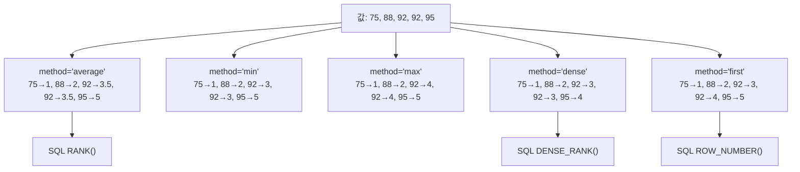

## 정의

- **`nlargest(n, cols)`** : 상위 N 개 행 (`sort_values + head` 보다 빠름)
- **`nsmallest(n, cols)`** : 하위 N 개 행
- **`rank()`** : 각 원소의 순위 (1, 2, 3, ...)

## rank method 비교 시각화



## nlargest / nsmallest

```python
df.nlargest(5, 'salary')
df.nsmallest(3, 'age')
df.nlargest(5, ['salary', 'age'])   # 다중 키 (salary 우선, 동률 시 age)
```

<CodeWithOutput
  language="python"
  outputLanguage="text"
  code={`import pandas as pd
df = pd.DataFrame({
    'name': ['A','B','C','D','E','F'],
    'score': [88, 92, 75, 92, 95, 81],
})
print(df.nlargest(3, 'score'))`}
  output={`  name  score
4    E     95
1    B     92
3    D     92`}
/>

| | name | score |
|---|------|-------|
| 4 | E | 95 |
| 1 | B | 92 |
| 3 | D | 92 |

### keep 옵션

```python
df.nlargest(3, 'score', keep='first')   # 동률 시 먼저 등장 우선 (기본)
df.nlargest(3, 'score', keep='last')    # 나중 등장 우선
df.nlargest(3, 'score', keep='all')     # 동률 모두 포함 (3 개 초과 가능)
```

### 왜 sort + head 보다 빠른가

`nlargest` 는 N 크기의 힙으로 부분 정렬, **O(n log k)**. 전체 정렬은 O(n log n).
- n = 1,000,000, k = 10 일 때 차이 큼

## rank

각 원소에 순위를 매긴다.

```python
df['rank'] = df['score'].rank(ascending=False)
```

<CodeWithOutput
  language="python"
  outputLanguage="text"
  code={`import pandas as pd
s = pd.Series([88, 92, 75, 92, 95])
print(s.rank(method='min'))           # 동률은 가장 작은 순위
print(s.rank(method='dense'))         # 동률은 같은 순위, 다음은 +1
print(s.rank(method='average'))       # 동률은 평균
print(s.rank(ascending=False).tolist())   # 내림차순 (큰 값이 1)`}
  output={`0    2.0
1    3.0
2    1.0
3    3.0
4    5.0
dtype: float64
0    2.0
1    3.0
2    1.0
3    3.0
4    4.0
dtype: float64
0    2.0
1    3.5
2    1.0
3    3.5
4    5.0
dtype: float64
[4.0, 2.5, 5.0, 2.5, 1.0]`}
/>

### method 옵션 비교

| method | 92, 92 인 경우 | 다음 순위 | SQL 대응 |
|:---|:---|:---|:---|
| `average` | 3.5, 3.5 | 5 | - |
| `min` | 3, 3 | 5 | `RANK()` |
| `max` | 4, 4 | 5 | - |
| `dense` | 3, 3 | 4 | `DENSE_RANK()` |
| `first` | 3, 4 | 5 | `ROW_NUMBER()` |

## 그룹별 순위 (SQL 의 ROW_NUMBER OVER PARTITION BY)

```python
df['rank_in_dept'] = df.groupby('dept')['salary'].rank(ascending=False)
```

[[Pandas groupby]] + rank.

<CodeWithOutput
  language="python"
  outputLanguage="text"
  code={`import pandas as pd
df = pd.DataFrame({
    'dept': ['Dev','Dev','HR','HR','Dev'],
    'name': ['A','B','C','D','E'],
    'salary': [5000, 7000, 4000, 6000, 6000],
})
df['rank'] = df.groupby('dept')['salary'].rank(method='dense', ascending=False)
cols = ['dept', 'name', 'salary', 'rank']
print(df[cols])`}
  output={`  dept name  salary  rank
0  Dev    A    5000   3.0
1  Dev    B    7000   1.0
2   HR    C    4000   2.0
3   HR    D    6000   1.0
4  Dev    E    6000   2.0`}
/>

## 분위수

```python
df['quartile'] = pd.qcut(df['score'], 4, labels=['Q1','Q2','Q3','Q4'])
df['percentile'] = df['score'].rank(pct=True)   # 0.0~1.0
```

`rank(pct=True)` 는 백분위 (0~1).

## 실전 패턴

### Top-N 필터 (그룹별)

```python
# 부서별 연봉 상위 2명
df['rank'] = df.groupby('dept')['salary'].rank(method='min', ascending=False)
top2 = df[df['rank'] <= 2]
```

### 증가율 Top-N

```python
df['growth'] = df['revenue'].pct_change()
growth_cols = ['name', 'revenue', 'growth']
top5_growth = df.nlargest(5, 'growth')[growth_cols]
```

### 순위 변동 추적

```python
# 이번 달 순위 - 지난 달 순위
df['rank_change'] = df['rank_prev'] - df['rank_curr']
df.nlargest(5, 'rank_change')   # 가장 많이 오른 항목
```

### 분위수 기반 세그먼트

<CodeWithOutput
  language="python"
  outputLanguage="text"
  code={`import pandas as pd
df = pd.DataFrame({'score': [45, 60, 72, 85, 91, 55, 78, 63, 88, 50]})
df['tier'] = pd.qcut(df['score'], q=3, labels=['하위','중위','상위'])
print(df.groupby('tier', observed=True)['score'].agg(['min','max','count']))`}
  output={`       min  max  count
tier
하위    45   60      4
중위    63   78      3
상위    85   91      3`}
/>

## 성능

```python
# nlargest vs sort + head
import timeit

# sort_values + head: O(n log n)
# nlargest: O(n log k), k << n 일 때 크게 유리

# 1M 행에서 Top-10 추출
# nlargest: ~0.05s
# sort_values + head: ~0.3s

# 다중 컬럼 정렬은 nlargest 에서도 내부 sort 사용 가능
df.nlargest(10, ['col_a', 'col_b'])   # col_a 우선, 동률 시 col_b
```

## 자주 만나는 함정

### 1. rank 의 기본 method

`rank()` 의 기본은 `'average'`, 동률을 평균값으로 둔다. 정수 순위를 원하면 `method='min'` 또는 `'dense'`.

> [!IMPORTANT]
> `rank()` 기본 `method='average'` 는 동률 시 float 값을 반환한다 (3.5 등). 정수 순위가 필요하면 `method='min'` (SQL RANK) 또는 `method='dense'` (SQL DENSE_RANK) 를 명시.

### 2. NaN 처리

```python
s.rank(na_option='keep')      # NaN 은 NaN (기본)
s.rank(na_option='top')       # NaN 을 가장 높은 순위 (가장 큰 값처럼)
s.rank(na_option='bottom')    # NaN 을 가장 낮은 순위 (가장 작은 값처럼)
```

### 3. nlargest 의 다중 키

```python
df.nlargest(3, ['a', 'b'])
# 'a' 가 더 우선, 'b' 는 동률일 때만 결정
```

### 4. ascending 방향 혼동

```python
df['rank'] = df['score'].rank(ascending=False)
# ascending=False 면 높은 점수가 낮은 순위 번호 (1위, 2위...)
# ascending=True (기본) 면 낮은 값이 1위
```

> [!WARNING]
> `rank(ascending=True)` 가 기본값이다. 점수가 높을수록 1위가 되게 하려면 반드시 `ascending=False`. 이를 빠뜨리면 순위가 반전된다.

## 관련 위키

- [[Pandas sort_values / sort_index]]
- [[Pandas groupby]]
- [[Pandas agg]]
- [[Pandas cut / qcut]]
- [[Pandas idxmax]]
