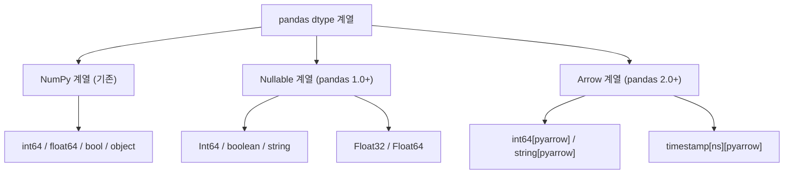
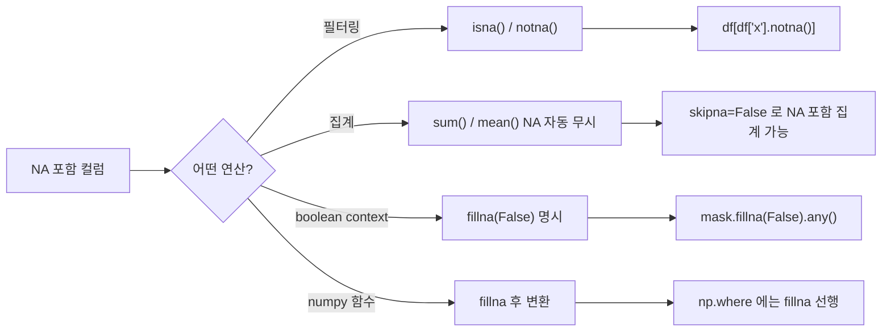

## 정의

**Nullable dtypes** 는 NaN/None 을 **타입 그대로** 표현할 수 있는 pandas 의 새 타입 시스템. NumPy 기반의 `int64` (NaN 미허용) 의 한계를 극복.

- **`Int8`, `Int16`, `Int32`, `Int64`** : nullable 정수 (대문자 I)
- **`UInt8`, ..., `UInt64`** : unsigned
- **`Float32`, `Float64`** : nullable 실수
- **`boolean`** : nullable bool
- **`string`** : 명시적 문자열 (object 대신)

## dtype 계열 시각화



## 사용 상황

| 상황 | 권장 dtype |
|:---|:---|
| NaN 포함 정수 컬럼 | `Int64` (nullable) |
| DB 에서 읽어 온 bool | `boolean` |
| 문자열 메모리 절약 | `string[pyarrow]` |
| Arrow 파이프라인 통합 | `dtype_backend='pyarrow'` |
| 단순 수치 연산 (NaN 없음) | `int64` / `float64` (NumPy, 빠름) |

## 왜 필요한가

### NaN 이 있으면 int → float 강등 문제

```python
import pandas as pd
import numpy as np
df = pd.DataFrame({'count': [1, 2, None, 4]})
df['count'].dtype     # float64 (NaN 때문에 int 못 함)
```

NumPy 의 `int64` 는 NaN 표현 불가 → NaN 행이 하나라도 있으면 float 로 변환.

### nullable 로 해결

```python
df['count'] = df['count'].astype('Int64')   # 대문자 I
df['count']
# 0       1
# 1       2
# 2    <NA>
# 3       4
# dtype: Int64
```

정수 유지 + NaN 표현.

## 사용

```python
df = df.astype({
    'id': 'Int32',
    'is_active': 'boolean',
    'name': 'string',
})

# read_csv 에서 직접
df = pd.read_csv('data.csv', dtype={
    'id': 'Int32',
    'is_active': 'boolean',
})

# pyarrow backend (pandas 2.0+)
df = pd.read_csv('data.csv', dtype_backend='numpy_nullable')
```

## pd.NA

nullable dtype 의 결측치 표현.

```python
pd.NA
# 산술: any op with pd.NA = pd.NA
pd.NA + 1            # <NA>
pd.NA == pd.NA       # <NA> (NaN 처럼)
```

NaN 과 다르게 **boolean context 에서 ambiguous** → 명시적 비교 필요.

```python
df['x'] == 5     # 결과에 pd.NA 가 섞일 수 있음
# 필터링은 isna() / notna() 활용
df[df['x'].notna() & (df['x'] == 5)]
```

## string dtype

```python
df['name'] = df['name'].astype('string')   # 명시적 string
df['name'] = df['name'].astype('string[pyarrow]')   # arrow 백킹 (더 빠름)
```

### object vs string vs string[pyarrow]

| dtype | 저장 | str accessor | 메모리 |
|:---|:---|:---:|:---|
| `object` | Python str 리스트 | ✓ | 큼 |
| `string` | pandas 내부 | ✓ | 중간 |
| `string[pyarrow]` | Arrow 백킹 | ✓ | **작음** |

문자열 컬럼은 가능하면 `string[pyarrow]` 권장.

## pyarrow backend (pandas 2.0+)

```python
pd.options.mode.dtype_backend = 'pyarrow'
df = pd.read_csv('data.csv', dtype_backend='pyarrow')
df.dtypes
# id            int64[pyarrow]
# name          string[pyarrow]
# created_at    timestamp[ns][pyarrow]
```

Arrow 백킹의 장점:
- 메모리 효율
- 빠른 IO (Parquet 와 호환)
- 정밀한 dtype (timezone, decimal 등)

[[Pandas pyarrow backend]] 참고.

## 타입별 메모리 비교

```python
import pandas as pd

s_obj = pd.Series(['hello'] * 10_000, dtype='object')
s_str = pd.Series(['hello'] * 10_000, dtype='string')
s_arrow = pd.Series(['hello'] * 10_000, dtype='string[pyarrow]')

# deep=True 로 실제 Python 객체 포함 측정
print(s_obj.memory_usage(deep=True))    # ~590000 bytes
print(s_str.memory_usage(deep=True))    # ~590000 bytes
print(s_arrow.memory_usage(deep=True))  # ~50000 bytes (10x 이상 절약)
```

## pandas 2.x 전환 패턴

```python
# 전체 DataFrame 을 nullable 로 일괄 전환
df = df.convert_dtypes()
# int64 -> Int64, object -> string, float64 -> Float64 (자동 추론)

# pyarrow 전환
df = df.convert_dtypes(dtype_backend='pyarrow')
# int64 -> int64[pyarrow], string -> large_string[pyarrow]
```

### 특정 컬럼만 선택적 전환

```python
int_cols = df.select_dtypes('int').columns
df[int_cols] = df[int_cols].astype('Int64')

str_cols = df.select_dtypes('object').columns
df[str_cols] = df[str_cols].astype('string')
```

## 타입 간 연산 동작

```python
s_int = pd.array([1, 2, pd.NA, 4], dtype='Int64')
s_float = pd.array([1.5, 2.5, pd.NA, 4.5], dtype='Float64')

# 산술: NA 전파
s_int + 10           # [11, 12, <NA>, 14]
s_int + s_float      # [2.5, 4.5, <NA>, 8.5]

# 비교
s_int > 2            # [False, False, <NA>, True] (boolean dtype 반환)

# 집계: NA 자동 무시
s_int.sum()          # 7  (1+2+4)
s_int.mean()         # 2.333...  (NA 제외)
```

## NA 처리 흐름



## 자주 만나는 함정

### 1. Int64 (NumPy) vs Int64 (nullable)

```python
df['x'].astype('int64')        # NumPy, NaN 미허용
df['x'].astype('Int64')        # nullable, NaN 허용
```

대소문자가 의미를 바꾼다.

### 2. boolean 의 truthiness

```python
mask = df['active']            # boolean dtype, pd.NA 가능
if mask.any():                  # ambiguous (NA 때문에 TypeError)
mask.fillna(False).any()        # ✓ 명시적
```

### 3. 일부 NumPy 함수 미지원

일부 numpy 함수는 pandas nullable 을 직접 처리 못 함. 변환이 필요.

```python
np.where(df['flag'], 'A', 'B')  # boolean dtype 에서 동작 안 할 수 있음
np.where(df['flag'].fillna(False), 'A', 'B')   # 회피
```

### 4. arrow string 의 일부 regex

대부분 동작하지만 일부 특수 regex 옵션은 fallback 가능. 표준 str 메서드만 쓰는 것이 안전.

### 5. to_parquet / to_csv 호환성

```python
# nullable dtype 은 parquet 로 저장할 때 pyarrow 가 알아서 처리
df.to_parquet('out.parquet')   # ✓ 정상 동작

# CSV 는 pd.NA 가 빈 문자열로 출력됨
df.to_csv('out.csv')           # <NA> -> 빈 문자열
```

### 6. groupby + nullable key

```python
# pandas 2.x 에서 groupby key 가 nullable 이면 NA 그룹 처리
df.groupby('id_nullable', dropna=False).sum()
# dropna=False 로 NA 그룹 포함 (기본은 NA 그룹 제외)
```

### 7. concat 후 dtype 변화

```python
df1 = pd.DataFrame({'x': pd.array([1, 2], dtype='Int64')})
df2 = pd.DataFrame({'x': [3, 4]})          # int64 (NumPy)
pd.concat([df1, df2])['x'].dtype            # float64 (강등 가능)

# 안전하게
df2['x'] = df2['x'].astype('Int64')
pd.concat([df1, df2])['x'].dtype            # Int64 유지
```

## pandas 3.0 의 미래

pandas 3.0 부터 **Arrow 가 기본 백킹**이 될 예정. 지금부터 nullable dtype 에 익숙해지면 마이그레이션이 쉽다.

## 관련 위키

- [[Pandas replace / astype]]
- [[Pandas pyarrow backend]]
- [[Pandas read_csv]]
- [[Pandas read_parquet / to_parquet]]
- [[Pandas dropna / fillna]]
- [[Pandas DataFrame]]
