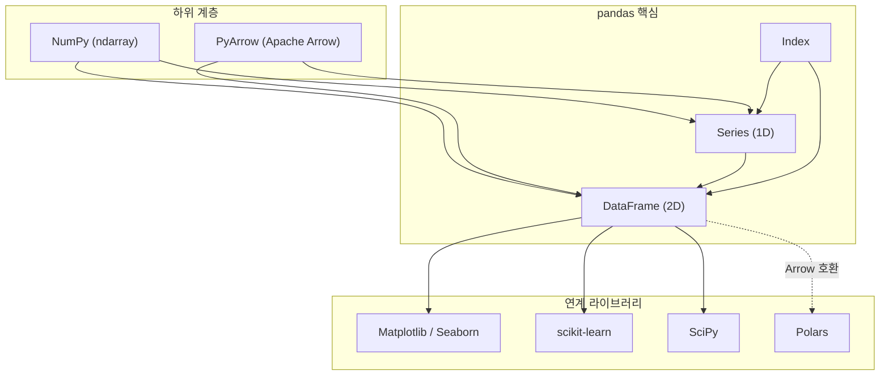
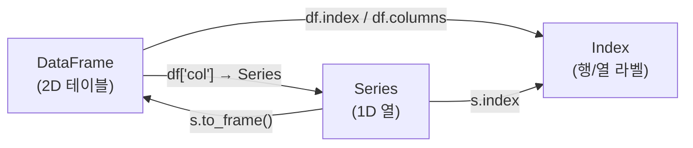

## 정의

**pandas** 는 Python 의 데이터 분석/조작 라이브러리. 두 가지 핵심 자료형을 중심으로 동작한다.

- **[[Pandas Series]]** : 1차원 레이블 배열 (NumPy array + index)
- **[[Pandas DataFrame]]** : 2차원 테이블 (행 / 열 모두 레이블)

NumPy 의 ndarray 위에 구축되어 빠른 수치 연산과 SQL/Excel 스타일의 직관적 조작을 결합. 데이터 분석, ETL, 머신러닝 전처리의 사실상 표준.

## 빠르게 보기

<CodeWithOutput
  language="python"
  label="python"
  outputLanguage="text"
  outputLabel="결과"
  code={`import pandas as pd

df = pd.DataFrame({
    'name': ['Alice', 'Bob', 'Charlie'],
    'age': [30, 25, 35],
    'city': ['Seoul', 'Busan', 'Seoul'],
})
print(df)
print(df.shape, df.dtypes.tolist())`}
  output={`      name  age   city
0    Alice   30  Seoul
1      Bob   25  Busan
2  Charlie   35  Seoul
(3, 3) [dtype('O'), dtype('int64'), dtype('O')]`}
/>

테이블 형태로 보면:

|   | name    | age | city  |
|---|---------|-----|-------|
| 0 | Alice   | 30  | Seoul |
| 1 | Bob     | 25  | Busan |
| 2 | Charlie | 35  | Seoul |

## 역사와 배경

| 연도 | 이정표 |
|:---|:---|
| 2008 | Wes McKinney, AQR Capital Management 에서 개발 시작 |
| 2009 | 오픈소스 공개 |
| 2012 | *Python for Data Analysis* 초판, 생태계 폭발적 성장 |
| 2020 | pandas 1.0 - nullable dtypes 도입 |
| 2023 | pandas 2.0 - Copy-on-Write(CoW), PyArrow 백엔드 기본화 |
| 2024 | pandas 2.2 - Arrow-backed strings, Copy-on-Write 완전 기본화 |

## pandas 생태계 구조



## NumPy / PyArrow 와의 관계

### NumPy 기반

전통적으로 pandas Series/DataFrame 의 내부는 NumPy `ndarray`. 빠른 수치 연산이 가능하지만 문자열/nullable 타입에는 약했다.

```python
import numpy as np, pandas as pd

arr = np.array([1, 2, 3])
s = pd.Series(arr)          # NumPy array 위에 index 추가
s.values                     # 다시 numpy array 로
```

### PyArrow 백엔드 (pandas 2.0+)

```python
# Arrow 기반 dtype
s = pd.Series(['a', 'b', 'c'], dtype='string[pyarrow]')
df = pd.read_csv('data.csv', dtype_backend='pyarrow')
```

PyArrow 백엔드의 장점:
- `null` 을 모든 타입에서 지원 (NumPy 는 float 만)
- 메모리 효율 향상 (columnar, compressed)
- Apache Arrow 생태계 (Polars, DuckDB, Spark) 와 무복사 교환

자세히: [[Pandas PyArrow Backend]], [[Pandas Nullable Types (Int64, boolean, string[pyarrow])]]

## 핵심 자료형



### Series

```python
s = pd.Series([10, 20, 30], index=['a', 'b', 'c'], name='score')
s.dtype   # int64
s.index   # Index(['a', 'b', 'c'])
```

### DataFrame

```python
df = pd.DataFrame({'x': [1, 2], 'y': [3, 4]})
df.columns  # Index(['x', 'y'])
df['x']     # Series
```

### Index

행과 열 모두 `Index` 객체. `RangeIndex`, `DatetimeIndex`, `MultiIndex` 등 여러 서브타입이 있다.

자세히: [[Pandas Series]], [[Pandas DataFrame]], [[Pandas Index]]

## 어디에 쓰는가

| 영역 | 예 |
|:---|:---|
| 데이터 ETL | CSV/Excel/DB 읽기 → 정제 → 저장 |
| 탐색적 분석 (EDA) | `describe()`, `value_counts()`, 시각화 |
| ML 전처리 | 결측치 처리, encoding, scaling |
| 시계열 분석 | resample, rolling, 이동평균 |
| 보고서 자동화 | pivot/groupby + 차트 |

## 주요 I/O

```python
# 읽기
df = pd.read_csv('data.csv')
df = pd.read_excel('data.xlsx')
df = pd.read_parquet('data.parquet')
df = pd.read_sql('SELECT * FROM t', conn)

# 쓰기
df.to_csv('out.csv', index=False)
df.to_parquet('out.parquet')
df.to_json('out.json', orient='records', lines=True)
```

자세히: [[Pandas read_csv]], [[Pandas read_excel]], [[Pandas read_parquet]], [[Pandas read_sql]]

## 학습 경로

1. **자료형 이해**: [[Pandas Series]], [[Pandas DataFrame]], [[Pandas Index]]
2. **I/O**: [[Pandas read_csv]], [[Pandas read_excel]]
3. **선택**: [[Pandas .loc / .iloc]], [[Pandas query]]
4. **필터링**: [[Pandas Boolean Indexing]]
5. **그룹/집계**: [[Pandas groupby]]
6. **변형**: [[Pandas pivot]], [[Pandas melt]]
7. **결합**: [[Pandas merge]]

## 버전 관습

| 버전 | 주요 변경 |
|:---|:---|
| 0.x | 레거시. `append()`, `Panel` 등 deprecated API |
| 1.x | nullable Int64/boolean dtypes, `pd.NA` 도입 |
| 2.0 (2023) | Copy-on-Write, PyArrow 백엔드, `int64` 기본 nullable |
| 2.1 | `infer_string` 옵션 (str → ArrowDtype) |
| 2.2 | Copy-on-Write 완전 기본화, Arrow-backed string 기본 |

본 wiki 는 **2.x 기준** 으로 작성. 1.x 와 차이가 있는 부분은 명시.

## 성능 특성

| 연산 | 빠름 | 느림 |
|:---|:---|:---|
| 수치 벡터 연산 | ✓ NumPy 활용 | - |
| 행 단위 반복 (`iterrows`) | - | ✓ Python 오버헤드 큼 |
| 대용량 필터/집계 | ✓ C 레벨 | - |
| 문자열 처리 | - | ✓ Python str 오버헤드 |
| Arrow 백엔드 문자열 | ✓ 개선됨 | - |

10M+ 행 이상의 대용량 처리에는 [[Pandas PyArrow Backend]] 나 Polars/DuckDB 고려.

자세히: [[Pandas 성능 / 메모리 최적화]]

## 함정

> [!WARNING]
> **`df.append()` 는 pandas 2.0 에서 제거됐다.** `pd.concat([df, new_row])` 를 사용하라.

```python
# ❌ pandas 1.x
df = df.append({'a': 1}, ignore_index=True)

# ✓ pandas 2.x
df = pd.concat([df, pd.DataFrame([{'a': 1}])], ignore_index=True)
```

> [!CAUTION]
> **`inplace=True` 는 method chaining 을 깨고 반환값이 `None`** 이다. 일관성을 위해 `inplace=False` (기본) 를 권장한다.

## 관련 위키

- [[Pandas Series]]
- [[Pandas DataFrame]]
- [[Pandas Index]]
- [[Pandas .loc / .iloc]]
- [[Pandas groupby]]
- [[Pandas merge]]
- [[Pandas 성능 / 메모리 최적화]]
- [[Pandas PyArrow Backend]]
