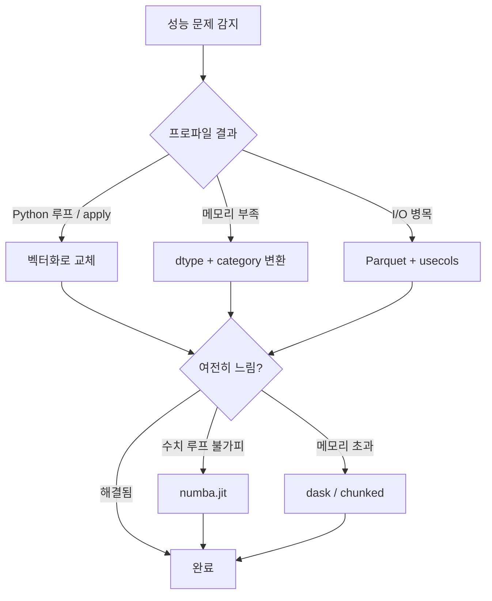

## 정의

pandas 의 흔한 성능 함정과 최적화 패턴. **벡터화 + dtype 선택 + 알고리즘** 의 조합이 핵심.

## 사용 상황

| 상황 | 권장 접근 |
|:---|:---|
| 단순 사칙연산 느림 | 벡터화, 내장 메서드 사용 |
| 메모리 부족 (OOM) | dtype 변환, `category` 활용 |
| CSV 로드 병목 | Parquet 전환, `usecols` 지정 |
| 수치 루프 피할 수 없음 | `numba.jit` |
| 수억 행 이상 처리 | dask / polars / modin 검토 |
| groupby / join 느림 | 키 dtype 통일, 정렬 선행 |

## 최적화 의사결정 흐름



## 1. 벡터 연산 우선

```python
# ❌ Python loop (느림)
for i in range(len(df)):
    df.iloc[i, 0] = df.iloc[i, 1] * 2

# ❌ apply 행마다 (좀 느림)
df['c'] = df.apply(lambda r: r['a'] * r['b'], axis=1)

# ✓ 벡터 연산 (빠름)
df['c'] = df['a'] * df['b']
```

100배 이상 차이.

## 2. dtype 명시로 메모리 절약

<CodeWithOutput
  language="python"
  outputLanguage="text"
  code={`import pandas as pd
import numpy as np

n = 1_000_000
df = pd.DataFrame({
    'id': np.arange(n),
    'small_int': np.random.randint(0, 100, n),
    'category': np.random.choice(['A','B','C','D'], n),
})

print('기본:', df.memory_usage(deep=True).sum() // 1024, 'KB')

# 최적화
df['id'] = df['id'].astype('int32')
df['small_int'] = df['small_int'].astype('int8')
df['category'] = df['category'].astype('category')

print('최적화:', df.memory_usage(deep=True).sum() // 1024, 'KB')`}
  output={`기본: 64453 KB
최적화: 4889 KB`}
/>

13 배 절감. 작은 dtype 가능 여부 확인.

| 정수 범위 | dtype |
|:---|:---|
| -128 ~ 127 | `int8` |
| -32,768 ~ 32,767 | `int16` |
| 약 ±21억 | `int32` |
| 그 이상 | `int64` |

`pd.api.types.infer_dtype` 또는 [`df.info(memory_usage='deep')`](https://pandas.pydata.org/docs/reference/api/pandas.DataFrame.info.html) 로 점검.

## 3. category dtype 활용

문자 컬럼에서 고유값이 적으면 [[Pandas Categorical]] 로 변환. 메모리 + groupby/merge 속도 모두 개선.

```python
df['city'] = df['city'].astype('category')
```

## 4. inplace vs assign

```python
df.sort_values('age', inplace=True)    # 옛날엔 빠르다고 했지만
df = df.sort_values('age')              # 사실 비슷, 명시성 좋음
```

inplace 가 메모리 절약 효과가 거의 없는 경우가 많다 (내부 복사 발생).

## 5. read_csv 의 최적화

```python
df = pd.read_csv('big.csv',
    usecols=['a', 'b', 'c'],         # 필요한 컬럼만
    dtype={'a': 'int32', 'b': 'category'},
    parse_dates=['ts'],
)
```

`chunksize=` 로 스트리밍.

## 6. 큰 데이터는 Parquet

```python
df.to_parquet('out.parquet')
df = pd.read_parquet('out.parquet')
```

CSV 대비 **수십 배 빠르고 작다**, dtype 도 보존.

## 7. eval / query (numexpr 가속)

```python
# 큰 DataFrame 에서
df.eval('total = price * qty + tax')
df.query('age > 30 and city == "Seoul"')
```

작은 DataFrame 에는 오히려 느릴 수 있음 (parser 비용).

## 8. groupby 의 cython 경로 사용

```python
df.groupby('x')['y'].sum()        # cython, 빠름
df.groupby('x')['y'].apply(sum)    # Python apply, 느림
```

`agg` / 내장 메서드가 `apply` 보다 훨씬 빠르다.

## 9. 인덱스 활용

```python
df = df.set_index('user_id').sort_index()
df.loc[12345]                       # O(log n) 또는 O(1)
df[df['user_id'] == 12345]          # O(n) scan
```

자주 lookup 하는 키를 index 로.

## 10. merge 시 dtype/sort 확인

```python
# 양쪽 키가 같은 dtype 인지
left['id'] = left['id'].astype('int64')
right['id'] = right['id'].astype('int64')

# 정렬되어 있으면 merge 가 빠름
pd.merge(left.sort_values('id'), right.sort_values('id'), on='id')
```

## 11. swifter / modin / polars (외부 도구)

- **`swifter`** : pandas 의 apply 를 자동 병렬화
- **`modin`** : pandas API 호환 + 멀티코어
- **`polars`** : Arrow 기반, 종종 10-100배 빠름

큰 데이터에서 pandas 의 한계를 만나면 검토.

## 12. info / memory_usage / describe 활용

```python
df.info(memory_usage='deep')
df.memory_usage(deep=True).sort_values(ascending=False)
```

어느 컬럼이 메모리를 많이 쓰는지 확인.

## 13. 성능 측정 도구

```python
import time

# 단순 타이밍
start = time.perf_counter()
result = df.groupby('x')['y'].sum()
print(f"elapsed: {time.perf_counter() - start:.4f}s")

# cProfile
import cProfile
cProfile.run(
    "df.groupby('x')['y'].agg(['sum', 'mean'])",
    sort='cumulative'
)

# 컬럼별 메모리 내림차순
df.memory_usage(deep=True).sort_values(ascending=False)
```

Jupyter 에서는 `%timeit`, `%time` 셀 매직이 더 편리하다.
`memory_usage(deep=True)` 로 병목 컬럼을 파악하고 dtype 최적화 대상을 선정.

## 14. numba (수치 루프 가속)

Python 루프가 꼭 필요하고 벡터화 표현이 불가능한 경우:

```python
from numba import njit
import numpy as np

@njit(cache=True)
def rolling_ratio(arr, window):
    n = len(arr)
    out = np.empty(n)
    for i in range(n):
        total = 0.0
        cnt = 0
        for j in range(max(0, i - window + 1), i + 1):
            total += arr[j]
            cnt += 1
        out[i] = total / cnt if cnt else 0.0
    return out

# 첫 호출: JIT 컴파일, 이후 호출: C 수준 속도
df['rolling_avg'] = rolling_ratio(df['value'].to_numpy(), window=7)
```

- `cache=True` 로 컴파일 결과를 디스크에 저장해 재기동 시 재컴파일 생략
- GPU 가속이 필요하면 RAPIDS cuDF 검토
- 함수 시그니처가 바뀌면 캐시 무효화됨

## 15. Dask (메모리 초과 대용량 처리)

단일 머신 메모리를 넘는 데이터:

```python
import dask.dataframe as dd

# 여러 CSV 를 lazy 로드
ddf = dd.read_csv('data/*.csv', dtype={'id': 'int32'})

# pandas 와 유사한 API
result = ddf.groupby('city')['revenue'].sum().compute()

# Parquet 파티셔닝 출력
ddf.to_parquet('out/', partition_on=['year'])
```

`compute()` 호출 전까지 실제 연산은 발생하지 않음 (lazy evaluation).
`dask.distributed` 로 클러스터 분산 처리도 가능.

## 함정

### 1. chained indexing

```python
df['col'][idx] = 1            # ⚠️ view 일지 copy 일지 모호
df.loc[idx, 'col'] = 1        # ✓ 한 줄 indexer
```

### 2. concat in loop

```python
result = pd.DataFrame()
for chunk in chunks:
    result = pd.concat([result, chunk])    # ❌ O(n²)

# ✓ 한 번에
result = pd.concat(chunks)
```

### 3. apply 의 axis=1

```python
df.apply(fn, axis=1)
# 행마다 Python 함수 호출, 가장 느린 패턴
```

벡터 연산 / 내장 메서드로 표현 가능한지 먼저 확인.

## 참고

- [[Pandas DataFrame]]
- [[Pandas Categorical]]
- [[Pandas read_csv]]
