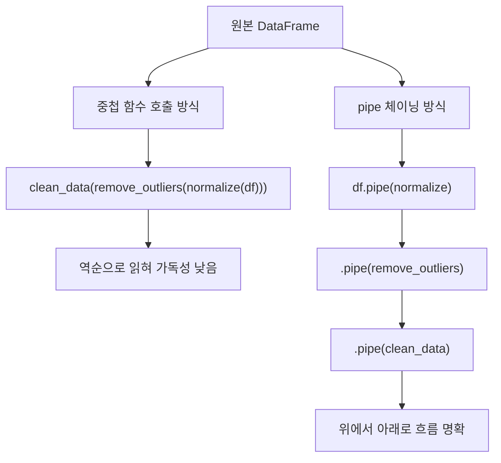
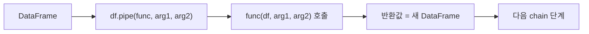

## 정의

**`DataFrame.pipe(func, *args, **kwargs)`** 는 **method chain 안에 사용자 함수를 끼워 넣기**. `func(df, ...)` 와 동등하지만 chain 의 흐름을 유지한다.

```python
df.pipe(my_func, arg1, arg2)
# = my_func(df, arg1, arg2)
```

## 사용 상황

| 상황 | pipe 활용 |
|:---|:---|
| 사용자 함수를 chain 에 끼워 넣기 | `.pipe(my_func)` |
| 데이터 전처리 파이프라인 구성 | `.pipe(normalize).pipe(clean)` |
| chain 중간에 로깅 / 검증 | `.pipe(log_shape).pipe(assert_no_null)` |
| func 의 첫 인자가 df 가 아닐 때 | `.pipe((func, 'df_kwarg'), ...)` |
| 함수형 스타일 데이터 변환 | `df -> f -> g -> h -> result` |

## 시각화

중첩 호출 vs pipe 체이닝 비교:



pipe 함수 실행 흐름:



## 왜 pipe 인가

체이닝의 가독성을 위해.

```python
# ❌ 중첩 함수 호출 (역순으로 읽힘)
clean_data(remove_outliers(normalize(df, cols), threshold=3))

# ✓ pipe 로 위에서 아래로
(df
 .pipe(normalize, cols)
 .pipe(remove_outliers, threshold=3)
 .pipe(clean_data))
```

## 기본 사용

```python
def add_total(df):
    df['total'] = df['price'] * df['qty']
    return df

def filter_high_value(df, threshold):
    return df[df['total'] >= threshold]

result = (df
    .pipe(add_total)
    .pipe(filter_high_value, threshold=10000)
    .sort_values('total', ascending=False))
```

## func 가 첫 인자가 DataFrame 이 아닐 때

```python
df.pipe((func, 'df_arg_name'), arg1)
# func(arg1, df_arg_name=df)
```

func 의 첫 인자가 DataFrame 이 아닌 경우 tuple 로 위치 명시.

## method chain 의 장점

```python
result = (df
    .query('age > 18')
    .assign(year=lambda d: d['date'].dt.year)
    .groupby(['year', 'city'])
    .agg(total=('sales', 'sum'))
    .reset_index()
    .pivot(index='year', columns='city', values='total')
    .fillna(0)
    .pipe(normalize_rows))
```

각 단계가 명확. 디버깅 시 한 줄씩 제거/추가 쉬움.

## assign 과의 조합

`assign` 으로 새 컬럼을 추가하면서 chain 유지.

```python
df.assign(
    bmi=lambda d: d['weight'] / (d['height']/100)**2,
    bmi_cat=lambda d: pd.cut(d['bmi'], bins=[0,18.5,25,30,100],
        labels=['under','normal','over','obese'])
)
```

`lambda d: ...` 패턴이 chain 안에서 이전 단계 결과를 참조.

## query 와 조합

```python
df = (df
    .query('age > 18 and city in @cities')
    .assign(group=lambda d: pd.cut(d['age'], bins=[0,30,50,100]))
    .groupby('group')
    .agg({'sales': 'sum'}))
```

## 함수형 스타일

```python
def normalize(df, cols):
    df = df.copy()
    for c in cols:
        df[c] = (df[c] - df[c].mean()) / df[c].std()
    return df

def remove_outliers(df, col, n_std=3):
    mean, std = df[col].mean(), df[col].std()
    return df[df[col].between(mean - n_std*std, mean + n_std*std)]

df.pipe(normalize, ['x', 'y']).pipe(remove_outliers, 'z')
```

각 함수가 `DataFrame -> DataFrame`, 재사용성 높음.

## tap 패턴 (중간 검사)

chain 을 끊지 않고 중간 상태를 로깅하거나 검증할 때 유용하다.

```python
def tap(df, func):
    """chain 중간에 side effect, df 그대로 반환"""
    func(df)
    return df

result = (df
    .pipe(normalize, ['x', 'y'])
    .pipe(tap, lambda d: print(f"normalize 후: {d.shape}"))
    .pipe(remove_outliers, 'z')
    .pipe(tap, lambda d: print(f"outlier 제거 후: {d.shape}"))
    .pipe(clean_data))
```

### assert pipe

```python
def assert_no_null(df, cols=None):
    check = df[cols] if cols else df
    null_count = check.isnull().sum().sum()
    if null_count > 0:
        raise ValueError(f"null {null_count}개 발견")
    return df

df.pipe(assert_no_null, cols=['id', 'date'])
```

## pipe 와 assign 고급 조합

`assign` 내부에서 lambda 로 이전 결과를 참조하는 패턴:

```python
df = (df
    .assign(
        revenue=lambda d: d['price'] * d['qty'],
        margin=lambda d: d['revenue'] - d['cost'],   # 방금 추가한 revenue 참조
        margin_pct=lambda d: d['margin'] / d['revenue'] * 100,
    )
    .pipe(filter_positive_margin)
    .pipe(add_segment_label, bins=[0, 20, 50, 100]))
```

`assign` 의 lambda 는 위에서 아래로 순서대로 실행되어, 같은 assign 블록 안에서도 이전 열을 참조할 수 있다.

## 가독성 가이드

| 패턴 | 권장 |
|:---|:---|
| 단순 한 단계 | 그냥 `func(df)` |
| 2-3 단계 | chain 권장 |
| 5+ 단계 | chain + 변수 분리 (readability) |

## 함정

### 1. inplace 함수와 안 어울림

```python
df.pipe(lambda d: d.sort_values('x', inplace=True))
# None 반환 → chain 끊김
```

`inplace=True` 와 chain 은 호환 안 됨.

### 2. side effect

```python
def add_log(df):
    print(df.shape)
    return df       # 반드시 return

df.pipe(add_log).head()
```

return 빠뜨리면 None.

### 3. 디버깅 어려움

```python
# 중간 결과 확인 어려움
result = df.pipe(a).pipe(b).pipe(c)

# 임시 변수로 격리
step1 = df.pipe(a)
step2 = step1.pipe(b)
step3 = step2.pipe(c)
```

문제 단계 격리에 임시 변수가 유용.

### 4. copy 없는 함수 주의

```python
def bad_normalize(df, cols):
    for c in cols:
        df[c] = (df[c] - df[c].mean()) / df[c].std()   # 원본 수정
    return df
```

`df.copy()` 없이 원본을 수정하면 예상치 못한 side effect 발생. chain 함수는 반드시 복사본을 반환하거나, 원본 수정이 의도인 경우 명시한다.

### 5. 큰 DataFrame 에서 pipe 마다 copy

각 `pipe` 단계에서 DataFrame 을 복사하면 메모리가 증가한다. 대용량 데이터에서는 적절한 단위로 묶거나 inplace 변형 후 `return df` 패턴을 검토.

## 관련 위키

- [[Pandas DataFrame]]
- [[Pandas apply / map]]
- [[Pandas query]]
- [[Pandas agg]]
- [[Pandas groupby]]
