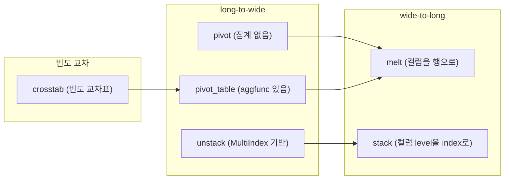

## 정의

**`DataFrame.pivot(index, columns, values)`** 는 **long-format → wide-format** 변환. 한 열의 고유 값들이 새 컬럼이 되고, 원래 데이터는 그 자리에 배치된다.

집계가 없으므로 같은 (index, columns) 조합이 두 번 있으면 에러. 집계가 필요하면 [[Pandas pivot_table]].

## reshape 함수 생태계



## 기본: pivot

<CodeWithOutput
  language="python"
  outputLanguage="text"
  code={`import pandas as pd
df = pd.DataFrame({
    'date': ['2024-01', '2024-01', '2024-02', '2024-02'],
    'product': ['A', 'B', 'A', 'B'],
    'sales': [100, 200, 150, 250],
})
result = df.pivot(index='date', columns='product', values='sales')
print(result)`}
  output={`product     A    B
date
2024-01   100  200
2024-02   150  250`}
/>

**Before (long-format):**

| date | product | sales |
|---|---|---|
| 2024-01 | A | 100 |
| 2024-01 | B | 200 |
| 2024-02 | A | 150 |
| 2024-02 | B | 250 |

**After (wide-format):**

| date | A | B |
|---|---|---|
| 2024-01 | 100 | 200 |
| 2024-02 | 150 | 250 |

행 라벨 (date) 는 유지, **product 의 고유값 (A, B) 이 새 컬럼** 이 됨.

## 여러 values

```python
df.pivot(index='date', columns='product', values=['sales', 'qty'])
# MultiIndex 컬럼: ('sales','A'), ('sales','B'), ('qty','A'), ('qty','B')
```

## 중복 (index, columns) → 에러

```python
df = pd.DataFrame({
    'date': ['2024-01', '2024-01'],
    'product': ['A', 'A'],   # 중복!
    'sales': [100, 50],
})
df.pivot(index='date', columns='product', values='sales')
# ValueError: Index contains duplicate entries, cannot reshape
```

해법: `pivot_table` (집계 사용).

## pivot_table

집계가 필요하거나 중복이 있을 때 `pivot_table` 을 쓴다. 기본 `aggfunc='mean'`.

```python
import pandas as pd

df = pd.DataFrame({
    'region': ['Seoul', 'Seoul', 'Busan', 'Busan', 'Seoul'],
    'product': ['A', 'B', 'A', 'B', 'A'],
    'sales':   [100, 200, 150, 250, 120],
    'qty':     [10, 20, 15, 25, 12],
})

# 기본 (mean)
df.pivot_table(index='region', columns='product', values='sales')

# sum 집계
df.pivot_table(index='region', columns='product', values='sales', aggfunc='sum')

# 여러 집계 함수
df.pivot_table(
    index='region',
    columns='product',
    values='sales',
    aggfunc=['sum', 'mean', 'count']
)

# 여러 values
df.pivot_table(
    index='region',
    columns='product',
    values=['sales', 'qty'],
    aggfunc='sum'
)

# 소계 (margins)
df.pivot_table(
    index='region', columns='product', values='sales',
    aggfunc='sum', margins=True, margins_name='Total'
)
```

### aggfunc 옵션

| aggfunc | 설명 |
|:---|:---|
| `'mean'` | 평균 (기본) |
| `'sum'` | 합계 |
| `'count'` | 개수 (NaN 제외) |
| `'min'` / `'max'` | 최솟값 / 최댓값 |
| `'median'` | 중앙값 |
| `lambda x: x.nunique()` | 고유값 개수 |
| `['sum', 'mean']` | 여러 집계 동시 |

## pivot vs pivot_table

| 항목 | `pivot` | `pivot_table` |
|:---|:---|:---|
| 중복 (index, columns) | ❌ ValueError | ✓ aggfunc 로 집계 |
| 기본 aggfunc | 없음 | `'mean'` |
| values 생략 | ✓ (나머지 컬럼 전부) | ✓ (numeric_only) |
| margins | ❌ | ✓ |
| 속도 | 빠름 | 약간 느림 |

데이터가 **이미 유니크** 한 long-format 이면 `pivot`, 집계가 필요하면 `pivot_table`.

## stack / unstack

**`DataFrame.unstack(level)`** 은 index 의 한 level 을 컬럼으로 올린다. `pivot` 의 MultiIndex 버전.

```python
import pandas as pd

mi_df = pd.DataFrame(
    {'sales': [100, 200, 150, 250]},
    index=pd.MultiIndex.from_tuples(
        [('Seoul', 'A'), ('Seoul', 'B'), ('Busan', 'A'), ('Busan', 'B')],
        names=['region', 'product']
    )
)

# unstack: product level 을 컬럼으로
wide = mi_df.unstack('product')
print(wide)
# sales      A    B
# region
# Busan    150  250
# Seoul    100  200

# stack: 컬럼을 index level 로 (unstack 역변환)
long = wide.stack('product')
print(long)
```

`pivot` 이 일반 DataFrame 을 받는다면, `unstack` 은 MultiIndex DataFrame 을 받는다.

### unstack 과 pivot 의 동치

```python
# 아래 두 표현은 같은 결과
df.pivot(index='date', columns='product', values='sales')
df.set_index(['date', 'product'])['sales'].unstack('product')
```

자세히는 [[Pandas stack / unstack]] 참고.

## melt (wide-to-long)

`pivot` 의 역변환. 여러 컬럼을 하나의 `variable` 컬럼 + `value` 컬럼으로 녹인다.

```python
import pandas as pd

wide = pd.DataFrame({
    'date': ['2024-01', '2024-02'],
    'A':    [100, 150],
    'B':    [200, 250],
})

long = wide.melt(id_vars='date', var_name='product', value_name='sales')
print(long)
```

출력:

```text
      date product  sales
0  2024-01       A    100
1  2024-02       A    150
2  2024-01       B    200
3  2024-02       B    250
```

`id_vars` 는 그대로 유지할 컬럼. `value_vars` 로 녹일 컬럼을 명시적으로 지정 가능.

```python
wide.melt(id_vars='date', value_vars=['A', 'B'], var_name='product', value_name='sales')
```

자세히는 [[Pandas melt]] 참고.

## crosstab

`pd.crosstab` 은 두 (이상의) 범주형 변수 간 **빈도 교차표** 를 만든다. `pivot_table` 의 `count` 집계 특수케이스.

```python
import pandas as pd

df = pd.DataFrame({
    'city': ['Seoul', 'Seoul', 'Busan', 'Seoul', 'Busan'],
    'plan': ['pro', 'basic', 'pro', 'pro', 'basic'],
})

ct = pd.crosstab(df['city'], df['plan'])
print(ct)
# plan    basic  pro
# city
# Busan       1    1
# Seoul       1    2

# normalize: 비율로
pd.crosstab(df['city'], df['plan'], normalize='index')    # 행 기준 비율
pd.crosstab(df['city'], df['plan'], normalize='columns')  # 열 기준 비율
pd.crosstab(df['city'], df['plan'], normalize=True)       # 전체 비율

# margins=True: 소계 추가
pd.crosstab(df['city'], df['plan'], margins=True)
```

자세히는 [[Pandas crosstab]] 참고.

## pivot 의 결과 처리

```python
result = df.pivot(index='date', columns='product', values='sales')
result.columns.name = None        # 'product' 컬럼 이름 제거
result = result.reset_index()     # date 를 컬럼으로
result.columns = ['date', 'A_sales', 'B_sales']  # 컬럼 이름 변경
```

## 실전 분석 예시

월별 지역별 매출 분석:

```python
import pandas as pd

df = pd.DataFrame({
    'month':  ['Jan', 'Jan', 'Feb', 'Feb', 'Mar', 'Mar'],
    'region': ['Seoul', 'Busan'] * 3,
    'sales':  [100, 80, 120, 90, 110, 95],
    'orders': [10, 8, 12, 9, 11, 10],
})

# 월별 지역별 매출 (wide)
pivot = df.pivot_table(
    index='month',
    columns='region',
    values='sales',
    aggfunc='sum',
    margins=True,
    margins_name='Total'
)

# 비율 분석
pivot_pct = pivot.div(pivot['Total'], axis=0)

# melt 로 다시 long
long = pivot.reset_index().melt(
    id_vars='month', var_name='region', value_name='sales'
)
```

## 자주 만나는 함정

### 1. NaN 발생

일부 (date, product) 조합이 없으면 NaN:

```python
df.pivot(index='date', columns='product', values='sales')
# 없는 조합은 NaN

result.fillna(0)   # 0 으로 채우거나
result.dropna()    # 해당 행 제거
```

### 2. 컬럼 이름이 MultiIndex 가 됨

```python
df.pivot(index='date', columns='product', values=['sales', 'qty'])
# 컬럼: ('sales','A'), ('sales','B'), ('qty','A'), ('qty','B')

# 평탄화
result.columns = ['_'.join(map(str, c)) for c in result.columns]
```

### 3. pivot_table 결과에 컬럼 이름 잔재

```python
result = df.pivot_table(index='date', columns='product', values='sales', aggfunc='sum')
# result.columns.name 이 'product' 로 남아 있음
result.columns.name = None   # 제거
```

### 4. pivot_table 기본 aggfunc 가 mean

```python
df.pivot_table(index='region', columns='product', values='sales')
# aggfunc 기본값이 'mean' 이므로 합계가 아님
# 합계가 필요하면 aggfunc='sum' 명시
```

## 관련 위키

- [[Pandas pivot_table]]
- [[Pandas melt]]
- [[Pandas stack / unstack]]
- [[Pandas crosstab]]
- [[Pandas groupby]]
- [[Pandas MultiIndex]]
- [[Pandas DataFrame]]
