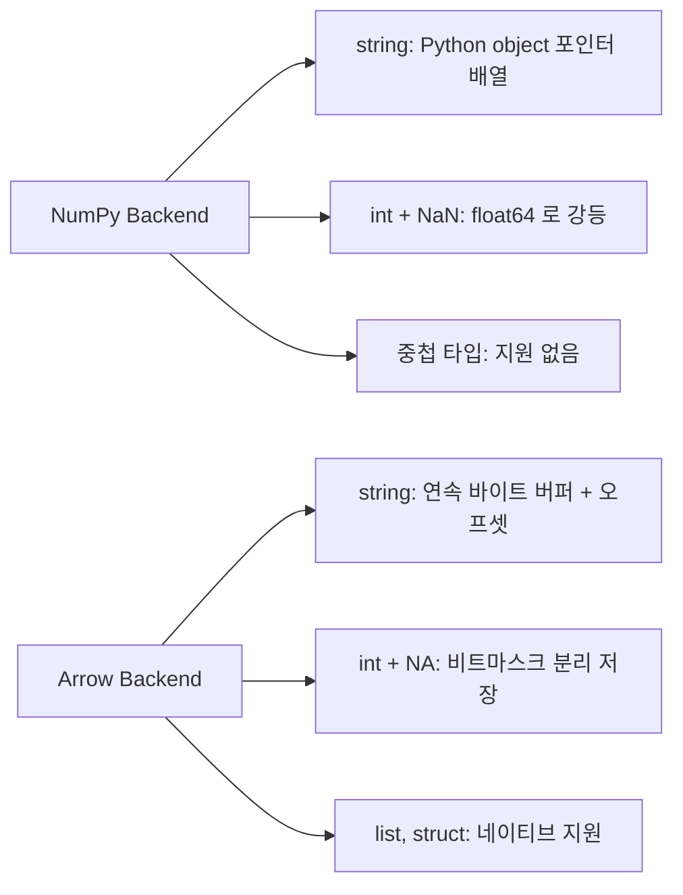
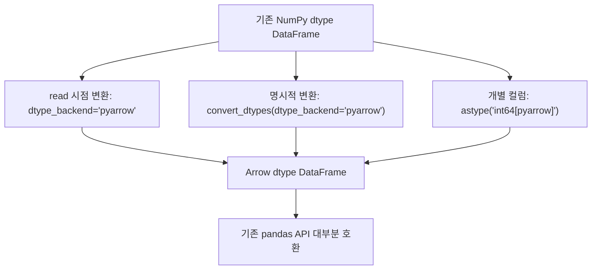

## 정의

pandas 2.0 부터 **Apache Arrow 를 백킹으로 사용** 하는 새 dtype 시스템. NumPy 기반의 한계 (메모리, 문자열, 타입 다양성) 를 크게 개선.

## 사용 상황

| 상황 | pyarrow backend 이점 |
|:---|:---|
| 대용량 문자열 컬럼 | 메모리 1/10 수준 절감 |
| Parquet 읽기/쓰기 | Arrow - Parquet 직접 매핑, 변환 비용 없음 |
| int + NaN 공존 | NumPy 는 float 으로 강등, Arrow 는 native int |
| 중첩 타입 (list, struct) | NumPy 불가, Arrow 는 가능 |
| 정확한 소수 (decimal) | Arrow decimal 타입 지원 |
| Python 3.x 마이그레이션 준비 | pandas 3.0 은 Arrow 기본 예정 |

## 시각화

NumPy vs Arrow 메모리 레이아웃 비교:



마이그레이션 경로:



## 적용 방법

### 1. read 함수에서

```python
df = pd.read_csv('data.csv', dtype_backend='pyarrow')
df = pd.read_parquet('data.parquet', dtype_backend='pyarrow')
df.dtypes
# id        int64[pyarrow]
# name      string[pyarrow]
# ts        timestamp[ns, UTC][pyarrow]
```

### 2. 전역 설정

```python
pd.options.future.infer_string = True       # 문자열은 pyarrow 로 추론
```

### 3. 명시적 변환

```python
df = df.astype({
    'id': 'int64[pyarrow]',
    'name': 'string[pyarrow]',
})
df = df.convert_dtypes(dtype_backend='pyarrow')   # 자동 변환
```

## NumPy backend vs pyarrow backend

| 항목 | NumPy | pyarrow |
|:---|:---|:---|
| int + NaN | ✗ (float 강등) | ✓ |
| string | object (Python list) | native arrow string |
| datetime tz | ✓ | ✓ (정밀) |
| decimal | ✗ | ✓ |
| nested types (list, struct) | ✗ | ✓ |
| 메모리 (string) | 큼 | **~1/10** |
| Parquet IO | 변환 비용 | 직접 |
| GIL 회피 | ✗ | △ |

## 메모리 비교 예

<CodeWithOutput
  language="python"
  outputLanguage="text"
  code={`import pandas as pd
import numpy as np
np.random.seed(0)

n = 100_000
df = pd.DataFrame({
    'city': np.random.choice(['Seoul','Busan','Daegu'], n),
    'plan': np.random.choice(['basic','pro','premium'], n),
})

print('object:', df.memory_usage(deep=True).sum() // 1024, 'KB')
df_arrow = df.astype({'city': 'string[pyarrow]', 'plan': 'string[pyarrow]'})
print('arrow :', df_arrow.memory_usage(deep=True).sum() // 1024, 'KB')`}
  output={`object: 12302 KB
arrow : 791 KB`}
/>

15 배 절감.

## 문자열 처리 속도

```python
# str accessor 메서드는 그대로 사용
df['name'].str.upper()
df['name'].str.contains('python')
df['name'].str.split(',')
```

pyarrow backend 에서는 내부 구현이 더 빠르다.

## 정밀한 타입

```python
# DECIMAL 타입 (정확한 소수)
df = pd.DataFrame({'price': pd.array(['1.23', '4.56'], dtype='decimal128(10, 2)[pyarrow]')})

# timezone 인식 timestamp
df['ts'].dt.tz                # arrow 는 더 정확한 timezone 표현
```

## 단점 / 함정

### 1. 일부 메서드 호환성

대부분의 pandas API 가 동작하지만, 일부 (특히 사용자 함수 적용) 에서 fallback 발생. 점진적으로 개선 중.

### 2. 다른 라이브러리와의 호환

```python
# scikit-learn 입력
X = df.values            # numpy 로 변환 (arrow → numpy 복사)
# 큰 데이터에서 비용 발생 가능
```

ML 파이프라인에 들어갈 때는 변환 단계가 비용일 수 있다.

### 3. 일부 dtype 의 표현

```python
pd.array([1, 2, 3], dtype='int64[pyarrow]')[0]
# ArrayScalar(1) 같은 형태로 보일 수 있음
```

스칼라 표현이 NumPy 와 다를 수 있음.

### 4. NaN vs &lt;NA&gt;

```python
df['x'].astype('int64[pyarrow]')
# NaN 위치 → <NA>
df['x'].isna()                # 양쪽 모두 처리
```

## 자주 쓰는 패턴

### 1. Parquet pipeline

```python
df = pd.read_parquet('data.parquet', dtype_backend='pyarrow')
result = process(df)
result.to_parquet('out.parquet')
```

Arrow → pandas → Arrow 변환 비용 거의 없음.

### 2. 문자열 대용량 데이터

```python
df = pd.read_csv('logs.csv', dtype_backend='pyarrow')
# string[pyarrow] 가 메모리 1/10
df['message'].str.contains('ERROR').sum()
```

### 3. 점진적 마이그레이션

```python
df = df.convert_dtypes(dtype_backend='pyarrow')
# 기존 NumPy dtype → 적절한 arrow dtype 변환
```

## dtype 변환 상세

| NumPy dtype | Arrow dtype |
|:---|:---|
| `object` (문자열) | `string[pyarrow]` |
| `int64` | `int64[pyarrow]` |
| `float64` | `double[pyarrow]` |
| `bool` | `bool[pyarrow]` |
| `datetime64[ns]` | `timestamp[ns][pyarrow]` |
| `category` | `dictionary[pyarrow]` |

```python
# 개별 컬럼 변환
df['name'] = df['name'].astype('string[pyarrow]')
df['count'] = df['count'].astype('int64[pyarrow]')

# 전체 일괄 변환
df_arrow = df.convert_dtypes(dtype_backend='pyarrow')

# dtype 확인
df_arrow.dtypes
# id      int64[pyarrow]
# name    string[pyarrow]
```

## ML 파이프라인 연동

Arrow backend 로 메모리를 절약한 뒤, ML 단계에서는 NumPy 로 변환:

```python
# 1. 대용량 데이터: Arrow 로 로드
df = pd.read_parquet('big_data.parquet', dtype_backend='pyarrow')

# 2. 전처리: pandas API 그대로 사용
df = df.dropna().query('age > 18')
df['log_income'] = np.log(df['income'].to_numpy() + 1)

# 3. ML 입력: NumPy 변환
X = df[feature_cols].to_numpy(dtype=np.float32)
y = df['target'].to_numpy()

model.fit(X, y)
```

`.to_numpy()` 호출 시 Arrow - NumPy 복사가 발생하나, 학습 단계는 한 번만 실행되므로 허용 가능.

## pandas 3.0

3.0 부터 **pyarrow 가 기본 백킹** 이 될 예정 (논의 중). 지금부터 적응하면 좋다.

## 관련 위키

- [[Pandas Nullable Types]]
- [[Pandas read_parquet]]
- [[Pandas read_csv]]
- [[Pandas performance]]
- [[Pandas DataFrame]]
