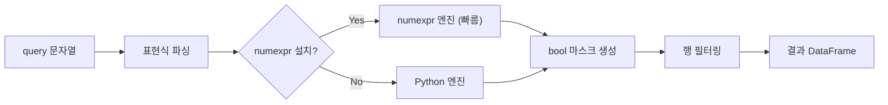

## 정의

- **`DataFrame.query(expr)`** : 문자열로 **boolean 표현식** 을 전달해 행 필터링
- **`DataFrame.eval(expr)`** : 문자열로 **계산 표현식** 을 평가

[[Pandas Boolean Indexing]] 의 가독성 있는 대안.

## 사용 상황

- 조건이 복잡해 boolean indexing 이 장황해질 때
- method chaining 안에서 필터를 인라인으로 넣고 싶을 때
- 대용량 DataFrame 에서 numexpr 가속을 활용하고 싶을 때
- SQL 스타일로 데이터를 탐색할 때

## query 처리 흐름



## 기본 사용법

```python
df.query('age > 30')

# 동등 의미
df[df['age'] > 30]
```

긴 조건일수록 query 가 짧고 읽기 쉽다.

<CodeWithOutput
  language="python"
  outputLanguage="text"
  code={`import pandas as pd
df = pd.DataFrame({
    'name': ['Alice', 'Bob', 'Charlie', 'Dave'],
    'age': [25, 30, 35, 40],
    'city': ['Seoul', 'Busan', 'Seoul', 'Daegu'],
})

result = df.query("age > 27 and city == 'Seoul'")
print(result)`}
  output={`      name  age   city
2  Charlie   35  Seoul`}
/>

## 외부 변수 참조 (@)

`@` 로 Python 변수를 query 안에 끌어온다.

<CodeWithOutput
  language="python"
  outputLanguage="text"
  code={`min_age = 27
cities = ['Seoul', 'Busan']
result = df.query("age > @min_age and city in @cities")
print(result)`}
  output={`      name  age   city
1      Bob   30  Busan
2  Charlie   35  Seoul`}
/>

```python
# 함수 결과도 변수로 전달 가능
threshold = df['salary'].quantile(0.9)
df.query("salary >= @threshold")
```

## 연산자

| 연산자 | 의미 |
|:---|:---|
| `==`, `!=`, `<`, `>`, `<=`, `>=` | 비교 |
| `and`, `or`, `not` | 논리 (권장) |
| `&`, `\|`, `~` | 비트 논리 (가능하지만 괄호 필요) |
| `in`, `not in` | 포함 여부 |

```python
df.query("city in ['Seoul', 'Busan']")
df.query("not (age < 30)")
df.query("age > 25 and city != 'Daegu'")
df.query("10 < age < 40")          # Python 체이닝 비교 가능 (boolean indexing 과 다름)
```

## 컬럼명에 공백 / 특수문자

```python
# 컬럼명에 공백이 있으면 backtick
df.query('`first name` == "Alice"')
df.query('`age (years)` > 30')

# 예약어 컬럼명도 backtick
df.query('`class` == "A"')
```

## eval 로 계산

```python
df.eval('total = price * qty')                # 새 컬럼 추가
df = df.eval('discount = price * 0.1', inplace=False)
df.eval('a + b - c')                          # Series 반환
```

대규모 DataFrame 에서 **numexpr** 기반 가속이 이뤄질 수 있다 (자동 감지).

```python
# 여러 표현식 한 번에
df = df.eval("""
    total = price * qty
    tax = total * 0.1
    net = total - tax
""")
```

## method chaining 과 query

`query` 는 method chaining 에서 특히 빛난다.

```python
result = (
    df
    .query("status == 'active'")
    .query("age >= 18")
    .assign(score=lambda x: x['sales'] / x['visits'])
    .query("score > @threshold")
    .sort_values('score', ascending=False)
    .head(10)
)
```

boolean indexing 으로 같은 코드를 쓰면 `df` 이름이 반복되고 중간 변수가 필요해진다.

## boolean indexing 과 비교

| 항목 | Boolean Indexing | `query()` |
|:---|:---|:---|
| 가독성 | 복잡 조건 시 장황 | 간결 |
| 성능 (소규모) | 빠름 | 파싱 오버헤드 있음 |
| 성능 (대규모) | 기본 | numexpr 활용 시 더 빠름 |
| 컬럼명 제약 | 없음 | 예약어/공백 시 backtick 필요 |
| 외부 변수 | 직접 참조 | `@var` 필요 |
| 복잡한 메서드 | `.str.contains()` 등 자유 | 제한적 |
| 체이닝 비교 | 불가 (`10 < age < 40`) | 가능 |

```python
# boolean indexing 이 더 자연스러운 경우
df[df['name'].str.startswith('A')]
df[df['tags'].apply(lambda x: 'python' in x)]

# query 가 더 자연스러운 경우
df.query("10 < age < 40 and city in ['Seoul', 'Busan']")
```

## numexpr 가속

```python
# numexpr 설치 여부 확인
import numexpr
print(numexpr.__version__)

# 대용량 DataFrame 에서 query 가 더 빠른 경우
import pandas as pd
df = pd.DataFrame({'a': range(1_000_000), 'b': range(1_000_000)})

# numexpr 사용 (설치된 경우 자동)
df.query("a > 500000 and b < 800000")

# 엔진 명시
df.query("a > 500000", engine='numexpr')   # numexpr 강제
df.query("a > 500000", engine='python')    # Python 강제
```

## 실전 패턴

### 날짜 범위 필터

```python
start = '2024-01-01'
end   = '2024-12-31'
df.query("date >= @start and date <= @end")
```

### 여러 값 포함 필터

```python
valid_statuses = ['active', 'pending', 'trial']
df.query("status in @valid_statuses")
```

### 수치 범위 + 카테고리 복합

```python
df.query("10 < age < 65 and department in ['eng', 'data'] and salary > 5000")
```

## 함정

### 1. 문자열 비교에 따옴표

```python
df.query("name == 'Alice'")    # ✓ 안쪽 single quote
df.query('name == "Alice"')    # ✓ 안쪽 double quote
df.query('name == Alice')       # ❌ Alice 라는 컬럼을 찾으려 함
```

### 2. backtick 없으면 공백 컬럼 인식 안 됨

```python
df.query('first name == "Alice"')        # ❌
df.query('`first name` == "Alice"')      # ✓
```

### 3. `&` / `|` 의 괄호

```python
df.query('(age > 30) & (city == "Seoul")')    # ✓
df.query('age > 30 & city == "Seoul"')         # 의도와 다른 해석 가능
# and / or 가 더 안전
df.query('age > 30 and city == "Seoul"')       # ✓
```

### 4. 외부 함수 호출 불가

```python
# ❌ query 안에서 함수 호출 불가
df.query("name.str.startswith('A')")

# ✓ boolean indexing 사용
df[df['name'].str.startswith('A')]
```

### 5. 소규모 DataFrame 에서 오버헤드

```python
# 행이 수백 개 이하면 query 파싱 비용이 더 클 수 있음
# 소규모: boolean indexing 이 빠름
# 대규모 (100만+ 행): query + numexpr 가 유리
```

## 관련 위키

- [[Pandas DataFrame]]
- [[Pandas Boolean Indexing]]
- [[Pandas .loc / .iloc]]
- [[Pandas pipe / method chaining]]
- [[Pandas 성능 / 메모리 최적화]]
