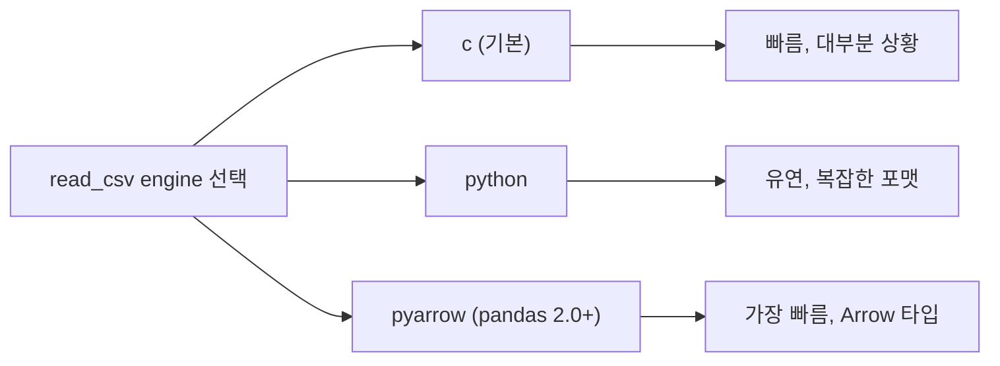

## 정의

**`pandas.read_csv`** 는 CSV(Comma-Separated Values) 또는 구분자 기반 텍스트 파일을 DataFrame 으로 읽는 함수. pandas 사용의 출발점.

반대 방향은 **`DataFrame.to_csv`** : DataFrame 을 CSV 로 내보내기.

## 사용 상황

| 상황 | 핵심 옵션 |
|:---|:---|
| 기본 읽기 | `pd.read_csv('file.csv')` |
| 특정 컬럼만 | `usecols=['a', 'b']` |
| 메모리 절약 | `dtype`, `usecols`, `chunksize` |
| 날짜 컬럼 처리 | `parse_dates=['col']` |
| 커스텀 NA 값 | `na_values=['-', 'NULL']` |
| 대용량 스트리밍 | `chunksize=N` |
| 빠른 파싱 (pandas 2.0+) | `engine='pyarrow'` |

## read_csv 파이프라인


## 기본 사용

```python
import pandas as pd

df = pd.read_csv('data.csv')
df.to_csv('out.csv', index=False)
```

## 핵심 옵션 전체

| 옵션 | 기본 | 설명 |
|:---|:---:|:---|
| `sep` / `delimiter` | `,` | 구분자 |
| `header` | `0` | 헤더 행 번호 (없으면 None) |
| `names` | - | 컬럼 이름 리스트 (header=None 과 같이) |
| `index_col` | - | index 로 쓸 컬럼 |
| `usecols` | - | 읽을 컬럼 선택 |
| `dtype` | - | 컬럼별 타입 |
| `parse_dates` | `False` | 날짜 파싱할 컬럼 |
| `na_values` | - | 추가 NA 로 취급할 값 |
| `keep_default_na` | `True` | 기본 NA 값 유지 여부 |
| `nrows` | - | 처음 N 행만 |
| `skiprows` | - | 건너뛸 행 번호/개수 |
| `encoding` | `utf-8` | 인코딩 |
| `chunksize` | - | 청크 크기 (iterator 반환) |
| `low_memory` | `True` | 혼합 타입 경고 (False 로 비활성) |
| `engine` | `c` | 파서 엔진 (c, python, pyarrow) |

## 구분자 / 인코딩

```python
# TSV (탭 구분)
df = pd.read_csv('data.tsv', sep='\t')

# 한글 Windows 인코딩
df = pd.read_csv('korean.csv', encoding='cp949')

# BOM 있는 UTF-8 (Excel 저장)
df = pd.read_csv('excel.csv', encoding='utf-8-sig')
```

## usecols + dtype (메모리 절약)

<CodeWithOutput
  language="python"
  outputLanguage="text"
  code={`import io, pandas as pd

csv_text = """id,name,age,salary,notes
1,Alice,30,3000,manager
2,Bob,25,4500,engineer
3,Charlie,35,6000,director"""

df = pd.read_csv(
    io.StringIO(csv_text),
    usecols=['id', 'name', 'age'],
    dtype={'id': 'int32', 'age': 'int8'},
)
print(df)
print(df.dtypes.to_dict())`}
  output={`   id     name  age
0   1    Alice   30
1   2      Bob   25
2   3  Charlie   35
{'id': dtype('int32'), 'name': dtype('O'), 'age': dtype('int8')}`}
/>

`usecols` 로 불필요한 컬럼 제외, `dtype` 으로 정수 크기 최소화.

## dtype 최적화

```python
df = pd.read_csv('data.csv', dtype={
    'id':       'int32',     # int64 대신 절반 메모리
    'age':      'int8',      # -128~127 범위면 충분
    'score':    'float32',   # float64 대신 절반
    'category': 'category',  # 문자열 반복이 많으면 category
})
```

| dtype | 범위 | 메모리 (per value) |
|:---|:---|:---|
| `int8` | -128 ~ 127 | 1 byte |
| `int32` | -2.1B ~ 2.1B | 4 bytes |
| `int64` (기본) | 매우 큼 | 8 bytes |
| `float32` | 소수 | 4 bytes |
| `float64` (기본) | 소수 | 8 bytes |
| `category` | 반복 문자열 | 정수 코드 |

## parse_dates

```python
# 단일 컬럼
df = pd.read_csv('events.csv', parse_dates=['created_at'])

# 여러 컬럼 → datetime
df = pd.read_csv('events.csv', parse_dates=['start', 'end'])

# 여러 컬럼 합쳐서 하나의 datetime 생성
df = pd.read_csv('events.csv', parse_dates={'datetime': ['date', 'time']})
```

> [!NOTE]
> pandas 2.0+ 에서 `parse_dates` 의 자동 추론 범위가 좁아졌다. 명시적으로 컬럼을 지정하거나, 읽은 후 `pd.to_datetime()` 으로 변환하는 것이 안전하다.

## na_values

```python
df = pd.read_csv('data.csv', na_values=['', 'NULL', 'N/A', '-', 'none', 'nan'])

# 기본 NA 인식 목록을 끄고 직접 지정
df = pd.read_csv('data.csv',
    na_values=['-'],
    keep_default_na=False,
)
```

## chunksize (대용량 스트리밍)

```python
total_sales = 0
chunks_processed = 0

for chunk in pd.read_csv('huge.csv', chunksize=100_000):
    total_sales += chunk['amount'].sum()
    chunks_processed += 1

print(f'청크 {chunks_processed} 개 처리, 총 매출: {total_sales:,.0f}')
```

`chunksize` 를 지정하면 `TextFileReader` iterator 를 반환. 메모리에 전체를 올리지 않음.

## low_memory

```python
# 기본 low_memory=True: 컬럼 타입을 청크별로 추론 → 혼합 타입 DtypeWarning 가능
df = pd.read_csv('data.csv')

# low_memory=False: 전체를 한 번에 읽어 타입 결정 → 메모리 더 씀, 경고 없음
df = pd.read_csv('data.csv', low_memory=False)

# 가장 좋은 방법: dtype 명시
df = pd.read_csv('data.csv', dtype={'id': str, 'code': str})
```

## pyarrow engine (pandas 2.0+)

```python
# C 엔진보다 최대 수배 빠름
df = pd.read_csv('data.csv', engine='pyarrow')

# dtype_backend='pyarrow': Arrow 배열로 저장 (메모리 효율)
df = pd.read_csv('data.csv', engine='pyarrow', dtype_backend='pyarrow')
```

Arrow 기반 dtype 은 nullable int, string 등을 네이티브로 지원.



## to_csv (저장)

```python
# 기본 (index 제외)
df.to_csv('out.csv', index=False)

# 한글 Excel 호환 (BOM)
df.to_csv('out.csv', encoding='utf-8-sig', index=False)

# TSV
df.to_csv('out.tsv', sep='\t', index=False)

# gzip 압축 (자동 감지)
df.to_csv('out.csv.gz', compression='gzip', index=False)

# 일부 컬럼만
df.to_csv('out.csv', columns=['id', 'name', 'age'], index=False)

# 날짜 포맷
df.to_csv('out.csv', date_format='%Y-%m-%d', index=False)
```

## 함정

### 1. index 가 CSV 에 포함됨

```python
df.to_csv('out.csv')               # 0,1,2... 열이 앞에 생김
df.to_csv('out.csv', index=False)  # ✓
```

저장 후 다시 읽으면 `Unnamed: 0` 컬럼이 생기는 현상의 원인.

### 2. 정수 컬럼이 float 으로 변환

NaN 이 하나라도 있으면 정수를 float 으로 저장 (NaN 이 float 타입). 해법:

```python
# pandas 1.0+ nullable integer
df['col'] = df['col'].astype('Int64')   # 대문자 I, nullable int
pd.read_csv('data.csv', dtype={'col': 'Int64'})
```

### 3. DtypeWarning: mixed types

```python
# 컬럼에 숫자와 문자가 섞이면
# DtypeWarning: Columns (N) have mixed types
df = pd.read_csv('data.csv', dtype={'mixed_col': str})   # str 로 통일
# 또는
df = pd.read_csv('data.csv', low_memory=False)
```

### 4. 한글 깨짐

| 상황 | 인코딩 |
|:---|:---|
| Windows Excel 저장 | `encoding='cp949'` |
| Mac / Linux CSV | `encoding='utf-8'` |
| Excel UTF-8 (BOM 있음) | `encoding='utf-8-sig'` |
| 알 수 없을 때 | `chardet` 라이브러리로 감지 |

### 5. 대용량 파일 메모리 폭주

```python
# ❌ 10GB 한 번에
df = pd.read_csv('10gb.csv')

# ✓ 청크 스트리밍
for chunk in pd.read_csv('10gb.csv', chunksize=50_000):
    process(chunk)

# ✓ usecols 로 컬럼 최소화
df = pd.read_csv('10gb.csv', usecols=['id', 'amount'], dtype={'amount': 'float32'})
```

### 6. skiprows 와 header 혼동

```python
# 처음 2 행 건너뛰고 3 번째 행을 헤더로
df = pd.read_csv('data.csv', skiprows=2)

# 처음 2 행 건너뛰고 헤더도 없음
df = pd.read_csv('data.csv', skiprows=2, header=None, names=['a', 'b', 'c'])
```

## 참고

- [[Pandas DataFrame]]
- [[Pandas read_excel]]
- [[Pandas read_json]]
- [[Pandas read_parquet]]
- [[Pandas Nullable Types]]
- [[Pandas 성능 / 메모리 최적화]]
- [[Pandas pyarrow backend]]
