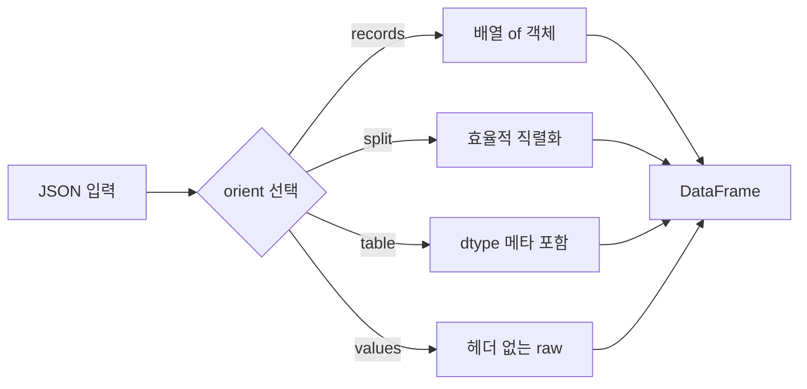

## 정의

**`pandas.read_json`** 은 JSON 문자열 또는 파일을 DataFrame 으로 변환. **`orient`** 파라미터가 핵심, JSON 의 구조가 어떤 형태인지를 선언한다.

반대 방향은 **`DataFrame.to_json`** : DataFrame 을 JSON 으로 직렬화.

## 사용 상황

| 상황 | 권장 |
|:---|:---|
| REST API 응답 (배열 of 객체) | `orient='records'` |
| pandas 자체 직렬화 / 복원 | `orient='split'` |
| 줄당 객체 (JSONL, 로그) | `lines=True` |
| 대용량 JSONL 스트리밍 | `lines=True, chunksize=N` |
| 중첩 JSON 평탄화 | `pd.json_normalize()` |

## orient 옵션 한눈에 보기

| orient | JSON 구조 | 설명 |
|:---|:---|:---|
| `records` | `[{col: val, ...}, ...]` | 배열 of 객체, API 응답 |
| `columns` | `{col: {idx: val}}` | 기본값, 열 중심 |
| `index` | `{idx: {col: val}}` | 행 중심 |
| `split` | `{columns:[...], index:[...], data:[ [...] ]}` | 효율적, 메타 보존 |
| `table` | JSON Table Schema 포함 | dtype 메타데이터 포함 |
| `values` | `[[v1, v2], ...]` | 헤더 없는 raw 2D |



## records: 가장 흔한 패턴

<CodeWithOutput
  language="python"
  outputLanguage="text"
  code={`import pandas as pd
import io

json_text = '[{"name":"Alice","age":30},{"name":"Bob","age":25}]'
df = pd.read_json(io.StringIO(json_text), orient='records')
print(df)
print(df.dtypes)`}
  output={`    name  age
0  Alice   30
1    Bob   25
name    object
age      int64
dtype: object`}
/>

## split: pandas 내부 직렬화

```python
# 저장
df.to_json('snapshot.json', orient='split')
# 복원
df2 = pd.read_json('snapshot.json', orient='split')
```

split 포맷의 JSON 구조:

```json
{
  "columns": ["name", "age"],
  "index": [0, 1],
  "data": [["Alice", 30], ["Bob", 25]]
}
```

columns / index 정보가 모두 보존되어 완전한 복원이 가능.

## table: dtype 메타데이터 포함

```python
df.to_json('typed.json', orient='table', indent=2)
df2 = pd.read_json('typed.json', orient='table')
# dtype 까지 복원됨 (orient='split' 은 dtype 복원 안 됨)
```

## values: 헤더 없는 raw 배열

```python
import io, pandas as pd

raw = '[[1, "Alice"], [2, "Bob"]]'
df = pd.read_json(io.StringIO(raw), orient='values')
df.columns = ['id', 'name']   # 컬럼명 직접 지정 필요
```

## lines (JSONL) 처리

JSONL(JSON Lines) 은 각 줄이 독립적인 JSON 객체. 로그 파일, 데이터 익스포트에 흔함.

```
{"id":1,"name":"Alice"}
{"id":2,"name":"Bob"}
```

```python
df = pd.read_json('data.jsonl', lines=True)
```

## chunksize (대용량 JSONL 스트리밍)

```python
total = 0
chunks_processed = 0

for chunk in pd.read_json('huge.jsonl', lines=True, chunksize=10_000):
    total += chunk['amount'].sum()
    chunks_processed += 1

print(f'청크 {chunks_processed} 개 처리, 총합: {total}')
```

메모리에 전체를 올리지 않고 10K 줄씩 처리.

## 중첩 JSON: json_normalize

깊이 있는 중첩 구조는 `pd.json_normalize` 가 강력.

<CodeWithOutput
  language="python"
  outputLanguage="text"
  code={`import pandas as pd

data = [
    {'id': 1, 'name': 'Alice', 'address': {'city': 'Seoul', 'zip': '12345'}},
    {'id': 2, 'name': 'Bob',   'address': {'city': 'Busan', 'zip': '67890'}},
]
df = pd.json_normalize(data, sep='_')
print(df)
print(df.columns.tolist())`}
  output={`   id   name address_city address_zip
0   1  Alice        Seoul       12345
1   2    Bob        Busan       67890
['id', 'name', 'address_city', 'address_zip']`}
/>

중첩 객체가 `sep` 구분자로 연결된 컬럼으로 평탄화.

## record_path: 배열 안의 배열

```python
data = [
    {'user': 'Alice', 'orders': [{'id': 1, 'qty': 2}, {'id': 2, 'qty': 5}]},
    {'user': 'Bob',   'orders': [{'id': 3, 'qty': 1}]},
]
df = pd.json_normalize(
    data,
    record_path='orders',   # 배열 필드
    meta='user',            # 상위 필드를 컬럼으로
)
print(df)
#    id  qty   user
# 0   1    2  Alice
# 1   2    5  Alice
# 2   3    1    Bob
```

## convert_dates (날짜 처리)

```python
# ISO 8601 문자열 자동 파싱 시도
df = pd.read_json(path, orient='records', convert_dates=['created_at'])

# epoch ms → datetime
df = pd.read_json(path, convert_dates=True)   # 모든 숫자형 날짜 시도

# 날짜 파싱 비활성화
df = pd.read_json(path, convert_dates=False)
```

## API 응답 처리

```python
import requests

response = requests.get('https://api.example.com/users')
data = response.json()

# 방법 1: pd.read_json (문자열 경로)
import io, json
df = pd.read_json(io.StringIO(json.dumps(data)), orient='records')

# 방법 2: pd.DataFrame (더 명확, data 가 list of dict 이면)
df = pd.DataFrame(data)
```

## to_json (저장)

```python
# records 형태 (가장 일반적)
df.to_json('out.json', orient='records', force_ascii=False, indent=2)

# JSONL (한 줄 한 객체)
df.to_json('out.jsonl', orient='records', lines=True, force_ascii=False)

# 날짜 ISO 포맷
df.to_json('out.json', orient='records', date_format='iso', force_ascii=False)

# 문자열로 반환 (파일 아닌 메모리)
json_str = df.to_json(orient='records', force_ascii=False)
```

## orient 별 to_json / read_json 왕복

```python
for orient in ['records', 'split', 'index', 'columns', 'table']:
    buf = df.to_json(orient=orient)
    df2 = pd.read_json(buf, orient=orient)
    assert df.equals(df2), f'{orient} 왕복 실패'
```

`table` orient 는 dtype 까지 보존하므로 가장 완전한 직렬화.

## 함정

### 1. orient 기본값이 columns

```python
pd.read_json('[{"a":1,"b":2}]')
# orient='columns' 기본 → 예상과 다른 결과

pd.read_json('[{"a":1,"b":2}]', orient='records')  # ✓ 명시
```

API 응답을 처리할 때 `orient='records'` 를 명시하지 않으면 컬럼이 뒤집힌 구조가 나온다.

### 2. 한글이 \u escape 로 저장

```python
df.to_json('out.json')                         # 한글이 \uXXXX 로
df.to_json('out.json', force_ascii=False)      # ✓ 한글 그대로
```

### 3. 날짜가 epoch ms (숫자) 로 저장

```python
df.to_json('out.json')                         # datetime → 정수 (ms)
df.to_json('out.json', date_format='iso')      # ✓ "2024-01-15T00:00:00"
```

### 4. 대용량 단일 파일 메모리 폭주

```python
# ❌ 한 번에 로드
df = pd.read_json('10GB.jsonl', lines=True)

# ✓ 청크로
for chunk in pd.read_json('10GB.jsonl', lines=True, chunksize=100_000):
    process(chunk)
```

### 5. read_json 과 pd.DataFrame 차이

- `pd.read_json(path)` : 파일/URL/문자열에서 직접 읽기, orient 파싱 포함
- `pd.DataFrame(list_of_dict)` : 이미 파싱된 파이썬 객체에서 생성, 더 명확

API 응답처럼 이미 파이썬 객체로 파싱된 경우 `pd.DataFrame(data)` 가 더 직관적.

### 6. index orient 와 columns orient 혼동

```python
# columns (기본): {컬럼명: {인덱스: 값}}
# index: {인덱스: {컬럼명: 값}}
# 둘 다 dict of dict 이지만 키 순서가 반대
```

## 참고

- [[Pandas DataFrame]]
- [[Pandas read_csv]]
- [[Pandas read_excel]]
- [[Pandas read_parquet]]
- [[Pandas dropna / fillna]]
