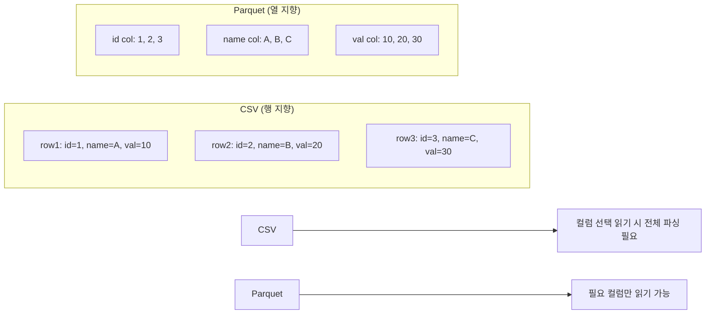

## 정의

**Parquet** 은 **column-oriented binary 포맷**. CSV 대비 **수십 배 빠르고 작다**. dtype 보존, 압축, 부분 컬럼 읽기 지원. 데이터 분석의 사실상 표준.

```python
df.to_parquet('out.parquet')
df = pd.read_parquet('out.parquet')
```

## CSV vs Parquet 저장 구조



## 사용 상황

| 상황 | CSV | Parquet |
|:---|:---:|:---:|
| 사람이 직접 열어 봐야 함 | ✓ | ✗ |
| 반복 분석 / 대용량 | ✗ | ✓ |
| dtype 그대로 유지 | ✗ | ✓ |
| 컬럼 일부만 읽기 | ✗ | ✓ |
| 빠른 IO | 느림 | 빠름 |
| 스트리밍 / Arrow 파이프라인 | ✗ | ✓ |

## 왜 CSV 가 아닌가

| 항목 | CSV | Parquet |
|:---|:---|:---|
| 크기 | 100% | 10-30% |
| 읽기 속도 | 100% | 5-20x faster |
| dtype 보존 | ✗ (재추론) | ✓ |
| 컬럼 선택 읽기 | ✗ (전체 파싱) | ✓ |
| 압축 | gz 별도 | 내장 (snappy/gzip/zstd) |
| 사람이 읽기 | ✓ | ✗ (binary) |
| 부분 schema | ✗ | ✓ |

대규모 데이터 / 반복 분석에는 Parquet 이 명백한 정답.

## 의존성

```bash
pip install pyarrow      # 가장 흔함 (Apache Arrow)
pip install fastparquet  # 대안
```

```python
df.to_parquet('out.parquet', engine='pyarrow')   # 기본
df.to_parquet('out.parquet', engine='fastparquet')
```

## 기본 사용

```python
df.to_parquet('data.parquet')
df = pd.read_parquet('data.parquet')

# 일부 컬럼만
df = pd.read_parquet('data.parquet', columns=['a', 'b'])
```

## 압축 옵션

```python
df.to_parquet('out.parquet', compression='snappy')   # 빠름, 기본
df.to_parquet('out.parquet', compression='zstd')      # 가장 작음
df.to_parquet('out.parquet', compression='gzip')      # 호환성
df.to_parquet('out.parquet', compression=None)
```

`zstd` 가 압축률/속도 균형 가장 좋음.

## partitioned dataset

```python
df.to_parquet('events/', partition_cols=['year', 'month'])
# events/year=2024/month=01/part-0.parquet
# events/year=2024/month=02/part-0.parquet
```

읽을 때 자동으로 필터링.

```python
import pandas as pd
df = pd.read_parquet('events/', filters=[
    ('year', '==', 2024),
    ('month', '>=', 6),
])
```

수십 GB 데이터에서도 메모리 효율적.

## dtype 보존

```python
df = pd.DataFrame({
    'id': [1, 2, 3],
    'name': ['A', 'B', 'C'],
    'ts': pd.to_datetime(['2024-01-01', '2024-02-01', '2024-03-01']),
    'flag': [True, False, True],
})
df.to_parquet('out.parquet')

df2 = pd.read_parquet('out.parquet')
df2.dtypes
# id        int64
# name      object
# ts        datetime64[ns]
# flag      bool
```

CSV 는 모든 dtype 정보가 사라진다.

## pyarrow backend

```python
df = pd.read_parquet('out.parquet', dtype_backend='pyarrow')
# Arrow 기반 dtype (string[pyarrow], Int64 등)
# 메모리 효율 + 빠름
```

[[Pandas pyarrow backend]] 참고.

## 대용량 파일 전략

### 컬럼 선택 읽기

```python
# 100 컬럼 중 3 컬럼만 읽어도 그 3 컬럼 비용만
df = pd.read_parquet('big.parquet', columns=['user_id', 'event', 'ts'])
```

CSV 는 전체를 파싱해야 함.

### row group 필터 (pyarrow)

```python
import pyarrow.parquet as pq

# 스캔 없이 조건 필터 (row group 수준)
table = pq.read_table(
    'events.parquet',
    filters=[('date', '>=', '2024-01-01'), ('date', '<', '2024-02-01')],
)
df = table.to_pandas()
```

### 반복 청크 처리

```python
import pyarrow.parquet as pq

pf = pq.ParquetFile('large.parquet')
for batch in pf.iter_batches(batch_size=100_000):
    chunk = batch.to_pandas()
    # 청크 단위 처리
```

## pandas 2.x 권장 패턴

```python
# pyarrow backend + nullable dtype 통합
df = pd.read_parquet('data.parquet', dtype_backend='pyarrow')
# 모든 컬럼이 arrow dtype
# string[pyarrow], int64[pyarrow], bool[pyarrow] 등

# 처리 후 저장
df.to_parquet('result.parquet', compression='zstd', index=False)
```

## S3 / 클라우드 활용

```python
import s3fs

# S3 에서 읽기
df = pd.read_parquet('s3://bucket/prefix/data.parquet')

# S3 에 쓰기
df.to_parquet('s3://bucket/prefix/output.parquet')

# partitioned S3
df.to_parquet('s3://bucket/events/', partition_cols=['year', 'month'])
```

`s3fs` 패키지만 설치하면 pandas 가 자동 감지.

## 자주 만나는 함정

### 1. 사람이 못 읽음

binary 포맷이라 `cat data.parquet` 으로 못 본다. CSV 로 변환:

```python
pd.read_parquet('data.parquet').to_csv('data.csv', index=False)
```

### 2. 일부 dtype 미지원

```python
df.to_parquet('out.parquet')
# category, period, sparse 등은 일부 변환 또는 미지원
```

`engine='pyarrow'` 가 가장 호환성 좋음.

### 3. partitioned 컬럼이 string 으로 복원

```python
df.to_parquet('events/', partition_cols=['year'])
# 읽을 때 'year' 는 string dtype 으로 복원 (path 파싱이므로)
pd.read_parquet('events/').dtypes
# year: object (string)

# 수동으로 복원
df['year'] = df['year'].astype('int64')
```

### 4. index 포함 여부

```python
df.to_parquet('out.parquet', index=True)   # 기본: index 포함
df.to_parquet('out.parquet', index=False)  # index 제외 (불필요한 컬럼 회피)
```

RangeIndex 는 어차피 재생성 가능하므로 `index=False` 권장.

### 5. row group size 와 필터 효율

```python
# 기본 row group 크기 (pyarrow: 약 128MB)
# 필터링 효율은 row group 이 작을수록 좋음

import pyarrow as pa
import pyarrow.parquet as pq

table = pa.Table.from_pandas(df)
pq.write_table(table, 'out.parquet', row_group_size=50_000)
```

### 6. 스키마 불일치

```python
# 여러 parquet 파일을 합칠 때 스키마가 달라 오류 가능
pd.read_parquet('dir/')  # schema 불일치 시 ArrowInvalid

# 강제 합치기
import pyarrow.dataset as ds
dataset = ds.dataset('dir/', format='parquet')
df = dataset.to_table(schema=...).to_pandas()
```

## 관련 위키

- [[Pandas read_csv]]
- [[Pandas pyarrow backend]]
- [[Pandas Nullable Types (Int64, boolean, string[pyarrow])]]
- [[Pandas DataFrame]]
- [[Pandas info / memory_usage / describe]]
