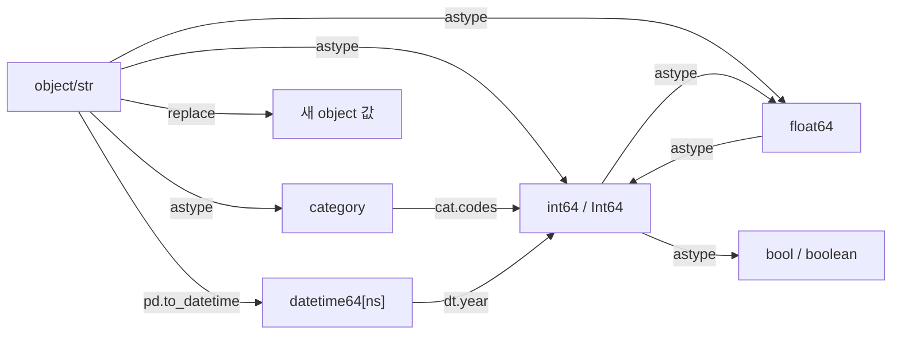

## 정의

- **`replace(...)`** : 특정 값을 다른 값으로 치환
- **`astype(...)`** : dtype 변환

## dtype 변환 경로



## replace 기본

```python
s.replace('A', 'X')                       # 단일 값
s.replace(['A', 'B'], 'X')                # 여러 값을 하나로
s.replace(['A', 'B'], ['X', 'Y'])         # 매핑
s.replace({'A': 'X', 'B': 'Y'})           # dict 매핑
```

<CodeWithOutput
  language="python"
  outputLanguage="text"
  code={`import pandas as pd
s = pd.Series(['A', 'B', 'C', 'A', 'B'])
print(s.replace({'A': 1, 'B': 2, 'C': 3}).tolist())`}
  output={`[1, 2, 3, 1, 2]`}
/>

## 정규식

```python
s.replace(r'^\s+', '', regex=True)        # 앞 공백 제거
s.replace({r'\d+': 'NUM'}, regex=True)    # 숫자 → 'NUM'
```

> [!IMPORTANT]
> pandas 2.0+ 에서 `replace` 의 `regex` 기본값이 **False**. 정규식 쓰려면 `regex=True` 명시.

## DataFrame.replace

```python
df.replace('?', pd.NA)                                    # 모든 셀
df.replace({'A': {'old': 'new'}})                         # 컬럼별 매핑
df.replace({'name': 'unknown', 'city': 'N/A'}, pd.NA)
```

## NaN 으로 치환

```python
df.replace('', pd.NA)
df.replace(['', '?', '-', 'N/A'], pd.NA)
# [[Pandas dropna / fillna]] 와 조합
```

## str.replace 와의 차이

- **`Series.replace`** : **전체 값** 매칭 (정확히 일치)
- **`Series.str.replace`** : **부분 문자열** 매칭

```python
s = pd.Series(['hello world', 'world cup'])
s.replace('world', 'X')               # 그대로 (전체 일치 안 함)
s.str.replace('world', 'X')           # 'hello X', 'X cup'
```

## astype 기본

```python
df['age'] = df['age'].astype('int32')
df['code'] = df['code'].astype(str)
df['city'] = df['city'].astype('category')
df['flag'] = df['flag'].astype(bool)
```

### 여러 컬럼 한 번에

```python
df = df.astype({
    'id': 'int32',
    'name': 'string[pyarrow]',
    'age': 'Int8',
    'is_active': 'boolean',
})
```

## 자주 쓰는 dtype

| dtype | 의미 | NaN 허용 |
|:---|:---|:---:|
| `int8`, `int16`, `int32`, `int64` | 정수 | ❌ |
| **`Int8`, `Int16`, `Int32`, `Int64`** | nullable 정수 | ✅ |
| `float32`, `float64` | 실수 | ✅ (NaN = float) |
| `bool` | True/False | ❌ |
| **`boolean`** | nullable bool | ✅ |
| `object` | 임의 Python 객체 (보통 str) | ✅ |
| `string[pyarrow]` | pyarrow 문자열 (효율적) | ✅ |
| `category` | 카테고리 | ✅ |
| `datetime64[ns]` | 날짜 | ✅ (NaT) |
| `timedelta64[ns]` | 시간 차이 | ✅ (NaT) |

## int64 vs Int64 (nullable 정수)

```python
import pandas as pd

s_with_nan = pd.Series([1, 2, None, 4])

# int64: NaN 은 float 로 자동 강등
print(s_with_nan.dtype)             # float64 (NaN 때문에)

# Int64: NaN 그대로 유지 가능
s_int64 = s_with_nan.astype('Int64')
print(s_int64.dtype)                # Int64
print(s_int64)                      # 1, 2, <NA>, 4
```

| 항목 | `int64` | `Int64` |
|:---|:---|:---|
| NaN 처리 | float 로 강등됨 | `pd.NA` 유지 |
| 메모리 | 동일 (8 bytes) | 약간 큼 (mask 포함) |
| 연산 속도 | 약간 빠름 | 약간 느림 |
| 권장 | NaN 없는 정수 컬럼 | NaN 이 있을 수 있는 정수 |

## 변환 함정 (errors)

```python
df['x'].astype('int64')               # 변환 실패 시 ValueError
pd.to_numeric(df['x'], errors='coerce')   # 실패 시 NaN
pd.to_numeric(df['x'], errors='ignore')   # 원본 반환
```

`to_numeric`, `to_datetime`, `to_timedelta` 에는 `errors` 옵션이 있다.

## astype vs to_numeric / to_datetime

```python
# 같은 결과지만 처리 방식 다름
df['x'].astype('int64')                   # 엄격, 실패 시 throw
pd.to_numeric(df['x'], errors='coerce')   # 관대, 실패 → NaN
```

데이터 클리닝에는 `to_numeric` / `to_datetime` 권장.

## datetime64 변환

날짜 문자열 컬럼을 datetime 으로 변환하는 패턴:

```python
import pandas as pd

df = pd.DataFrame({'date_str': ['2024-01-01', '2024-02-15', '2024-12-31']})

# 방법 1: pd.to_datetime (권장)
df['date'] = pd.to_datetime(df['date_str'])

# 방법 2: astype (포맷이 표준이면 동작)
df['date'] = df['date_str'].astype('datetime64[ns]')

# 포맷 지정 (비표준 날짜)
df['date'] = pd.to_datetime(df['date_str'], format='%Y-%m-%d')

# 여러 포맷 혼재 (느리지만 안전)
df['date'] = pd.to_datetime(df['date_str'], infer_datetime_format=True)
```

datetime 변환 후 `dt` accessor 로 다양한 추출:

```python
df['year']    = df['date'].dt.year
df['month']   = df['date'].dt.month
df['weekday'] = df['date'].dt.day_name()
df['quarter'] = df['date'].dt.quarter
```

## category dtype 으로 메모리 절약

```python
# 실제 메모리 비교
import pandas as pd
import numpy as np

n = 1_000_000
cities = np.random.choice(['Seoul', 'Busan', 'Incheon', 'Daegu'], n)
s_obj = pd.Series(cities)
s_cat = s_obj.astype('category')

print(f'object:   {s_obj.memory_usage(deep=True) / 1e6:.1f} MB')
print(f'category: {s_cat.memory_usage(deep=True) / 1e6:.1f} MB')
# object:   65.0 MB
# category:  4.0 MB (약 16배 절약)
```

고유값이 적은 문자열 컬럼에 category 를 쓰면 메모리와 groupby 성능 모두 개선된다.

[[Pandas Categorical]] 참고.

## 자주 쓰는 패턴

### category 로 메모리 절약

```python
df['city'] = df['city'].astype('category')
df.memory_usage(deep=True)
```

### NaN-aware 정수

```python
df['count'] = df['count'].astype('Int64')   # NaN 가능 정수
```

### bool → 0/1

```python
df['flag_int'] = df['flag'].astype(int)
```

### 정수 → 문자 (zfill)

```python
df['code_str'] = df['code'].astype(str).str.zfill(8)
# 12345 → '00012345'
```

## 실전 데이터 클리닝 파이프라인

원본 CSV 데이터를 로드하면 대부분 컬럼이 `object` 로 들어온다. 아래 패턴으로 한 번에 정리:

```python
import pandas as pd

df = pd.read_csv('sales.csv')

# 1. 더미 결측값 교체
df.replace(['', 'N/A', '-', 'null', 'NULL'], pd.NA, inplace=True)

# 2. 수치형 변환 (실패 시 NaN)
df['age']    = pd.to_numeric(df['age'], errors='coerce')
df['price']  = pd.to_numeric(df['price'], errors='coerce')

# 3. 날짜 변환
df['date'] = pd.to_datetime(df['date'], errors='coerce')

# 4. 정수 변환 (NaN 있을 수 있으면 Int64)
df['quantity'] = df['quantity'].astype('Int64')

# 5. 카테고리 최적화
for col in ['city', 'category', 'status']:
    if df[col].nunique() < 100:
        df[col] = df[col].astype('category')

# 6. bool 변환
df['is_active'] = df['is_active'].map({'Y': True, 'N': False}).astype('boolean')

print(df.dtypes)
print(df.memory_usage(deep=True).sum() / 1e6, 'MB')
```

## 함정

### 1. NaN 이 있는 int 컬럼

```python
df['age'].astype('int64')      # NaN 있으면 ValueError
df['age'].astype('Int64')      # ✓ nullable
df['age'].fillna(0).astype('int64')   # NaN → 0 후 변환
```

### 2. astype('category') 후 새 카테고리 추가

```python
df['city'] = df['city'].astype('category')
df.loc[100, 'city'] = 'NewCity'   # ❌ categories 에 없음
df['city'] = df['city'].cat.add_categories('NewCity')
```

### 3. dtype 강등 (object)

```python
df['x'] = df['x'].where(cond, 'fallback')
# x 가 int 였어도 결과는 object
```

### 4. replace 와 str.replace 혼동

```python
s = pd.Series(['Seoul City', 'Busan Town'])

# 전체 값 매칭 (없음)
s.replace('City', 'Metro')     # 그대로 유지

# 부분 문자열 교체
s.str.replace('City', 'Metro') # 'Seoul Metro', 'Busan Town'
```

### 5. 대규모 DataFrame 에서 astype 체이닝

```python
# ❌ 매번 중간 복사본 생성
df['a'] = df['a'].astype('int32')
df['b'] = df['b'].astype('float32')

# ✓ 한 번에 처리 (더 효율적)
df = df.astype({'a': 'int32', 'b': 'float32'})
```

## 관련 위키

- [[Pandas Categorical]]
- [[Pandas dropna / fillna]]
- [[Pandas to_datetime]]
- [[Pandas Nullable Types]]
- [[Pandas 성능 / 메모리 최적화]]
- [[Pandas str accessor]]
