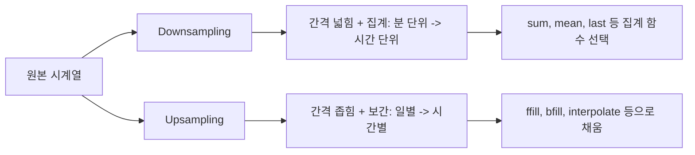
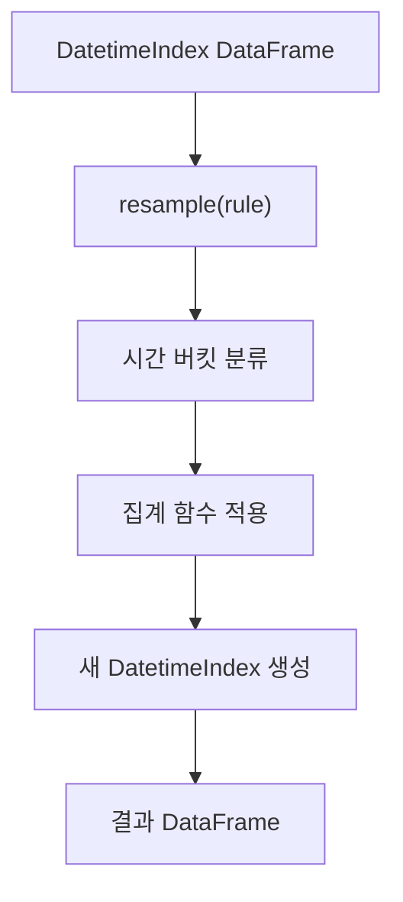

## 정의

**`resample(rule)`** 는 시계열 데이터를 **다른 빈도** (월별, 일별, 시간별 등) 로 재샘플링하면서 집계한다. [[Pandas groupby]] 의 시계열 버전.

DatetimeIndex (또는 `on=` 으로 datetime 컬럼) 이 필수.

## 사용 상황

| 상황 | resample 활용 |
|:---|:---|
| 일별 데이터를 월별로 집계 | `resample('ME').sum()` |
| 분 단위 로그를 시간 단위로 평균 | `resample('h').mean()` |
| 누락 기간 채우기 (upsampling) | `resample('D').ffill()` |
| OHLCV (주식 캔들스틱) | `resample('D').agg({'open','close','high','low','vol'})` |
| 영업일 기준 집계 | `resample('B').last()` |
| 분기별 보고서 | `resample('QE').sum()` |

## 시각화

downsampling vs upsampling 개념:



resample 처리 파이프라인:



```anim:pandas-resample-time
{}
```

## 기본

```python
df.resample('D').sum()        # 일별 합
df.resample('W').mean()        # 주별 평균
df.resample('ME').sum()        # 월말 (Month End)
df.resample('h').mean()        # 시간별 평균
```

<CodeWithOutput
  language="python"
  outputLanguage="text"
  code={`import pandas as pd
import numpy as np
idx = pd.date_range('2024-01-01', periods=10, freq='D')
df = pd.DataFrame({'sales': [10,15,12,18,20,25,22,30,28,35]}, index=idx)
print(df.resample('3D').sum())`}
  output={`            sales
2024-01-01     37
2024-01-04     63
2024-01-07     80
2024-01-10     35`}
/>

| date | 3-day sum |
|---|---|
| 2024-01-01 | 37 (10+15+12) |
| 2024-01-04 | 63 (18+20+25) |
| 2024-01-07 | 80 (22+30+28) |
| 2024-01-10 | 35 |

## 빈도 (frequency) 문법

| 코드 | 의미 |
|:---|:---|
| `s`, `min`, `h` | 초, 분, 시간 |
| `D` | 일 |
| `W` | 주 (일요일 끝) |
| `W-MON` | 주 (월요일 끝) |
| `ME` | 월말 (pandas 2.x, 이전엔 'M') |
| `MS` | 월초 |
| `QE`, `QS` | 분기 말/초 |
| `YE`, `YS` | 연 말/초 |
| `B` | 영업일 (Business day) |
| `BME` | 영업월말 |

> [!IMPORTANT]
> pandas 2.x 에서 `'M'`, `'Q'`, `'Y'` 가 deprecated. 명시적으로 `'ME'`, `'QE'`, `'YE'` 사용.

## upsampling (간격 축소 + interpolate)

```python
df.resample('h').ffill()              # 시간별 → 분 단위 forward fill
df.resample('h').interpolate()        # 선형 보간
```

## downsampling (집계 함수)

```python
df.resample('W').agg({
    'sales': ['sum', 'mean'],
    'orders': 'count',
})
```

## label / closed

```python
df.resample('W', closed='right', label='right')
# 'right' 라벨: 주의 마지막 날 (일요일) 이 결과 index
# 'left' 라벨: 주의 첫 날
```

- `closed`: 구간의 닫힌 쪽 (포함 여부)
- `label`: 결과 index 의 위치

## origin (시작 기준)

```python
df.resample('5min', origin='start_day')
# 매일 0시부터 5분 단위
```

## 자주 쓰는 패턴

### 일별 → 월별 매출

```python
monthly = df.resample('ME', on='date')['amount'].sum()
```

### 분 단위 → 시간 단위 평균

```python
hourly = df.resample('h').mean()
```

### 영업일 기준 (주말 제외)

```python
df.resample('B').agg({'price': 'last'})
```

### asfreq vs resample

```python
# asfreq: 단순 재인덱싱, 집계 없음
df.asfreq('h', fill_value=0)

# resample: 집계 동반
df.resample('h').sum()
```

## resample vs groupby

| 항목 | resample | groupby |
|:---|:---|:---|
| 기준 | 시간 간격 | 임의 키 |
| index | DatetimeIndex 필수 | 어떤 컬럼도 가능 |
| 빈도 문자열 | `'D'`, `'ME'`, `'h'` 등 | 없음 |
| upsampling | 가능 (ffill, interpolate) | 불가 |
| 사용 예 | 일별 -> 월별 집계 | 카테고리별 집계 |

```python
# 동일 결과 (downsampling 에서는 groupby 도 가능)
df.resample('ME').sum()
df.groupby(df.index.to_period('M')).sum()  # 더 복잡
```

## OHLCV 패턴

주식 / 가격 데이터에서 자주 쓰는 패턴:

```python
ohlcv = df['price'].resample('D').agg(
    open='first',
    high='max',
    low='min',
    close='last',
)
volume = df['volume'].resample('D').sum()
candle = ohlcv.join(volume)
```

## 함정

### 1. DatetimeIndex 필수

```python
df.resample('D')   # TypeError if not DatetimeIndex
df.resample('D', on='date')   # 특정 datetime 컬럼 사용
```

### 2. NaN 발생

```python
# 데이터가 없는 기간은 NaN
df.resample('h').sum()
# 일부 시간은 0 이 아닌 NaN (구분: 데이터가 없음 vs 합이 0)
```

`fill_value=0` 또는 `.fillna(0)`.

### 3. timezone 영향

```python
# tz-aware index 에서 'D' 는 자정 기준 (해당 timezone 의)
df.tz_convert('UTC').resample('D').sum()
```

### 4. pandas 2.x 빈도 문자열 변경

```python
# 1.x 에서는 동작했지만 2.x 에서 deprecated
df.resample('M').sum()    # FutureWarning
df.resample('Q').sum()    # FutureWarning

# 올바른 표기
df.resample('ME').sum()   # Month End
df.resample('QE').sum()   # Quarter End
```

> [!IMPORTANT]
> pandas 2.2 이후 `'M'`, `'Q'`, `'Y'` 는 deprecated. `'ME'`, `'QE'`, `'YE'` 로 대체.

### 5. label / closed 혼동

```python
# 기본: label='left', closed='left'
df.resample('W').sum()
# 결과 index 는 주의 시작 날짜 (월요일)

df.resample('W', label='right').sum()
# 결과 index 는 주의 마지막 날짜 (일요일)
```

합계 자체는 동일하나 index 라벨이 다름. 시각화 시 주의.

## 관련 위키

- [[Pandas dt accessor]]
- [[Pandas to_datetime]]
- [[Pandas date_range]]
- [[Pandas rolling]]
- [[Pandas groupby]]
- [[Pandas interpolate]]
