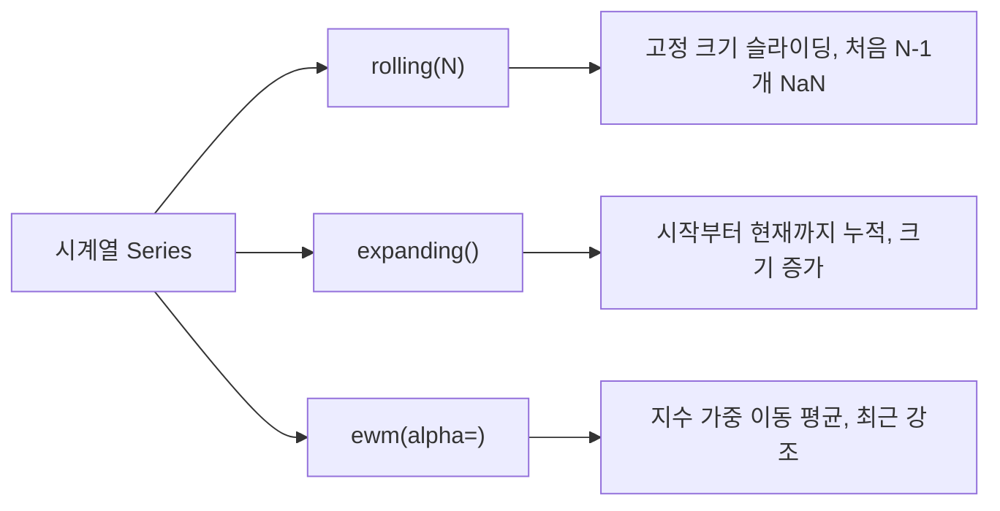
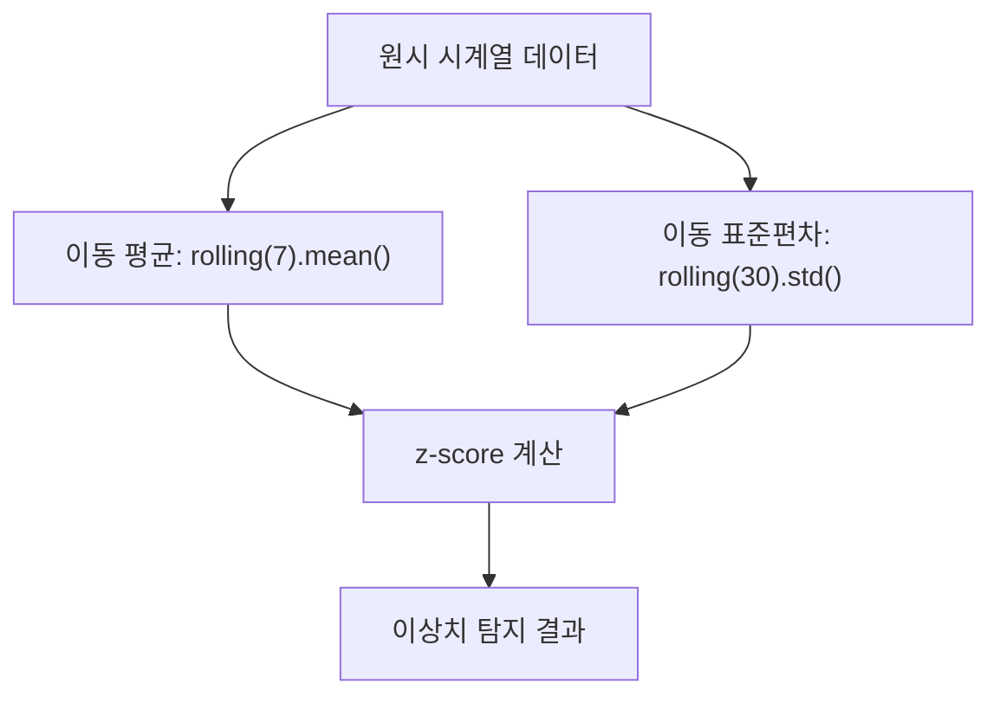

## 정의

- **`rolling(window)`** : 고정 크기 슬라이딩 윈도우 (이동 평균 등)
- **`expanding()`** : 시작부터 누적 윈도우 (cumulative)
- **`ewm(alpha=)`** : 지수 가중 이동 평균

## 사용 상황

| 상황 | 적합한 방법 |
|:---|:---|
| 노이즈 제거, smoothing | `rolling().mean()` |
| 최근 데이터에 더 큰 가중치 | `ewm(alpha=...)` |
| 전체 기간 누적 추세 파악 | `expanding().mean()` |
| 이상치 탐지 | `rolling().std()` + z-score |
| Bollinger Band 계산 | `rolling().mean()` + `rolling().std()` |
| 실시간 누적 집계 | `expanding().sum()` |
| 그룹별 이동 집계 | `groupby().rolling()` |

## 시각화

세 가지 윈도우 방식 비교:



시계열 분석 파이프라인:



```anim:pandas-rolling-window
{}
```

## rolling 기본

```python
s.rolling(window=3).mean()      # 3-point 이동 평균
s.rolling(window=7).sum()       # 7일 합계 (시계열)
s.rolling(window=5).std()
s.rolling(window=10).max()
```

<CodeWithOutput
  language="python"
  outputLanguage="text"
  code={`import pandas as pd
s = pd.Series([1, 2, 3, 4, 5, 6, 7, 8])
print(s.rolling(window=3).mean().tolist())`}
  output={`[nan, nan, 2.0, 3.0, 4.0, 5.0, 6.0, 7.0]`}
/>

| index | value | rolling(3).mean |
|---|---|---|
| 0 | 1 | NaN |
| 1 | 2 | NaN |
| 2 | 3 | 2.0 (1+2+3)/3 |
| 3 | 4 | 3.0 (2+3+4)/3 |
| 4 | 5 | 4.0 (3+4+5)/3 |
| 5 | 6 | 5.0 |
| 6 | 7 | 6.0 |
| 7 | 8 | 7.0 |

처음 N-1 개는 NaN (window 가 안 채워짐).

## min_periods (최소 데이터 수)

```python
s.rolling(window=3, min_periods=1).mean()
# [1.0, 1.5, 2.0, 3.0, 4.0, ...]  ← 처음 2 개도 계산
```

## time-based rolling (시계열)

```python
# index 가 DatetimeIndex 일 때
df.rolling('7D').sum()       # 지난 7일
df.rolling('30min').mean()   # 지난 30분
```

데이터 빈도가 불규칙해도 시간 기반으로 정확히 윈도우 형성.

## center=True

```python
s.rolling(window=3, center=True).mean()
# 중심 정렬, [NaN, 2.0, 3.0, 4.0, ..., NaN]
```

기본은 right-aligned (윈도우의 마지막 위치에 결과). `center=True` 는 중앙.

## expanding (누적)

```python
s.expanding().mean()       # 시작부터 현재까지 평균
s.expanding().sum()        # 누적합 (== cumsum)
s.expanding(min_periods=5).mean()
```

## ewm (지수 가중)

```python
s.ewm(alpha=0.3).mean()        # alpha 클수록 최근 가중
s.ewm(span=10).mean()           # span = (2/alpha - 1)
s.ewm(halflife=5).mean()
```

최근 데이터에 더 큰 가중치, **이전 데이터는 점진적 감소**. 금융 / 신호 처리.

## groupby + rolling

```python
df.groupby('user_id')['amount'].rolling(window=7).sum()
# 각 user 별 7-day 합계 (MultiIndex 결과)
```

## 자주 쓰는 패턴

### 7일 이동 평균 (smoothing)

```python
df['ma7'] = df['sales'].rolling(7).mean()
```

### 누적 합 / 평균

```python
df['cumulative_revenue'] = df['revenue'].expanding().sum()
df['running_avg'] = df['revenue'].expanding().mean()
```

### Bollinger Bands

```python
ma = s.rolling(20).mean()
std = s.rolling(20).std()
upper = ma + 2 * std
lower = ma - 2 * std
```

### 윈도우 안에서 사용자 함수

```python
s.rolling(window=5).apply(lambda x: x.max() - x.min(), raw=True)
# raw=True 면 numpy array 가 전달되어 빠름
```

### rolling z-score 이상치 탐지

```python
roll_mean = df['value'].rolling(30).mean()
roll_std  = df['value'].rolling(30).std()
df['z_score'] = (df['value'] - roll_mean) / roll_std
outliers = df[df['z_score'].abs() > 3]
```

### 두 시리즈 이동 상관계수

```python
df['x'].rolling(30).corr(df['y'])
# 30일 구간의 이동 상관계수, -1.0 ~ 1.0
```

### step 으로 건너뛰며 집계

```python
# pandas 1.5+
s.rolling(window=6, step=2).mean()
# 2 칸씩 건너뛰며 집계, 결과 크기 절반
```

## rolling 집계 함수 목록

| 메서드 | 설명 |
|:---|:---|
| `.mean()` | 이동 평균 |
| `.sum()` | 이동 합 |
| `.std()` / `.var()` | 이동 표준편차 / 분산 |
| `.min()` / `.max()` | 이동 최솟값 / 최댓값 |
| `.median()` | 이동 중앙값 |
| `.count()` | NaN 제외 유효 수 |
| `.corr(other)` | 이동 상관계수 |
| `.cov(other)` | 이동 공분산 |
| `.apply(func)` | 사용자 함수 |
| `.quantile(q)` | 이동 분위수 |
| `.rank()` | 이동 순위 |
| `.skew()` | 이동 왜도 |
| `.kurt()` | 이동 첨도 |

## 성능 팁

```python
# 1. numba engine (pandas 1.3+)
s.rolling(window=50).mean(engine='numba')

# 2. raw=True 로 apply 속도 개선
s.rolling(5).apply(np.mean, raw=True)  # numpy array 전달, 빠름

# 3. 큰 윈도우 + 큰 데이터에서 polars 고려
# polars: df.lazy().with_columns(pl.col('x').rolling_mean(7))
```

## 함정

### 1. window 가 너무 커서 NaN 만

```python
short_series.rolling(window=100).mean()
# 데이터가 99 개라면 모두 NaN
```

`min_periods=1` 로 부분 결과.

### 2. shift 와 혼동

```python
s.rolling(3).mean()       # 현재 포함 3 개
s.shift(1).rolling(3).mean()    # 이전 3 개 (오늘 제외)
```

미래 정보 누설 방지 (lookahead bias) 가 필요할 때 `shift`.

### 3. 성능

- 큰 데이터 + 작은 윈도우: 빠름
- 큰 데이터 + 큰 윈도우: 느림
- `numba` engine 사용: `s.rolling(window=10).mean(engine='numba')` (pandas 1.x+)

### 4. closed 파라미터

```python
s.rolling(3, closed='left').mean()    # 현재 제외, 이전 3개
s.rolling(3, closed='right').mean()   # 기본 (현재 포함)
s.rolling(3, closed='both').mean()    # 양쪽 포함
```

> [!WARNING]
> `closed` 는 DatetimeIndex 기반 time-based rolling 에서만 유효. 정수 index 에서는 무시된다.

### 5. groupby + rolling 의 MultiIndex

```python
result = df.groupby('cat')['val'].rolling(3).mean()
# (cat, original_index) 의 MultiIndex
result = result.reset_index(level=0, drop=True)  # 원래 index 복원
```

### 6. expanding 과 cumsum 의 차이

```python
s.expanding().sum()   # expanding 집계, NaN 고려
s.cumsum()            # 단순 누적합, 빠름
```

`NaN` 이 포함된 데이터에서는 `expanding().sum()` 이 `cumsum()` 보다 안전. `skipna=True` 가 기본.

## 관련 위키

- [[Pandas resample]]
- [[Pandas groupby]]
- [[Pandas DataFrame]]
- [[Pandas shift / diff]]
- [[Pandas expanding]]
- [[Pandas interpolate]]
- [[Pandas cumulative]]
