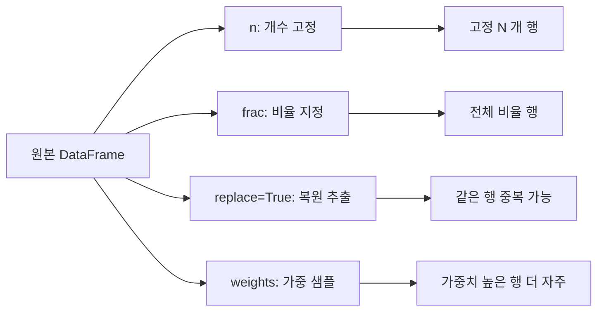

## 정의

**`DataFrame.sample()`** / **`Series.sample()`** 은 행 (또는 열) 을 **랜덤으로 추출** 하는 함수. EDA 빠른 확인, train/test split, bootstrap, imbalanced data 처리에 자주 사용.

## 사용 상황

| 상황 | 패턴 |
|:---|:---|
| EDA 미리보기 | `df.sample(20)` |
| 비율로 분할 | `df.sample(frac=0.8)` |
| 전체 섞기 (shuffle) | `df.sample(frac=1, random_state=42)` |
| Bootstrap 신뢰 구간 | `replace=True` |
| Stratified 샘플링 | `df.groupby('label').sample(n=N)` |
| 가중 샘플링 | `weights='컬럼'` |

## 기본 사용

```python
df.sample(n=5)                        # 5 개 무작위
df.sample(frac=0.1)                   # 10% 무작위
df.sample(n=5, random_state=42)       # 시드 고정 (재현 가능)
df.sample(frac=1, random_state=42)    # 전체 섞기 (shuffle)
```

`n` 과 `frac` 은 둘 중 하나만 지정.

## 주요 파라미터

| 파라미터 | 기본값 | 설명 |
|:---|:---:|:---|
| `n` | - | 추출 개수 (frac 과 상호 배타) |
| `frac` | - | 비율 (0~1, 1 초과 시 replace=True 필요) |
| `replace` | `False` | 복원 추출 여부 |
| `weights` | `None` | 가중치 (Series 또는 컬럼명) |
| `random_state` | `None` | 시드 (int 또는 numpy Generator) |
| `axis` | `0` | 0 = 행 샘플, 1 = 열 샘플 |
| `ignore_index` | `False` | True 면 결과 index 를 0,1,... 로 재배치 |

## 샘플링 전략 시각화



## random_state (재현성)

```python
# 매번 다른 결과
df.sample(n=5)

# 시드 고정: 같은 결과
df.sample(n=5, random_state=42)

# numpy Generator 도 가능 (pandas 1.4+)
import numpy as np
rng = np.random.default_rng(42)
df.sample(n=5, random_state=rng)
```

테스트, ML 실험에서 `random_state` 미지정은 재현 불가능.

## 복원 추출 (Bootstrap)

```python
# Bootstrap 한 번: 원본과 같은 크기, 중복 허용
boot = df.sample(n=len(df), replace=True, random_state=42)

# 1000 번 bootstrap 으로 평균의 95% 신뢰 구간
import numpy as np
samples = [
    df.sample(frac=1, replace=True, random_state=i)['salary'].mean()
    for i in range(1000)
]
ci = np.percentile(samples, [2.5, 97.5])
print(f'95% CI: {ci[0]:.0f} ~ {ci[1]:.0f}')
```

## 가중 샘플링

```python
# 컬럼을 가중치로
df.sample(n=100, weights='priority_score')

# 명시적 Series
weights = df['is_vip'].map({True: 5.0, False: 1.0})
df.sample(n=100, weights=weights, random_state=42)

# 가중치 정규화는 자동 (합이 1 이 아니어도 됨)
```

VIP 는 5 배 자주 샘플링됨. 비균등 샘플링.

## train / test split

```python
# 80 / 20 split
train = df.sample(frac=0.8, random_state=42)
test = df.drop(train.index)

print(f'train: {len(train)}, test: {len(test)}')
```

`sklearn.model_selection.train_test_split` 보다 단순하지만, 층화(stratified) 는 groupby.sample 로 해야 함.

## groupby + sample (Stratified Sampling)

각 그룹에서 균등하게 추출하는 층화 샘플링.

<CodeWithOutput
  language="python"
  outputLanguage="text"
  code={`import pandas as pd

df = pd.DataFrame({
    'label': ['pos'] * 10 + ['neg'] * 90,
    'value': range(100),
})

# 각 클래스에서 5 개씩
stratified = df.groupby('label').sample(n=5, random_state=42)
print(stratified['label'].value_counts())`}
  output={`label
neg    5
pos    5
Name: count, dtype: int64`}
/>

```python
# 각 클래스에서 10% 씩
df.groupby('label').sample(frac=0.1, random_state=42)
```

## ignore_index

```python
df.sample(n=10, ignore_index=True)
# 결과 DataFrame 의 index 가 0, 1, ..., 9 로 재설정
# 원래 index 불필요할 때 사용
```

## imbalanced data 처리

```python
# 다운샘플링: 다수 클래스를 소수 클래스 크기로 줄이기
minority = df[df['label'] == 1]
majority = df[df['label'] == 0].sample(n=len(minority), random_state=42)
balanced = pd.concat([minority, majority]).sample(frac=1, random_state=42)

# 업샘플링: 소수 클래스를 복원 추출로 늘리기
oversampled = df[df['label'] == 1].sample(
    n=len(df[df['label'] == 0]),
    replace=True,
    random_state=42,
)
balanced2 = pd.concat([df[df['label'] == 0], oversampled])
```

## 열 샘플링

```python
# axis=1: 열을 샘플링
df.sample(n=3, axis=1)          # 컬럼 3 개 랜덤 선택
df.sample(frac=0.5, axis=1)     # 컬럼의 50%
```

## numpy 와의 비교

```python
import numpy as np

# numpy: index 만 얻고 df 에서 선택
idx = np.random.choice(len(df), size=100, replace=False)
df.iloc[idx]

# pandas: 바로 DataFrame, index 보존
df.sample(n=100)
```

pandas API 가 더 자연스럽고 원본 index 를 보존한다.

## 실전 패턴

### EDA 빠르게

```python
df.sample(20)        # 20 행만 보면서 데이터 형태 확인
df.sample(frac=0.01) # 1% 미리보기 (대용량 파일)
```

### 재현 가능한 실험 세트

```python
SEED = 42
train = df.sample(frac=0.7, random_state=SEED)
remaining = df.drop(train.index)
val = remaining.sample(frac=0.5, random_state=SEED)
test = remaining.drop(val.index)

print(f'train={len(train)}, val={len(val)}, test={len(test)}')
```

### 각 그룹에서 최대 N 개 (불균형 그룹 처리)

```python
# 그룹마다 크기가 다를 때: 최대 N 개 (부족하면 있는 만큼)
df.groupby('category').sample(n=50, replace=False, random_state=42)
# 그룹 크기 < 50 이면 ValueError → replace=True 또는 min(n, len) 처리
```

## 함정

### 1. random_state 미지정

```python
df.sample(n=5)                    # 매 실행마다 다른 결과
df.sample(n=5, random_state=42)   # 고정 결과
```

ML 실험, 테스트 코드에는 반드시 시드 지정.

### 2. frac > 1.0 은 replace=True 필요

```python
df.sample(frac=2.0)                       # ValueError
df.sample(frac=2.0, replace=True)         # ✓ 복원 추출
```

### 3. n > len(df) 는 replace=True 필요

```python
df.sample(n=len(df) + 10)                 # ValueError
df.sample(n=len(df) + 10, replace=True)   # ✓
```

### 4. groupby sample 의 그룹 크기 부족

```python
# 그룹 크기 < n 이면 ValueError
df.groupby('label').sample(n=100, random_state=42)
# 해결: replace=True 또는 각 그룹 크기 확인 후 min 적용
```

### 5. weights 에 NaN 있으면 오류

```python
# weights 컬럼에 NaN 있으면 ValueError
w = df['weight'].fillna(0)
df.sample(n=10, weights=w)
```

### 6. index 보존 vs ignore_index

```python
result = df.sample(n=5)
# result.index 는 원본 df 의 index 값들 → 역추적 가능
# df.loc[result.index] 로 원본에서 같은 행 확인

result_reset = df.sample(n=5, ignore_index=True)
# 0,1,2,3,4 로 재설정 → 원본 추적 불가
```

## 관련 위키

- [[Pandas DataFrame]]
- [[Pandas groupby]]
- [[Pandas concat]]
- [[Pandas Boolean Indexing]]
- [[Pandas isin / isna]]
