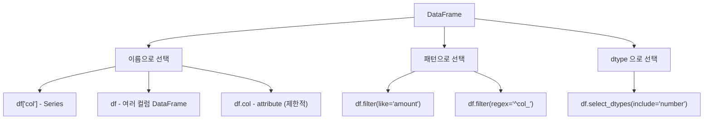

## 정의

DataFrame 에서 **하나 또는 여러 컬럼을 선택** 하는 방법들. 가장 기본이자 가장 자주 쓰는 동작.

## 선택 방법 분류



## 4 가지 기본 방식

```python
df['name']             # 단일 컬럼 → Series
df[['name']]            # 한 컬럼이지만 DataFrame
df[['name', 'age']]    # 여러 컬럼 → DataFrame
df.name                 # attribute (제한적)
```

## 단일 vs 다중 (반환 타입 차이)

<CodeWithOutput
  language="python"
  outputLanguage="text"
  code={`import pandas as pd
df = pd.DataFrame({'a': [1, 2, 3], 'b': [4, 5, 6], 'c': [7, 8, 9]})

x = df['a']             # Series
y = df[['a']]            # DataFrame (한 컬럼)
print(type(x).__name__, type(y).__name__)
print(x.shape, y.shape)`}
  output={`Series DataFrame
(3,) (3, 1)`}
/>

**대괄호 1 개** → Series, **대괄호 2 개 (리스트)** → DataFrame.

## attribute 접근의 제한

```python
df.name      # ✓ 동작
df.class     # ❌ Python 예약어
df['1st']    # ✓ 동작
df.1st       # ❌ 문법 오류
```

attribute 는 일관성이 없으므로 **`df['col']` 권장**.

## 컬럼 순서 변경

```python
df[['c', 'a', 'b']]      # 명시적 순서로 재정렬한 새 DataFrame
df.reindex(columns=['c', 'a', 'b'])  # 같음
```

## 패턴으로 선택

```python
# 이름이 'amount_' 로 시작하는 컬럼만
df.filter(like='amount_')

# 정규식
df.filter(regex='^(name|age)$')

# dtype 기반
df.select_dtypes(include='number')
df.select_dtypes(include=['int64', 'float64'])
df.select_dtypes(exclude='object')
```

<CodeWithOutput
  language="python"
  outputLanguage="text"
  code={`df = pd.DataFrame({
    'name': ['A', 'B'],
    'age': [20, 30],
    'salary': [3000, 5000],
})
print(df.select_dtypes(include='number').columns.tolist())
print(df.filter(like='a').columns.tolist())`}
  output={`['age', 'salary']
['name', 'age', 'salary']`}
/>

## 동적 컬럼 목록

```python
# 런타임에 컬럼 목록 결정
target_cols = ['name', 'age', 'salary']
df[target_cols]

# 특정 컬럼 제외
exclude = ['id', 'created_at']
cols = [c for c in df.columns if c not in exclude]
df[cols]

# 또는 drop 으로
df.drop(columns=exclude)
```

## 컬럼 추가 / 삭제

```python
df['bmi'] = df['weight'] / (df['height'] / 100) ** 2
df['constant'] = 100
df = df.drop(columns=['old_col'])
df = df.drop(columns=['a', 'b'])

# in-place 도 가능하지만 권장 안 함
df.drop(columns=['a'], inplace=True)
```

## assign 으로 method chain

```python
df_new = (df
    .assign(bmi=lambda d: d['weight'] / (d['height']/100)**2)
    .assign(category=lambda d: d['bmi'].apply(categorize))
)
```

체인 방식으로 새 컬럼을 추가, 원본 보존.

## 컬럼 이름 변경

```python
df.rename(columns={'old_name': 'new_name'})
df.rename(columns=str.lower)              # 모든 컬럼 소문자
df.columns = ['a', 'b', 'c']              # 직접 할당
```

## 컬럼 타입 확인 및 일괄 변환

```python
df.dtypes                                   # 각 컬럼 dtype
df.dtypes[df.dtypes == 'object']            # object 타입만

# 일괄 변환
df = df.astype({
    'age': 'int32',
    'city': 'category',
    'score': 'float32',
})

# object -> category (메모리 절약)
cat_cols = df.select_dtypes(include='object').columns
df[cat_cols] = df[cat_cols].astype('category')
```

## loc / iloc 으로 컬럼 범위 선택

```python
import pandas as pd
df = pd.DataFrame({'a': [1], 'b': [2], 'c': [3], 'd': [4]})

df.loc[:, 'b':'d']       # 컬럼 b, c, d (label 슬라이스, 양쪽 포함)
df.iloc[:, 1:3]          # 컬럼 위치 1, 2 (position 슬라이스, 오른쪽 미포함)
df.iloc[:, ::2]          # 짝수 위치 컬럼 (a, c)
```

자세히는 [[Pandas .loc / .iloc]].

## 성능 팁

```python
# 필요한 컬럼만 read_csv 할 때
df = pd.read_csv('large.csv', usecols=['name', 'age', 'salary'])
# 불필요한 컬럼을 메모리에 올리지 않음

# object 컬럼이 많으면 category 변환으로 선택 연산 속도 향상
df['city'] = df['city'].astype('category')
```

## 함정

### 1. SettingWithCopyWarning

```python
sub = df[df['age'] > 20]
sub['new'] = 1      # ⚠️ SettingWithCopyWarning
# 해법: .copy() 명시
sub = df[df['age'] > 20].copy()
sub['new'] = 1      # ✓
```

> [!WARNING]
> pandas 2.0 부터 CoW(Copy-on-Write) 기본 도입. 체이닝 인덱싱(`df[mask]['col'] = ...`) 은 `ChainedAssignmentError`. `.loc[mask, col] =` 패턴 사용.

### 2. attribute 가 메서드와 충돌

`df.shape`, `df.values`, `df.index` 같은 attribute 가 있으면 같은 이름의 컬럼은 attribute 로 못 부른다.

```python
df['shape']    # ✓ 컬럼
df.shape        # DataFrame 의 shape attribute
```

### 3. 컬럼 이름에 공백 / 특수문자

```python
df['first name']           # ✓ 대괄호 필수
df.first name              # ❌ 문법 오류
df.query("`first name` > 0")   # query 에서는 backtick 으로 이스케이프
```

### 4. filter(like=...) 의 동작 범위

```python
df.filter(like='name')    # 컬럼명에 'name' 이 포함된 것 (행 이름 아님)
# df.filter(axis=0, like='2024') 으로 행 필터 가능
```

`filter` 는 기본 `axis=1` (컬럼). 혼동 주의.

## pipe 와 method chain 에서 컬럼 선택

```python
# 파이프라인에서 동적으로 컬럼 가공
result = (
    df
    .assign(bmi=lambda d: d['weight'] / (d['height']/100)**2)
    .pipe(lambda d: d.loc[:, ['name', 'age', 'bmi']])   # 필요한 컬럼만 유지
    .rename(columns={'bmi': 'body_mass_index'})
)
```

자세히는 [[Pandas pipe]].

## 관련 위키

- [[Pandas DataFrame]]
- [[Pandas .loc / .iloc]]
- [[Pandas Boolean Indexing]]
- [[Pandas query]]
- [[Pandas replace / astype]]
- [[SettingWithCopyWarning]]
- [[Pandas pipe]]
