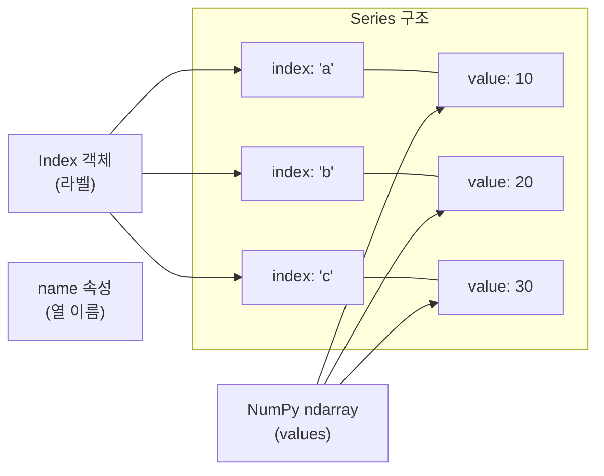
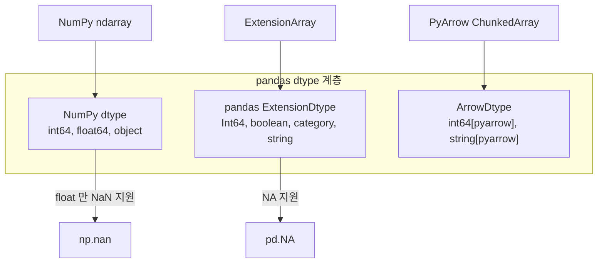

## 정의

**`pandas.Series`** 는 **1차원 레이블 배열**. NumPy `ndarray` + `Index` 의 결합. [[Pandas DataFrame]] 의 한 열이 곧 Series. dict-like (key = index label) 이자 list-like (순서 있는 배열) 의 성질을 함께 가진다.

```python
import pandas as pd
s = pd.Series([10, 20, 30], index=['a', 'b', 'c'], name='score')
```

## 구조 시각화



## 핵심 속성

| 속성 | 의미 |
|:---|:---|
| `s.values` | numpy array (또는 Arrow array) |
| `s.index` | Index 객체 |
| `s.dtype` | 데이터 타입 (`int64`, `float64`, `object`, ...) |
| `s.name` | Series 이름 (DataFrame 의 열 이름이 됨) |
| `s.size` | 원소 수 |
| `s.shape` | `(n,)` - 1D 튜플 |
| `s.nbytes` | 메모리 사용량 (bytes) |

## 생성

<CodeWithOutput
  language="python"
  outputLanguage="text"
  code={`import pandas as pd

# list 로
s1 = pd.Series([1, 2, 3])

# dict 로 (key → index)
s2 = pd.Series({'a': 10, 'b': 20, 'c': 30})

# scalar broadcast
s3 = pd.Series(0, index=['x', 'y', 'z'])

print(s1.tolist(), '|', s2.to_dict(), '|', s3.tolist())`}
  output={`[1, 2, 3] | {'a': 10, 'b': 20, 'c': 30} | [0, 0, 0]`}
/>

### 다양한 생성 방법

```python
# NumPy array 로
import numpy as np
s = pd.Series(np.arange(5))

# range 로
s = pd.Series(range(5))

# 날짜 인덱스
s = pd.Series(
    [100, 200, 300],
    index=pd.date_range('2024-01-01', periods=3),
)

# dtype 지정
s = pd.Series([1, 2, 3], dtype='float32')
s = pd.Series(['a', 'b'], dtype='string[pyarrow]')  # Arrow 백엔드
```

## dict-like / list-like 이중 성격

```python
s = pd.Series({'a': 10, 'b': 20, 'c': 30})

# dict-like: key(label)로 접근
s['b']         # 20
'b' in s       # True
s.keys()       # Index(['a', 'b', 'c'])

# list-like: 순서로 접근
s.iloc[1]      # 20
list(s)        # [10, 20, 30]
```

## 인덱싱

<CodeWithOutput
  language="python"
  outputLanguage="text"
  code={`s = pd.Series([10, 20, 30, 40], index=['a', 'b', 'c', 'd'])

print(s['b'])               # label 로
print(s.iloc[1])            # 정수 위치
labels = ['a', 'c']
print(s[labels].values)     # 여러 label
print(s[s > 15].values)     # boolean mask`}
  output={`20
20
[10 30]
[20 30 40]`}
/>

> [!IMPORTANT]
> 정수 index 에서 `s[n]` 은 label 로 해석된다 (`.loc` 와 동일). 위치로 접근하려면 항상 `.iloc[n]` 을 사용하라.

## 벡터 연산

NumPy 처럼 element-wise 연산이 빠르다. C 레벨에서 실행되어 Python 반복문보다 수십 배 빠르다.

<CodeWithOutput
  language="python"
  outputLanguage="text"
  code={`s = pd.Series([1, 2, 3, 4])
print((s * 10).tolist())
print((s + s).tolist())
print(s.mean(), s.sum(), s.std())`}
  output={`[10, 20, 30, 40]
[2, 4, 6, 8]
2.5 10 1.2909944487358056`}
/>

### 주요 집계 메서드

```python
s.sum()         # 합계
s.mean()        # 평균
s.std()         # 표준편차
s.var()         # 분산
s.min(), s.max()
s.median()
s.quantile(0.25)  # 1사분위수
s.describe()    # 주요 통계 한 번에
```

## Index 정렬 (Index Alignment)

두 Series 를 연산할 때 **index 가 자동 정렬** 된다.

<CodeWithOutput
  language="python"
  outputLanguage="text"
  code={`a = pd.Series([1, 2, 3], index=['x', 'y', 'z'])
b = pd.Series([10, 20, 30], index=['y', 'z', 'w'])
print(a + b)`}
  output={`w     NaN
x     NaN
y    12.0
z    23.0
dtype: float64`}
/>

매칭되지 않은 index 는 NaN. 이 동작이 SQL 의 outer join 과 유사. 정렬을 끄려면 `.values` 를 사용:

```python
# index 무시하고 위치 기반 계산
pd.Series(a.values + b.values)
```

## dtype 과 NumPy 관계



```python
# NumPy dtype (기존)
pd.Series([1, 2, 3])              # dtype: int64
pd.Series([1, None, 3])           # dtype: float64 (None → NaN)

# Nullable Int64 (pandas Extension)
pd.Series([1, None, 3], dtype='Int64')  # dtype: Int64, NA 지원

# PyArrow
pd.Series([1, None, 3], dtype='int64[pyarrow]')  # dtype: int64[pyarrow]
```

자세히: [[Pandas Nullable Types (Int64, boolean, string[pyarrow])]]

## 실전 예시: 주요 변환

```python
s = pd.Series([3, 1, 4, 1, 5, 9, 2, 6])

# 정렬
s.sort_values()                  # 오름차순 (index 유지)
s.sort_values(ascending=False)   # 내림차순

# 순위
s.rank()                         # 1.0-based float
s.rank(method='min')             # 동점 처리: min 방법

# 중복 제거
s.unique()                       # numpy array
s.drop_duplicates()              # Series (index 유지)
s.nunique()                      # 고유값 수

# 결측치
s.isna()                         # bool Series
s.fillna(0)                      # NaN → 0
s.dropna()                       # NaN 행 제거
```

## 실전 예시: 문자열 Series

```python
names = pd.Series(['alice', 'BOB', 'Charlie', None])

names.str.title()           # Title Case
names.str.upper()           # 대문자
names.str.len()             # 길이
names.str.startswith('A')   # bool
names.str.contains('ob', case=False, na=False)
```

자세히: [[Pandas str accessor]], [[Pandas str contains]]

## DataFrame 으로 변환

```python
s = pd.Series([10, 20, 30], name='score')
df = s.to_frame()               # 1열짜리 DataFrame
df2 = pd.DataFrame({'score': s, 'grade': ['A', 'B', 'A']})
```

## 성능

### apply 는 느리다

```python
s = pd.Series(range(1_000_000))

# ❌ 느림 - Python 반복
s.apply(lambda x: x * 2)

# ✓ 빠름 - 벡터 연산
s * 2
```

`apply` 는 각 원소마다 Python 호출이 발생해 10-100배 느리다.

### 큰 문자열 Series

```python
# object dtype (기본) - 느림
s = pd.Series(['a', 'b'] * 500_000)

# string[pyarrow] - 빠르고 메모리 효율적
s = pd.Series(['a', 'b'] * 500_000, dtype='string[pyarrow]')
```

## 함정

> [!WARNING]
> **정수 index 에서 `s[0]` 은 라벨 0을 찾는다**, 위치 0이 아니다.

```python
s = pd.Series([10, 20, 30], index=[5, 6, 7])
s[5]      # 값 10 (라벨 5)
s.iloc[0] # 값 10 (위치 0)
s[0]      # KeyError (라벨 0 없음)
```

> [!CAUTION]
> Series 에 inplace 연산을 여러 번 적용하면 Chained Assignment 경고가 발생한다. pandas 2.x Copy-on-Write 에서는 모든 선택이 복사본을 반환하므로 `s[mask] = value` 패턴은 원본을 변경하지 않을 수 있다. `.loc` 또는 `pd.Series.where()` 를 사용하라.

```python
# ❌ 2.x 에서 원본 미변경
s[s > 2] = 0

# ✓
s = s.where(s <= 2, 0)
```

## 관련 위키

- [[Pandas Overview]]
- [[Pandas DataFrame]]
- [[Pandas Index]]
- [[Pandas .loc / .iloc]]
- [[Pandas str accessor]]
- [[Pandas Nullable Types (Int64, boolean, string[pyarrow])]]
- [[Pandas apply / map]]
