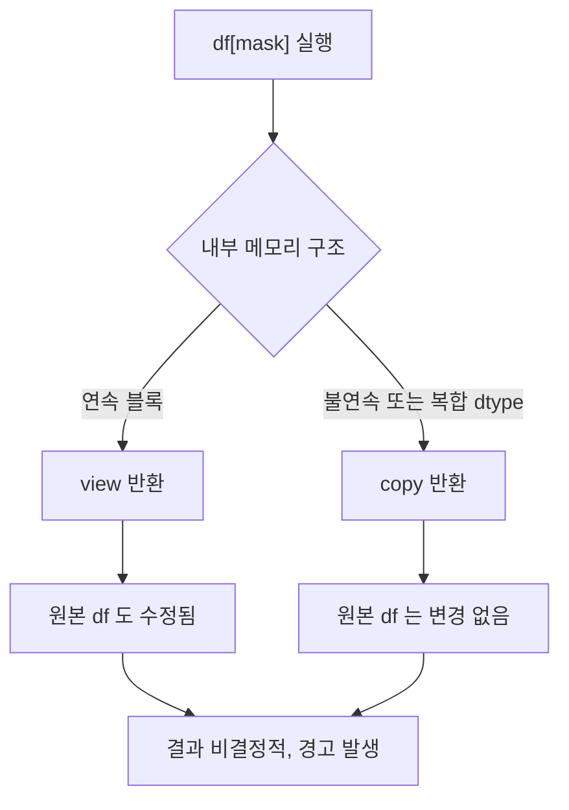

## 정의

**`SettingWithCopyWarning`** 은 pandas 가 가장 자주 던지는 경고. **chained indexing 으로 view 인지 copy 인지 모호한 상태에 값을 할당** 할 때 발생.

```python
sub = df[df['age'] > 30]
sub['new'] = 1                    # ⚠️ SettingWithCopyWarning
# sub 가 view 인지 copy 인지 pandas 가 모름
# 원본 df 가 영향받을 수도, 안 받을 수도
```

## 사용 상황

다음 상황에서 가장 자주 발생한다.

| 상황 | 예시 패턴 | 발생 이유 |
|:---|:---|:---|
| 필터링 후 컬럼 추가 | `df[mask]['col'] = v` | chained indexing |
| 슬라이스 후 수정 | `df[5:10]['x'] = 1` | slice 가 view 일 수 있음 |
| groupby 결과 수정 | `get_group(...)` 후 할당 | view/copy 불확실 |
| 함수 인자 df 수정 | 받은 df 에 직접 컬럼 추가 | 호출자 df 변경 여부 불확실 |
| 함수형 체이닝 후 수정 | `.sort_values()[...] = v` | 체이닝 결과가 copy |

## 원인: view vs copy 흐름



pandas 는 어떤 경우에 view 가, 어떤 경우에 copy 가 반환될지 **버전마다, dtype 마다, 메모리 레이아웃마다 다르다**. 사용자는 예측할 수 없다.

## 왜 위험한가

- `sub` 가 **copy** 면: `sub['new'] = 1` 은 sub 만 변경, **원본 df 는 안 바뀜**
- `sub` 가 **view** 면: 원본 df 도 함께 변경됨 (의도일 수도, 아닐 수도)

두 경우 모두 조용히 지나가기 때문에 버그를 늦게 발견하는 경우가 많다.

## 4 가지 해결 패턴

### 1. `.loc[]` 한 줄에 통합 (가장 권장)

```python
# ❌ chained indexing: 두 번의 indexing
df[df['age'] > 30]['salary'] = 0

# ✓ loc 로 한 번에: 행 + 열 동시 지정
df.loc[df['age'] > 30, 'salary'] = 0
```

행 / 열을 한 번의 indexer 로 처리. `[[Pandas .loc / .iloc]]` 참고.

### 2. 명시적 `.copy()`

```python
sub = df[df['age'] > 30].copy()   # 명시적 copy
sub['new'] = 1                     # sub 만 변경, 원본 df 불변
```

원본 보존 의도가 명확. 단, 대용량 df 에서 메모리 복사 비용 발생.

### 3. `.assign()` 으로 method chaining

```python
# 새 컬럼 추가 / 기존 컬럼 변환
df = df.assign(
    salary=lambda d: d['salary'].where(d['age'] > 30, 0),
    is_senior=lambda d: d['age'] > 30,
)
```

원본 df 를 직접 변경하지 않고 새 df 를 반환한다. `[[Pandas pipe / method chaining]]` 참고.

### 4. `np.where` / `np.select` 벡터화

```python
import numpy as np

# 조건부 컬럼 생성: apply 보다 훨씬 빠름
df['category'] = np.where(df['age'] > 30, 'senior', 'junior')

# 다중 분기
conditions = [df['age'] < 20, df['age'] < 60, df['age'] >= 60]
choices    = ['youth', 'adult', 'senior']
df['age_group'] = np.select(conditions, choices, default='unknown')
```

## 흔한 함정 패턴

### chained indexing

```python
df[df['age'] > 30]['salary'] = 0
# 내부 동작: df.__getitem__(mask).__setitem__('salary', 0)
# 첫 번째 __getitem__ 결과가 view/copy 불확실
```

### slice 후 수정

```python
sub = df[5:10]      # slice 는 view (대부분의 경우)
sub['x'] = 1         # 원본 df 의 5~10 행도 영향받을 수 있음
```

### loc + chained

```python
df.loc[df['age'] > 30]['salary'] = 0   # ❌ 여전히 chained
df.loc[df['age'] > 30, 'salary'] = 0   # ✓ 한 번에
```

`.loc` 를 썼더라도 두 번의 indexing 이면 같은 문제가 발생한다.

## view vs copy 판별 (비공식)

pandas 내부 동작이 복잡하고 버전마다 다르다. **확신할 수 없으면 항상 `.copy()`** 또는 한 줄 `.loc[행, 열]` 을 쓴다.

```python
df._is_view       # 비공식 속성, 의존하지 마라
df._is_copy       # 동일
```

## pandas 2.x Copy-on-Write (CoW)

pandas 2.0 부터 CoW 가 opt-in 으로 도입됐고, **pandas 3.0 부터 기본 활성화**.

```python
# pandas 2.x: 수동 활성화
import pandas as pd
pd.options.mode.copy_on_write = True

# CoW 동작 원리: lazy copy
sub = df[df['age'] > 30]    # 아직 실제 복사 없음
sub['new'] = 1               # write 시점에 물리적 복사 수행
# 원본 df 는 항상 불변
```

CoW 활성화 환경에서의 동작 변화:

| 코드 패턴 | pandas 2.x 이전 | CoW 활성화 후 |
|:---|:---|:---|
| `df[mask]['col'] = v` | SettingWithCopyWarning | ChainedAssignmentError |
| `df.loc[mask, 'col'] = v` | 정상 | 정상 |
| `sub = df[mask].copy()` 후 수정 | 정상 | 정상 |

```python
# pandas 3.0+ (CoW 기본)
df[df['age'] > 30]['salary'] = 0          # ChainedAssignmentError
df.loc[df['age'] > 30, 'salary'] = 0       # ✓ 정상 동작
```

> [!IMPORTANT]
> pandas 3.0 에서는 `SettingWithCopyWarning` 이 에러로 격상된다. 지금부터 `.loc[행, 열]` 패턴으로 작성하는 습관을 들여야 한다.

## 성능

| 방법 | 메모리 비용 | 속도 | 비고 |
|:---|:---:|:---:|:---|
| `.loc[행, 열] = v` | 없음 | 빠름 | 인플레이스 수정 |
| `.copy()` 후 수정 | df 전체 복사 | 중간 | 명확한 의도 표현 |
| `.assign()` | 새 df 생성 | 중간 | 함수형 style |
| `np.where` / `np.select` | 없음 | 빠름 | 벡터 연산 |

대용량 DataFrame 에서 `.copy()` 는 메모리 / 시간 비용이 크다. 원본 수정이 목적이면 `.loc[행, 열] = v` 가 최선.

```python
import pandas as pd
import numpy as np

# 1,000,000 행 DataFrame 테스트 (예시)
df = pd.DataFrame({'age': np.random.randint(20, 60, 1_000_000),
                   'salary': np.random.randint(3000, 8000, 1_000_000)})

# 빠름: 메모리 추가 없음
df.loc[df['age'] > 30, 'bonus'] = 500

# 느림: 전체 복사
sub = df[df['age'] > 30].copy()
sub['bonus'] = 500
```

## 자주 묻는 질문

### Q. 경고를 무시해도 되나?

A. **무시하지 마라.** 경고는 의도와 다른 결과를 낳을 수 있다는 신호. pandas 3.0 에서는 에러로 바뀐다.

### Q. `inplace=True` 가 해결인가?

A. 별 도움 안 됨. `inplace` 자체도 deprecation 방향. 명시적 할당을 권장.

### Q. `.copy()` 가 항상 안전한가?

A. ✓. 단, 큰 DataFrame 에서 메모리 / 시간 비용이 있다. 원본 수정이 목적이라면 `.loc[]` 가 낫다.

### Q. pandas 2.x 에서 CoW 를 켜면 경고가 사라지나?

A. 경고가 `ChainedAssignmentError` 에러로 격상된다. 체이닝 자체를 원천 차단한다.

### Q. 경고 없이 코드가 돌아가는데 결과가 이상하다면?

A. 체이닝으로 copy 에 썼기 때문에 원본이 변경되지 않은 것. `.loc[행, 열] = v` 로 고쳐야 한다.

## 함정

> [!WARNING]
> 아래 함정들은 데이터가 기대와 다르게 수정(또는 미수정)되어 조용한 버그로 이어질 수 있다.

### 1. groupby 결과 수정

```python
# ❌
g = df.groupby('city').get_group('Seoul')
g['new'] = 1

# ✓
g = df.groupby('city').get_group('Seoul').copy()
g['new'] = 1
```

### 2. boolean mask + 컬럼 추가

```python
# ❌
sub = df[df['age'] > 30]
sub.loc[:, 'flag'] = True    # 여전히 경고

# ✓
sub = df[df['age'] > 30].copy()
sub['flag'] = True
```

### 3. 경고 출처가 다른 줄

경고 메시지의 라인 정보가 실제 원인 라인과 다를 수 있다. 한 단계 앞에서 발생한 chained indexing 이 진짜 원인인 경우가 많다.

### 4. 함수 인자로 받은 df

```python
# ❌ 호출자의 df 도 변경될 수 있음
def add_flag(df):
    df['flag'] = True   # ⚠️ 체이닝 아니어도 경고

# ✓ 명시적 copy 후 반환
def add_flag(df):
    df = df.copy()
    df['flag'] = True
    return df
```

### 5. 경고 억제 (권장하지 않음)

```python
# 경고를 억제하는 것은 문제를 숨기는 것
import warnings
pd.options.mode.chained_assignment = None   # 비권장
```

## 관련 위키

- [[Pandas .loc / .iloc]]
- [[Pandas Boolean Indexing]]
- [[Pandas pipe / method chaining]]
- [[Pandas 성능 / 메모리 최적화]]
- [[Pandas groupby]]
