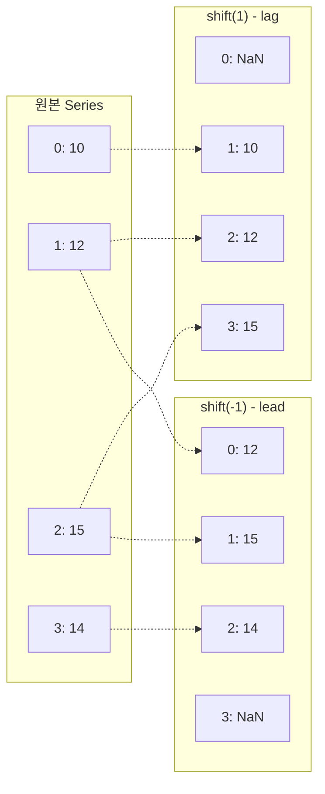

## 정의

- **`shift(n)`** : 값을 n 칸 밀기 (lag/lead 생성)
- **`diff(n)`** : n 칸 차이 (= `s - s.shift(n)`)
- **`pct_change(n)`** : 변화율 (= `s.diff(n) / s.shift(n)`)

시계열 분석의 기본 도구. 전일 대비 / 전월 대비 / lag feature 생성 등에 광범위하게 쓰인다.

## 사용 상황

| 상황 | 방법 | 예시 |
|:---|:---|:---|
| 전일 대비 변화량 계산 | `diff(1)` | 매일 판매량 변화 |
| 전월 대비 변화율 계산 | `pct_change(1)` | 월 매출 증감률 |
| 주간 동기 비교 | `shift(7)` / `diff(7)` | 7일 전 대비 |
| ML lag feature 생성 | `shift(1)`, `shift(7)` | 과거 값을 feature 로 |
| 미래 타깃 생성 | `shift(-1)` | 내일 close 를 타깃으로 |
| 그룹별 이전 값 비교 | `groupby().shift(1)` | user 별 이전 주문 |

## shift 시각화



`shift(1)` 은 값을 한 칸 아래로 (과거 값 참조). `shift(-1)` 은 한 칸 위로 (미래 값 참조).

## shift

```python
s.shift(1)                  # 한 칸 아래로 (lag, NaN 채움)
s.shift(-1)                 # 한 칸 위로 (lead)
s.shift(7)                  # 일주일 전 값
s.shift(1, fill_value=0)    # NaN 대신 0
```

<CodeWithOutput
  language="python"
  outputLanguage="text"
  code={`import pandas as pd
s = pd.Series([10, 12, 15, 14, 18])
print('original:', s.tolist())
print('shift(1):', s.shift(1).tolist())
print('shift(-1):', s.shift(-1).tolist())`}
  output={`original: [10, 12, 15, 14, 18]
shift(1): [nan, 10.0, 12.0, 15.0, 14.0]
shift(-1): [12.0, 15.0, 14.0, 18.0, nan]`}
/>

| index | s | shift(1) | shift(-1) |
|---|---|---|---|
| 0 | 10 | NaN | 12 |
| 1 | 12 | 10 | 15 |
| 2 | 15 | 12 | 14 |
| 3 | 14 | 15 | 18 |
| 4 | 18 | 14 | NaN |

## diff

```python
s.diff()        # = s - s.shift(1), 1차 차분
s.diff(2)       # 2 step 차분
s.diff(-1)      # 다음 값 - 현재 값 (역방향)
```

<CodeWithOutput
  language="python"
  outputLanguage="text"
  code={`import pandas as pd
s = pd.Series([10, 12, 15, 14, 18])
print(s.diff().tolist())
print(s.diff(2).tolist())`}
  output={`[nan, 2.0, 3.0, -1.0, 4.0]
[nan, nan, 5.0, 2.0, 3.0]`}
/>

### 2차 차분

```python
s.diff().diff()     # 2차 차분: 변화량의 변화량
# 시계열 stationarity 확보에 사용
```

## pct_change (변화율)

```python
s.pct_change()        # 직전 대비 비율 변화
s.pct_change(7)       # 7 step 변화율 (주간 단위 등)
s.pct_change(fill_method=None)    # NaN 을 채우지 않음 (pandas 2.2+)
```

<CodeWithOutput
  language="python"
  outputLanguage="text"
  code={`import pandas as pd
s = pd.Series([100, 120, 144, 180])
print(s.pct_change().round(3).tolist())`}
  output={`[nan, 0.2, 0.2, 0.25]`}
/>

20% → 20% → 25% 증가.

### fill_method 주의 (pandas 2.2+)

```python
# pandas 2.2 부터 fill_method 기본값 변경
# NaN 을 앞 값으로 채워 계산하는 동작이 deprecated
s.pct_change()                      # FutureWarning (pandas 2.2+)
s.pct_change(fill_method=None)      # 명시적, 경고 없음
```

## time-based shift

DatetimeIndex 일 때 freq 지정 가능.

```python
import pandas as pd

ts = pd.Series(
    [100, 110, 120],
    index=pd.to_datetime(['2024-01-01', '2024-01-03', '2024-01-07'])
)

ts.shift(1, freq='D')      # 1 일 이동 (날짜 이동, 값은 그대로)
ts.shift(1, freq='W')      # 1 주 이동
ts.shift(-1, freq='ME')    # 한 달 뒤로
```

freq 지정 시 **값이 이동하는 게 아니라 인덱스(날짜) 가 이동**한다.

## 자주 쓰는 패턴

### 전월 대비 매출

```python
df['mom'] = df['monthly_sales'].pct_change()
df['yoy'] = df['monthly_sales'].pct_change(12)   # 전년 동월 대비
```

### lag features (ML)

```python
for lag in [1, 7, 14, 30]:
    df[f'sales_lag{lag}'] = df['sales'].shift(lag)

# diff feature
df['sales_diff1'] = df['sales'].diff(1)
df['sales_diff7'] = df['sales'].diff(7)
```

### 룩어헤드 방지

```python
# 오늘 데이터로 내일을 예측하는 모델
df['target'] = df['close'].shift(-1)   # 내일 종가 (타깃)
# 학습 feature 는 shift 안 함 (현재 또는 과거 데이터)
df = df.dropna()    # 마지막 행 NaN 제거
```

### 누적 증가율

```python
df['daily_return'] = df['close'].pct_change()
df['cumulative_return'] = (1 + df['daily_return']).cumprod()
```

### 그룹별 shift

```python
# 같은 user 안에서 이전 주문 참조
df = df.sort_values(['user_id', 'date'])
df['prev_amount'] = df.groupby('user_id')['amount'].shift(1)
df['amount_diff']  = df.groupby('user_id')['amount'].diff(1)
```

### 이동 평균과 결합

```python
# 단기 이동 평균 vs 장기 이동 평균 교차 (golden cross / dead cross)
df['ma5']  = df['close'].rolling(5).mean()
df['ma20'] = df['close'].rolling(20).mean()
df['cross_signal'] = (df['ma5'] > df['ma20']) & (df['ma5'].shift(1) <= df['ma20'].shift(1))
```

### 변화 감지

```python
# 값이 바뀐 위치 탐지
df['changed'] = df['status'] != df['status'].shift(1)
df['run_id'] = df['changed'].cumsum()   # 연속 구간 ID
```

## 성능

| 연산 | 속도 | 비고 |
|:---|:---:|:---|
| `shift(n)` | 빠름 | 단순 메모리 오프셋 |
| `diff(n)` | 빠름 | 내부적으로 shift + 빼기 |
| `pct_change(n)` | 빠름 | diff / shift |
| `groupby().shift(n)` | 중간 | 그룹 기준 분할 후 shift |

```python
import pandas as pd
import numpy as np

# 대용량에서도 빠름
df = pd.DataFrame({'value': np.random.randn(1_000_000)})
df['lag1'] = df['value'].shift(1)      # 거의 즉시
df['diff1'] = df['value'].diff(1)      # 거의 즉시
```

## 함정

> [!WARNING]
> shift / diff / pct_change 를 쓸 때 다음 상황을 주의한다.

### 1. NaN 의 첫/마지막

`shift(1)` 은 첫 행이 NaN, `shift(-1)` 은 마지막 행이 NaN.

```python
df['lag1'] = df['value'].shift(1)
df = df.dropna()                    # 첫 행 제거
# 또는
df['lag1'] = df['value'].shift(1, fill_value=0)   # 0 으로 채움
```

### 2. 시간 freq 가 일정하지 않을 때

```python
# index 가 불규칙 시계열 (2024-01-01, 01-03, 01-10 등)
df.shift(1)           # 위치 기반: 바로 앞 행
df.shift(1, freq='D') # 시간 기반: 정확히 1일 전 (없으면 NaN)
```

불규칙 시계열에서는 위치 기반 shift 와 시간 기반 shift 의 결과가 완전히 다르다.

### 3. groupby + shift 의 정렬

```python
# 정렬 없이 shift 하면 의미가 달라짐
df = df.sort_values(['user_id', 'date'])   # 반드시 정렬 먼저
df['prev'] = df.groupby('user_id')['amount'].shift(1)
```

### 4. pct_change 의 inf / 분모 0

```python
s = pd.Series([0, 10, 5])
s.pct_change()   # [NaN, inf, -0.5]
# 분모(이전 값)가 0 이면 inf 발생
```

### 5. 타입 변화

```python
# int Series 에 shift(1) 적용 시 float 으로 변환 (NaN 때문)
s = pd.Series([1, 2, 3], dtype='int64')
s.shift(1).dtype    # float64
```

pandas 2.x Nullable Int 타입 사용 시 `Int64` 로 선언하면 NaN 을 보존하면서 정수 유지.

```python
s = pd.Series([1, 2, 3], dtype='Int64')   # Nullable Int
s.shift(1)    # [<NA>, 1, 2] dtype: Int64
```

## 관련 위키

- [[Pandas rolling]]
- [[Pandas resample]]
- [[Pandas cumulative]]
- [[Pandas groupby]]
- [[Pandas 성능 / 메모리 최적화]]
