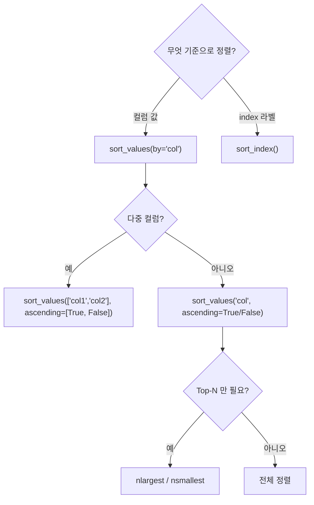

## 정의

- **`sort_values()`**: 컬럼 값 기준 정렬
- **`sort_index()`**: index (행 또는 열 라벨) 기준 정렬

기본은 오름차순, `ascending=False` 로 내림차순.

## 사용 상황

- **단일 컬럼 정렬**: 날짜, 점수, 금액 등 단순 순위 정렬
- **다중 컬럼 정렬**: 그룹 내 부분 정렬 (예: 지역별 내림차순 매출)
- **nlargest / nsmallest**: 전체 정렬 없이 상위/하위 N 개만 빠르게 추출
- **sort_index**: 합병/pivot 후 흐트러진 index 를 원래 순서로 복구

## 정렬 흐름 시각화



## sort_values 기본

<CodeWithOutput
  language="python"
  outputLanguage="text"
  code={`import pandas as pd
df = pd.DataFrame({
    'name': ['Alice', 'Bob', 'Charlie', 'Dave'],
    'age': [30, 25, 35, 28],
    'salary': [5000, 4000, 6000, 4500],
})

print(df.sort_values('age'))
print('---')
print(df.sort_values('age', ascending=False))`}
  output={`      name  age  salary
1      Bob   25    4000
3     Dave   28    4500
0    Alice   30    5000
2  Charlie   35    6000
---
      name  age  salary
2  Charlie   35    6000
0    Alice   30    5000
3     Dave   28    4500
1      Bob   25    4000`}
/>

## 여러 컬럼 정렬

```python
df.sort_values(['city', 'age'])
df.sort_values(['city', 'age'], ascending=[True, False])
# city 오름차순, 같은 city 안에서 age 내림차순
```

<CodeWithOutput
  language="python"
  outputLanguage="text"
  code={`import pandas as pd
df = pd.DataFrame({
    'city':   ['Seoul', 'Busan', 'Seoul', 'Busan', 'Seoul'],
    'name':   ['A', 'B', 'C', 'D', 'E'],
    'sales':  [100, 200, 150, 300, 80],
})
result = df.sort_values(['city', 'sales'], ascending=[True, False])
print(result)`}
  output={`    city name  sales
1  Busan    B    200
3  Busan    D    300
2  Seoul    C    150
0  Seoul    A    100
4  Seoul    E     80`}
/>

## NaN 위치

```python
df.sort_values('age', na_position='last')    # 기본: NaN 을 마지막에
df.sort_values('age', na_position='first')   # NaN 을 맨 앞에
```

NaN 은 비교 불가. `na_position` 으로 위치를 명시해야 의도한 결과를 얻을 수 있다.

## stable sort

```python
df.sort_values('age', kind='stable')        # 같은 값의 상대 순서 유지
```

기본 `kind='quicksort'`. **stable 이 필요한 경우**: multi-pass 정렬, 카테고리별 누적 순서 유지 시 `kind='stable'` 명시.

## key 함수

```python
# 대소문자 무시 정렬
df.sort_values('name', key=lambda s: s.str.lower())

# 절댓값 기준
df.sort_values('balance', key=lambda s: s.abs())

# 한글 초성 기준 정렬 (사용자 정의 매핑 필요)
CHOSEONG_ORDER = {'가': 'ㄱ', '나': 'ㄴ', ...}
df.sort_values('name', key=lambda s: s.map(lambda x: CHOSEONG_ORDER.get(x[0], x)))
```

## sort_index

```python
df.sort_index()                    # 행 라벨 정렬
df.sort_index(axis=1)              # 컬럼 이름 정렬
df.sort_index(ascending=False)     # 내림차순
df.sort_index(level=0)             # MultiIndex 의 특정 level
```

pivot / merge 후 index 가 흐트러졌을 때 `sort_index()` 로 복원:

```python
pivoted = df.pivot_table(index='date', columns='product', values='sales')
pivoted.sort_index()  # 날짜 순으로 복원
```

## sorted 결과를 in-place 로

```python
df = df.sort_values('age')           # 사본 (권장)
df.sort_values('age', inplace=True)  # in-place (deprecated 방향)
```

> [!TIP]
> 새 pandas 에서는 **in-place 가 더 빠르지 않다**. 명시성과 method chain 을 위해 `df = df.sort_values(...)` 형태를 권장.

## reset_index 와 함께

정렬 후 index 가 뒤섞이는 게 싫다면 `reset_index(drop=True)`:

```python
df_sorted = df.sort_values('age').reset_index(drop=True)
```

## nlargest / nsmallest

상위/하위 N 개만 필요하면 sort 후 head 보다 `nlargest` / `nsmallest` 가 빠르다.

```python
df.nlargest(3, 'salary')            # 상위 3 명
df.nsmallest(3, 'salary')           # 하위 3 명
df.nlargest(3, ['salary', 'age'])   # 다중 키 Top-N
```

[[Pandas nlargest / rank]] 참고.

## 실전 패턴

### 그룹별 Top-N

```python
# 각 도시에서 매출 상위 2 명
top2_per_city = (
    df.sort_values('sales', ascending=False)
    .groupby('city')
    .head(2)
)
```

### 날짜 내림차순으로 최신 N 개

```python
df.sort_values('created_at', ascending=False).head(10)
```

### 특정 값을 맨 앞으로

```python
# status == 'urgent' 를 맨 앞에 배치
order_map = {'urgent': 0, 'normal': 1, 'low': 2}
df.sort_values('status', key=lambda s: s.map(order_map))
```

### 정렬 후 순위 컬럼 추가

```python
df_sorted = df.sort_values('score', ascending=False)
df_sorted['rank'] = range(1, len(df_sorted) + 1)
```

### 다중 DataFrame 정렬 후 concat

```python
import pandas as pd
result = pd.concat([
    df_jan.sort_values('date'),
    df_feb.sort_values('date'),
], ignore_index=True)
```

## 성능

| 방법 | 복잡도 | 용도 |
|:---|:---|:---|
| `sort_values` | O(n log n) | 전체 정렬 |
| `nlargest(k)` | O(n + k log k) | 상위 k 개 |
| `sort_values().head(k)` | O(n log n) | 전체 정렬 후 잘라냄 |

Top-N 만 필요하다면 `nlargest` 가 항상 빠르다.

```python
# 1000 만 행에서 상위 10 개: nlargest 가 sort_values().head() 보다 빠름
df.nlargest(10, 'score')
```

## 함정

### 1. 정렬 후 index 가 섞임

```python
df.sort_values('age')
# index: 1, 3, 0, 2 같이 뒤섞임
# .iloc[0] 은 정렬 결과의 첫 행 (의도한 동작)
# .loc[0] 은 라벨 0 인 행 (정렬 전 첫 번째 행)
df.sort_values('age').reset_index(drop=True).iloc[0]   # 명확
```

### 2. inplace=True 의 부작용

```python
df.sort_values('age', inplace=True)
# 이후 모든 view 가 영향받음
# method chain 도 끊김
```

### 3. 한글 정렬

```python
# 기본은 유니코드 순. 한글의 사전순이 항상 직관적이지는 않음
# 특히 초성 구분이 안 될 때: 별도 정렬 키 또는 locale 사용
```

> [!WARNING]
> `sort_values` 에 `inplace=True` 를 쓰면 pandas 2.x Copy-on-Write 환경에서 경고가 발생할 수 있다. 새 DataFrame 을 할당하는 방식 (`df = df.sort_values(...)`) 을 사용하라.

### 4. NaN 과 ascending=False 의 조합

```python
# ascending=False + na_position='last' (기본): NaN 이 맨 마지막
# ascending=True + na_position='last' (기본): NaN 이 맨 마지막
# na_position 은 ascending 과 독립적
df.sort_values('score', ascending=False, na_position='last')
```

## 관련 위키

- [[Pandas DataFrame]]
- [[Pandas nlargest / rank]]
- [[Pandas groupby]]
- [[Pandas .loc / .iloc]]
- [[Pandas concat]]
