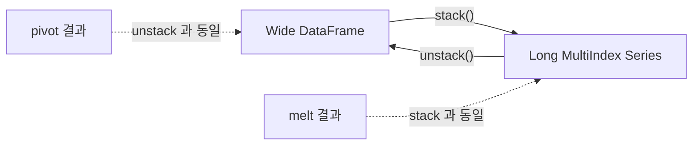

## 정의

- **`stack()`** : 가장 안쪽 **컬럼 레벨 -> 행 레벨** (DataFrame -> Series 또는 더 좁은 DataFrame)
- **`unstack()`** : 가장 안쪽 **행 레벨 -> 컬럼 레벨**

[[Pandas pivot]] / [[Pandas melt]] 의 MultiIndex 기반 버전.

## 사용 상황

- **`groupby` 결과 wide 변환**: `groupby(['region', 'product']).sum()` 후 `unstack('product')` 로 product 별 컬럼
- **시계열 패널 -> wide format**: 날짜 + 종목 MultiIndex를 날짜 행 + 종목 컬럼으로
- **wide -> long 변환**: 여러 컬럼 (`Q1`, `Q2`, `Q3`, `Q4`)을 `stack()` 으로 긴 형태로
- **`pivot_table` 결과 정리**: MultiIndex 컬럼이 생겼을 때 `stack()` 으로 조정

`pivot`/`melt` 가 이미 있는 경우 대부분 충분하다. `stack`/`unstack` 은 **이미 MultiIndex가 있거나 자동 생성된 경우**에 가장 자연스럽다.

## 변환 흐름 시각화



## stack 기본

<CodeWithOutput
  language="python"
  outputLanguage="text"
  code={`import pandas as pd
df = pd.DataFrame(
    {'math': [90, 80], 'english': [85, 75]},
    index=['Alice', 'Bob']
)
print(df)
print('--- stack ---')
print(df.stack())`}
  output={`       math  english
Alice    90       85
Bob      80       75
--- stack ---
Alice  math       90
       english    85
Bob    math       80
       english    75
dtype: int64`}
/>

DataFrame 의 2 컬럼이 **MultiIndex Series** 로 합쳐졌다.

## unstack 기본

```python
s.unstack()                  # 가장 안쪽 index level -> columns
s.unstack(level=0)           # 0번 level 을 columns 로
s.unstack(level='product')   # 이름으로 지정 (권장)

# 역변환: stack 으로 복원
multi = df.stack()           # Series
multi.unstack()              # 원래 DataFrame 으로 복원
```

## 다단계 unstack

```python
df = pd.DataFrame({
    'region': ['Seoul', 'Seoul', 'Busan', 'Busan'],
    'product': ['A', 'B', 'A', 'B'],
    'sales': [100, 200, 150, 250],
}).set_index(['region', 'product'])['sales']

df.unstack()                # product 가 컬럼
df.unstack(level='region')  # region 이 컬럼
```

<CodeWithOutput
  language="python"
  outputLanguage="text"
  code={`import pandas as pd
s = pd.Series([100, 200, 150, 250],
    index=pd.MultiIndex.from_tuples(
        [('Seoul','A'),('Seoul','B'),('Busan','A'),('Busan','B')],
        names=['region','product']
    ))
print(s.unstack())`}
  output={`product    A    B
region
Busan    150  250
Seoul    100  200`}
/>

| region \ product | A | B |
|---|---|---|
| Busan | 150 | 250 |
| Seoul | 100 | 200 |

## pivot / melt 와의 비교

| 동작 | DataFrame API | MultiIndex API |
|:---|:---|:---|
| long -> wide | `pivot`, `pivot_table` | `unstack` |
| wide -> long | `melt` | `stack` |

대부분의 경우 `pivot` / `melt` 가 더 직관적. `stack` / `unstack` 은 MultiIndex 가 이미 있는 경우 자연스럽다.

```python
# 같은 결과 (다른 경로)
df.pivot(index='region', columns='product', values='sales')
df.set_index(['region', 'product'])['sales'].unstack('product')
```

## groupby + unstack 패턴

```python
# groupby 가 MultiIndex 결과를 반환 -> unstack 으로 wide 형태
df.groupby(['region', 'product'])['sales'].sum().unstack('product')
```

이 패턴은 실무에서 매우 자주 쓰인다. `groupby` + `agg` + `unstack` 조합:

```python
result = (
    df.groupby(['region', 'product', 'quarter'])['sales']
    .sum()
    .unstack('quarter')
    .fillna(0)
)
```

## fill_value

```python
s.unstack(fill_value=0)      # NaN 을 0 으로
```

## stack 의 dropna

```python
df.stack(dropna=False)       # NaN 도 결과에 포함 (기본은 제거)
```

pandas 2.x 에서 `stack` 의 기본 동작이 변경됨: `future_stack=True` 모드가 기본이 됨. NaN 처리 방식 확인 필요.

## 실전 패턴

### 분기별 wide 보고서

```python
import pandas as pd

data = {
    'region': ['Seoul', 'Seoul', 'Seoul', 'Busan', 'Busan', 'Busan'],
    'quarter': ['Q1', 'Q2', 'Q3', 'Q1', 'Q2', 'Q3'],
    'revenue': [100, 120, 130, 80, 90, 95],
}
df = pd.DataFrame(data)

# long -> wide: region 행, quarter 컬럼
wide = (
    df.groupby(['region', 'quarter'])['revenue']
    .sum()
    .unstack('quarter')
    .fillna(0)
)
print(wide)
# quarter    Q1     Q2     Q3
# region
# Busan    80.0   90.0   95.0
# Seoul   100.0  120.0  130.0
```

### wide -> long 정리

```python
# 여러 시점 컬럼을 long format 으로
df_wide = pd.DataFrame({
    'region': ['Seoul', 'Busan'],
    'Q1': [100, 80],
    'Q2': [120, 90],
    'Q3': [130, 95],
}).set_index('region')

df_long = df_wide.stack().reset_index()
df_long.columns = ['region', 'quarter', 'revenue']
```

### MultiIndex 컬럼 unstack 후 평탄화

```python
result = df.groupby(['region', 'product']).agg({'sales': ['sum', 'mean']})
# 컬럼: MultiIndex ('sales', 'sum'), ('sales', 'mean')

# unstack 으로 region 을 컬럼 레벨로
wide = result['sales'].unstack('region')
# 컬럼: MultiIndex ('sum', 'Seoul'), ('sum', 'Busan'), ('mean', 'Seoul'), ...

# 평탄화
wide.columns = ['_'.join(c) for c in wide.columns]
```

### pandas 2.x 스타일: stack() 동작 확인

```python
import pandas as pd

# pandas 2.x 에서 stack 은 MultiIndex 컬럼도 처리
df = pd.DataFrame(
    {'A': {'x': 1, 'y': 2}, 'B': {'x': 3, 'y': 4}}
)
# pandas 2.x default: future_stack=True
stacked = df.stack(future_stack=True)
```

## 성능

| 상황 | 권장 |
|:---|:---|
| `unstack()` 후 sparse | NaN 폭증 주의, long-format 유지 권장 |
| 대용량 wide -> long | `melt()` 가 `stack()` 보다 빠를 수 있음 |
| 대용량 long -> wide | `pivot_table()` 또는 `unstack()` 비슷, 테스트 후 선택 |
| 반복 `stack()` / `unstack()` | 중간 결과 캐싱: 인터미디어트 DataFrame 저장 |

```python
# 대용량에서 unstack NaN 폭증 방지: sparse 확인
before = s.memory_usage(deep=True)
after = s.unstack().memory_usage(deep=True).sum()
print(f"메모리 증가: {after / before:.1f}x")
```

## 함정

### 1. stack 한 결과의 타입

- `DataFrame.stack()` -> Series (일반: 컬럼이 1개 레벨)
- `DataFrame.stack(level=0)` -> DataFrame (남은 컬럼 레벨이 있으면)

### 2. unstack 의 level 지정

```python
s.unstack()                 # 가장 안쪽 level (기본)
s.unstack(level=-1)         # 같음
s.unstack(level=0)          # 가장 바깥 level
s.unstack(level='product')  # 이름으로 (권장, 명확)
```

### 3. 데이터가 너무 sparse 하면 NaN 폭증

```python
# 10 region x 1000 product 의 unstack -> 10000 셀 대부분 NaN
# 이런 경우 long-format 유지가 메모리 효율적
```

### 4. pandas 2.x stack() 변경사항

> [!WARNING]
> pandas 2.x 에서 `stack()` 의 기본 동작이 변경됐다. `FutureWarning` 가 발생하면 `future_stack=True` 를 명시적으로 전달하라.

```python
# pandas 2.x: FutureWarning 방지
df.stack(future_stack=True)   # 새 동작 명시적 사용
```

## 관련 위키

- [[Pandas pivot]]
- [[Pandas pivot_table]]
- [[Pandas melt]]
- [[Pandas MultiIndex]]
- [[Pandas groupby]]
- [[Pandas DataFrame]]
- [[Pandas 성능 / 메모리 최적화]]
