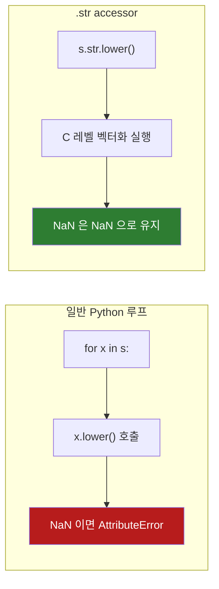

## 정의

**`Series.str`** 는 Series 의 각 문자열 원소에 **벡터화된 문자열 메서드** 를 적용하는 accessor. Python `str` 의 거의 모든 메서드를 NaN-aware 로 제공한다.

```python
s.str.lower()
s.str.contains('python')
s.str.split(',')
s.str.replace('a', 'A')
```

## accessor 동작 방식



`apply(lambda x: x.lower())` 보다 빠르고, NaN 을 안전하게 통과시킨다.

## 기본 메서드

| 메서드 | 의미 |
|:---|:---|
| `.lower()`, `.upper()`, `.title()`, `.capitalize()` | 대소문자 |
| `.strip()`, `.lstrip()`, `.rstrip()` | 공백 제거 |
| `.len()` | 문자열 길이 |
| `.startswith(s)`, `.endswith(s)` | 시작/끝 검사 |
| `.contains(pat)` | 부분 문자열 (정규식 가능) |
| `.count(pat)` | 패턴 등장 횟수 |
| `.replace(pat, repl)` | 치환 |
| `.split(sep)`, `.rsplit(sep)` | 분리 |
| `.join(sep)` | 결합 (list of str) |
| `.slice(start, stop)` | 슬라이싱 |
| `.pad(width, side)`, `.zfill(width)` | 패딩 |
| `.extract(pat)` | 정규식 캡처 그룹 추출 |
| `.findall(pat)` | 모든 매칭 리스트 반환 |
| `.match(pat)` | 시작부터 매칭 여부 |
| `.cat(sep=)` | Series 연결 |

## 기본 사용

<CodeWithOutput
  language="python"
  outputLanguage="text"
  code={`import pandas as pd
s = pd.Series(['  Alice  ', 'BOB', 'Charlie', None])
print(s.str.strip().str.lower().tolist())
print(s.str.len().tolist())
print(s.str.startswith('A').tolist())`}
  output={`['alice', 'bob', 'charlie', None]
[9.0, 3.0, 7.0, nan]
[False, False, False, None]`}
/>

NaN 은 NaN 으로 유지된다. Python `str` 메서드는 NaN 에서 `AttributeError` 를 던지지만, `.str` accessor 는 이를 자동으로 처리한다.

## chaining

```python
df['email_clean'] = (df['email']
    .str.lower()
    .str.strip()
    .str.replace(r'\s+', '', regex=True))
```

체이닝이 자연스럽다.

## 새 컬럼 분리 (split + expand)

```python
s = pd.Series(['Alice,30', 'Bob,25'])

# expand=True: DataFrame 반환
df = s.str.split(',', expand=True)
df.columns = ['name', 'age']

# 최대 분할 횟수 제한
s.str.split(',', n=1, expand=True)
```

`expand=False` (기본) 는 각 원소가 리스트인 Series 를 반환한다.

## get / getitem

```python
s = pd.Series(['Alice,30', 'Bob,25'])
s.str.split(',').str.get(0)   # 첫 원소
s.str.split(',').str[0]        # 같음, indexer 형태

s.str[0]                       # 첫 글자
s.str[-1]                      # 마지막 글자
s.str[1:4]                     # 슬라이싱
```

## extract: 정규식 캡처 그룹

```python
s = pd.Series(['Alice(30)', 'Bob(25)', 'Charlie(40)'])

# 캡처 그룹별 컬럼 반환
df = s.str.extract(r'(\w+)\((\d+)\)')
df.columns = ['name', 'age']

# 이름 있는 캡처 그룹
df = s.str.extract(r'(?P<name>\w+)\((?P<age>\d+)\)')
```

## findall: 모든 매칭

```python
s = pd.Series(['apple banana', 'cherry apple', 'banana'])

# 각 원소에서 모든 매칭을 리스트로
s.str.findall(r'\b\w+le\b')
# 0    ['apple']
# 1    ['apple']
# 2    []
```

## replace: 정규식 치환

```python
# 정규식 치환 (regex=True 기본, 단 문자열이면 False)
df['phone'] = df['phone'].str.replace(r'[^0-9]', '', regex=True)

# 전화번호 정규화
df['phone'] = (df['phone']
    .str.replace(r'[^\d]', '', regex=True)
    .str.zfill(11))

# 여러 공백을 하나로
df['text'] = df['text'].str.replace(r'\s+', ' ', regex=True).str.strip()
```

## 성능: str accessor vs apply

<CodeWithOutput
  language="python"
  outputLanguage="text"
  code={`import pandas as pd, time

n = 500_000
df = pd.DataFrame({'email': pd.Series(['User@Example.COM'] * n)})

t = time.perf_counter()
df['email'].str.lower()
print(f'.str.lower()        : {time.perf_counter()-t:.4f}s')

t = time.perf_counter()
df['email'].apply(str.lower)
print(f'apply(str.lower)    : {time.perf_counter()-t:.4f}s')

t = time.perf_counter()
df['email'].apply(lambda x: x.lower() if pd.notna(x) else x)
print(f'apply(lambda)       : {time.perf_counter()-t:.4f}s')`}
  output={`.str.lower()        : 0.0381s
apply(str.lower)    : 0.0712s
apply(lambda)       : 0.1043s`}
/>

`.str` accessor 가 `apply` 보다 빠르다. 단, 복잡한 분기 로직은 `apply` 가 필요할 수 있다.

## 실전 예시

### 이메일 정제

```python
df['email'] = (df['email']
    .str.strip()
    .str.lower()
    .str.replace(r'\s+', '', regex=True))

# 유효한 이메일 필터
valid_mask = df['email'].str.contains(r'^[\w.+-]+@[\w-]+\.[a-z]{2,}$', regex=True, na=False)
df_valid = df[valid_mask]
```

### 전화번호 정규화

```python
df['phone'] = (df['phone']
    .str.replace(r'[^\d]', '', regex=True)   # 숫자만 남김
    .str.zfill(11))                           # 앞 0 채우기

# 형식 변환: 01012345678 -> 010-1234-5678
df['phone_fmt'] = df['phone'].str.replace(
    r'(\d{3})(\d{4})(\d{4})', r'\1-\2-\3', regex=True
)
```

### 도메인 추출

```python
df['domain'] = df['email'].str.extract(r'@([\w.-]+)')
df['tld'] = df['email'].str.extract(r'\.(\w+)$')
```

### 텍스트 카테고리 분류

```python
# 키워드 기반 분류
conditions = [
    df['title'].str.contains('오류|에러|error', case=False, na=False, regex=True),
    df['title'].str.contains('성능|느림|timeout', case=False, na=False, regex=True),
]
choices = ['bug', 'performance']
df['category'] = np.select(conditions, choices, default='general')
```

## category 자동 보존

```python
s = pd.Series(['A', 'B', 'A']).astype('category')
s.str.lower()    # category dtype 유지 (유한 cardinality)
```

## 함정

### 1. NaN 과 boolean mask

```python
s.str.contains('a')              # NaN 행 → NaN (불리언 mask 에 NaN 있으면 에러)
s.str.contains('a', na=False)    # NaN → False (필터에 안전)
s.str.contains('a', na=True)     # NaN → True
```

mask 로 쓸 때 `na=False` 를 반드시 지정.

### 2. 정규식 메타문자 escape

```python
s.str.contains('.')             # 정규식 메타문자 → 모든 문자와 매칭
s.str.contains('.', regex=False)  # 리터럴 점
s.str.contains(r'\.', regex=True) # 리터럴 점 (정규식 escape)
```

### 3. 숫자/비문자열 열에 .str 사용

```python
s = pd.Series([1, 2, 3])
s.str.lower()              # AttributeError
s.astype(str).str.lower()  # ✓ 먼저 str 로 변환
```

### 4. expand=False 의 리스트 Series

```python
s = pd.Series(['a,b', 'c,d,e'])
result = s.str.split(',')
# 0    ['a', 'b']
# 1    ['c', 'd', 'e']
# 각 원소가 길이 다른 리스트 → explode() 로 펼치거나 expand=True 사용
result.explode()
```

> [!WARNING]
> `.str.replace` 의 `regex` 파라미터 기본값은 `True` 이지만, 패턴이 실제 정규식이 아닐 때 의도치 않은 동작을 일으킬 수 있다. 리터럴 치환이라면 `regex=False` 를 명시하라.

## 관련 위키

- [[Pandas Series]]
- [[Pandas str pattern]]
- [[Pandas str regex]]
- [[Pandas apply / map]]
- [[Pandas Boolean Indexing]]
- [[Pandas Categorical]]
