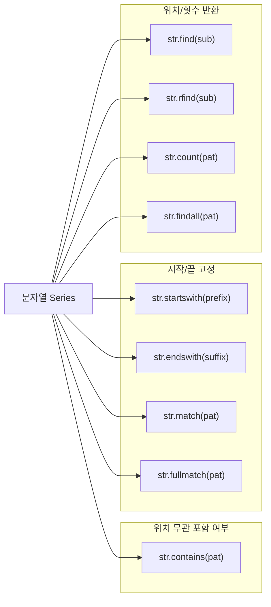
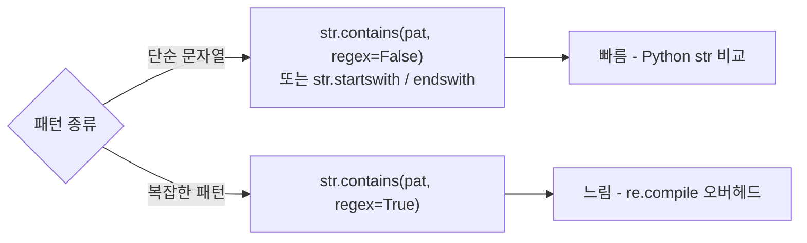

## 정의

문자열 Series 에서 **패턴 매칭** 으로 필터링/검색하는 메서드들. SQL 의 `LIKE`, `WHERE str LIKE '%pat%'` 패턴에 해당하며, `.str` accessor 를 통해 접근한다.

## 메서드 전체 지도



## contains

`str.contains(pat, case=True, na=None, regex=True)` - 부분 매칭 (내부적으로 `re.search`).

```python
s.str.contains('python')                  # 'python' 포함
s.str.contains('python', case=False)      # 대소문자 무시
s.str.contains(r'^\d+$', regex=True)      # 정규식
s.str.contains('python', na=False)        # NaN → False
```

<CodeWithOutput
  language="python"
  outputLanguage="text"
  code={`import pandas as pd
s = pd.Series(['Hello World', 'Python Pandas', 'pandas tutorial', None])
print(s.str.contains('python', case=False, na=False).tolist())`}
  output={`[False, True, True, False]`}
/>

## startswith / endswith

```python
s.str.startswith('Mr.')
s.str.endswith('.com')
s.str.startswith(('Mr.', 'Ms.', 'Dr.'))    # tuple 로 여러 패턴
s.str.endswith(('.jpg', '.png', '.gif'))    # tuple 지원
```

`startswith` / `endswith` 는 **정규식 미지원**, 리터럴 비교만. 튜플로 여러 패턴을 OR 조건으로 검사한다.

<CodeWithOutput
  language="python"
  outputLanguage="text"
  code={`import pandas as pd
emails = pd.Series(['alice@gmail.com', 'bob@naver.com', 'carol@gmail.net', None])

gmail = emails.str.endswith('@gmail.com', na=False)
print(gmail.tolist())`}
  output={`[True, False, False, False]`}
/>

## match / fullmatch

```python
s.str.match(r'^\d{3}-\d{4}$')     # 처음부터 매칭 (re.match)
s.str.fullmatch(r'^\d{3}-\d{4}$') # 전체 매칭 (re.fullmatch)
s.str.contains(r'\d{3}-\d{4}')    # 어느 위치든 매칭 (re.search)
```

| 메서드 | 내부 동작 | SQL 유사체 |
|:---|:---|:---|
| `contains(pat)` | `re.search` - 부분 매칭 | `LIKE '%pat%'` |
| `match(pat)` | `re.match` - 처음부터 | `LIKE 'pat%'` (단순 경우) |
| `fullmatch(pat)` | `re.fullmatch` - 전체 | `= pat` (패턴 일치) |
| `startswith(s)` | `str.startswith` - 리터럴 | `LIKE 's%'` |
| `endswith(s)` | `str.endswith` - 리터럴 | `LIKE '%s'` |

## find / rfind / index

```python
s.str.find('o')         # 첫 위치 (없으면 -1)
s.str.rfind('o')        # 마지막 위치
s.str.findall(r'\w+')   # 모든 매치 (list 반환)
```

## count

```python
s.str.count('a')         # 'a' 등장 횟수
s.str.count(r'\d')       # 숫자 개수
```

## 필터에 활용

```python
df[df['email'].str.contains('@gmail.com', na=False)]
df[df['name'].str.startswith('Mr.') | df['name'].str.startswith('Ms.')]
df[~df['url'].str.endswith('.png')]
```

## 실전 예시: 로그 분석

<CodeWithOutput
  language="python"
  outputLanguage="text"
  code={`import pandas as pd

logs = pd.Series([
    'ERROR 500 /api/users',
    'INFO 200 /health',
    'WARN 429 /api/orders',
    'ERROR 404 /api/items',
    'DEBUG timer elapsed',
])

# ERROR 레벨만
errors = logs[logs.str.startswith('ERROR')]
print("에러:", errors.tolist())

# /api/ 경로만
api_logs = logs[logs.str.contains(r'/api/', na=False)]
print("API:", api_logs.tolist())

# 상태코드 5xx
server_err = logs[logs.str.contains(r' 5\d{2} ', regex=True)]
print("5xx:", server_err.tolist())`}
  output={`에러: ['ERROR 500 /api/users', 'ERROR 404 /api/items']
API: ['ERROR 500 /api/users', 'WARN 429 /api/orders', 'ERROR 404 /api/items']
5xx: ['ERROR 500 /api/users']`}
/>

## 실전 예시: 이메일/URL 패턴

```python
df = pd.DataFrame({'email': ['alice@gmail.com', 'bob@company.co.kr', 'invalid']})

# 유효한 이메일 (단순 검사)
valid = df['email'].str.contains(r'^[\w.+-]+@[\w-]+\.[a-zA-Z]{2,}$', regex=True, na=False)

# 도메인 추출
df['domain'] = df['email'].str.extract(r'@([\w.-]+)')

# 특정 도메인만
gmail_users = df[df['email'].str.endswith('@gmail.com', na=False)]
```

## 성능: 리터럴 vs 정규식



```python
import pandas as pd
import time

s = pd.Series(['hello world'] * 1_000_000)

# 리터럴: regex=False 명시
t0 = time.perf_counter()
_ = s.str.contains('world', regex=False)
print(f"regex=False: {time.perf_counter()-t0:.3f}s")

# 정규식: 불필요하면 느림
t0 = time.perf_counter()
_ = s.str.contains('world', regex=True)
print(f"regex=True:  {time.perf_counter()-t0:.3f}s")
```

일반적으로 `regex=False` 가 3-10배 빠르다.

### 대용량 최적화 팁

```python
# 1. 가능하면 startswith/endswith (리터럴, 가장 빠름)
s.str.startswith('ERROR')

# 2. regex=False 명시
s.str.contains('pattern', regex=False)

# 3. 대소문자 변환 후 비교 (case=False 보다 빠를 수 있음)
s.str.lower().str.startswith('error')

# 4. PyArrow backend 사용 시 str 연산도 빨라짐
s = s.astype('string[pyarrow]')
s.str.contains('ERROR')
```

## 함정

### 1. NaN 처리

```python
df[df['col'].str.contains('x')]
# NaN 인 행 → NaN (Falsy 가 아님, boolean indexing 에러)

df[df['col'].str.contains('x', na=False)]
# ✓ NaN → False, 안전
```

> [!WARNING]
> `na=False` 를 빠뜨리면 `ValueError: Cannot mask with non-boolean array containing NA / NaN values` 발생. **항상 `na=False` 명시 권장.**

### 2. 정규식 default 변화

pandas 1.x 까지 `regex=True` 가 기본. pandas 2.x 에서도 동일하지만, 단순 리터럴 검색에는 `regex=False` 를 명시해 의도를 분명히 하고 성능을 높이는 것이 좋다.

```python
# 이 두 코드는 동작이 다를 수 있음
s.str.contains('.')       # regex=True → 임의 문자 1개 매칭
s.str.contains('.', regex=False)  # 리터럴 '.' 검색
```

### 3. 대소문자

```python
s.str.contains('seoul')             # 대소문자 구분
s.str.contains('seoul', case=False) # 무시
s.str.contains('(?i)seoul')         # 정규식의 inline flag
```

### 4. startswith / endswith 는 tuple 만

```python
# tuple 은 가능
s.str.startswith(('A', 'B', 'C'))

# list 는 불가
s.str.startswith(['A', 'B', 'C'])  # TypeError
```

### 5. match 는 앵커가 없다

`str.match` 는 `re.match` 를 사용해 문자열의 **시작** 에서만 매칭한다. 끝을 잠그려면 `$` 앵커를 추가하거나 `fullmatch` 를 써야 한다.

```python
s = pd.Series(['abc123', '123abc'])
s.str.match(r'\d+')     # [False, True] - 시작이 숫자인 것만
s.str.fullmatch(r'\d+') # [False, False] - 전체가 숫자인 것만
```

## 관련 위키

- [[Pandas str accessor]]
- [[Pandas str regex]]
- [[Pandas Boolean Indexing]]
- [[Pandas Series]]
- [[Pandas isin]]
