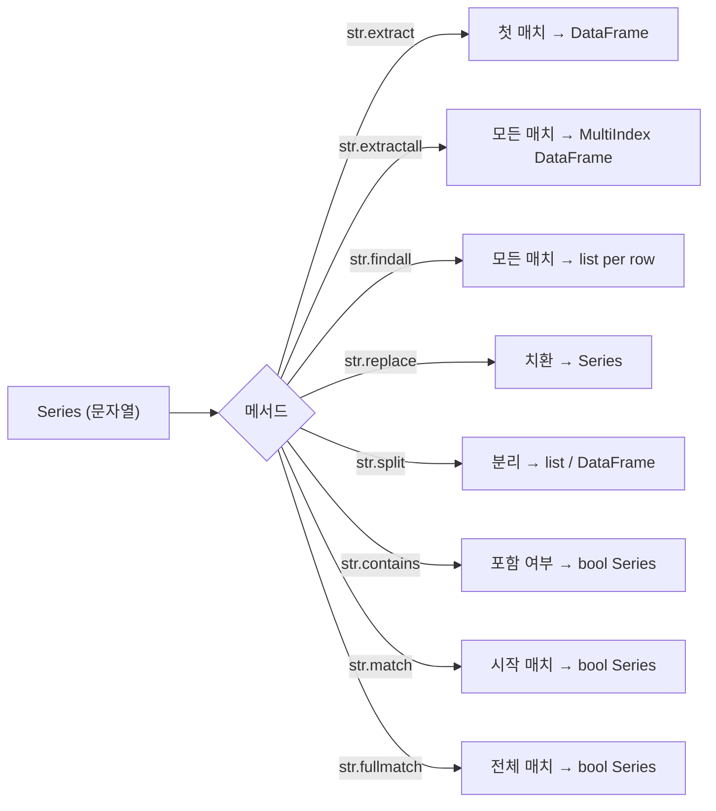

## 정의

`Series.str` 의 정규식 기반 메서드. **패턴 추출, 분리, 치환** 의 핵심.

[[Pandas str accessor]] 의 정규식 특화 부분. 기본 문자열 메서드는 [[Pandas str pattern]] 참고.

## 사용 상황

- 로그 문자열에서 IP, 날짜, 에러 코드 등을 컬럼으로 추출할 때
- 전화번호/이메일 등 비정형 데이터를 정규화할 때
- HTML/JSON 문자열에서 특정 패턴을 파싱할 때
- 문자열 내 여러 매치를 모두 찾아야 할 때

## str regex 메서드 흐름



## str.extract: 캡처 그룹으로 추출

<CodeWithOutput
  language="python"
  outputLanguage="text"
  code={`import pandas as pd
s = pd.Series(['Alice (30)', 'Bob (25)', 'Charlie (40)'])
result = s.str.extract(r'(\w+) \((\d+)\)')
result.columns = ['name', 'age']
print(result)`}
  output={`      name age
0    Alice  30
1      Bob  25
2  Charlie  40`}
/>

- 캡처 그룹 수 = 결과 DataFrame 의 컬럼 수
- 매치 없는 행은 NaN

### named group: 컬럼명 자동 지정

```python
s.str.extract(r'(?P<name>\w+) \((?P<age>\d+)\)')
# 컬럼이 자동으로 name, age 가 됨
```

### expand=False: 단일 그룹 → Series

```python
s.str.extract(r'(\d+)', expand=False)   # Series 반환
s.str.extract(r'(\d+)', expand=True)    # DataFrame 반환 (기본)
```

## str.extractall: 모든 매치

```python
s = pd.Series(['Alice and Bob', 'Charlie and Dave'])
result = s.str.extractall(r'(\w+)')
# 한 행이 여러 매치를 가지면 MultiIndex 로 expand
```

<CodeWithOutput
  language="python"
  outputLanguage="text"
  code={`import pandas as pd
s = pd.Series(['price: 100, qty: 5', 'price: 200, qty: 3'])
result = s.str.extractall(r'(\d+)')
print(result)`}
  output={`         0
  match   
0 0      100
  1        5
1 0      200
  1        3`}
/>

## str.split: 분리

```python
s.str.split(',')               # list 반환
s.str.split(',', expand=True)  # DataFrame 으로 분리
s.str.split(',', n=1)          # 최대 1번 분리
s.str.split(r'\s+', regex=True) # 정규식 분리 (pandas 1.4+)
```

```python
df = pd.DataFrame({'full_name': ['Alice Smith', 'Bob Johnson']})
df[['first', 'last']] = df['full_name'].str.split(' ', expand=True)
```

## str.replace: 치환

```python
s.str.replace('a', 'A')                              # 단순 치환 (regex=False)
s.str.replace(r'\d+', 'X', regex=True)               # 정규식
s.str.replace(r'(\w+)@(\w+)', r'\2 / \1', regex=True) # 그룹 참조
```

> [!IMPORTANT]
> pandas 2.0 부터 `str.replace` 의 `regex` 기본값이 **False**. 정규식을 쓰려면 `regex=True` 를 명시해야 한다.

```python
# 2.0+ 에서 경고 없이 쓰는 패턴
s.str.replace(r'\d+', 'X', regex=True)    # ✓ 명시
s.str.replace('abc', 'ABC', regex=False)  # ✓ 명시
```

## str.findall: 모든 매치를 리스트로

```python
s = pd.Series(['call me 010-1234-5678', 'email me at a@b.com'])
s.str.findall(r'\d+')
# 0    [010, 1234, 5678]
# 1                   []
```

`extractall` 과 달리 각 행에 list 를 반환한다. 개수가 가변적일 때 유용.

## str.match vs str.contains vs str.fullmatch

| 메서드 | 매칭 위치 | 동등 Python |
|:---|:---|:---|
| `contains` | 어느 위치든 | `re.search` |
| `match` | 시작부터 | `re.match` |
| `fullmatch` | 전체 일치 | `re.fullmatch` |

```python
s = pd.Series(['abc', 'abcd', 'xabc'])
s.str.contains(r'^abc$')      # [True, False, False]
s.str.match(r'abc')           # [True, True, False]
s.str.fullmatch(r'abc')       # [True, False, False]
```

### na 처리

```python
s = pd.Series(['abc', None, 'xyz'])
s.str.contains('a', na=False)   # NaN → False
s.str.contains('a', na=True)    # NaN → True
```

## 실전 패턴

### 이메일 도메인 추출

```python
df['domain'] = df['email'].str.extract(r'@(.+)$')
df['domain'].value_counts()
```

### 전화번호 정규화

```python
df['phone'] = (
    df['phone']
    .str.replace(r'\D', '', regex=True)                          # 숫자만
    .str.replace(r'^(\d{3})(\d{4})(\d{4})$', r'\1-\2-\3', regex=True)
)
```

### 로그 파싱

```python
# '2024-01-15 09:00:00 ERROR Something failed'
log = pd.Series([
    '2024-01-15 09:00:00 ERROR Something failed',
    '2024-01-15 09:01:00 INFO  Request received',
])
parsed = log.str.extract(
    r'(?P<date>\d{4}-\d{2}-\d{2}) (?P<time>\d{2}:\d{2}:\d{2}) (?P<level>\w+)\s+(?P<msg>.+)'
)
```

### URL 에서 경로 추출

```python
df['path'] = df['url'].str.extract(r'https?://[^/]+(/[^?#]*)')
df['query'] = df['url'].str.extract(r'\?(.+)$')
```

### 여러 패턴 중 하나 매치

```python
pattern = r'(error|warning|critical)'
df['level'] = df['log'].str.extract(pattern, flags=0)
df[df['log'].str.contains(pattern, case=False, regex=True)]
```

## 성능

| 방법 | 속도 | 비고 |
|:---|:---:|:---|
| `str.extract` | 보통 | 행별 re.search |
| `str.contains` | 빠름 | 단순 패턴은 빠름 |
| `apply(re.search)` | 느림 | Python 루프 |
| `str.extractall` | 느림 | MultiIndex 생성 비용 |

```python
# 대용량에서 contains 가 extract 보다 빠름
# 존재 여부만 확인할 때는 contains 사용
df[df['text'].str.contains(r'\d{3}-\d{4}', regex=True)]
```

## 함정

### 1. extract 의 반환 타입

```python
# 단일 그룹: expand=True (기본) → DataFrame
s.str.extract(r'(\d+)')           # DataFrame
# 단일 그룹: expand=False → Series
s.str.extract(r'(\d+)', expand=False)  # Series
```

### 2. 욕심쟁이 vs 게으른 수량자

```python
s = pd.Series(['<a>text</a>'])
s.str.extract(r'<(.+)>')      # 욕심쟁이: 'a>text</a' 매치
s.str.extract(r'<(.+?)>')     # 게으른: 'a' 매치
```

### 3. multiline / dotall 플래그

```python
import re
s.str.extract(r'(.+)', flags=re.DOTALL)      # . 이 줄바꿈도 매치
s.str.contains(r'^abc', flags=re.MULTILINE)  # 각 줄의 시작
```

### 4. regex=False 기본값 (pandas 2.0+)

```python
# ❌ pandas 2.0+ 에서 FutureWarning 또는 의도와 다른 동작
s.str.replace(r'\d+', 'X')

# ✓ 명시
s.str.replace(r'\d+', 'X', regex=True)
```

### 5. extractall 의 MultiIndex

```python
result = s.str.extractall(r'(\d+)')
# index 가 (원래 index, match 번호) 의 MultiIndex
# 원래 index 로 돌아가려면
result.reset_index(level='match', drop=True)
```

## 관련 위키

- [[Pandas str accessor]]
- [[Pandas str pattern]]
- [[Pandas Boolean Indexing]]
- [[Pandas dropna / fillna]]
- [[Pandas value_counts]]
