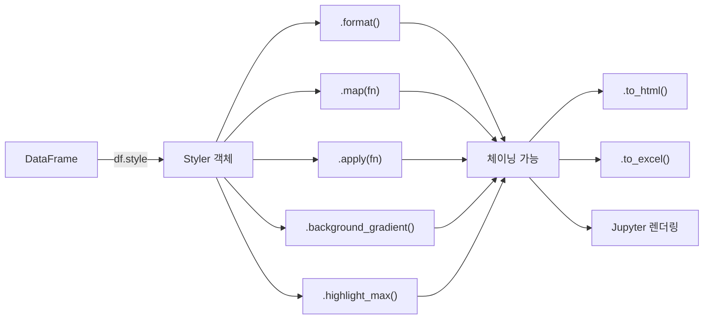

## 정의

**`DataFrame.style`** 는 HTML/CSS 기반 서식을 DataFrame 에 적용하는 API. Jupyter 노트북, 보고서, Excel 출력에 활용. **데이터 자체는 변하지 않고 표시만 바뀐다**.

```python
import pandas as pd

df = pd.DataFrame({'sales': [1200, 950, 1800], 'growth': [0.12, -0.05, 0.25]})
df.style.format({'sales': '{:,.0f}', 'growth': '{:.1%}'})
# DataFrame 이 아닌 Styler 객체 반환
```

## 사용 상황

| 용도 | 적합 여부 | 비고 |
|:---|:---:|:---|
| Jupyter 보고서 시각화 | ✅ | 셀 출력 시 자동 렌더링 |
| Excel 서식 있는 출력 | ✅ | `to_excel()` + openpyxl |
| HTML 대시보드 | ✅ | `to_html()` |
| 대용량 df 시각화 | ❌ | 10만 행 이상 느림 |
| 데이터 변환 | ❌ | 표시만 바뀜, df 값 불변 |

## Styler API 파이프라인



메서드는 모두 Styler 객체를 반환하므로 `.format().map().highlight_max()` 처럼 체이닝 가능.

## 자주 쓰는 메서드

| 메서드 | 효과 |
|:---|:---|
| `.format(...)` | 숫자/날짜 포맷팅 |
| `.map(fn)` | 셀별 스타일 함수 |
| `.apply(fn, axis=)` | 컬럼/행 단위 스타일 |
| `.background_gradient(cmap=)` | 색상 그라데이션 |
| `.bar(...)` | 셀 안 막대 시각화 |
| `.highlight_max(color=)` | 최댓값 강조 |
| `.highlight_min(color=)` | 최솟값 강조 |
| `.highlight_null(color=)` | NaN 강조 |
| `.highlight_between(left=, right=)` | 범위 내 값 강조 |
| `.set_caption(...)` | 표 제목 |
| `.set_properties(**kwargs)` | 모든 셀 CSS 속성 |
| `.to_html()` / `.to_excel()` | 내보내기 |

## format

숫자, 날짜, 문자열 표시 형식 지정.

```python
import pandas as pd

df.style.format({
    'price': '{:,.0f} 원',
    'rate': '{:.2%}',
    'date': lambda x: x.strftime('%Y-%m-%d'),
    'score': '{:.1f}',
})
```

| 포맷 문자열 | 의미 | 예시 |
|:---|:---|:---|
| `{:.2f}` | 소수 2 자리 | `3.14` |
| `{:,.0f}` | 천 단위 콤마 | `1,234` |
| `{:.2%}` | 백분율 | `12.50%` |
| `{:>10}` | 우측 정렬 10 칸 | `      text` |
| `{:+.1f}` | 부호 포함 | `+3.1` / `-3.1` |

NaN 처리:

```python
df.style.format('{:.1f}', na_rep='N/A')   # NaN 을 'N/A' 로 표시
```

## conditional 색상

```python
# 색상 맵: RdYlGn (빨강 낮음, 초록 높음)
df.style.background_gradient(cmap='RdYlGn', subset=['profit'])

# 특정 범위만
df.style.background_gradient(cmap='Blues', vmin=0, vmax=100, subset=['score'])
```

자주 쓰는 cmap: `RdYlGn`, `Greens`, `Blues`, `Reds`, `coolwarm`, `viridis`.

## highlight

```python
df.style.highlight_max(color='lightgreen', subset=['sales'])
df.style.highlight_min(color='salmon', subset=['sales'])
df.style.highlight_null(color='yellow')
df.style.highlight_between(left=0, right=100, color='lightblue', subset=['score'])
```

## 사용자 정의 스타일 (map)

셀 단위로 CSS 문자열을 반환하는 함수.

```python
def color_negative(v):
    return 'color: red; font-weight: bold' if v < 0 else 'color: green'

df.style.map(color_negative)                       # 모든 숫자 셀
df.style.map(color_negative, subset=['profit'])     # 특정 컬럼만

# NaN 포함 데이터에 안전하게 적용
def safe_color(v):
    if pd.isna(v):
        return ''
    return 'color: red' if v < 0 else ''

df.style.map(safe_color, subset=['growth'])
```

> [!IMPORTANT]
> pandas 2.1 부터 `applymap` 이 `map` 으로 이름 변경됐다. pandas 2.1 미만 환경에서는 `applymap` 을 써야 한다. `df.style.applymap(fn)` → `df.style.map(fn)`.

## apply (행/열 단위)

행 또는 열 전체를 받아 CSS 리스트를 반환하는 함수.

```python
def highlight_max_in_row(s):
    is_max = s == s.max()
    return ['background-color: gold' if v else '' for v in is_max]

df.style.apply(highlight_max_in_row, axis=1)    # 각 행의 max 강조

def shade_col(s):
    return ['background-color: #e0f0ff'] * len(s)

df.style.apply(shade_col, axis=0, subset=['revenue'])   # 열 배경 고정
```

## bar (셀 안 막대)

```python
df.style.bar(subset=['sales'], color='lightgreen')

# 음수/양수 양방향 막대
df.style.bar(
    subset=['profit'],
    color=['#ffcccc', '#ccffcc'],   # 음수색, 양수색
    align='zero',
)

# 너비 조절
df.style.bar(subset=['score'], vmin=0, vmax=100, width=80)
```

## 속성 일괄 지정 (set_properties)

```python
# 모든 셀에 동일한 CSS 적용
df.style.set_properties(**{
    'text-align': 'right',
    'font-size': '12px',
    'border': '1px solid #ddd',
})

# 특정 컬럼만
df.style.set_properties(subset=['name'], **{'text-align': 'left'})
```

## 보고서 내보내기

```python
# HTML
df.style.format('{:.2f}').to_html('report.html')

# Excel (서식 포함, openpyxl 필요)
df.style.background_gradient().to_excel('styled.xlsx', engine='openpyxl')

# Excel: 여러 시트에 쓸 때
with pd.ExcelWriter('report.xlsx', engine='openpyxl') as writer:
    df.style.highlight_max().to_excel(writer, sheet_name='Sheet1')

# LaTeX
df.style.to_latex()
```

## 자주 쓰는 패턴

### 매출 보고서

```python
report = monthly.style \
    .format({'sales': '{:,.0f}', 'growth': '{:.1%}'}) \
    .background_gradient(cmap='Greens', subset=['sales']) \
    .map(lambda x: 'color: red' if x < 0 else 'color: green',
         subset=['growth']) \
    .highlight_max(subset=['sales'], color='gold') \
    .set_caption('월별 매출 현황')

report.to_excel('monthly_report.xlsx', engine='openpyxl')
```

### 결측치 검사

```python
df.style.highlight_null(color='red')
```

### 조건부 행 하이라이트

```python
def highlight_high_sales(row):
    return ['background-color: #fffacd' if row['sales'] > 1000 else ''
            for _ in row]

df.style.apply(highlight_high_sales, axis=1)
```

### 등급별 색상

```python
grade_colors = {'A': '#c3e6cb', 'B': '#fff3cd', 'C': '#f5c6cb'}

df.style.map(lambda g: f'background-color: {grade_colors.get(g, "")}',
             subset=['grade'])
```

## 성능

```python
# 행 수별 스타일 적용 시간 (기준치)
# 1,000 행 → ~0.1초
# 10,000 행 → ~1초
# 100,000 행 → 수십 초, 메모리 급증
```

| 접근 | 적합 행 수 | 비고 |
|:---|:---:|:---|
| `background_gradient` | 10,000 이하 | 행마다 색상 계산 |
| `highlight_*` | 100,000 이하 | max/null 계산 비교적 빠름 |
| `format` | 제한 없음 | 표시 변환만 |
| `map(fn)` | 50,000 이하 | 셀마다 fn 호출 |

> [!CAUTION]
> 보고용 요약 DataFrame (수백~수천 행) 에 쓰는 것이 적합하다. 원시 데이터 전체에 적용하는 용도가 아니다.

## 함정

### 1. Style 은 Styler, 데이터 자체는 안 바뀜

```python
styled = df.style.format('{:.2f}')
type(styled)        # pandas.io.formats.style.Styler (DataFrame 아님)
styled.data         # 원본 DataFrame 접근
df                  # 원본 값 그대로
```

### 2. 체이닝 순서가 결과에 영향

```python
# highlight_max 가 background_gradient 보다 나중에 오면 덮어씀
df.style.background_gradient(cmap='Greens').highlight_max(color='gold')
```

### 3. format 후 Excel 저장 시 dtype

```python
df.style.format('{:.2f}').to_excel('out.xlsx')
# Excel 셀에는 원래 숫자 값, 단지 표시 형식만 변경됨
# 문자열로 저장되지 않음
```

### 4. NaN 이 있는 셀의 fn 처리

```python
# ❌ NaN 에 float 연산 → TypeError
df.style.map(lambda x: 'red' if x < 0 else '')

# ✓ NaN 방어
df.style.map(lambda x: '' if pd.isna(x) else ('color: red' if x < 0 else ''))
```

### 5. 무거운 스타일

수만 행에 그라데이션 적용 → 느림. 보고용 요약 데이터에 쓴다.

## 관련 위키

- [[Pandas DataFrame]]
- [[Pandas read_excel]]
- [[Pandas 성능 / 메모리 최적화]]
