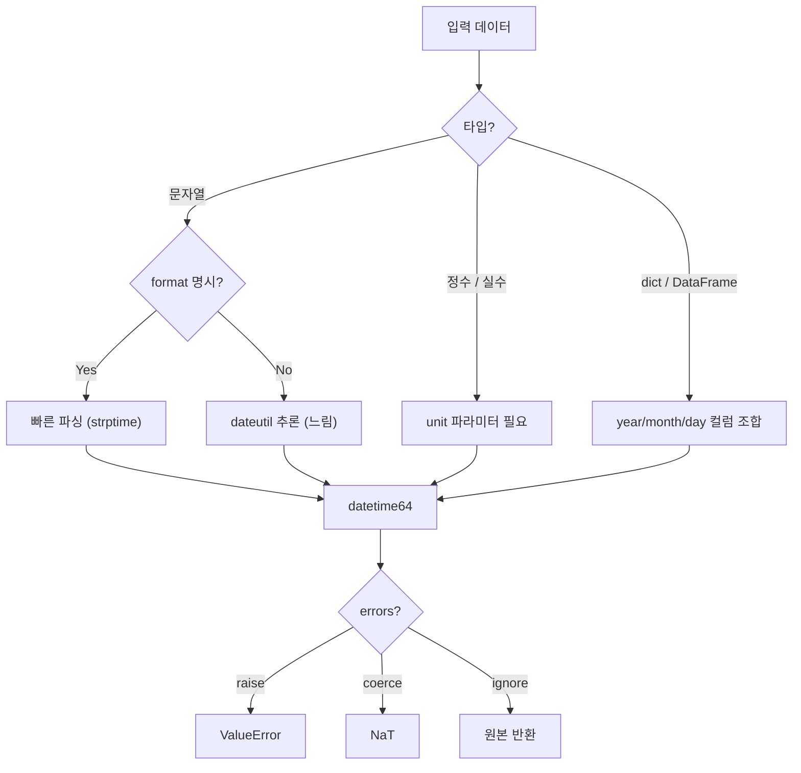

## 정의

**`pd.to_datetime(arg)`** 는 문자열, 정수, dict, DataFrame 컬럼을 `datetime64` 타입으로 변환한다. pandas 시계열 작업의 출발점.

```python
pd.to_datetime('2024-01-15')                       # Timestamp
pd.to_datetime(['2024-01-15', '2024-02-20'])       # DatetimeIndex
pd.to_datetime(df['date_str'])                     # Series[datetime64]
```

## 사용 상황

- CSV 로드 후 날짜 컬럼이 `object` (문자열) 로 읽혔을 때
- Unix timestamp (초/밀리초) 를 datetime 으로 변환할 때
- 연/월/일이 별도 컬럼으로 분리된 데이터를 합칠 때
- timezone 이 혼재된 데이터를 UTC 로 정규화할 때

## 변환 흐름



## 기본 사용법

<CodeWithOutput
  language="python"
  outputLanguage="text"
  code={`import pandas as pd
s = pd.Series(['2024-01-15', '2024-02-20', '2024-03-25'])
dt = pd.to_datetime(s)
print(dt)
print(dt.dtype)`}
  output={`0   2024-01-15
1   2024-02-20
2   2024-03-25
dtype: datetime64[s]
datetime64[s]`}
/>

## format 명시 (빠르고 명확)

```python
pd.to_datetime(s, format='%Y-%m-%d')               # ISO 8601
pd.to_datetime(s, format='%d/%m/%Y')               # 유럽식 DD/MM/YYYY
pd.to_datetime(s, format='%m/%d/%Y')               # 미국식 MM/DD/YYYY
pd.to_datetime(s, format='%Y년 %m월 %d일')         # 한글 포맷
pd.to_datetime(s, format='%Y%m%d')                 # 숫자 연속 (20240115)
pd.to_datetime(s, format='mixed')                  # 여러 포맷 혼재 (느림)
pd.to_datetime(s, format='ISO8601')                # ISO 8601 전용 빠른 파서 (pandas 2.0+)
```

> [!IMPORTANT]
> `format` 명시가 **10-100배 빠르다**. 대용량 데이터에서는 반드시 명시. `format='ISO8601'` 은 pandas 2.0+ 에서 추가된 빠른 ISO 파서.

### format 코드 주요 목록

| 코드 | 의미 | 예시 |
|:---|:---|:---|
| `%Y` | 4자리 연도 | 2024 |
| `%m` | 2자리 월 | 01-12 |
| `%d` | 2자리 일 | 01-31 |
| `%H` | 24시간 | 00-23 |
| `%M` | 분 | 00-59 |
| `%S` | 초 | 00-59 |
| `%f` | 마이크로초 | 000000-999999 |
| `%z` | UTC offset | +0900 |

## errors 옵션

```python
pd.to_datetime(s, errors='raise')      # 기본: 에러 시 ValueError
pd.to_datetime(s, errors='coerce')     # 에러 → NaT (Not a Time)
pd.to_datetime(s, errors='ignore')     # 에러 시 원본 값 그대로 반환
```

<CodeWithOutput
  language="python"
  outputLanguage="text"
  code={`import pandas as pd
s = pd.Series(['2024-01-15', 'not-a-date', '2024-03-25'])
print(pd.to_datetime(s, errors='coerce'))`}
  output={`0   2024-01-15
1          NaT
2   2024-03-25
dtype: datetime64[s]`}
/>

`errors='coerce'` 가 실전에서 가장 많이 쓰인다. 잘못된 행을 NaT 로 두고 분석을 계속 진행할 수 있다.

## unix timestamp 변환

```python
# 초 단위 (Unix epoch)
pd.to_datetime([1705248000, 1705334400], unit='s')

# 밀리초 단위
pd.to_datetime([1705248000000], unit='ms')

# 마이크로초
pd.to_datetime([1705248000000000], unit='us')

# 나노초 (pandas 내부 단위)
pd.to_datetime([1705248000000000000], unit='ns')
```

<CodeWithOutput
  language="python"
  outputLanguage="text"
  code={`import pandas as pd
ts = pd.to_datetime(1705248000, unit='s')
print(ts)
print(type(ts))`}
  output={`2024-01-14 16:00:00
<class 'pandas._libs.tslibs.timestamps.Timestamp'>`}
/>

## 여러 컬럼 → 하나의 datetime

연/월/일이 별도 컬럼으로 분리된 경우 dict 또는 DataFrame 을 직접 전달한다.

```python
df = pd.DataFrame({
    'year':  [2024, 2024, 2025],
    'month': [1,    2,    3],
    'day':   [15,   20,   1],
})
pd.to_datetime(df[['year', 'month', 'day']])
# 0   2024-01-15
# 1   2024-02-20
# 2   2025-03-01
```

시/분/초 컬럼도 함께 전달 가능:

```python
time_cols = ['year', 'month', 'day', 'hour', 'minute', 'second']
pd.to_datetime(df[time_cols])
```

## timezone 처리

### tz_localize vs tz_convert

```python
# naive datetime → timezone 부여
ts = pd.to_datetime('2024-01-15 09:00:00')
ts_seoul = ts.tz_localize('Asia/Seoul')

# timezone 변환
ts_utc = ts_seoul.tz_convert('UTC')
```

### utc=True: 혼재 timezone 정규화

```python
# utc=True 로 모두 UTC 로 정규화
pd.to_datetime(
    ['2024-01-15+09:00', '2024-01-15T00:00:00Z', '2024-01-15'],
    utc=True
)
```

> [!IMPORTANT]
> timezone 이 혼재된 Series 는 `utc=True` 없이는 `ValueError` 가 발생한다. 항상 UTC 로 정규화 후 필요한 timezone 으로 변환하는 것이 안전하다.

### Series 에 timezone 적용

```python
df['ts'] = pd.to_datetime(df['ts_str'], utc=True)
df['ts_kst'] = df['ts'].dt.tz_convert('Asia/Seoul')
```

## DatetimeIndex 활용

datetime 컬럼을 index 로 설정하면 강력한 시계열 슬라이싱이 가능하다.

```python
df = df.set_index(pd.to_datetime(df['date']))

df['2024']                          # 2024년 전체
df['2024-01']                       # 2024년 1월
df['2024-01-15':'2024-01-31']       # 날짜 범위
df.loc['2024-01-15']                # 특정 날짜
```

[[Pandas dt accessor]] 로 datetime 의 각 컴포넌트 접근:

```python
df['date'].dt.year
df['date'].dt.month
df['date'].dt.day_of_week    # 0=월요일
df['date'].dt.quarter
df['date'].dt.is_month_end
```

## pandas 2.x 변경점

| 항목 | 1.x | 2.x |
|:---|:---|:---|
| 기본 해상도 | `datetime64[ns]` | `datetime64[s]` (초 단위) |
| `format='ISO8601'` | 없음 | 추가 (빠른 ISO 파서) |
| `format='mixed'` | 없음 | 추가 (혼재 포맷) |
| `infer_datetime_format` | 있음 | deprecated |

```python
# 2.x 에서 infer_datetime_format 대신
pd.to_datetime(s, format='ISO8601')   # ISO 형식
pd.to_datetime(s, format='mixed')     # 혼재 형식

# 나노초 해상도가 필요하면 명시
pd.to_datetime(s).astype('datetime64[ns]')
```

## 성능

| 방법 | 상대 속도 | 비고 |
|:---|:---:|:---|
| format 없음 (dateutil 추론) | 1x | 느림, 소규모에만 |
| format 명시 (strptime) | 10-50x | 권장 |
| `format='ISO8601'` | 50-100x | pandas 2.0+, ISO 형식 전용 |

```python
import pandas as pd

n = 1_000_000
dates = pd.Series(['2024-01-15'] * n)

# 느림: dateutil 추론
pd.to_datetime(dates)

# 빠름: format 명시
pd.to_datetime(dates, format='%Y-%m-%d')

# 가장 빠름: ISO8601 파서
pd.to_datetime(dates, format='ISO8601')
```

## 함정

### 1. 한국어 / 비표준 포맷

```python
# '2024년 1월 15일' 같은 형식
pd.to_datetime(s, format='%Y년 %m월 %d일')
# format 없이는 dateutil 추론이 실패하거나 잘못된 결과를 줄 수 있음
```

### 2. dayfirst: 월/일 모호성

```python
pd.to_datetime('01/02/2024')                 # 미국식: 1월 2일
pd.to_datetime('01/02/2024', dayfirst=True)  # 유럽식: 2월 1일
```

지역별 모호한 형식은 `dayfirst` 또는 `format` 을 명시한다.

### 3. 빈 문자열 / None

```python
pd.to_datetime(['', None, '2024-01-15'], errors='coerce')
# NaT, NaT, Timestamp('2024-01-15')
```

`errors='coerce'` 가 안전하다.

### 4. tzinfo 혼재

```python
# ❌ 일부에 timezone, 일부에 없음
pd.to_datetime(['2024-01-15+09:00', '2024-01-15'])
# ValueError: Cannot mix tz-naive and tz-aware

# ✓ utc=True 로 정규화
pd.to_datetime(['2024-01-15+09:00', '2024-01-15'], utc=True)
```

### 5. pandas 2.x 해상도 변경

```python
# 2.x 에서 기본 해상도가 ns → s 로 변경
# 나노초가 필요하면 명시
s = pd.to_datetime(['2024-01-15']).astype('datetime64[ns]')
```

### 6. infer_datetime_format deprecated

```python
# ❌ pandas 2.x 에서 FutureWarning
pd.to_datetime(s, infer_datetime_format=True)

# ✓ 대신
pd.to_datetime(s, format='ISO8601')
```

## 관련 위키

- [[Pandas dt accessor]]
- [[Pandas resample]]
- [[Pandas date_range]]
- [[Pandas groupby]]
- [[Pandas 성능 / 메모리 최적화]]
