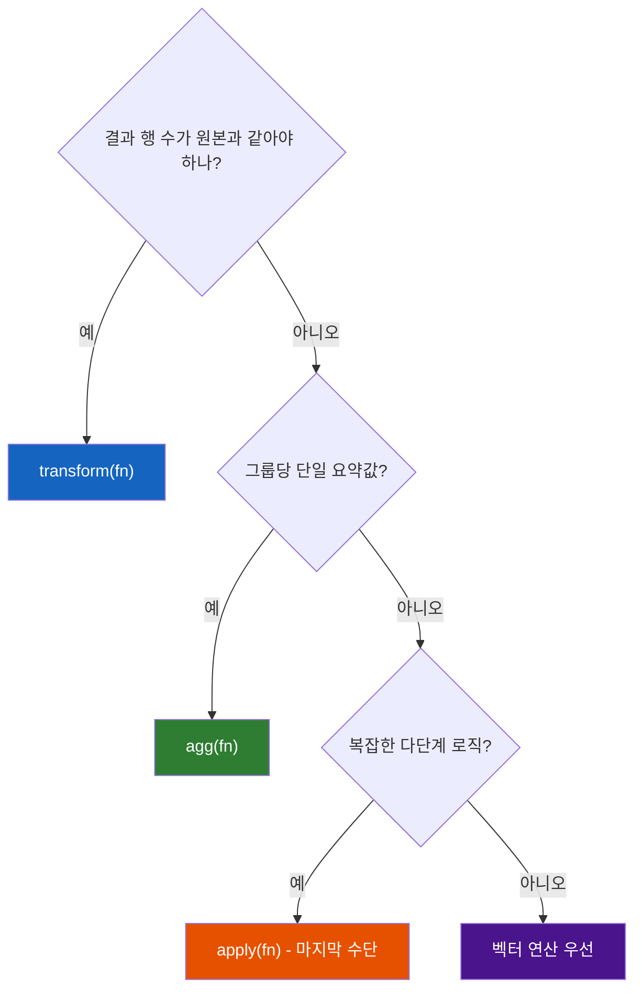
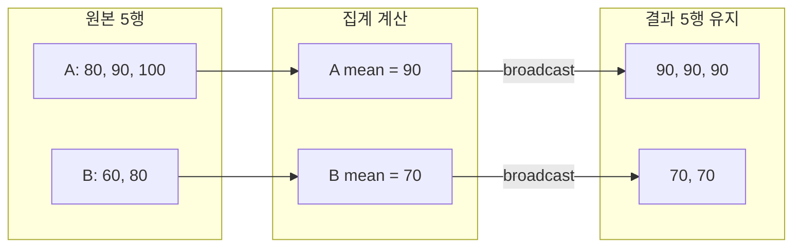

## 정의

| 메서드 | 입력 | 출력 | 용도 |
|:---|:---|:---|:---|
| **`.transform(fn)`** | 그룹 | **같은 shape** | 정규화, 보충 |
| **`.apply(fn)`** | 그룹 | 임의 shape | 가장 유연, 가장 느림 |
| **`.agg(fn)`** | 그룹 | 그룹당 1 row | 집계 |

`transform` 과 `apply` 는 모두 `groupby` 객체의 메서드이지만 목적이 다르다. `agg` 와 달리 `transform` 은 원본 행 수를 유지한다.

## 메서드 선택 흐름



## transform: 같은 shape

각 그룹에 함수를 적용해도 결과가 **원본 DataFrame 과 같은 행 수**. 그룹별 정규화에 적합.

<CodeWithOutput
  language="python"
  outputLanguage="text"
  code={`import pandas as pd
df = pd.DataFrame({
    'team': ['A','A','A','B','B'],
    'score': [80, 90, 100, 60, 80],
})
df['team_mean'] = df.groupby('team')['score'].transform('mean')
df['team_z'] = df.groupby('team')['score'].transform(lambda s: (s - s.mean()) / s.std())
print(df)`}
  output={`  team  score   team_mean    team_z
0    A     80   90.000000 -1.000000
1    A     90   90.000000  0.000000
2    A    100   90.000000  1.000000
3    B     60   70.000000 -0.707107
4    B     80   70.000000  0.707107`}
/>

각 행에 **그 행이 속한 그룹의 평균** 이 채워졌다. 핵심 패턴.

## broadcast 동작 원리

`transform` 이 그룹당 단일 값(예: mean)을 반환하면, pandas 가 그 값을 그룹 내 모든 행에 자동 **broadcast** 한다. `agg` 는 그룹당 1 row 만 반환하므로 원본과 `merge` 가 필요하지만, `transform` 은 그 과정 없이 바로 대입 가능하다.



## 자주 쓰는 transform 패턴

```python
# 그룹별 평균으로 NaN 채우기
df['salary'] = df.groupby('dept')['salary'].transform(
    lambda s: s.fillna(s.mean())
)

# 그룹별 max 대비 비율
df['pct_of_max'] = df['sales'] / df.groupby('region')['sales'].transform('max')

# 그룹 내 순위 (rank 는 같은 shape 반환)
df['rank_in_team'] = df.groupby('team')['score'].rank(ascending=False)

# 그룹별 첫 번째 이벤트 시각
df['first_seen'] = df.groupby('user_id')['event_time'].transform('first')

# 그룹 크기 (행 수) 를 각 행에 붙이기
df['group_size'] = df.groupby('category')['id'].transform('count')

# 그룹 내 누적합
df['cumsum_in_group'] = df.groupby('team')['score'].transform('cumsum')
```

## apply: 가장 유연

`.apply` 는 각 그룹에 **임의의 함수** 를 적용. 결과 shape 는 함수가 결정한다.

```python
def top3_with_total(g):
    return g.nlargest(3, 'score').assign(total=g['score'].sum())

# pandas 2.2+: include_groups=False 권장
df.groupby('team').apply(top3_with_total, include_groups=False)
```

### apply 의 단점

- **느리다**: Python 함수 호출 오버헤드 per group
- 결과 타입 추론이 까다로움 (FutureWarning 자주 발생)
- 같은 효과를 `agg` / `transform` 으로 표현 가능하면 그것이 더 빠름

## agg vs transform vs apply 비교

```python
import pandas as pd

df = pd.DataFrame({
    'dept': ['HR', 'HR', 'IT', 'IT', 'IT'],
    'salary': [300, 400, 500, 600, 700],
})

# agg: 그룹별 요약 (행 수 줄어듦)
df.groupby('dept')['salary'].agg(['mean', 'sum'])
# dept | mean | sum
# HR   | 350  | 700
# IT   | 600  | 1800

# transform: 원본 행 수 유지, 그룹별 mean broadcast
df.groupby('dept')['salary'].transform('mean')
# 0  350.0
# 1  350.0
# 2  600.0
# 3  600.0
# 4  600.0

# apply: 그룹별 상위 1명 추출 (행 수 변동)
df.groupby('dept', group_keys=False).apply(
    lambda g: g.nlargest(1, 'salary')
)
```

## 벡터 연산 우선

```python
# ❌ apply 로 행마다 처리
df['bmi'] = df.apply(lambda r: r['weight'] / (r['height'] / 100) ** 2, axis=1)

# ✓ 벡터 연산 (100배 이상 빠름)
df['bmi'] = df['weight'] / (df['height'] / 100) ** 2
```

벡터 연산이 종종 100배 이상 빠르다.

## 성능 비교

<CodeWithOutput
  language="python"
  outputLanguage="text"
  code={`import pandas as pd, numpy as np, time

np.random.seed(42)
n = 200_000
df = pd.DataFrame({
    'group': np.random.choice(['A', 'B', 'C', 'D'], size=n),
    'value': np.random.randn(n),
})

t = time.perf_counter()
df['r1'] = df.groupby('group')['value'].transform('mean')
print(f'transform built-in : {time.perf_counter()-t:.4f}s')

t = time.perf_counter()
df['r2'] = df.groupby('group')['value'].transform(lambda s: s.mean())
print(f'transform lambda   : {time.perf_counter()-t:.4f}s')

t = time.perf_counter()
means = df.groupby('group')['value'].mean()
df['r3'] = df['group'].map(means)
print(f'agg + map          : {time.perf_counter()-t:.4f}s')`}
  output={`transform built-in : 0.0131s
transform lambda   : 0.0401s
agg + map          : 0.0063s`}
/>

> [!TIP]
> 단순 집계(mean, sum, max)는 `transform` 대신 `groupby().agg()` + `map()` 조합이 2배 빠를 수 있다. 대용량에서는 검토 가치가 있다.

## 언제 무엇을 쓸까

| 시나리오 | 권장 |
|:---|:---|
| 그룹별 평균/합계 집계 | **`agg`** |
| 결과를 원본 행에 매핑 | **`transform`** |
| 그룹 내 정규화 / NaN 채우기 | **`transform`** |
| 그룹별 정렬, 상위 N 추출 | **`groupby + sort + head`** |
| 임의 복합 로직, 여러 컬럼 출력 | `apply` (마지막 수단) |

## 실전 예시

### 그룹 내 Z-score 정규화

```python
df['score_z'] = df.groupby('subject')['score'].transform(
    lambda s: (s - s.mean()) / s.std(ddof=0)
)
```

### 그룹별 결측 보충

```python
# 각 그룹의 중앙값으로 NaN 채우기
df['price'] = df.groupby('category')['price'].transform(
    lambda s: s.fillna(s.median())
)
```

### 그룹 내 이전 대비 변화율

```python
df['pct_change'] = df.groupby('stock')['close'].transform(
    lambda s: s.pct_change()
)
```

### 여러 컬럼에 동시 적용

```python
cols = ['salary', 'bonus']
result = df.groupby('dept')[cols].transform('mean')
df['salary_mean'] = result['salary']
df['bonus_mean'] = result['bonus']
```

## transform 의 제약

- 함수가 **같은 길이 결과** 를 반환해야 함
- 그룹별 단일 값 (예: mean) → 자동 broadcast
- 길이 불일치 → `ValueError`

```python
df.groupby('x').transform(lambda s: s.head(2))   # ❌ 그룹마다 다른 길이
df.groupby('x').apply(lambda s: s.head(2))       # ✓ apply 가 적절
```

## 함정

### 1. apply 의 첫 그룹 2회 호출

pandas 가 결과 타입 추론을 위해 첫 그룹을 **2회 호출** 할 수 있다. side effect 있는 함수는 주의가 필요하다.

```python
count = 0
def fn(g):
    global count
    count += 1
    return g

df.groupby('team').apply(fn)
# count 가 예상보다 1 많을 수 있음
```

### 2. group_keys 로 인한 MultiIndex

```python
# group_keys=True (기본) → MultiIndex 반환
result = df.groupby('team').apply(lambda g: g.head(2))

# 원치 않으면
result = df.groupby('team', group_keys=False).apply(lambda g: g.head(2))
```

### 3. apply vs transform 혼동

> [!WARNING]
> `df.apply(fn, axis=1)` 는 **행 단위** 처리이고, `df.groupby('g').apply(fn)` 는 **그룹 단위** 처리다. 이름이 같아도 전혀 다른 동작이니 혼동하지 말 것.

### 4. pandas 2.2 deprecation

```python
# pandas 2.2+: groupby().apply() 에서 그룹 키 컬럼이 함수에 전달되면 경고
# include_groups=False 로 명시
df.groupby('team').apply(fn, include_groups=False)
```

## 관련 위키

- [[Pandas groupby]]
- [[Pandas agg]]
- [[Pandas apply / map]]
- [[Pandas pivot_table]]
- [[Pandas iterrows]]
- [[Pandas 성능 / 메모리 최적화]]
