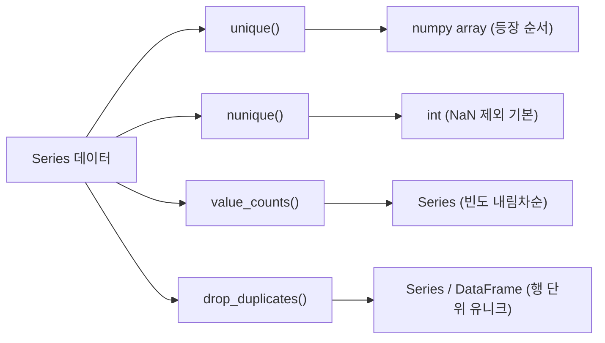

## 정의

- **`Series.unique()`** : 고유값을 **등장 순서대로** numpy array 반환
- **`Series.nunique()`** : 고유값의 **개수** 반환 (NaN 기본 제외)
- **`DataFrame.nunique()`** : 각 컬럼/행의 고유값 개수
- **`pd.unique()`** : Series 가 아닌 array-like 입력을 처리하는 모듈 수준 함수

SQL 의 `SELECT DISTINCT` / `COUNT(DISTINCT ...)` 와 동일한 개념.

## unique / nunique / value_counts 관계



## 사용

<CodeWithOutput
  language="python"
  outputLanguage="text"
  code={`import pandas as pd
s = pd.Series(['A', 'B', 'A', 'C', 'B', 'A', None])
print('unique :', s.unique())
print('nunique:', s.nunique())
print('nunique (NaN 포함):', s.nunique(dropna=False))`}
  output={`unique : ['A' 'B' 'C' None]
nunique: 3
nunique (NaN 포함): 4`}
/>

`unique()` 는 NaN 도 포함해 등장 순서로 반환. `nunique()` 는 기본적으로 NaN 제외.

## DataFrame.nunique

```python
df.nunique()                # 각 컬럼의 고유값 개수 (axis=0 기본)
df.nunique(axis=1)          # 각 행의 고유값 개수
df.nunique(dropna=False)    # NaN 도 카운트
```

<CodeWithOutput
  language="python"
  outputLanguage="text"
  code={`import pandas as pd
df = pd.DataFrame({
    'city': ['Seoul','Busan','Seoul','Daegu'],
    'plan': ['pro','basic','pro','pro'],
    'age': [25, 30, 25, 28],
})
print(df.nunique())`}
  output={`city    3
plan    2
age     3
dtype: int64`}
/>

## pd.unique() vs Series.unique() vs np.unique()

```python
import numpy as np
import pandas as pd

arr = np.array([3, 1, 2, 1, 3])

pd.unique(arr)             # array([3, 1, 2]) - 등장 순서
np.unique(arr)             # array([1, 2, 3]) - 정렬됨

s = pd.Series(arr)
s.unique()                 # array([3, 1, 2]) - pd.unique 와 동일
```

`pd.unique` 는 Series 가 아닌 list, ndarray, Index 도 받는다. `np.unique` 는 항상 정렬된 결과를 반환한다는 점이 다르다.

## value_counts() 와의 관계

```python
s = pd.Series(['A', 'B', 'A', 'C', 'B', 'A', None])

s.value_counts()
# A    3
# B    2
# C    1
# (NaN 제외 기본)

s.value_counts(normalize=True)       # 비율 (합계 1.0)
s.value_counts(dropna=False)         # NaN 포함
s.value_counts().index               # 고유값 (빈도 내림차순)
s.value_counts().index.tolist()      # 리스트로
```

`unique()` 는 등장 순서를 보존하고, `value_counts().index` 는 빈도 내림차순. 정렬된 고유값이 필요하면 `sorted(s.unique())`.

자세한 빈도 분석은 [[Pandas value_counts]] 참고.

## 카디널리티 검사 (ETL 실전)

데이터 파이프라인에서 컬럼의 고유값 수 (카디널리티) 를 확인하는 용도로 `nunique` 를 자주 사용한다.

```python
# 컬럼별 카디널리티 전체 확인
cardinality = df.nunique().sort_values()
print(cardinality)

# 카디널리티가 낮은 컬럼 → category dtype 후보
low_card = cardinality[cardinality < 50].index.tolist()
df[low_card] = df[low_card].astype('category')
```

카디널리티가 낮은 컬럼을 `category` dtype 으로 변환하면 메모리 절약과 성능 향상 효과가 있다. 자세히는 [[Pandas Categorical]] 참고.

## category dtype 과 unique / nunique

```python
import pandas as pd

s = pd.Series(['A', 'B', 'A', 'C'], dtype='category')

s.unique()    # CategoricalIndex(['A', 'B', 'C'], ...) 반환
s.nunique()   # 3

# categories 직접 접근
s.cat.categories       # Index(['A', 'B', 'C'], dtype='object')
len(s.cat.categories)  # 3 (nunique 와 같음)
```

category dtype 에서 `s.unique()` 는 `CategoricalIndex` 를 반환하며, `s.cat.categories` 와 동일하다.

> [!IMPORTANT]
> category dtype 컬럼의 경우 `unique()` 결과는 **정의된 카테고리 순서** 를 따른다. 등장 순서가 아니므로 주의.

## drop_duplicates 와의 관계

| 메서드 | 입력 | 출력 | 용도 |
|:---|:---|:---|:---|
| `unique()` | Series | numpy array | 컬럼 하나의 고유값 |
| `nunique()` | Series / DataFrame | int / Series | 고유값 개수 |
| `drop_duplicates()` | Series / DataFrame | 같은 타입 | **행 단위** 중복 제거 |

`unique()` 는 한 컬럼의 고유값, `drop_duplicates()` 는 행 전체 중복 제거. 자세한 행 단위 중복 제거는 [[Pandas drop_duplicates]] 참고.

```python
# unique 는 컬럼 기준
df['city'].unique()         # ['Seoul', 'Busan', 'Daegu'] - city 컬럼 고유값

# drop_duplicates 는 행 기준 (모든 컬럼 같으면 중복)
df.drop_duplicates()        # 행 전체가 같은 경우 제거
df.drop_duplicates('city')  # city 컬럼만 기준으로 중복 제거
```

## 정렬된 고유값

`unique()` 는 등장 순서를 보존. 정렬이 필요하면 별도 정렬:

```python
sorted(s.unique())       # Python list 정렬
np.sort(s.unique())      # numpy 정렬 (원 dtype 유지)
pd.Series(s.unique()).sort_values().reset_index(drop=True)  # Series 로
```

## 활용

### groupby + nunique (그룹별 고유 사용자 수)

```python
# 도시별 고유 사용자 수
df.groupby('city')['user_id'].nunique()

# 모든 컬럼에 대해
df.groupby('city').nunique()
```

SQL 로 치면: `SELECT city, COUNT(DISTINCT user_id) FROM ... GROUP BY city`

### 중복 비율 측정

```python
n_total = len(df)
n_unique = df['key'].nunique()
dup_rate = 1 - n_unique / n_total

print(f'중복 비율: {dup_rate:.1%}')  # 중복 비율: 33.3%
```

### 여러 컬럼의 카디널리티 한눈에 보기

```python
summary = pd.DataFrame({
    'nunique': df.nunique(),
    'total': len(df),
    'ratio': df.nunique() / len(df),
})
print(summary.sort_values('nunique'))
```

### 고유값 목록을 필터 조건으로

```python
# 특정 컬럼의 고유값을 다른 DataFrame 필터에 활용
valid_cities = df_main['city'].unique()
df_sub = df_sub[df_sub['city'].isin(valid_cities)]
```

## 함정

### 1. unique 의 정렬 안 됨

```python
s = pd.Series([3, 1, 2, 1])
s.unique()   # array([3, 1, 2]) - 등장 순서
```

정렬된 결과가 필요하면 `np.sort(s.unique())` 또는 `sorted(s.unique())`.

### 2. NaN 처리 비대칭

```python
s.unique()                # NaN 포함 (numpy nan 으로)
s.nunique()               # NaN 제외 (기본값 dropna=True)
s.nunique(dropna=False)   # NaN 포함
```

`unique` 와 `nunique` 의 NaN 기본값이 다르므로 주의.

### 3. 대용량 데이터: 컬럼 단위로

```python
df.nunique()         # 모든 컬럼에 대해 unique 계산, 메모리 多
df['col'].nunique()  # 한 컬럼만 (권장)
```

컬럼이 많고 데이터가 클 때는 `df.nunique()` 보다 필요한 컬럼만 지정.

### 4. category dtype 에서 unique 순서

```python
s = pd.Categorical(['B', 'A', 'C', 'A'], categories=['A', 'B', 'C'])
pd.Series(s).unique()
# CategoricalIndex(['B', 'A', 'C'], ...) - 등장 순서이지만 categories 순이 아님
```

등장 순서와 category 정의 순서가 다를 수 있으니 카테고리 순서가 중요하면 `s.cat.categories` 를 직접 사용.

### 5. unique 결과는 numpy array, 인덱스 없음

```python
arr = s.unique()
type(arr)          # numpy.ndarray
arr[0]             # 첫 번째 고유값
pd.Series(arr)     # 다시 Series 로 변환 (인덱스 0, 1, 2, ...)
```

## 관련 위키

- [[Pandas Series]]
- [[Pandas value_counts]]
- [[Pandas drop_duplicates]]
- [[Pandas Categorical]]
- [[Pandas groupby]]
- [[Pandas Boolean Indexing]]
