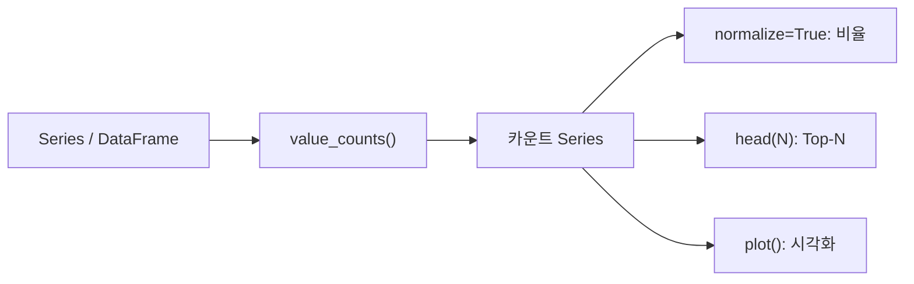

## 정의

**`Series.value_counts()`** 는 각 고유값의 **등장 빈도** 를 내림차순 Series 로 반환. SQL 의 `GROUP BY ... ORDER BY count DESC`.

pandas 1.1+ 부터는 `DataFrame.value_counts()` 도 가능 (여러 컬럼 조합).

## 기본

<CodeWithOutput
  language="python"
  outputLanguage="text"
  code={`import pandas as pd
s = pd.Series(['A', 'B', 'A', 'C', 'B', 'A', 'B'])
print(s.value_counts())`}
  output={`A    3
B    3
C    1
Name: count, dtype: int64`}
/>

| value | count |
|---|---|
| A | 3 |
| B | 3 |
| C | 1 |

## 옵션

```python
s.value_counts(normalize=True)    # 비율 (sum to 1)
s.value_counts(ascending=True)     # 오름차순
s.value_counts(dropna=False)       # NaN 도 카운트
s.value_counts(bins=5)             # 수치형, 5 개 구간으로 binning
```

### normalize

<CodeWithOutput
  language="python"
  outputLanguage="text"
  code={`import pandas as pd
s = pd.Series(['A', 'B', 'A', 'C', 'B', 'A', 'B'])
print(s.value_counts(normalize=True))`}
  output={`A    0.428571
B    0.428571
C    0.142857
Name: proportion, dtype: float64`}
/>

비율 → 분포 분석에 유용.

## DataFrame.value_counts (다중 컬럼)

```python
df.value_counts(['city', 'plan'])
# (city, plan) 조합의 빈도
```

<CodeWithOutput
  language="python"
  outputLanguage="text"
  code={`import pandas as pd
df = pd.DataFrame({
    'city': ['Seoul','Busan','Seoul','Busan','Seoul'],
    'plan': ['pro','basic','pro','basic','basic'],
})
print(df.value_counts())`}
  output={`city   plan
Seoul  pro      2
Busan  basic    2
Seoul  basic    1
Name: count, dtype: int64`}
/>

MultiIndex Series 결과.

## bins (수치형 분포)

```python
ages = pd.Series([22, 25, 31, 35, 42, 55, 18, 29])
ages.value_counts(bins=4)
# (17.999, 27.25]    3
# (27.25, 36.5]      3
# (36.5, 45.75]      1
# (45.75, 55.0]      1
```

자동으로 구간 분할, [[Pandas cut / qcut]] 의 quick version.

## SQL 비교

```sql
SELECT value, COUNT(*) AS count
FROM table
GROUP BY value
ORDER BY count DESC
```

`s.value_counts()` 한 줄과 같다.

## 활용 패턴

### 상위 N 개 카테고리

```python
top10 = s.value_counts().head(10)
```

### 빈도가 낮은 카테고리 묶기

```python
counts = df['category'].value_counts()
rare = counts[counts < 10].index
df['category'] = df['category'].where(~df['category'].isin(rare), 'OTHER')
```

### 빈도 시각화

```python
df['category'].value_counts().plot(kind='bar')
```

## value_counts vs groupby + size

```python
s.value_counts()                          # ↓ 같은 결과
df.groupby('city').size().sort_values(ascending=False)
```

`value_counts` 가 더 짧고 명시적.

## 함정

### 1. NaN 기본 제외

```python
s.value_counts()                          # NaN 제외
s.value_counts(dropna=False)              # NaN 포함
```

### 2. category dtype 의 차이

```python
s = pd.Series(['A','B','A'], dtype='category')
s.value_counts()                          # 등장한 카테고리만
# Categorical 의 categories 에 정의됐지만 등장 안 한 값은?
# pandas 2.x: observed=False 로 포함 가능
```

### 3. Series 가 아닌 DataFrame 에 호출

```python
df.value_counts()       # 모든 컬럼 조합의 빈도 (1.1+)
df.value_counts('col')  # 단일 컬럼
```

## 빈도 분석 흐름



## 카테고리 통합 패턴

```python
# 빈도 낮은 카테고리를 'OTHER' 로 통합
counts = df['platform'].value_counts()
rare = counts[counts < 100].index
df['platform'] = df['platform'].where(~df['platform'].isin(rare), 'OTHER')

# long-tail 확인
df['platform'].value_counts()
```

특정 임계값 이하의 카테고리를 묶어 *long-tail 처리*.

## 비율 + 누적 분포

```python
vc = df['country'].value_counts(normalize=True)
cumulative = vc.cumsum()
# 상위 5개 국가가 전체의 몇 % 커버?
print(cumulative.head(5))
print(f"상위 5개국 커버율: {cumulative.iloc[4]:.1%}")
```

*파레토 분석* (상위 20% 가 80% 비율 커버) 패턴.

## 빈도 시각화

```python
# 수직 막대 차트
df['plan'].value_counts().plot(kind='bar', title='Plan 분포')

# 수평 막대 (카테고리 많을 때 가독성)
df['country'].value_counts().head(20).plot(kind='barh')

# 파이 차트
df['tier'].value_counts().plot(kind='pie', autopct='%1.1f%%')
```

## value_counts 결과를 DataFrame 에 join

```python
vc = df['city'].value_counts().rename('city_count')
df = df.join(vc, on='city')
# 각 row 에 해당 도시의 전체 빈도 추가
```

## 분포 이상 탐지

```python
# 예상 외 카테고리 확인
expected = {'active', 'inactive', 'pending'}
actual = set(df['status'].unique())
unexpected = actual - expected
if unexpected:
    print(f"예상 외 값: {unexpected}")

# 단일 값이 지나치게 지배적
vc = df['status'].value_counts(normalize=True)
if vc.iloc[0] > 0.9:
    print("경고: 단일 값이 90% 초과")
```

## 관련 함수 비교

| 함수 | 반환 | 정렬 기준 |
|---|---|---|
| `value_counts()` | count Series | 빈도 내림차순 |
| `groupby + size()` | count Series | 키 오름차순 |
| `groupby + count()` | non-null count | 키 오름차순 |
| `unique()` | 고유값 배열 | 등장 순 |
| `nunique()` | 고유값 개수 | N/A |

`value_counts` 가 가장 간결. 정렬이나 추가 집계가 필요하면 `groupby`.

## 참고

- [[Pandas Series]]
- [[Pandas unique / nunique]]
- [[Pandas cut / qcut]]
- [[Pandas groupby]]
- [[pandas-agg]]
- [[pandas-categorical]]
