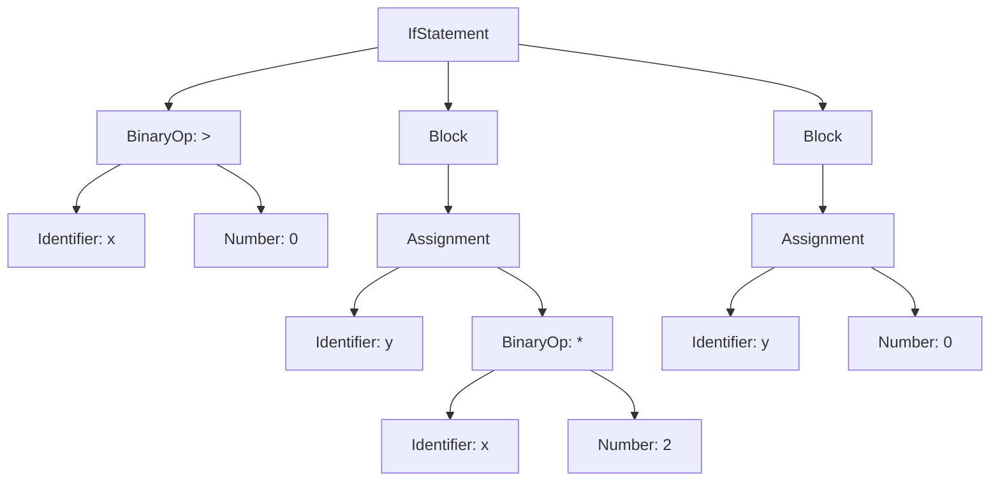

## 정의

**Abstract Syntax Tree (AST, 추상 구문 트리)** 는 프로그램의 **문법 구조를 트리로 표현** 한 자료구조입니다. 파서의 출력물이자, 이후 컴파일러/인터프리터의 거의 모든 단계 (semantic 분석, 최적화, 코드 생성) 의 입력.

**핵심**: 소스 코드의 **본질적 구조** 만 남기고, 문법 세부 (괄호, 세미콜론, 공백) 제거.

## 왜 트리인가

프로그래밍 언어의 구조는 자연스럽게 **재귀적**:
- 함수는 statement 들의 목록
- statement 는 expression 을 포함
- expression 은 다른 expression 을 포함

트리 = 재귀 구조 표현의 자연스러운 자료구조.

## AST 예시

**소스 코드**:
```javascript
if (x > 0) {
  y = x * 2;
} else {
  y = 0;
}
```

**AST**:



각 노드는 의미 있는 구조:
- **IfStatement**: cond, then, else 세 자식
- **BinaryOp**: op, left, right
- **Assignment**: target, value
- **Block**: statements 리스트

## AST vs Parse Tree (Concrete Syntax Tree)

두 개념 자주 혼동.

### Parse Tree (CST)

문법 규칙을 **그대로** 반영. 모든 non-terminal 이 노드.

```
Expression
├── Term
│   ├── Factor
│   │   └── Number(2)
│   └── OP(+)
│   └── Term
│       ├── Factor
│       │   └── Number(3)
│       └── OP(*)
│       └── Factor
│           └── Number(4)
```

`2 + 3 * 4` 의 CST 는 `Expression → Term → Factor` 등 중간 노드 다수.

### AST

**본질 구조만**:

```
BinaryOp(+)
├── Number(2)
└── BinaryOp(*)
    ├── Number(3)
    └── Number(4)
```

간결. 이후 처리에 유리.

**언제 CST 유지?**:
- 소스 코드 포매터 (원본 재구성 필요)
- 리팩터링 도구 (주석/공백 보존)
- IDE (원본 위치 정확성)

## AST 노드 정의 (TypeScript 예시)

```typescript
// 표현식
type Expression =
  | NumberLiteral
  | StringLiteral
  | BooleanLiteral
  | Identifier
  | BinaryOp
  | UnaryOp
  | Call
  | MemberAccess
  | Assignment;

interface NumberLiteral {
  kind: 'NumberLiteral';
  value: number;
  location: SourceLocation;
}

interface Identifier {
  kind: 'Identifier';
  name: string;
  location: SourceLocation;
}

interface BinaryOp {
  kind: 'BinaryOp';
  op: '+' | '-' | '*' | '/' | '==' | '<' | '>' | '&&' | '||';
  left: Expression;
  right: Expression;
  location: SourceLocation;
}

interface UnaryOp {
  kind: 'UnaryOp';
  op: '-' | '!' | '++' | '--';
  operand: Expression;
  location: SourceLocation;
}

interface Call {
  kind: 'Call';
  callee: Expression;
  args: Expression[];
  location: SourceLocation;
}

// 문장
type Statement =
  | ExpressionStatement
  | VariableDeclaration
  | IfStatement
  | WhileStatement
  | ReturnStatement
  | FunctionDeclaration
  | Block;

interface IfStatement {
  kind: 'IfStatement';
  condition: Expression;
  thenBranch: Statement;
  elseBranch?: Statement;
  location: SourceLocation;
}

interface FunctionDeclaration {
  kind: 'FunctionDeclaration';
  name: string;
  params: Identifier[];
  body: Block;
  location: SourceLocation;
}

interface SourceLocation {
  file: string;
  line: number;
  column: number;
}
```

## AST 순회 (Traversal)

AST 를 처리할 때 대부분 **재귀 순회**.

### Depth-First

```text
function visit(node):
    switch node.kind:
        case 'NumberLiteral':
            processNumber(node)
        case 'BinaryOp':
            visit(node.left)
            visit(node.right)
            processBinaryOp(node)
        case 'IfStatement':
            visit(node.condition)
            visit(node.thenBranch)
            if node.elseBranch:
                visit(node.elseBranch)
            processIf(node)
        ...
```

### 방문 시점

- **Pre-order**: 자식 방문 전 노드 처리
- **Post-order**: 자식 모두 방문 후 노드 처리
- **In-order**: 이진 트리 특수 (프로그래밍 언어 AST 는 잘 안 씀)

## Visitor Pattern

전형적 OOP 패턴:

```typescript
interface Visitor<T> {
  visitNumber(node: NumberLiteral): T;
  visitBinaryOp(node: BinaryOp): T;
  visitIdentifier(node: Identifier): T;
  visitIf(node: IfStatement): T;
  // ...
}

class Evaluator implements Visitor<Value> {
  visitNumber(node) {
    return node.value;
  }
  visitBinaryOp(node) {
    const left = this.visit(node.left);
    const right = this.visit(node.right);
    return applyOp(node.op, left, right);
  }
  visitIdentifier(node) {
    return this.env.get(node.name);
  }
  // ...

  visit(node): Value {
    switch (node.kind) {
      case 'NumberLiteral': return this.visitNumber(node);
      case 'BinaryOp': return this.visitBinaryOp(node);
      case 'Identifier': return this.visitIdentifier(node);
      // ...
    }
  }
}
```

**Discriminated union + switch** 방식 (TypeScript, Rust 스타일) 이 최근 관용.

## AST 변환 (Transformation)

새 AST 를 만들어 반환하는 함수:

```typescript
function replaceConstants(node: Expression): Expression {
  if (node.kind === 'Identifier' && node.name === 'PI') {
    return { kind: 'NumberLiteral', value: 3.14159, location: node.location };
  }
  if (node.kind === 'BinaryOp') {
    return {
      ...node,
      left: replaceConstants(node.left),
      right: replaceConstants(node.right),
    };
  }
  return node;
}
```

**Babel plugin, TypeScript transformer, ESLint auto-fix** 가 이 패턴.

## 실전 사용 사례

### 1. 인터프리터

AST 순회하며 실행. Tree-walking interpreter.

```typescript
function evaluate(node: Expression, env: Environment): Value {
  switch (node.kind) {
    case 'NumberLiteral': return node.value;
    case 'BinaryOp':
      const l = evaluate(node.left, env);
      const r = evaluate(node.right, env);
      return applyOp(node.op, l, r);
    case 'Identifier':
      return env.lookup(node.name);
  }
}
```

Crafting Interpreters 의 첫 인터프리터.

### 2. 컴파일러 (코드 생성)

AST → 목표 코드:

```
NumberLiteral 42       → PUSH 42
BinaryOp(+, l, r)      → visit(l); visit(r); ADD
```

### 3. 정적 분석 / 린터

ESLint 는 AST 를 순회하며 규칙 적용:

```javascript
// no-unused-vars 규칙
Program(node) {
  const declared = collectDeclared(node);
  const used = collectUsed(node);
  for (const varName of declared) {
    if (!used.has(varName)) {
      report(`Unused variable: ${varName}`);
    }
  }
}
```

### 4. 트랜스파일러

Babel: ES2020+ AST → ES5 AST (다운그레이드).

TypeScript: TS AST → JS AST + 별도 타입 검사.

### 5. IDE 지원

- **자동완성**: 커서 위치 AST 노드 확인
- **Go to definition**: identifier → declaration
- **Rename**: 같은 심볼의 모든 참조 재작성
- **포매팅**: AST → 표준 형식으로 재출력 (Prettier)

### 6. Code Mods (자동 리팩터링)

jscodeshift, ts-morph: 대규모 자동 리팩터링. AST 변환.

## AST Explorer

https://astexplorer.net/ 에서 여러 언어 파서의 AST 를 실시간 확인 가능. 학습 필수 도구.

**예**: JavaScript `const x = 42;` 의 AST:

```json
{
  "type": "Program",
  "body": [
    {
      "type": "VariableDeclaration",
      "kind": "const",
      "declarations": [
        {
          "type": "VariableDeclarator",
          "id": { "type": "Identifier", "name": "x" },
          "init": { "type": "Literal", "value": 42 }
        }
      ]
    }
  ]
}
```

## 언어별 AST 표기법

### JavaScript

- **ESTree** 명세: 사실상 표준. Acorn, Babel, ESLint 채택.
- **SWC AST**, **Oxc AST**: Rust 기반 최근 도구, 대부분 ESTree 호환.

### TypeScript

TypeScript 자체 컴파일러 AST. ESTree 와 다름 (typescript-eslint 는 변환).

### Python

`ast` 모듈. `ast.parse(source)` → AST.

```python
import ast
tree = ast.parse("x = 42")
print(ast.dump(tree))
```

### Rust

`rustc_ast`, `syn` (proc macro 용).

### Go

`go/ast` 표준 패키지.

## 함정

> [!WARNING]
> **Source location 저장**. AST 노드에 원본 위치 (파일/줄/열) 없으면 에러 메시지 최악.

> [!CAUTION]
> **주석/공백 처리**. Prettier / 포매터 하려면 AST 에 관련 정보 유지 필요. 대부분 컴파일러는 버림.

> [!WARNING]
> **AST 재사용 시 immutable 지향**. 변환은 새 AST 생성. 원본 수정은 버그 온상.

> [!IMPORTANT]
> **Discriminated union + switch** 가 OOP visitor 보다 현대적. TypeScript exhaustive check.

> [!CAUTION]
> **AST 순회 순서가 의미 결정**. Pre-order 인지 post-order 인지 명확히 (예: 순회 중 변수 정의 발견 순서).

## 관련 위키

- [[programming-language-theory|PLT 개요]]
- [[plt-lexical-analysis|Lexical Analysis]]
- [[plt-parsing|Parsing]]
- [[plt-semantic-analysis|Semantic Analysis]]
- [[plt-interpreter-compiler|Interpreter vs Compiler]]
- [[plt-ir-optimization-codegen|IR & Code Gen]]
- [[ts-decorators|TypeScript Decorators]] - 실전 AST 변환
- [[js-bundling|JS 번들링]]
