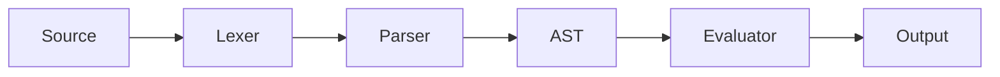

## 정의

프로그래밍 언어의 실행 모델 두 접근:

- **Compiler (컴파일러)**: 소스 → 목표 코드 (기계어, 바이트코드) 로 변환. 실행은 나중.
- **Interpreter (인터프리터)**: 소스 (또는 AST) 를 **직접 실행**. 별도 목표 코드 없음.

**현대는 하이브리드**. 순수 컴파일러/인터프리터는 드묾. JIT, 바이트코드 VM 등 조합.

## Compiler 파이프라인


**Ahead-Of-Time (AOT)**: 실행 전 전체 컴파일.

**예**: C, C++, Rust, Go, Swift (native), Kotlin/Native.

## Interpreter 파이프라인



**Tree-walking interpreter**: AST 순회하며 실행.

**예**: 초기 Python (인터프리티브), Ruby MRI 초기, Lua 5.1, PHP 초기.

## Tree-Walking Interpreter (의사코드)

```text
evaluate(node, env):
    switch node.kind:
        case NumberLiteral:
            return node.value

        case BinaryOp:
            l = evaluate(node.left, env)
            r = evaluate(node.right, env)
            return applyOp(node.op, l, r)

        case Identifier:
            return env.lookup(node.name)

        case Assignment:
            v = evaluate(node.value, env)
            env.set(node.target.name, v)
            return v

        case IfStatement:
            if isTruthy(evaluate(node.cond, env)):
                return evaluate(node.then, env)
            elif node.else:
                return evaluate(node.else, env)

        case WhileLoop:
            while isTruthy(evaluate(node.cond, env)):
                evaluate(node.body, env)

        case FunctionCall:
            fn = evaluate(node.callee, env)
            args = [evaluate(a, env) for a in node.args]
            return callFunction(fn, args)
```

**장점**: 단순, 이해 쉬움.
**단점**: 느림. 매 노드가 dict lookup + case switch.

## Bytecode VM

Tree-walking 을 개선. AST → **바이트코드** (스택 기반 명령) 로 컴파일 후 VM 이 실행.

```
Source: 1 + 2 * 3

Compile to bytecode:
  PUSH 1
  PUSH 2
  PUSH 3
  MUL
  ADD

VM 실행:
  스택: [1, 2, 3]
  MUL: 2*3=6, 스택 [1, 6]
  ADD: 1+6=7, 스택 [7]
```

**예**: CPython (bytecode + VM), JVM (bytecode + JIT), .NET (CIL + JIT), Lua (bytecode).

**장점**:
- Tree-walking 대비 훨씬 빠름 (10-100배)
- Portable (VM 만 있으면 어디서든)
- 최적화 여지

**단점**:
- 컴파일 단계 필요
- VM 자체 오버헤드

## JIT (Just-In-Time)

바이트코드 (또는 소스) 를 **실행 중 native 기계어로 컴파일**.

- **Warm-up**: 초기에는 인터프리터 (또는 baseline 컴파일)
- **Hot path 감지**: 자주 실행되는 코드 발견
- **Optimizing JIT**: hot path 를 최적화된 native 로 재컴파일
- **Deoptimization**: 가정 (타입, inline) 이 깨지면 인터프리터로 fallback

**예**:
- **V8 (Chrome, Node.js)**: Ignition (interpreter) + TurboFan/Maglev (JIT)
- **HotSpot (Java)**: C1/C2 컴파일러
- **LuaJIT**: 세계에서 가장 빠른 JIT
- **PyPy**: Python JIT
- **SpiderMonkey (Firefox)**: Ion, Warp

**성능**: JIT 언어는 종종 C++ 성능의 50-90% 도달.

## AOT vs JIT vs Interpreter

| 축 | AOT | JIT | Interpreter |
|:---|:---|:---|:---|
| **시작 속도** | 빠름 (컴파일 완료) | 느림 (warm-up) | 빠름 (파싱만) |
| **최대 성능** | 최고 | 매우 높음 | 낮음 |
| **동적 최적화** | 불가 | 가능 (runtime info) | 불가 |
| **배포 크기** | 큼 (native binary) | 작음 (bytecode) | 소스 |
| **크로스 플랫폼** | 재컴파일 | VM 있으면 | 인터프리터 있으면 |
| **개발 iteration** | 느림 | 빠름 | 매우 빠름 |
| **예** | C, Rust, Go | Java, V8 | Bash, 초기 Ruby |

## 하이브리드 (현대)

대부분 현대 언어는 **여러 접근 조합**:

### JavaScript (V8)
1. **Parse** → AST
2. **Ignition**: bytecode 인터프리터 (빠른 시작)
3. **Sparkplug**: baseline JIT (한 번 실행된 함수)
4. **Maglev**: mid-tier JIT
5. **TurboFan**: optimizing JIT (hot 함수)
6. **Deoptimization**: 가정 깨지면 이전 계층으로

### Java (HotSpot)
1. **javac** → bytecode (.class)
2. **Interpreter** (인터프리팅)
3. **C1 compiler** (client JIT, 빠른 컴파일)
4. **C2 compiler** (server JIT, 고급 최적화)

### Python (CPython)
1. **Parse** → AST
2. **Compile** → bytecode (.pyc)
3. **VM 실행**
4. (**PyPy**: JIT 추가)

### C# (.NET)
1. **Roslyn** → CIL
2. **RyuJIT** 또는 **AOT (Native AOT)**

## Transpiler (소스-대-소스 컴파일러)

**소스 → 다른 소스**.

- **Babel**: 최신 JS → 옛 JS (호환성)
- **TypeScript**: TS → JS (타입 제거)
- **Kotlin → JVM/JS/Native**
- **CoffeeScript → JS** (legacy)
- **Vue SFC compiler**: `.vue` → JS
- **Sass → CSS**

**차이점**: 컴파일러이지만 목표가 기계어가 아닌 다른 고급 언어.

## Cross-Compilation

**한 플랫폼에서 다른 플랫폼용 바이너리 생성**.

- Rust: `cargo build --target=x86_64-unknown-linux-gnu`
- Go: `GOOS=linux GOARCH=amd64 go build`
- 임베디드 (Rust, C): x86 머신에서 ARM 바이너리

## REPL (Read-Eval-Print Loop)

인터프리터의 확장. 사용자 입력 즉시 실행.

**예**: Python REPL, Node.js, GHCi (Haskell), rusti (Rust).

컴파일 언어도 REPL 가능: Kotlin, Scala (컴파일 후 실행).

## Meta-Circular Interpreter

**언어 X 로 X 를 구현**. Lisp 이 유명.

**예**: JavaScript 로 JavaScript 파서 (Acorn, Babel).

**장점**: bootstrap, self-hosting.

## Interpreter vs Compiler 선택 기준

**컴파일러가 좋을 때**:
- 성능 우선 (게임, 시스템)
- 배포 크기 (native binary)
- 최적화 여지 극대화

**인터프리터가 좋을 때**:
- 개발 iteration 빠름
- 동적 (eval, reflection)
- 이식성 우선 (같은 소스 여러 플랫폼)

**JIT 가 좋을 때**:
- 두 이익 모두 (개발 편의 + 성능)
- 런타임 정보 활용 (동적 타입 최적화)

## 함정

> [!WARNING]
> **인터프리티드 언어 = 느림 은 오해**. JIT (V8, LuaJIT, HotSpot) 는 C 급 성능.

> [!CAUTION]
> **JIT warmup**. 짧은 CLI 프로그램은 JIT 이점 없음. Java 는 특히 startup 느림 → AOT (GraalVM) 로 해결.

> [!WARNING]
> **Bytecode 도 크로스플랫폼 아님**. JVM 바이트코드는 JVM 필요. WASM 은 다양한 호스트.

> [!IMPORTANT]
> **Transpiler 도 컴파일러**. AST 변환은 동일. 다만 출력이 소스 코드.

> [!CAUTION]
> **Tree-walking interpreter 는 프로덕션 부적합**. 학습용. 실전은 bytecode + JIT.

## 관련 위키

- [[programming-language-theory|PLT 개요]]
- [[plt-abstract-syntax-tree|AST]]
- [[plt-semantic-analysis|Semantic Analysis]]
- [[plt-ir-optimization-codegen|IR & Code Gen]]
- [[plt-type-systems|Type Systems]]
- [[js-bundling|JS 번들링]] - Transpiler 실전
- [[typescript|TypeScript]] - Transpiler
