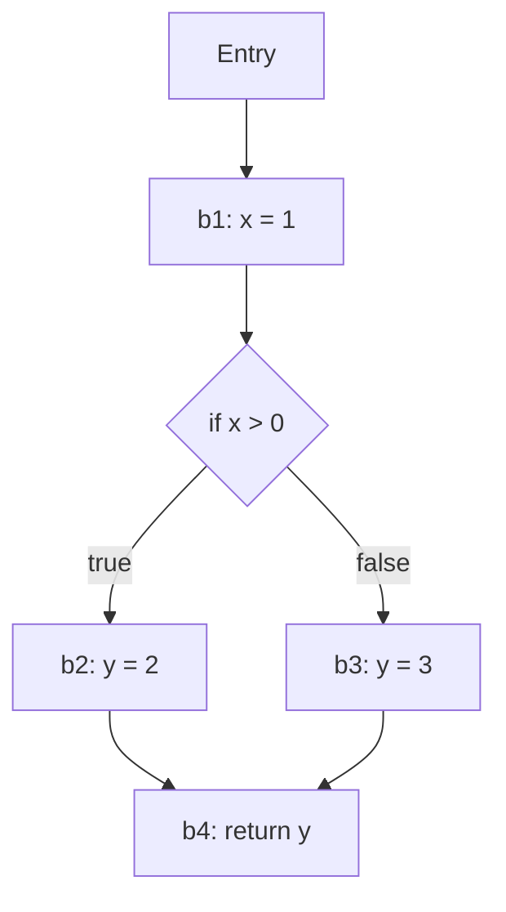

## 정의

컴파일러의 **백엔드** 는 semantic 분석까지 마친 AST 를 실제 실행 가능한 목표 코드로 변환합니다. 세 주요 단계:

1. **IR (Intermediate Representation) 생성**: AST → 중간 표현
2. **최적화**: IR 을 더 효율적인 IR 로 변환
3. **코드 생성**: IR → 목표 코드 (native, bytecode, WASM)

이 문서는 세 단계를 통합 소개합니다.

## 왜 IR 인가

AST 는 언어 특유의 구조. 그대로 다루면:
- 언어마다 다른 최적화 코드
- 아키텍처마다 다른 코드 생성

**IR** 은 **언어 독립 + 아키텍처 독립** 중간 지점:

```
[C 소스] ─┐              ┌─→ [x86 어셈블리]
[Rust]  ─┼─→ [LLVM IR] ─┼─→ [ARM 어셈블리]
[Swift] ─┘              └─→ [WASM]
```

**LLVM** 이 이 개념의 극한. LLVM IR 은 사실상 산업 표준.

## IR 종류

### 1. AST 자체

가장 원시. 처리 어려움. 트리 순회 인터프리터 급.

### 2. Three-Address Code (TAC)

각 명령이 최대 3개 피연산자 (source1, source2, destination):

```
t1 = a + b
t2 = t1 * c
t3 = t2 + 1
d = t3
```

원본:
```javascript
d = (a + b) * c + 1
```

**한 명령 = 한 연산**. 최적화하기 쉬움.

### 3. Static Single Assignment (SSA)

**각 변수는 정확히 한 번 할당**. 새 값은 새 변수 이름.

```
// 원본
x = 1
x = x + 1
x = x * 2

// SSA
x_1 = 1
x_2 = x_1 + 1
x_3 = x_2 * 2
```

### Phi 함수 (Φ)

분기 후 합류 시 어떤 정의를 선택:

```
if cond:
    x = 1        // x_1 = 1
else:
    x = 2        // x_2 = 2
y = x + 1        // x_3 = Φ(x_1, x_2); y_1 = x_3 + 1
```

`Φ(x_1, x_2)` = "실행 경로에 따라 x_1 또는 x_2".

### 왜 SSA 인가

- **Def-use chain 명확**: 각 변수 정의는 유일, 사용 곳 추적 쉬움
- **최적화 알고리즘 단순**: constant propagation, dead code elimination
- **Register allocation 개선**

**모든 현대 컴파일러**: LLVM, JVM (Hotspot C2), V8 Turbofan, GCC (GIMPLE) 가 SSA.

### 4. Control Flow Graph (CFG)

프로그램을 **기본 블록 (basic block)** 으로 나누고 분기를 간선으로:



**기본 블록**: 분기 없이 순차 실행되는 명령의 최대 시퀀스.

CFG 위에서 **data flow analysis** 수행.

### 5. LLVM IR

산업 표준 IR. 텍스트/바이너리 두 형식.

```llvm
define i32 @add(i32 %a, i32 %b) {
entry:
  %sum = add i32 %a, %b
  ret i32 %sum
}
```

- **Typed** (i32, i64, ptr)
- **SSA** (기본)
- **Portable** (아키텍처 독립)
- **Optimizer + Backend 도구 풍부**

## Optimization (최적화)

컴파일러의 각종 최적화 pass. 100+ 가지 존재.

### Constant Folding

```
x = 2 + 3
→
x = 5
```

컴파일 시 상수 표현 미리 계산.

### Constant Propagation

```
x = 5
y = x + 1
→
x = 5
y = 6
```

상수 값을 전파.

### Dead Code Elimination

```
x = 1
y = 2
z = x + 1
return z
```

`y` 는 사용 안 됨 → 제거:

```
x = 1
z = x + 1
return z
```

### Common Subexpression Elimination (CSE)

```
a = (x + y) * 2
b = (x + y) * 3
```

`x + y` 중복. 한 번만 계산:

```
t = x + y
a = t * 2
b = t * 3
```

### Function Inlining

```
function add(a, b) { return a + b; }
result = add(1, 2);

→ (inlined)

result = 1 + 2;  // 그 다음 constant folding → 3
```

작은 함수는 호출 오버헤드 제거 + 추가 최적화 활성.

### Loop Optimizations

- **Loop-invariant code motion**: 루프 안 불변식을 밖으로
- **Loop unrolling**: 반복 횟수 줄이고 iteration 확장
- **Strength reduction**: 곱셈 → 덧셈 (`i*4` → `i+i+i+i` 아니 `i<<2`)
- **Vectorization**: SIMD 명령 활용

### Tail Call Optimization

```
function factorial(n, acc=1) {
  if (n <= 1) return acc;
  return factorial(n - 1, n * acc);   // tail call
}
```

Tail call = 함수 마지막 액션이 함수 호출. 스택 프레임 재사용 가능 → 무한 재귀 없이 실행.

Scheme, Haskell 필수. JavaScript ES2015 스펙에는 있지만 실구현 미미.

### Escape Analysis

객체가 함수 밖으로 escape 안 하면 **스택 할당** (heap 대신):

```javascript
function foo() {
  const arr = [1, 2, 3];  // 함수 안에서만 사용 → stack alloc 가능
  return arr[0];
}
```

V8, JVM 이 활용.

## 실행 순서 (Pass Manager)

최적화들은 **순서** 대로 적용. 한 최적화가 다른 것을 활성:

```
1. Function inlining
2. Constant propagation
3. Dead code elimination
4. Common subexpression elimination
5. Loop invariant code motion
6. ... (반복)
```

각 pass 는 IR 을 읽고 새 IR 을 출력. 여러 번 실행하기도 (fixed-point).

## Code Generation

IR → 목표 코드.

### Register Allocation

CPU 는 유한한 **레지스터** (예: x86-64 는 16개 일반 레지스터). IR 은 무한 가상 레지스터 사용 → 물리 레지스터에 매핑.

**Graph Coloring**: interference graph 색칠 문제 (NP-hard, 근사).

**Linear Scan**: 빠른 근사, JIT 에 자주 사용.

Spilling: 레지스터 부족 시 메모리 (stack) 로.

### Instruction Selection

IR 명령 → 실제 CPU 명령.

- IR: `%c = mul %a, %b`
- x86: `imul %eax, %ebx, %ecx`
- ARM: `MUL R0, R1, R2`

**Tree matching**, **BURS (bottom-up rewriting)**.

### Instruction Scheduling

CPU 는 pipeline. 명령 순서 재배열로 stall 최소화. Superscalar 활용.

### Peephole Optimization

작은 명령 시퀀스를 더 나은 것으로:

```
MOV eax, 0    →    XOR eax, eax  (더 짧고 빠름)
```

## LLVM 파이프라인

```
Source (C, Rust, ...)
   ↓ (Language frontend)
LLVM IR
   ↓ (opt: optimization passes)
Optimized LLVM IR
   ↓ (llc: code generation)
Assembly
   ↓ (as: assembler)
Object file
   ↓ (ld: linker)
Executable
```

각 단계 도구화. 개별 실행/디버그 가능.

## 목표 코드 종류

### Native (기계어)

CPU 아키텍처별 (x86-64, ARM64, RISC-V, ...).

### Bytecode

VM 용 중간 코드 (JVM bytecode, .NET CIL, Python .pyc).

### WebAssembly (WASM)

브라우저용 저수준 VM. 여러 언어 대상 (C, C++, Rust, Go).

### Intermediate (LLVM IR, SPIR-V)

LLVM IR 자체를 목표로 배포 (Rust `no-std` 라이브러리 등).

### Transpiled (High-level)

다른 고급 언어. TypeScript → JavaScript, Kotlin → JS.

## 최적화의 한계

**Rice's Theorem** (계산 가능성 이론): 비자명한 프로그램 성질은 undecidable.

즉, 컴파일러는 **완벽한 최적화 불가**. 근사만 가능.

**보수적 근사**: "안전하지 않으면 최적화 안 함". 옳지 않은 최적화 > 아쉬운 최적화.

## 최적화 vs 가독성

컴파일러가 훌륭하다면 **가독성 우선**. 손으로 최적화 (loop unrolling 등) 는 대개 컴파일러가 이미 하거나 오히려 방해.

**예외**: 알고리즘 선택 (Big-O), 데이터 구조. 이건 컴파일러가 못 함.

## 함정

> [!WARNING]
> **최적화 = 항상 빠름 은 아님**. Inlining 은 코드 크기 폭발. Loop unrolling 은 캐시 miss. 프로파일링 우선.

> [!CAUTION]
> **-O0 (최적화 X)** 에서 잘 되던 코드가 -O3 에서 실패. UB (undefined behavior) 원인 (C/C++). Sanitizer 사용.

> [!WARNING]
> **JIT 는 옛 코드 무효화**. 가정 (타입, inline) 이 깨지면 deoptimize. 이 원인 이해가 hot path 튜닝의 핵심.

> [!IMPORTANT]
> **LLVM IR 이 표준**. 새 언어 만들 때 backend 재발명 X. LLVM 활용.

> [!CAUTION]
> **Register allocation 이 컴파일러 성능 큰 요인**. JIT 는 특히 speed vs quality trade-off.

## 관련 위키

- [[programming-language-theory|PLT 개요]]
- [[plt-lexical-analysis|Lexical Analysis]]
- [[plt-parsing|Parsing]]
- [[plt-abstract-syntax-tree|AST]]
- [[plt-semantic-analysis|Semantic Analysis]]
- [[plt-type-systems|Type Systems]]
- [[plt-interpreter-compiler|Interpreter vs Compiler]]
- [[js-bundling|JS 번들링]] - 실전 컴파일러 도구
