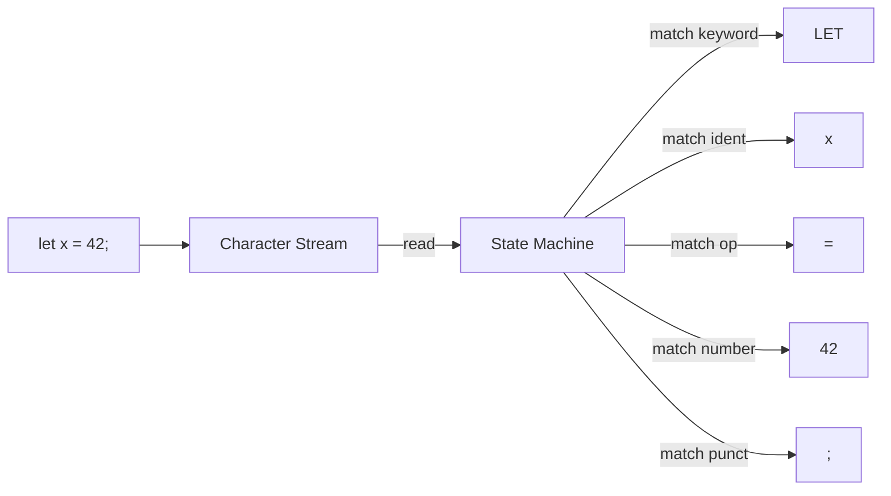

## 정의

**어휘 분석 (Lexical Analysis)** 은 소스 코드 **문자 시퀀스** 를 의미 있는 최소 단위인 **토큰 (Token)** 으로 분해하는 과정입니다. 담당 컴포넌트를 **Lexer (또는 Tokenizer, Scanner)** 라고 합니다.

**한 줄 요약**: 문자열을 프로그래밍 언어의 "단어" 로 자름.

## 왜 필요한가

파서가 매 문자를 다루면 매우 복잡합니다. 어휘 분석이 미리 **의미 없는 것 (공백, 주석) 제거** + **의미 있는 것 그룹핑** 하면 파서는 훨씬 단순.

## 토큰 (Token)

**의미 있는 최소 단위**. 예: JavaScript `let x = 42;` 를 lex 하면:

```
[LET]           value: "let"        type: keyword
[IDENTIFIER]    value: "x"          type: identifier
[EQUAL]         value: "="          type: operator
[NUMBER]        value: "42"         type: literal
[SEMICOLON]     value: ";"          type: punct
```

각 토큰:
- **Type** (Kind): 카테고리
- **Value / Lexeme**: 원본 문자열
- **Location**: 파일/줄/열 (에러 메시지용)

## 토큰 카테고리

일반적 언어의 토큰 유형:

- **Keyword**: `if`, `else`, `while`, `let`, `const`, `function` (예약어)
- **Identifier**: 변수/함수 이름 (`x`, `myFunc`)
- **Literal**: 값
  - Number: `42`, `3.14`, `0xFF`
  - String: `"hello"`, `'world'`
  - Boolean: `true`, `false`
  - Null: `null`
- **Operator**: `+`, `-`, `*`, `==`, `&&`, `<=`
- **Punctuation**: `(`, `)`, `{`, `}`, `;`, `,`
- **Whitespace / Comment**: 대개 건너뜀 (일부 언어는 유의미)

## 정규 표현식과 토큰 정의

각 토큰 유형은 **정규 표현식** 으로 정의:

```
NUMBER      = [0-9]+ (\.[0-9]+)?
IDENTIFIER  = [a-zA-Z_][a-zA-Z0-9_]*
KEYWORD_IF  = "if"
OPERATOR_EQ = "=="
STRING      = "[^"]*"
```

**중요**: 규칙 순서. `if` 는 identifier 패턴에도 매치 → keyword 먼저 확인.

## Longest Match Rule

여러 규칙이 매치 시 **가장 긴 매치** 선택.

```
== 는 [EQUAL_EQUAL] (2 문자) vs [EQUAL][EQUAL] (1 문자씩)
→ 항상 longest = [EQUAL_EQUAL]
```

`<=` vs `<`, `**` vs `*` 등.

## 시각화: Lexer 흐름



## 유한 오토마타 (Finite Automata)

정규 표현식은 **유한 상태 머신** 으로 구현.

### DFA (Deterministic Finite Automaton)

각 상태에서 각 입력에 대해 **유일한** 다음 상태.

**예**: 정수 인식 DFA

```
     [0-9]         [0-9]
State 0 ─────> State 1 <─┐
  (start)      (accept)  │
                └────────┘
```

- Start (0): 첫 숫자 도착 시 State 1 로
- State 1 (accept): 계속 숫자 소비, 아니면 종료

### NFA (Nondeterministic Finite Automaton)

한 상태에서 여러 다음 상태 가능. **정규 표현식 → NFA 는 자연스러움**.

NFA → DFA 변환 알고리즘 (subset construction) 이 존재.

### 실전

컴파일러 구현 시:
- **수동 구현**: 상태를 switch 문으로. Crafting Interpreters, 대부분 프로덕션 컴파일러.
- **자동 생성**: Lex/Flex 가 정규식 → C 코드 생성. Legacy.

**대부분 현대 컴파일러는 수동 lexer** (에러 메시지, 성능, 유연성 이유).

## 실전 Lexer 구현 (의사코드)

```text
function lex(source):
    tokens = []
    pos = 0
    while pos < len(source):
        char = source[pos]

        if char is whitespace:
            pos += 1
            continue

        if char is '/' and source[pos+1] is '/':
            # line comment
            while pos < len(source) and source[pos] != '\n':
                pos += 1
            continue

        if char is digit:
            start = pos
            while pos < len(source) and source[pos] is digit:
                pos += 1
            tokens.append(Token(NUMBER, source[start:pos]))
            continue

        if char is letter or '_':
            start = pos
            while pos < len(source) and (source[pos] is letter/digit/_):
                pos += 1
            lexeme = source[start:pos]
            if lexeme in KEYWORDS:
                tokens.append(Token(KEYWORDS[lexeme], lexeme))
            else:
                tokens.append(Token(IDENTIFIER, lexeme))
            continue

        if char is '"':
            # string literal
            pos += 1
            start = pos
            while pos < len(source) and source[pos] != '"':
                pos += 1
            tokens.append(Token(STRING, source[start:pos]))
            pos += 1   # skip closing quote
            continue

        if char is operator:
            # ==, !=, <=, etc.
            if source[pos:pos+2] in TWO_CHAR_OPS:
                tokens.append(Token(TWO_CHAR_OPS[source[pos:pos+2]], source[pos:pos+2]))
                pos += 2
            else:
                tokens.append(Token(ONE_CHAR_OPS[char], char))
                pos += 1
            continue

        raise LexError(f"Unknown character: {char}")

    tokens.append(Token(EOF, ""))
    return tokens
```

**핵심 패턴**:
- Position pointer 로 문자열 순회
- 각 상태별 while 로 매치
- Longest match 자연스럽게 구현

## 에러 처리

Lexer 오류:
- 알 수 없는 문자
- 종료되지 않은 문자열 (`"hello`)
- 종료되지 않은 주석 (`/* ...`)
- 잘못된 숫자 형식 (`3.14.15`)

**전략**:
- 즉시 실패 (초기 예)
- 에러 토큰 생성 후 계속 (파서에서 recovery)

**좋은 에러 메시지**:
```
error: unterminated string literal
  --> src/main.rs:3:15
   |
 3 |     let x = "hello
   |             ^ expected closing quote
```

파일/줄/열 정보를 토큰마다 저장.

## Special Cases

### Whitespace-Significant Languages

Python, Haskell, YAML 은 들여쓰기가 의미 있음. Lexer 가 **INDENT / DEDENT 토큰** 생성:

```
def foo():
    x = 1        ← INDENT
    if x:
        y = 2    ← INDENT
    z = 3        ← DEDENT
                 ← DEDENT
```

### Template Literals (JS/TS)

`` `hello ${name}` `` 는 lexer 가 특수 처리. 문자열 안에 표현식 삽입.

### 다국어 지원

Unicode identifier. 이모지 변수 (`💰 = 100`). 언어 스펙에 따라.

## 유명 언어의 Lexer

- **JavaScript**: [ECMAScript 스펙](https://tc39.es/ecma262/#sec-ecmascript-language-lexical-grammar) 에 정의된 문법. V8, SpiderMonkey 등이 각자 구현.
- **Python**: `tokenize` 모듈로 노출.
- **Rust**: `rustc_lexer` crate.
- **TypeScript**: TS 컴파일러의 scanner.ts.

## 도구

- **Lex / Flex** (C): 정규식 → C lexer. Legacy.
- **ANTLR**: 파서 생성기 (lexer 포함), Java 기반.
- **Rply, PLY** (Python): 옛 방식.
- **Chumsky, Pest** (Rust): parser combinator.

**대부분 현대 컴파일러는 수동 lexer**. 유연성, 성능, 에러 메시지.

## 함정

> [!WARNING]
> **Longest match** 잘못 구현하면 `==` 이 `=`, `=` 두 개로.

> [!CAUTION]
> **Keyword 를 identifier 로**. `if` 를 identifier 처리하면 파서가 이상해짐. Keyword 먼저 매치.

> [!WARNING]
> **위치 정보 저장 잊음**. 에러 메시지에 line/col 없으면 UX 최악.

> [!IMPORTANT]
> **Lookahead**. `==` 인지 확인하려면 다음 문자 미리 봄. 1-2 문자 lookahead 흔함.

## 관련 위키

- [[programming-language-theory|PLT 개요]]
- [[plt-parsing|Parsing & Grammars]]
- [[plt-abstract-syntax-tree|AST]]
- [[js-regex|JavaScript Regex]] - 정규식 배경
- [[discrete-mathematics|이산수학]] - 오토마타 이론
