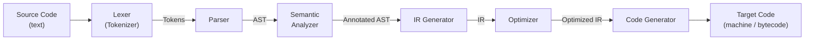
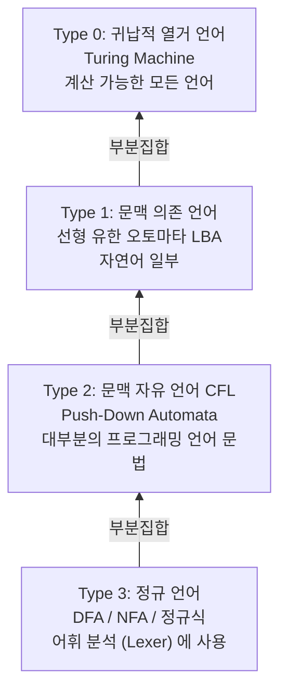

## 정의

**프로그래밍 언어론 (Programming Language Theory, PLT)** 은 프로그래밍 언어를 **어떻게 설계하고, 정의하고, 처리하는가** 를 다루는 컴퓨터 과학 분야입니다.

크게 두 갈래:
- **언어 설계 (Language Design)**: 문법, 의미론, 타입 시스템
- **언어 구현 (Language Implementation)**: 어휘 분석, 파싱, 의미 분석, 최적화, 코드 생성

컴퓨터가 소스 코드를 이해하고 실행하는 **모든 단계** 를 이론적으로 뒷받침합니다.

## 왜 배워야 하는가

프로그래머는 매일 언어를 사용합니다. 하지만 이 언어가 **어떻게 작동하는지** 이해하지 않으면:

- 컴파일 오류 메시지 해석 어려움
- 타입 시스템의 제약 이유를 모름
- 왜 특정 코드가 느린지 (컴파일러 최적화 이슈)
- 새 언어를 배울 때 표면적 문법만 익힘

PLT 를 알면:
- **디버깅 능력 향상**: "왜 이 오류가?"
- **성능 튜닝**: 컴파일러가 뭘 최적화하고 뭘 못 하는지
- **DSL 구축**: 자체 언어 만들 수 있음
- **정적 분석 도구 개발**: 린터, 포매터, 리팩터링 도구
- **언어 선택 판단**: Rust vs Go 의 근본 차이

## 언어 처리기의 큰 그림

**컴파일러/인터프리터** 는 소스 코드를 다음 파이프라인으로 처리합니다.



각 단계:
1. **Lexer**: 문자열을 **토큰** (의미 있는 최소 단위) 으로 분해
2. **Parser**: 토큰을 **AST (Abstract Syntax Tree)** 로 조립
3. **Semantic Analyzer**: 이름 해석, 타입 검사, scope 결정
4. **IR Generator**: 플랫폼 독립 중간 표현
5. **Optimizer**: 성능 개선 (죽은 코드 제거, 인라인 등)
6. **Code Generator**: 목표 (x86 어셈블리, JVM 바이트코드, WASM 등)

## Frontend vs Backend

전통적으로 컴파일러를 두 부분으로 나눔:

- **Frontend**: Source → AST → IR (**언어 의존**)
- **Backend**: IR → Target Code (**하드웨어 의존**)

**LLVM** 은 이 분리를 극한으로: 각 언어는 LLVM IR 을 생성만 하면, LLVM 이 x86, ARM, WASM, RISC-V 등 다양한 백엔드 지원.

## Compiler vs Interpreter

두 접근법이 있습니다.

- **컴파일러**: 소스 → 목표 코드 (실행 파일). 한 번 컴파일, 여러 번 실행.
- **인터프리터**: 소스 → 즉시 실행. AST 를 순회하며 실행.

**혼합** (Modern):
- **JIT (Just-In-Time)**: 실행 중 자주 쓰이는 부분만 컴파일 (V8, HotSpot, LuaJIT, PyPy)
- **AOT (Ahead-Of-Time)**: 사전 컴파일 (Java native image, Rust)
- **Bytecode + VM**: 중간 형태 (JVM, .NET, CPython)

자세한 것은 [[plt-interpreter-compiler|Interpreter vs Compiler]] 참조.

## 주요 학습 주제

이 코스가 다루는 순서:

### 1. Lexical Analysis (어휘 분석)

문자열을 **토큰** 으로 분해. 정규 표현식, 유한 오토마타 (DFA/NFA).

→ [[plt-lexical-analysis|Lexical Analysis]]

### 2. Parsing (구문 분석)

토큰을 **문법 규칙 (grammar)** 에 따라 AST 로. Top-down (LL, recursive descent) vs Bottom-up (LR, LALR).

→ [[plt-parsing|Parsing & Grammars]]

### 3. Abstract Syntax Tree

프로그램의 **본질 구조** 를 트리로. 코드 → AST → 실행/변환/분석.

→ [[plt-abstract-syntax-tree|AST]]

### 4. Semantic Analysis

**이름 해석, scope, 타입 검사**. AST 의 각 노드에 "무엇을 가리키는지" 주석.

→ [[plt-semantic-analysis|Semantic Analysis]]

### 5. Type Systems

**정적 vs 동적, sound vs unsound, 타입 추론**. 언어 안전성의 근간.

→ [[plt-type-systems|Type Systems]]

### 6. Interpreter vs Compiler

두 실행 모델의 근본 차이. 각 접근법의 트레이드오프.

→ [[plt-interpreter-compiler|Interpreter vs Compiler]]

### 7. IR + 최적화 + 코드 생성

컴파일러 **백엔드**. 3-address code, SSA, dead code elimination, register allocation.

→ [[plt-ir-optimization-codegen|IR, 최적화, 코드 생성]]

## 이론 vs 실전

이 코스는 **실전 언어 구현** 관점. 하지만 배경 이론도 관련:

- **형식 언어 이론**: Chomsky 위계 (Regular, CFG, CSG, Recursive)
- **오토마타 이론**: DFA, NFA, PDA, Turing Machine
- **람다 계산법**: 함수형 언어 근본
- **타입 이론**: Hindley-Milner, System F, Dependent Types
- **의미론 (Semantics)**: Operational, Denotational, Axiomatic

이론에 관심 있으면 **Pierce, Types and Programming Languages** 부터.

## 형식 언어 계층 (Chomsky Hierarchy)

프로그래밍 언어의 이론적 토대는 **Chomsky 위계** 다. 계층마다 표현력과 인식 오토마타가 다르다.



실전 연관:
- **어휘 분석**: 정규 언어 (Type 3). 정규식이나 DFA 로 토큰 인식.
- **구문 분석**: 문맥 자유 언어 (Type 2). LL, LR 파서가 CFG 를 처리.
- **의미 분석**: CFG 를 벗어난 규칙 (같은 타입 변수 선언 등) 은 별도 통과.
- C++ / Rust 의 일부 구문은 CFG 의 표현 한계를 벗어나 파서가 의미 정보를 참조.

## 파서 기법 선택

| 기법 | 방향 | 특징 | 사용 예 |
|:---|:---:|:---|:---|
| LL(1) | Top-down | 예측 파싱, 왼쪽 재귀 금지 | 교육용 |
| Recursive Descent | Top-down | 손으로 작성, 에러 메시지 우수 | Rust, Go, TypeScript |
| LALR(1) | Bottom-up | 파서 생성기 (yacc/bison) | 구형 컴파일러 |
| Pratt Parser | Top-down | 중위 연산자 우선순위 처리 탁월 | 실전 언어 구현 |
| PEG / Packrat | Top-down | 백트래킹, 결정적 | pest, PEGN |

현대 컴파일러 (Clang, Rust, Go, TypeScript) 는 대부분 **hand-written recursive descent** 채택. 에러 메시지 품질과 IDE 지원 (incremental parsing) 때문.

## 명작 자료

- **Crafting Interpreters** (Robert Nystrom, 무료 웹): 실전 인터프리터 구현. **최고 입문서**.
- **Dragon Book** (Aho et al.): 정통 교과서. 두꺼움.
- **Engineering a Compiler** (Cooper & Torczon): 현대 관점.
- **Programming Language Pragmatics** (Scott): 언어 설계 관점.
- **TAPL** (Pierce): 타입 이론.
- **PLAI** (Krishnamurthi, 무료 온라인): 함수형 관점.

## 실전 언어 만들기

이 코스를 마치면 다음 프로젝트를 스스로 할 수 있어야:

- **작은 인터프리터** (calculator, Lisp subset)
- **트리 순회 인터프리터**
- **바이트코드 VM**
- **간단한 컴파일러** (자체 문법 → LLVM IR 또는 C)
- **DSL** (config 언어, query 언어)
- **정적 분석 도구** (린터, 포매터)

## 컴퓨터 과학 응용

PLT 지식이 쓰이는 곳:

- **컴파일러 / 트랜스파일러**: gcc, clang, Babel, TypeScript, SWC
- **인터프리터**: Python, Ruby, Lua
- **VM**: JVM, V8, .NET CLR
- **JIT**: V8 TurboFan, LLVM ORC, PyPy, LuaJIT
- **정적 분석**: ESLint, mypy, Clippy, Sonar
- **IDE**: Language Server Protocol, 자동완성, 리팩터링
- **DSL**: SQL, GraphQL, HTML, CSS, regex
- **템플릿 엔진**: Handlebars, Jinja2
- **쿼리 옵티마이저**: SQL query planner
- **정규식 엔진**
- **암호화 회로**: 형식 검증
- **AI**: 코드 생성 LLM 이 AST 활용

## 실전 도구와 언어 처리기

PLT 지식이 직접 들어가는 실전 도구 분류:

| 도구 / 프레임워크 | 언어 | 관련 PLT 개념 |
|:---|:---:|:---|
| Babel / SWC | JS | AST 변환 트랜스파일러 |
| TypeScript | TS | 타입 시스템, 타입 추론, 타입 체킹 |
| ESLint / Clippy | JS / Rust | 정적 분석, 패턴 매칭 on AST |
| LLVM | 다언어 | IR, 최적화 패스, 코드 생성 |
| Tree-sitter | 다언어 | 증분 파서, IDE 심볼 추출 |
| ANTLR | 다언어 | LL(*) 파서 생성기 |
| Cranelift | Rust | JIT 백엔드 (Wasmtime, Cranelift) |

### Babel AST 변환 예시

JSX 를 일반 JS 함수 호출로 변환하는 것이 Babel 트랜스파일의 핵심:

```
// 입력 (JSX)
<Button onClick={fn}>Click</Button>

// AST 변환 후 출력
React.createElement(Button, { onClick: fn }, "Click")
```

Babel 은:
1. 소스를 파싱 → AST (parser: `@babel/parser`)
2. 플러그인 체인에서 AST visitor 로 노드 변환
3. 변환된 AST → 코드 생성 (`@babel/generator`)

이 파이프라인이 PLT 컴파일러 프론트엔드와 완전히 동일한 구조다.

### 오토마타와 실전 연결

| 오토마타 | 실전 |
|:---|:---|
| DFA | Lexer 토큰 인식, 정규식 엔진 |
| PDA | CFG 파서 (LL, LR) |
| Turing Machine | 범용 계산, 정지 문제 |

Lex (flex) 는 정규식 → DFA 변환으로 빠른 lexer 생성. Yacc/bison 은 LALR(1) 파서 테이블 생성.

## 함정

> [!WARNING]
> **이론만 배우고 구현 안 하면 잊음**. 반드시 작은 언어를 직접 구현해봐야.

> [!CAUTION]
> **Dragon Book 부터 시작하면 좌절**. 두껍고 오래됨. Crafting Interpreters 로 시작.

> [!WARNING]
> **파서 생성기 만능 아님**. yacc/bison 이 옛 관용, 요즘은 hand-written recursive descent 가 더 흔함 (에러 메시지 우수).

> [!IMPORTANT]
> **최신 언어는 표준 파이프라인을 따르지 않음**. Rust 는 여러 pass, Swift 는 별도 SIL, Go 는 매우 단순. 원리 이해 후 각 언어 특성.

## 관련 위키

- [[plt-lexical-analysis|Lexical Analysis]]
- [[plt-parsing|Parsing & Grammars]]
- [[plt-abstract-syntax-tree|Abstract Syntax Tree]]
- [[plt-semantic-analysis|Semantic Analysis]]
- [[plt-type-systems|Type Systems]]
- [[plt-interpreter-compiler|Interpreter vs Compiler]]
- [[plt-ir-optimization-codegen|IR, 최적화, 코드 생성]]
- [[discrete-mathematics|이산수학]] - 형식 언어 기초
- [[typescript|TypeScript]] - 실전 타입 시스템
- [[js-bundling|JS 번들링]] - 컴파일러 실전
