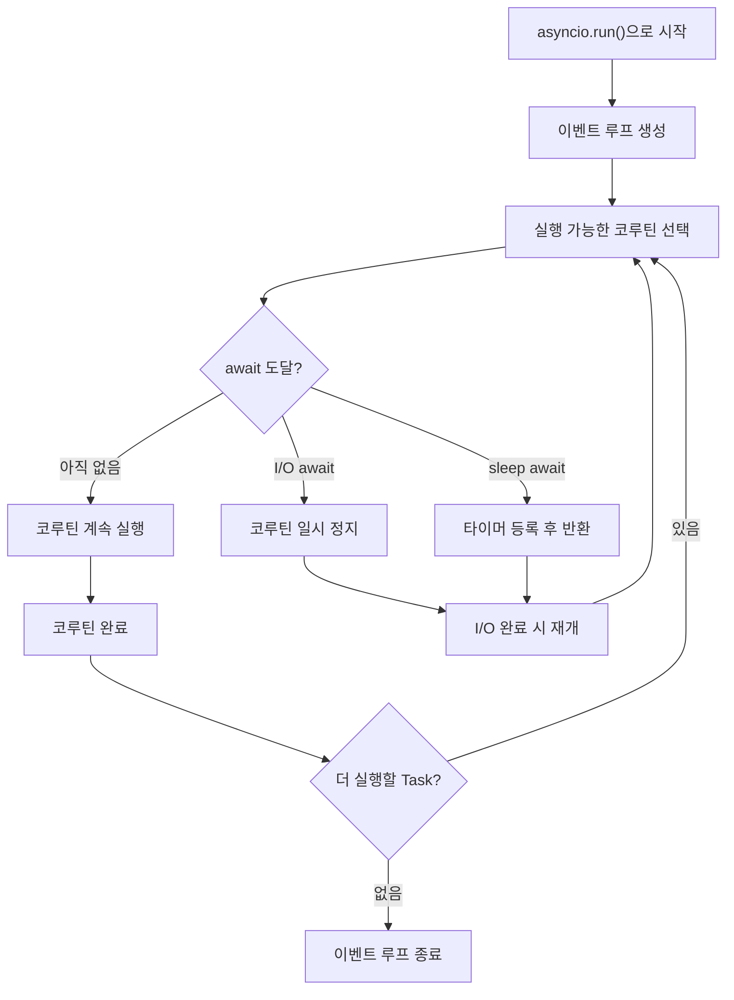
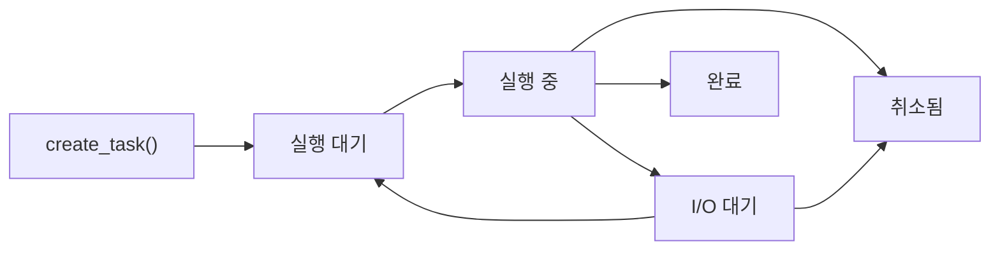

## 정의

**asyncio** 는 Python 의 표준 비동기 I/O 라이브러리 (3.4+). **event loop** 위에서 **coroutine** 을 스케줄링. `async def` 로 정의한 함수가 코루틴이 되고, `await` 키워드로 제어권을 이벤트 루프에 돌려준다.

단일 스레드이지만 I/O 대기 중 다른 코루틴을 실행해 높은 동시성을 달성한다. CPU 집약적 작업에는 적합하지 않다.

## 사용 상황

| 상황 | asyncio | 대안 |
|:---|:---:|:---|
| 네트워크 요청 다수 병렬 처리 | ✅ | - |
| DB 쿼리 동시 실행 | ✅ | - |
| WebSocket / 스트리밍 서버 | ✅ | - |
| CPU 집약 계산 | ❌ | [[py-multiprocessing]] |
| 블로킹 파일 I/O | 주의 | aiofiles 또는 executor |
| 스레드 기반 동시성 | 선택 | [[py-threading]] |

## 이벤트 루프 메커니즘



핵심: 이벤트 루프는 단일 스레드. 코루틴은 `await` 지점에서만 제어권을 넘긴다. 블로킹 호출이 하나라도 있으면 전체 루프가 멈춘다.

## 기본

```python
import asyncio

async def fetch(url):
    await asyncio.sleep(1)
    return f"result for {url}"

async def main():
    result = await fetch("https://example.com")
    print(result)

asyncio.run(main())
```

`asyncio.run()` 은 새 이벤트 루프를 만들고, 전달한 코루틴이 끝나면 루프를 닫는다. 프로그램 진입점에서 한 번만 호출해야 한다.

## 병렬 실행

### gather

```python
async def main():
    results = await asyncio.gather(
        fetch("url1"),
        fetch("url2"),
        fetch("url3"),
    )
    # results = [res1, res2, res3]
```

세 요청이 병렬 실행. 결과 순서는 인자 순서와 동일. 하나가 예외를 던지면 다른 Task 는 취소되지 않는다 (`return_exceptions=True` 옵션으로 예외를 결과에 포함 가능).

### as_completed

```python
async def main():
    tasks = [fetch(u) for u in urls]
    for future in asyncio.as_completed(tasks):
        result = await future
        print(result)  # 완료된 순서
```

완료 순서가 중요할 때 사용.

## Task 생성과 생명주기



```python
task = asyncio.create_task(fetch(url))
# ...다른 일...
result = await task
```

`create_task` 는 즉시 이벤트 루프에 등록해 백그라운드 실행. `await` 는 필요할 때 결과 수집. Task 를 `await` 하지 않으면 예외가 무시되어 디버깅이 어렵다.

## Semaphore 로 동시 실행 제한

외부 API 요청 수 제한 등에 활용.

```python
sem = asyncio.Semaphore(10)

async def limited_fetch(url):
    async with sem:
        return await fetch(url)

async def main():
    await asyncio.gather(*[limited_fetch(u) for u in urls])
```

## async context manager

`async with` 는 동기 `with` 의 비동기 버전. `__aenter__` / `__aexit__` 프로토콜.

```python
import aiofiles

async def write_file(path, data):
    async with aiofiles.open(path, 'w') as f:
        await f.write(data)
```

직접 구현:

```python
class AsyncDB:
    async def __aenter__(self):
        self.conn = await connect()
        return self.conn

    async def __aexit__(self, exc_type, exc, tb):
        await self.conn.close()

async def main():
    async with AsyncDB() as conn:
        await conn.execute("SELECT 1")
```

`contextlib.asynccontextmanager` 를 사용하면 더 간단하다.

```python
from contextlib import asynccontextmanager

@asynccontextmanager
async def managed_resource():
    resource = await acquire()
    try:
        yield resource
    finally:
        await release(resource)
```

자세히는 [[py-context-manager]] 참고.

## asyncio.timeout / wait_for

```python
# wait_for (3.4+)
try:
    result = await asyncio.wait_for(fetch(url), timeout=5.0)
except asyncio.TimeoutError:
    print("timed out")

# timeout context manager (3.11+)
try:
    async with asyncio.timeout(5.0):
        result = await fetch(url)
except asyncio.TimeoutError:
    print("timed out")
```

## TaskGroup (Python 3.11+)

```python
async def main():
    async with asyncio.TaskGroup() as tg:
        task1 = tg.create_task(fetch("url1"))
        task2 = tg.create_task(fetch("url2"))
    # 블록 종료 시 모두 완료됨
    # 하나가 실패하면 나머지도 취소되고 ExceptionGroup 발생
    print(task1.result(), task2.result())
```

`gather` 보다 구조화된 취소 처리. 하나가 실패하면 나머지도 정리된다. Python 3.11+ 에서 권장.

## asyncio.Queue

코루틴 간 안전한 데이터 전달 (스레드 safe 불필요).

```python
async def producer(queue: asyncio.Queue):
    for i in range(5):
        await queue.put(i)
    await queue.put(None)  # 종료 신호

async def consumer(queue: asyncio.Queue):
    while True:
        item = await queue.get()
        if item is None:
            break
        print(f"consumed: {item}")
        queue.task_done()

async def main():
    q = asyncio.Queue(maxsize=3)
    await asyncio.gather(producer(q), consumer(q))
```

## 취소 처리

```python
async def long_task():
    try:
        await asyncio.sleep(100)
    except asyncio.CancelledError:
        print("취소됨, 정리 작업 실행")
        raise  # 반드시 재전파

async def main():
    task = asyncio.create_task(long_task())
    await asyncio.sleep(1)
    task.cancel()
    try:
        await task
    except asyncio.CancelledError:
        print("태스크 취소 완료")
```

> [!WARNING]
> `CancelledError` 를 삼켜버리면 Task 가 취소된 것처럼 보이지 않아 TaskGroup / gather 취소 체인이 망가진다. **반드시 재전파**.

## run_in_executor: 블로킹 코드 연동

```python
import asyncio
from concurrent.futures import ThreadPoolExecutor

executor = ThreadPoolExecutor(max_workers=4)

async def main():
    loop = asyncio.get_event_loop()
    # 블로킹 함수를 스레드 풀에서 실행
    result = await loop.run_in_executor(executor, blocking_function, arg1)
```

`requests.get()`, `time.sleep()`, 동기 DB 드라이버 등 교체 불가능한 블로킹 함수에 사용.

## 함정

- **동기 코드 블로킹**: `time.sleep()` 대신 `await asyncio.sleep()`. 다른 블로킹 함수는 `run_in_executor` 로.
- **event loop 하나**: `asyncio.run()` 을 중첩하면 안 됨. Jupyter 는 이미 loop 있어서 `nest_asyncio` 또는 `await` 직접 사용 필요.
- **취소 처리**: `asyncio.CancelledError` 반드시 전파.
- **Task 미 await**: `create_task` 후 `await` 하지 않으면 예외가 `Task exception was never retrieved` 경고로만 남는다.
- **`gather` vs `TaskGroup`**: Python 3.11+ 에서는 구조화된 취소가 필요할 때 `TaskGroup` 선호.
- **블로킹 I/O 혼용**: `open()`, `requests.get()` 같은 동기 I/O 는 이벤트 루프를 블로킹. 비동기 라이브러리 사용 필수.

## 실전 라이브러리

| 라이브러리 | 용도 |
|:---|:---|
| **aiohttp** | HTTP client / server |
| **asyncpg** | PostgreSQL (고성능) |
| **motor** | MongoDB |
| **httpx** | HTTP client (sync/async 모두 지원) |
| **FastAPI** | 웹 프레임워크 |
| **Starlette** | FastAPI 기반 ASGI 프레임워크 |
| **aiofiles** | 비동기 파일 I/O |
| **redis.asyncio** | Redis 비동기 클라이언트 |

## 관련 위키

- [[py-asyncio]] - 이벤트 루프 및 async/await 개요
- [[py-async-generator]] - 비동기 제너레이터 (`async for`)
- [[py-context-manager]] - async context manager 프로토콜
- [[py-concurrent-futures]] - ThreadPoolExecutor / ProcessPoolExecutor 연계
- [[py-threading]] - 스레드 기반 동시성과 비교
- [[py-gil]] - GIL 과 asyncio 의 관계
- [[py-contextvars]] - 비동기 컨텍스트 변수 전파
- [[js-async-await|JS async/await 비교]]
