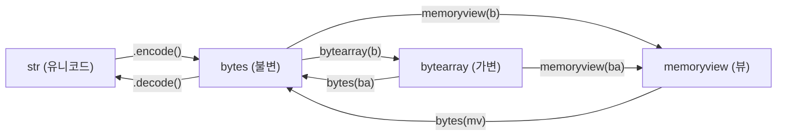

## 정의

Python에서 **바이너리 데이터**는 세 가지 타입으로 다룬다.

- **`bytes`**: 불변 바이트 시퀀스. 0~255 정수의 immutable 배열.
- **`bytearray`**: 가변 바이트 시퀀스. `bytes`의 mutable 형제.
- **`memoryview`**: 다른 객체의 메모리 버퍼를 복사 없이 보는 뷰.

## bytes 리터럴

```python
b1 = b"hello"               # ASCII
b2 = b"\\x00\\xff\\x7f"     # 16진 이스케이프
b3 = b"\\n\\t"              # 제어 문자
b4 = bytes([72, 101, 108, 108, 111])   # 정수 시퀀스
b5 = bytes(5)               # b'\\x00\\x00\\x00\\x00\\x00' (영바이트)

# 비ASCII 문자는 안됨: b"안녕"은 SyntaxError
```

## str과 bytes 변환

문자열은 추상 유니코드, bytes는 실제 바이트. 변환에는 **인코딩**이 필요하다.

<CodeWithOutput
  language="python"
  outputLanguage="text"
  code={`s = "안녕 hello"
b = s.encode("utf-8")
print(b)

back = b.decode("utf-8")
print(back)

# 인코딩 미지정시 기본은 utf-8 (Python 3)
print("café".encode())`}
  output={`b'\\xec\\x95\\x88\\xeb\\x85\\x95 hello'
안녕 hello
b'caf\\xc3\\xa9'`}
/>

잘못된 인코딩 시 `UnicodeDecodeError`. `errors=` 인자로 처리 전략 지정.

```python
b = b"\\xff\\xfe"
b.decode("utf-8")                          # UnicodeDecodeError
b.decode("utf-8", errors="ignore")         # ""
b.decode("utf-8", errors="replace")        # "\ufffd\ufffd"
```

## bytes 메서드

str과 거의 같은 메서드를 갖는다 (split, replace, startswith 등).

<CodeWithOutput
  language="python"
  outputLanguage="text"
  code={`b = b"hello world"
print(b.upper())
print(b.split(b" "))
print(b.replace(b"world", b"python"))
print(b.find(b"world"))
print(b[6:])`}
  output={`b'HELLO WORLD'
[b'hello', b'world']
b'hello python'
6
b'world'`}
/>

**중요**: bytes 메서드 인자도 bytes여야 한다. `b.find("world")`는 TypeError.

## bytearray: 가변 버전

```python
ba = bytearray(b"hello")
ba[0] = 72                      # OK (정수 할당)
ba.append(33)                   # b'Hello!' 끝에 !
ba.extend(b" world")
print(ba)                       # bytearray(b'Hello! world')

# bytes로 변환
b = bytes(ba)
```

대용량 바이너리 처리 시 `bytes` 연결 반복(`b1 + b2`)은 매번 새 객체 생성으로 느리다. `bytearray.extend()` 또는 `io.BytesIO`를 사용.

```python
from io import BytesIO
buf = BytesIO()
for chunk in chunks:
    buf.write(chunk)
data = buf.getvalue()
```

## 인덱싱 함정

bytes의 단일 인덱싱은 **정수**를 반환한다. 슬라이싱은 bytes를 반환.

<CodeWithOutput
  language="python"
  outputLanguage="text"
  code={`b = b"abc"
print(b[0])      # 97 (int!)
print(b[0:1])    # b'a' (bytes)
print(type(b[0]), type(b[0:1]))`}
  output={`97
b'a'
<class 'int'> <class 'bytes'>`}
/>

C/Go의 byte slice와 다른 점. `b[0] == "a"`는 False, `b[0] == ord("a")`는 True.

## 16진/Base64 변환

```python
b = b"hello"

b.hex()              # '68656c6c6f'
bytes.fromhex("68656c6c6f")    # b'hello'

import base64
base64.b64encode(b)              # b'aGVsbG8='
base64.b64decode(b"aGVsbG8=")    # b'hello'
```

## struct: 바이너리 포맷 변환

C 구조체 같은 고정 포맷 직렬화.

<CodeWithOutput
  language="python"
  outputLanguage="text"
  code={`import struct

# little-endian: int32, float32, char
packed = struct.pack("<ifc", 42, 3.14, b"X")
print(packed)
print(packed.hex())

unpacked = struct.unpack("<ifc", packed)
print(unpacked)`}
  output={`b'*\\x00\\x00\\x00\\xc3\\xf5H@X'
2a000000c3f54840 58
(42, 3.140000104904175, b'X')`}
/>

포맷 코드: `i`=int32, `q`=int64, `f`=float32, `d`=double, `s`=char[n]. `<`=little-endian, `>`=big-endian.

## memoryview: 복사 없는 뷰

큰 bytes/bytearray의 일부를 잘라 다른 함수에 넘길 때 `b[100:200]`은 복사를 만든다. `memoryview(b)[100:200]`은 복사 없이 뷰만.

<CodeWithOutput
  language="python"
  outputLanguage="text"
  code={`data = bytearray(b"hello world")
mv = memoryview(data)

# 슬라이스 = 뷰 (복사 X)
slice_view = mv[6:11]
print(bytes(slice_view))

# 원본 변경이 뷰에도 반영
data[6] = ord("W")
print(bytes(slice_view))`}
  output={`b'world'
b'World'`}
/>

대용량 네트워크 버퍼·파일 처리에서 메모리 절감에 유용.

## 언제 무엇을 쓰나

| 용도 | 선택 |
|------|------|
| 네트워크 페이로드, 파일 읽기 | `bytes` |
| 인코딩 후 변경 필요 | `bytearray` |
| 큰 버퍼의 일부만 처리 | `memoryview` |
| C 구조체 ↔ 바이트 변환 | `struct` |
| 수치 배열, 산술 연산 | `numpy.ndarray` |
| 이미지/오디오 | `bytes` + 라이브러리 (Pillow, soundfile) |

## 타입 관계



## 성능 고려사항

### bytes 연결 반복은 느리다

```python
# 나쁜 예: O(n^2) - 매번 새 객체 생성
result = b""
for chunk in chunks:
    result += chunk

# 좋은 예 1: bytearray
result = bytearray()
for chunk in chunks:
    result.extend(chunk)
final = bytes(result)

# 좋은 예 2: join
final = b"".join(chunks)
```

### memoryview 슬라이싱 vs bytes 슬라이싱

대용량 데이터를 여러 chunk 로 나눌 때 `b[1000:2000]` 은 복사 발생.
`memoryview(b)[1000:2000]` 은 복사 없이 뷰만 반환해 메모리를 아낀다.

```python
from io import BytesIO

# 스트림 방식: 대용량 파일 분할 전송
def chunked_read(path: str, chunk_size: int = 65536):
    with open(path, "rb") as f:
        while chunk := f.read(chunk_size):
            yield chunk
```

## 실용 패턴

### 네트워크 프로토콜 파싱

```python
import struct

def parse_packet(data: bytes) -> dict:
    # 헤더: version(1B), type(1B), length(2B big-endian), checksum(4B)
    header_fmt = ">BBHi"
    header_size = struct.calcsize(header_fmt)
    version, ptype, length, checksum = struct.unpack(
        header_fmt, data[:header_size]
    )
    payload = data[header_size : header_size + length]
    return {
        "version": version,
        "type": ptype,
        "payload": payload,
        "checksum": checksum,
    }
```

### 소켓 메시지 송수신 (길이 프리픽스 방식)

```python
import socket, struct

def send_msg(sock: socket.socket, msg: str) -> None:
    payload = msg.encode("utf-8")
    header = struct.pack(">I", len(payload))   # 4B 길이
    sock.sendall(header + payload)

def recv_msg(sock: socket.socket) -> str:
    raw_len = sock.recv(4)
    length = struct.unpack(">I", raw_len)[0]
    buf = bytearray()
    while len(buf) < length:
        chunk = sock.recv(length - len(buf))
        if not chunk:
            raise ConnectionError("연결 끊김")
        buf.extend(chunk)
    return buf.decode("utf-8")
```

## 함정

### bytes 비교 시 인코딩 불일치

```python
s = "안녕"
utf8  = s.encode("utf-8")
euckr = s.encode("euc-kr")
utf8 == euckr    # False (같은 문자, 다른 바이트)
```

항상 인코딩을 명시. 네트워크/파일에서 받은 데이터의 인코딩은 별도 확인 필요.

### 단일 인덱싱은 int

```python
b = b"ABC"
b[0]              # 65 (int, b'A' 아님)
b[0] == "A"       # False
b[0] == ord("A")  # True
```

`b[0:1]` 슬라이싱은 `bytes` 반환.

### bytearray.append 에는 정수만

```python
ba = bytearray()
ba.append(65)       # ✓ OK
ba.append(b"A")     # ❌ TypeError
ba.extend(b"A")     # ✓ iterable 가능
ba += b"B"          # ✓ 가능
```

### bytes 는 비ASCII 리터럴 불가

```python
b"안녕"    # ❌ SyntaxError
"안녕".encode("utf-8")   # ✓ 변환 필요
```

## 관련 위키

- [[python string]]
- [[python hashlib]]
- [[py-gc]]
- [[GIL]]
- [[py-asyncio]]
