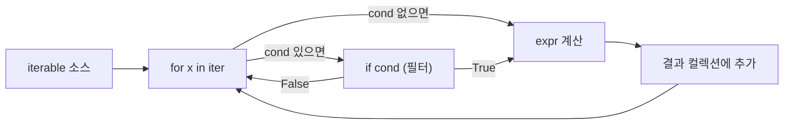

## 정의

**Comprehension(컴프리헨션)**은 iterable로부터 list/set/dict/generator를 **선언적·간결하게** 만드는 문법이다. 일반 `for`+`append` 보다 30-50% 빠르며 (전용 바이트코드 `LIST_APPEND` 등), Pythonic 코드의 핵심 관용구다.

## 4가지 형태

```python
[expr for x in iter if cond]        # list
{expr for x in iter if cond}        # set
{k: v for x in iter if cond}        # dict
(expr for x in iter if cond)        # generator (괄호: lazy)
```

## 평가 순서 시각화



중첩 `for` 는 왼쪽이 바깥 루프다.


## list comprehension

<CodeWithOutput
  language="python"
  outputLanguage="text"
  code={`squares = [x ** 2 for x in range(5)]
print(squares)

evens = [x for x in range(10) if x % 2 == 0]
print(evens)

# 변환 + 필터 동시
upper_long = [s.upper() for s in ["hi", "world", "py"] if len(s) > 2]
print(upper_long)

# 중첩 for
pairs = [(x, y) for x in range(2) for y in range(2)]
print(pairs)

# 2차원 → 1차원 (flatten)
matrix = [[1, 2], [3, 4], [5, 6]]
flat = [x for row in matrix for x in row]
print(flat)`}
  output={`[0, 1, 4, 9, 16]
[0, 2, 4, 6, 8]
['WORLD']
[(0, 0), (0, 1), (1, 0), (1, 1)]
[1, 2, 3, 4, 5, 6]`}
/>

### 중첩 for 순서

```python
[(x, y) for x in A for y in B]
# 동등한 일반 for
result = []
for x in A:
    for y in B:
        result.append((x, y))
```

왼쪽 for가 바깥 루프. 헷갈리면 일반 for로 바꿔서 확인.

### 조건부 표현식

`if`는 필터, `if-else`는 표현식 변환.

```python
# 필터 (수만 통과)
[x for x in nums if x > 0]

# 변환 (모두 통과, 값만 바뀜)
[x if x > 0 else 0 for x in nums]
```

## dict comprehension

<CodeWithOutput
  language="python"
  outputLanguage="text"
  code={`squares = {x: x ** 2 for x in range(5)}
print(squares)

# dict 뒤집기
d = {"a": 1, "b": 2}
inverted = {v: k for k, v in d.items()}
print(inverted)

# 필터링
filtered = {k: v for k, v in d.items() if v > 1}
print(filtered)`}
  output={`{0: 0, 1: 1, 2: 4, 3: 9, 4: 16}
{1: 'a', 2: 'b'}
{'b': 2}`}
/>

## set comprehension

<CodeWithOutput
  language="python"
  outputLanguage="text"
  code={`unique_lengths = {len(s) for s in ["a", "bb", "cc", "ddd"]}
print(unique_lengths)

vowels = {ch for ch in "comprehensions" if ch in "aeiou"}
print(vowels)`}
  output={`{1, 2, 3}
{'e', 'i', 'o'}`}
/>

## generator expression

**괄호()**로 감싸면 generator를 반환한다. 메모리 효율적인 lazy 시퀀스.

<CodeWithOutput
  language="python"
  outputLanguage="text"
  code={`# 차이: list (즉시 생성) vs gen (lazy)
import sys
lst = [x ** 2 for x in range(1000)]
gen = (x ** 2 for x in range(1000))
print(sys.getsizeof(lst), "bytes (list)")
print(sys.getsizeof(gen), "bytes (gen)")

# 함수 단일 인자일 때 괄호 생략 가능
total = sum(x ** 2 for x in range(100))
print(total)`}
  output={`8056 bytes (list)
208 bytes (gen)
328350`}
/>

거대한 데이터를 처리할 때는 **항상 generator 먼저 고려**. list 컴프리헨션을 메모리에 들고 있을 이유가 없으면 괄호로 바꿔라.

## 성능: list comp vs for loop vs map

| 방법 | CPython 속도 | 메모리 |
|:---|:---:|:---:|
| list comprehension | 기준 (1.0x) | 즉시 |
| 일반 for + append | ~1.3-1.5x 느림 | 즉시 |
| `map()` + lambda | ~1.1-1.2x 느림 | lazy |
| `map()` + 내장 함수 | ~0.9x (약간 빠름) | lazy |
| generator expression | 기준 (1.0x) | lazy (훨씬 적음) |

```python
# list comp
[x ** 2 for x in xs if x > 0]

# map + filter (역사적 대안)
list(map(lambda x: x ** 2, filter(lambda x: x > 0, xs)))
```

CPython에서 lambda 호출 비용이 크기 때문에 **list comp가 거의 항상 빠르다**. `map(operator.add, ...)`처럼 lambda 없이 내장 함수만 쓰면 map이 비등하거나 더 빠를 수 있다.

## Walrus(`:=`)와 결합

같은 비싼 계산을 필터와 표현식에서 두 번 하지 않게.

```python
# WRONG: f(x)를 두 번 호출
results = [f(x) for x in xs if f(x) is not None]

# 3.8+
results = [y for x in xs if (y := f(x)) is not None]
```

## async comprehension (3.6+)

```python
async def fetch_all():
    return [await fetch(url) async for url in urls()]

# async generator
async def squares():
    async for n in numbers():
        yield n ** 2
```

`async` 컨텍스트(코루틴 함수 내부)에서만 가능.

## 실전 패턴

### JSON 필드 추출

```python
users = [{"id": 1, "name": "Alice"}, {"id": 2, "name": "Bob"}]
names = [u["name"] for u in users if u["id"] > 0]
id_map = {u["id"]: u["name"] for u in users}
```

### 중복 제거 (순서 유지)

```python
seen = set()
unique = [x for x in items if not (x in seen or seen.add(x))]
```

`set.add()` 가 `None` 반환하므로 `or seen.add(x)` 트릭으로 순서 유지 dedup.

### 중첩 dict 평탄화

```python
data = {"a": {"x": 1, "y": 2}, "b": {"x": 3, "y": 4}}
flat = {f"{outer}_{inner}": v
        for outer, inner_d in data.items()
        for inner, v in inner_d.items()}
# {'a_x': 1, 'a_y': 2, 'b_x': 3, 'b_y': 4}
```

### 그룹핑 (itertools 없이)

```python
from collections import defaultdict
words = ["apple", "banana", "avocado", "cherry", "blueberry"]
by_first = defaultdict(list)
for w in words:
    by_first[w[0]].append(w)

# 컴프리헨션으로 표현 (가독성 주의)
by_first2 = {k: [w for w in words if w[0] == k]
             for k in {w[0] for w in words}}
```

첫 번째 방식이 O(n), 두 번째가 O(n^2)이다. 가독성을 위해 복잡도 희생하지 말 것.

## 가독성 한계

너무 복잡하면 일반 for로 바꿔라. 일반적 규칙:

- 중첩 3단계 이상 → for로 분해
- 조건 2개 이상 + 변환 복잡 → 함수로 추출
- 한 줄 80자 초과 → 부분식 변수로 추출 또는 for

```python
# 나쁨: 한 줄에 너무 많음
result = [transform(x) for sublist in matrix for x in sublist if x > 0 and not is_blacklisted(x) and ...]

# 좋음
def is_valid(x):
    return x > 0 and not is_blacklisted(x)

result = [transform(x)
          for sublist in matrix
          for x in sublist
          if is_valid(x)]
```

## 스코프 (3.x)

Python 3 컴프리헨션은 **자체 스코프**를 가진다. 변수 누출 없음.

```python
x = 99
squares = [x ** 2 for x in range(5)]
print(x)    # 99 (덮어쓰지 않음)
```

Python 2에서는 누출됐지만 3에서 수정됨.

## 함정

> [!WARNING]
> **비싼 호출 반복**: 필터와 표현식에서 같은 함수를 두 번 호출하지 말 것.

```python
# WRONG: 매 반복마다 expensive_call() 두 번 호출
[expensive_call(x) for x in xs if expensive_call(x).is_ok]

# OK: walrus operator 활용
[y for x in xs if (y := expensive_call(x)).is_ok]
```

> [!WARNING]
> **generator를 두 번 소비**: generator expression은 한 번만 소비 가능.

```python
gen = (x ** 2 for x in range(5))
list(gen)   # [0, 1, 4, 9, 16]
list(gen)   # [] (소진됨)
```

> [!WARNING]
> **순회 중 변경**: dict/set comprehension 내부에서 소스를 변경하면 안 됨.

## 관련 위키

- [[py-iterator-generator]] - generator 심층: yield, send, throw
- [[py-list]] - list 자체: 메모리 레이아웃, 시간복잡도
- [[py-dict]] - dict comprehension 의 타겟 자료구조
- [[py-functools]] - `reduce`, `partial` 등 함수형 도구
- [[py-asyncio]] - async comprehension 의 기반
