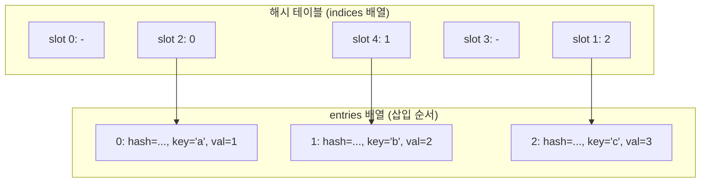

## 정의

`dict`는 Python의 **해시 맵 자료구조**다. Python 3.7부터 **삽입 순서를 언어 사양으로 보장**한다(이전엔 CPython 3.6 구현 디테일이었음). 평균 O(1) 조회·삽입·삭제. 키는 해시 가능해야 한다(`tuple`/`str`/`frozenset` O, `list`/`dict`/`set` X).

## 내부 구조 (compact dict, 3.6+)



- **해시 테이블**: 슬롯마다 entries 배열의 인덱스만 저장
- **entries 배열**: 실제 (hash, key, value) 를 삽입 순서대로 저장
- 삽입 순서 보장 + 메모리 절약 동시 달성 (이전 CPython 대비 ~50% 절약)

## 생성

```python
empty = {}
d1 = {"a": 1, "b": 2}
d2 = dict(a=1, b=2)             # 키워드 인수 (str 키만)
d3 = dict([("a", 1), ("b", 2)]) # 튜플 시퀀스
d4 = dict.fromkeys(["a", "b", "c"], 0)  # {'a': 0, 'b': 0, 'c': 0}

# 컴프리헨션
squares = {x: x ** 2 for x in range(5)}
```

## 기본 연산

<CodeWithOutput
  language="python"
  outputLanguage="text"
  code={`d = {"a": 1, "b": 2, "c": 3}

# 조회
print(d["a"])             # KeyError if missing
print(d.get("z"))         # None if missing
print(d.get("z", -1))     # default
print("a" in d)           # 멤버십

# 변경
d["d"] = 4                # 추가/덮어쓰기
d.update({"e": 5, "a": 99})
print(d)

# 삭제
del d["a"]
print(d.pop("b"))         # 반환 후 제거
print(d.popitem())        # 마지막 항목 (LIFO, 3.7+)
print(d)`}
  output={`1
None
-1
True
{'a': 99, 'b': 2, 'c': 3, 'd': 4, 'e': 5}
2
('e', 5)
{'c': 3, 'd': 4}`}
/>

## 뷰: keys / values / items

```python
d = {"a": 1, "b": 2}

d.keys()      # dict_keys(['a', 'b'])
d.values()    # dict_values([1, 2])
d.items()     # dict_items([('a', 1), ('b', 2)])
```

**중요**: 뷰는 **동적**이다. dict가 바뀌면 뷰도 즉시 반영된다.

<CodeWithOutput
  language="python"
  outputLanguage="text"
  code={`d = {"a": 1, "b": 2}
keys = d.keys()
print(list(keys))

d["c"] = 3
print(list(keys))   # 뷰가 업데이트됨`}
  output={`['a', 'b']
['a', 'b', 'c']`}
/>

## 순회

```python
d = {"a": 1, "b": 2, "c": 3}

for k in d:                # 키 순회 (기본)
    print(k)

for k, v in d.items():     # 키-값 동시
    print(k, v)

for v in d.values():
    print(v)
```

> [!WARNING]
> **순회 중 변경 금지**: 순회 중 dict를 변경하면 `RuntimeError: dictionary changed size during iteration`.

```python
# WRONG
for k in d:
    if d[k] < 0:
        del d[k]          # RuntimeError

# CORRECT: 키 리스트로 복사
for k in list(d.keys()):
    if d[k] < 0:
        del d[k]

# 또는 컴프리헨션으로 새 dict 생성
d = {k: v for k, v in d.items() if v >= 0}
```

## defaultdict / Counter

표준 라이브러리 `collections`의 자주 쓰이는 dict 서브클래스.

<CodeWithOutput
  language="python"
  outputLanguage="text"
  code={`from collections import defaultdict, Counter

# 그룹핑
words = ["apple", "banana", "cherry", "avocado", "blueberry"]
grouped = defaultdict(list)
for w in words:
    grouped[w[0]].append(w)
print(dict(grouped))

# 빈도 계산
text = "abracadabra"
c = Counter(text)
print(c.most_common(3))`}
  output={`{'a': ['apple', 'avocado'], 'b': ['banana', 'blueberry'], 'c': ['cherry']}
[('a', 5), ('b', 2), ('r', 2)]`}
/>

### Counter 산술

```python
from collections import Counter

a = Counter(["cat", "dog", "cat"])
b = Counter(["dog", "bird"])

print(a + b)        # Counter({'cat': 2, 'dog': 2, 'bird': 1})
print(a - b)        # Counter({'cat': 2})
print(a & b)        # Counter({'dog': 1})   # min(a, b)
print(a | b)        # Counter({'cat': 2, 'dog': 1, 'bird': 1})  # max(a, b)
```

## setdefault와 get

`get(k, default)`는 dict를 변경하지 않고 기본값 반환. `setdefault(k, default)`는 키가 없으면 추가까지.

```python
d = {}
v = d.setdefault("count", 0)   # d = {"count": 0}, v = 0
d["count"] += 1                # d = {"count": 1}

# 두 줄 = defaultdict(int)["count"] += 1 한 줄
```

## dict 병합 (3.9+)

PEP 584 도입.

```python
a = {"x": 1, "y": 2}
b = {"y": 99, "z": 3}

merged = a | b               # {'x': 1, 'y': 99, 'z': 3}
a |= b                       # a 직접 갱신

# 3.9 이전:
merged = {**a, **b}
```

## ChainMap: 계층적 조회

`collections.ChainMap` 은 여러 dict를 체인으로 연결. 앞에서부터 순서대로 키 검색.

```python
from collections import ChainMap

defaults = {"color": "red", "verbose": False}
env     = {"verbose": True}
cli     = {"output": "json"}

config = ChainMap(cli, env, defaults)
print(config["color"])    # "red" (defaults 에서)
print(config["verbose"])  # True (env 에서 오버라이드)
print(config["output"])   # "json" (cli 에서)

# 실전: argparse + 환경변수 + 기본값 계층
```

## 해시 가능성

키는 `__hash__`를 구현해야 한다. 가변 객체(`list`, `dict`, `set`)는 해시 불가능.

```python
{[1, 2]: "x"}              # TypeError: unhashable type: 'list'
{(1, 2): "x"}              # OK
{frozenset([1, 2]): "x"}   # OK
```

해시값과 동등성은 일관되어야 한다(`a == b` → `hash(a) == hash(b)`). 직접 만든 클래스를 키로 쓰려면 `__eq__`와 `__hash__`를 함께 구현.

```python
class Point:
    def __init__(self, x, y):
        self.x, self.y = x, y

    def __eq__(self, other):
        return (self.x, self.y) == (other.x, other.y)

    def __hash__(self):
        return hash((self.x, self.y))   # tuple 해시 재활용

d = {Point(0, 0): "origin"}
```

## 내부 구조 간단히

- **Open addressing** + perturbation probing
- 3.6+ **compact dict**: 해시 테이블에는 인덱스만, 실제 항목은 별도 배열에 순서대로 저장 → 메모리 절약 + 순서 보존
- load factor 약 2/3 도달 시 리사이즈

```python
import sys
sys.getsizeof({})              # 64 (3.12 기준)
sys.getsizeof({"a": 1})        # 184
```

## 실전 패턴

### dict를 클래스처럼: TypedDict

```python
from typing import TypedDict

class User(TypedDict):
    name: str
    age: int

u: User = {"name": "Alice", "age": 30}
# 정적 타입 검사 지원, 런타임엔 일반 dict
```

### 조건부 키 포함

```python
# 3.9+ 전: 조건 키 추가하려면 두 번 작성
config = {}
if debug:
    config["verbose"] = True

# 3.9+ 병합 연산자 활용
config = {"host": "localhost"} | ({"verbose": True} if debug else {})
```

### 함수형: dict → 변환

```python
inventory = {"apple": 5, "banana": 0, "cherry": 3}

# 0 제거
available = {k: v for k, v in inventory.items() if v > 0}

# 값 변환
doubled = {k: v * 2 for k, v in inventory.items()}

# 키 정렬
sorted_inv = dict(sorted(inventory.items(), key=lambda kv: kv[1], reverse=True))
```

## 성능 함정

> [!CAUTION]
> 매우 큰 dict에서 키 정렬이 필요하면 `sorted(d)` 매번 호출보다 `sortedcontainers.SortedDict` 검토.

- 키 충돌이 심한 사용자 정의 객체는 O(n) 가능 → `__hash__` 잘 분포되게 구현
- `dict` 대신 `__slots__` + 클래스: 메모리 1/3, 속도 약간 빠름 (필드 고정 시)
- `dict.get()` vs `try/except KeyError`: 키 존재 확률 낮으면 예외 방식이 더 빠름

## 관련 위키

- [[py-comprehension]] - dict comprehension 문법
- [[py-set-frozenset]] - set: 해시 가능 키 집합
- [[py-collections]] - defaultdict, Counter, ChainMap, OrderedDict
- [[py-typing]] - TypedDict, Mapping, MutableMapping 타입 힌트
- [[py-dataclass]] - 구조화 데이터: dict 대신 클래스 쓸 때
