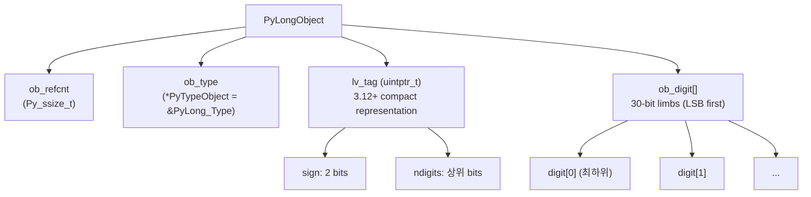
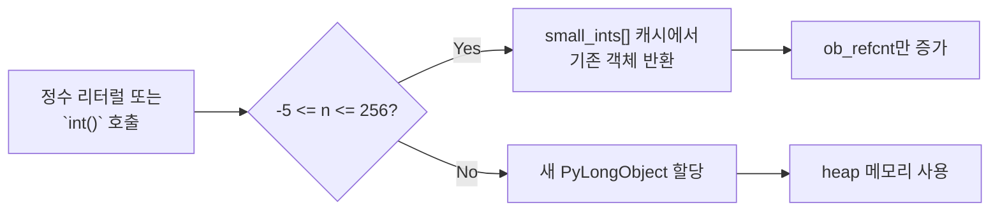

## 정의

Python의 `int`는 **임의 정밀도 정수(arbitrary precision integer)**다. C의 `int32`/`int64`처럼 비트 폭이 고정되지 않으며, 메모리가 허용하는 한 무한히 큰 정수를 표현한다. 내부는 `PyLongObject` 구조체로, 30비트 단위의 디지트 배열로 구현되어 있다.

## CPython 내부 구조: PyLongObject

Python 3.12부터 `int` 내부 구조가 크게 최적화되었다.



### 3.12 이전: `ob_size`

```c
/* CPython 3.11 이전 */
typedef struct {
    PyObject_VAR_HEAD  /* ob_refcnt, ob_type, ob_size */
    digit ob_digit[1]; /* 30비트 limb 배열 */
} PyLongObject;
```

`ob_size`가 양수면 양수, 음수면 음수, 0이면 0.

### 3.12+: Compact Representation

```c
/* CPython 3.12+ */
typedef struct {
    uintptr_t lv_tag;  /* 하위 3비트: tag, 나머지: ndigits / 값 */
    digit ob_digit[1];
} PyLongObject;
```

**Compact int**: limb 1개(`-2^30 ~ 2^30-1`)이면 `ob_digit`을 별도 메모리 없이 인라인 저장. 일반 정수의 메모리 풋프린트 30% 감소.

## Small Int Cache: -5 ~ 256

CPython은 **-5 ~ 256** 범위의 정수를 인터프리터 시작 시 미리 생성해 캐싱한다. 같은 값이면 동일한 객체를 반환한다.



<CodeWithOutput
  language="python"
  outputLanguage="text"
  code={`# 캐시 범위 내: 동일 객체
a, b = 256, 256
print(a is b)         # True

# 캐시 범위 밖: 별도 객체
c, d = 257, 257
print(c is d)         # False (보통. REPL 내 동일 코드 객체라면 True일 수도)

# 항상 ==로 비교
print(c == d)         # True

# sys.intern 트릭 (문자열 유사)
x = sys.intern("hello" * 100)   # 안 됨. int는 intern 없음`}
  output={`True
False
True`}
/>

### 왜 -5 ~ 256인가

CPython 소스 `Objects/longobject.c`:

```c
#define NSMALLPOSINTS   257   /* 0 ~ 256 */
#define NSMALLNEGINTS   5    /* -5 ~ -1 */
static PyLongObject small_ints[NSMALLNEGINTS + NSMALLPOSINTS];
```

-5는 일반적인 오프셋(`-1` 같은 에러 코드)에 쓰이고, 256은 바이트 값(0x00~0xFF)과 ASCII 범위를 커버하기 위한 설계.

> [!IMPORTANT]
> `is`는 객체 동일성 비교다. 정수 동등성 비교는 **항상 `==`** 사용. 캐시 범위가 구현 세부사항이므로 `is`에 의존하는 코드는 이식성이 없다.

## 기본 사용

<CodeWithOutput
  language="python"
  outputLanguage="text"
  code={`x = 42
y = -7
z = 10 ** 100   # googol
big = 2 ** 1000

print(x, y)
print(z)
print(big.bit_length(), "bits")`}
  output={`42 -7
10000000000000000000000000000000000000000000000000000000000000000000000000000000000000000000000000000
1001 bits`}
/>

`2 ** 1000`도 오버플로 없이 동작한다. C/Java라면 `long`도 표현 못 한다.

## C long vs Python int

| 항목 | C `int64_t` | Python `int` |
|:---|:---|:---|
| 크기 | 64비트 고정 | 무제한 (메모리 한계) |
| 오버플로 | 정의되지 않은 동작 / 래핑 | 없음 |
| 메모리 | 8 bytes | 28 bytes (작은 int 기본) |
| 속도 | 레지스터 연산 | 객체 할당 + GC |
| 사용처 | 시스템/네이티브 코드 | Python 연산 |

NumPy `np.int64`는 C `int64_t`를 래핑해 고정 크기 + 고속 배열 연산을 제공. `int` 단독 계산보다 배열 연산은 100배+ 빠를 수 있다.

## 진법 리터럴

```python
binary = 0b1010      # 2진수: 10
octal  = 0o17        # 8진수: 15
hexa   = 0xff        # 16진수: 255
under  = 1_000_000   # 가독성 언더스코어 (PEP 515)
```

진법 변환 함수:

<CodeWithOutput
  language="python"
  outputLanguage="text"
  code={`n = 255
print(bin(n))    # 2진
print(oct(n))    # 8진
print(hex(n))    # 16진

print(int("ff", 16))     # 16진 문자열 -> int
print(int("1010", 2))    # 2진 문자열 -> int`}
  output={`0b11111111
0o377
0xff
255
10`}
/>

## 정수 연산

| 연산자 | 의미 | 예시 |
|:---|:---|:---|
| `+`, `-`, `*` | 사칙연산 | `5 + 3 == 8` |
| `/` | 부동소수 나눗셈 | `7 / 2 == 3.5` |
| `//` | 몫 (floor division) | `7 // 2 == 3`, `-7 // 2 == -4` |
| `%` | 나머지 | `7 % 2 == 1` |
| `**` | 거듭제곱 | `2 ** 10 == 1024` |
| `divmod(a, b)` | 몫/나머지 동시 | `divmod(7, 2) == (3, 1)` |

`//`는 **수학적 floor**라 음수에서 0으로 자르는 C와 다르다.

<CodeWithOutput
  language="python"
  outputLanguage="text"
  code={`print(-7 // 2)    # -4 (C: -3)
print(-7 % 2)     # 1  (C: -1)
# 불변식: (a // b) * b + (a % b) == a
print((-7 // 2) * 2 + (-7 % 2))`}
  output={`-4
1
-7`}
/>

## 비트 연산

`int`는 무한 길이 2의 보수로 비트 연산을 지원한다.

```python
a = 0b1100   # 12
b = 0b1010   # 10

print(a & b)     # 8  (AND)
print(a | b)     # 14 (OR)
print(a ^ b)     # 6  (XOR)
print(~a)        # -13 (NOT: -(a+1))
print(a << 2)    # 48
print(a >> 1)    # 6
```

### 비트 조작 패턴

```python
# 특정 비트 설정/해제/토글
n = 0b1100

# 비트 k 설정 (set)
k = 1
n |= (1 << k)     # 0b1110

# 비트 k 해제 (clear)
n &= ~(1 << k)    # 0b1100

# 비트 k 토글
n ^= (1 << k)     # 0b1110

# 비트 k 읽기
bit = (n >> k) & 1

# 최하위 비트 제거 (Brian Kernighan)
n &= n - 1

# 2의 거듭제곱 여부
is_pow2 = n > 0 and (n & (n - 1)) == 0
```

## 유용한 메서드 (3.12+ 기준)

```python
n = 255
n.bit_length()             # 8 (2진수 표현에 필요한 비트 수)
n.bit_count()              # 8 (3.10+: 1인 비트 개수, popcount)
n.to_bytes(2, "big")       # b'\x00\xff'
n.to_bytes(2, "little")    # b'\xff\x00'
int.from_bytes(b"\x00\xff", "big")   # 255

# 3.11+: bit_count (popcount)
(0b10110).bit_count()      # 3

# sys.int_info
import sys
print(sys.int_info)
# sys.int_info(bits_per_digit=30, sizeof_digit=4, ...)
```

## bool은 int의 서브클래스

`True`와 `False`는 각각 `int(1)`, `int(0)`이다.

<CodeWithOutput
  language="python"
  outputLanguage="text"
  code={`print(True + 1)
print(isinstance(True, int))
print(sum([True, False, True, True]))`}
  output={`2
True
3`}
/>

`sum(condition_list)`로 조건을 만족하는 원소 수를 세는 관용구가 흔히 쓰인다.

## 성능 노트

- 64비트 이하 정수는 거의 C와 비슷한 속도지만, 매번 객체를 할당하므로 NumPy `int64` 배열이 훨씬 빠르다.
- 거대한 정수 곱셈은 Karatsuba 알고리즘을 사용 (n이 작으면 초등 알고리즘, 매우 크면 Toom-Cook 3-way).
- Python 3.11+에서 `int(s)` 변환의 DoS 방지 패치: 4300자 이상 기본 `ValueError`.

```python
# 3.11+: 큰 문자열 int 변환 제한
import sys
print(sys.get_int_max_str_digits())   # 4300 (기본)
sys.set_int_max_str_digits(0)         # 제한 해제 (위험)
```

## 함정

### `is`로 정수 비교

```python
# WRONG
def is_admin(level):
    return level is 1   # SyntaxWarning (3.8+)

# OK
def is_admin(level):
    return level == 1
```

> [!WARNING]
> `is`는 객체 ID 비교. 캐시 범위(-5~256) 밖에서는 동일 값이어도 `False`. 정수/문자열 비교는 항상 `==`.

### 정수 나눗셈

```python
result = 7 / 2     # 3.5 (float!)
result = 7 // 2    # 3   (int)
```

Python 2 코드 포팅 시 `/`가 정수 나눗셈이었던 동작이 3에서 변경됨. 타입이 중요하다면 `//` 명시.

### 오버플로 없는 정수의 메모리

```python
import sys
print(sys.getsizeof(0))          # 24 bytes
print(sys.getsizeof(2 ** 30))    # 28 bytes
print(sys.getsizeof(2 ** 60))    # 32 bytes
print(sys.getsizeof(2 ** 300))   # 68 bytes
```

큰 수는 그만큼 메모리를 차지한다. 암호화 등 큰 수 연산 대량 수행 시 메모리 감시.

## 관련 위키

- [[python]] - Python 언어 개요
- [[py-float-decimal]] - 부동소수점과 Decimal
- [[py-none-bool]] - None과 bool
- [[py-operators]] - 연산자 (비트 연산 포함)
- [[py-bytecode-dis]] - 바이트코드와 CPython VM
- [[py-tracemalloc]] - 메모리 프로파일링
- [[py-gc]] - 가비지 컬렉터
