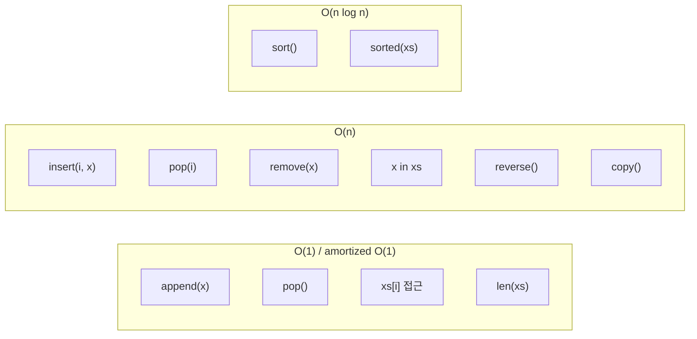

## 정의

Python의 `list`는 **가변 길이 동적 배열(dynamic array)**이다. C의 `ArrayList`/Java `ArrayList`와 같은 자료구조로, 내부적으로 PyObject 포인터의 연속 배열을 over-allocation 전략으로 관리한다. 임의 인덱스 접근 O(1), 끝 추가 amortized O(1), 임의 위치 삽입·삭제 O(n).

## 기본 사용

```python
empty = []
nums = [1, 2, 3]
mixed = [1, "two", 3.0, [4, 5]]   # 타입 혼합 가능
from_iter = list(range(5))         # [0, 1, 2, 3, 4]
```

## 인덱싱과 슬라이싱

<CodeWithOutput
  language="python"
  outputLanguage="text"
  code={`xs = [10, 20, 30, 40, 50]
print(xs[0], xs[-1])
print(xs[1:4])        # [20, 30, 40]
print(xs[::2])        # [10, 30, 50]
print(xs[::-1])       # 뒤집기

xs[1:3] = [99, 99, 99]  # 슬라이스 할당 (길이 변경 가능)
print(xs)`}
  output={`10 50
[20, 30, 40]
[10, 30, 50]
[50, 40, 30, 20, 10]
[10, 99, 99, 99, 40, 50]`}
/>

## 가변 메서드

| 메서드 | 동작 | 복잡도 |
|--------|------|--------|
| `append(x)` | 끝 추가 | amortized O(1) |
| `extend(iter)` | 다른 iter 합치기 | O(k) |
| `insert(i, x)` | i번째에 삽입 | O(n) |
| `pop([i])` | 끝(또는 i) 제거 후 반환 | O(1) / O(n) |
| `remove(x)` | 첫 매치 제거 | O(n) |
| `clear()` | 비우기 | O(n) |
| `reverse()` | 제자리 뒤집기 | O(n) |
| `sort(key=, reverse=)` | 제자리 정렬 (Timsort) | O(n log n) |
| `index(x[, start, end])` | 위치 (없으면 ValueError) | O(n) |
| `count(x)` | 출현 횟수 | O(n) |
| `copy()` | 얕은 복사 | O(n) |

<CodeWithOutput
  language="python"
  outputLanguage="text"
  code={`xs = [3, 1, 4, 1, 5, 9, 2, 6]
xs.append(5)
xs.extend([5, 3, 5])
print(xs)

xs.sort()
print(xs)

xs.sort(reverse=True)
print(xs)

# key 정렬: 길이 기준
words = ["python", "hi", "world"]
words.sort(key=len)
print(words)`}
  output={`[3, 1, 4, 1, 5, 9, 2, 6, 5, 5, 3, 5]
[1, 1, 2, 3, 3, 4, 5, 5, 5, 5, 6, 9]
[9, 6, 5, 5, 5, 5, 4, 3, 3, 2, 1, 1]
['hi', 'world', 'python']`}
/>

## sorted() vs sort()

- `list.sort()`: 제자리, 반환 `None`
- `sorted(iter)`: 새 리스트 반환, 모든 iterable 가능

```python
nums = [3, 1, 4]
nums.sort()                  # nums 자체 정렬, None 반환
new = sorted(nums)           # 새 리스트
new = sorted(nums, key=lambda x: -x)
```

## 리스트 컴프리헨션

가독성과 속도를 모두 잡는 Pythonic 패턴.

<CodeWithOutput
  language="python"
  outputLanguage="text"
  code={`squares = [x ** 2 for x in range(5)]
evens = [x for x in range(10) if x % 2 == 0]
matrix = [[i * j for j in range(3)] for i in range(3)]

print(squares)
print(evens)
print(matrix)`}
  output={`[0, 1, 4, 9, 16]
[0, 2, 4, 6, 8]
[[0, 0, 0], [0, 1, 2], [0, 2, 4]]`}
/>

성능 비교: 동일 결과를 `for` + `append`로 만드는 것보다 30% 이상 빠르다(전용 바이트코드 `LIST_APPEND`).

## 얕은 복사 vs 깊은 복사

```python
import copy
a = [[1, 2], [3, 4]]

shallow = a.copy()           # 또는 list(a), a[:]
shallow[0].append(99)        # 내부 리스트는 공유
print(a)                     # [[1, 2, 99], [3, 4]] (영향 받음)

deep = copy.deepcopy(a)
deep[0].append(100)
print(a)                     # deep만 변경됨
```

**중요**: `[[]] * 3`은 같은 빈 리스트 3개 참조다. 함정.

<CodeWithOutput
  language="python"
  outputLanguage="text"
  code={`wrong = [[]] * 3
wrong[0].append(1)
print(wrong)         # 모두 같은 리스트

right = [[] for _ in range(3)]
right[0].append(1)
print(right)`}
  output={`[[1], [1], [1]]
[[1], [], []]`}
/>

## 언패킹과 스타 표현식

```python
a, b, c = [1, 2, 3]
first, *rest = [1, 2, 3, 4]      # first=1, rest=[2, 3, 4]
first, *mid, last = [1, 2, 3, 4, 5]  # mid=[2, 3, 4]
```

## 리스트 vs 다른 타입

| 상황 | 선택 |
|------|------|
| 변경 가능, 순서 중요 | `list` |
| 변경 불가, 순서 중요 | `tuple` |
| 빈번한 양끝 삽입/삭제 | `collections.deque` (양끝 O(1)) |
| 큰 수치 배열, 수학 연산 | `numpy.ndarray` |
| 중복 없음, 멤버십 체크 | `set` |

## 시간 복잡도 시각화



> [!TIP]
> `x in list` 는 O(n). 자주 확인한다면 `set` 으로 변환 후 `x in myset` (O(1)) 이 훨씬 빠르다.

## 함수형 패턴

`map`, `filter`, `functools.reduce` 는 list 에서 자주 쓰인다.

<CodeWithOutput
  language="python"
  outputLanguage="text"
  code={`from functools import reduce

nums = [1, 2, 3, 4, 5]

doubled = list(map(lambda x: x * 2, nums))
evens   = list(filter(lambda x: x % 2 == 0, nums))
total   = reduce(lambda acc, x: acc + x, nums, 0)

print(doubled)
print(evens)
print(total)`}
  output={`[2, 4, 6, 8, 10]
[2, 4]
15`}
/>

> [!NOTE]
> `map` / `filter` 는 lazy iterator 를 반환한다. 결과를 즉시 쓰려면 `list(...)` 로 감싼다. 컴프리헨션이 더 Pythonic 하지만 기존 코드에서 자주 보인다.

## zip 과 enumerate

```python
names = ["Alice", "Bob", "Carol"]
scores = [90, 85, 92]

# zip: 두 리스트를 쌍으로
for name, score in zip(names, scores):
    print(f"{name}: {score}")

# enumerate: 인덱스와 값
for i, name in enumerate(names, start=1):
    print(f"{i}. {name}")

# transpose: zip(*matrix)
matrix = [[1, 2, 3], [4, 5, 6]]
transposed = list(zip(*matrix))  # [(1, 4), (2, 5), (3, 6)]
```

## 성능 함정

- `list.insert(0, x)`: O(n). 큐로 쓰면 `deque` 사용
- `x in list`: O(n). 멤버십 체크가 빈번하면 `set`
- 큰 정수 배열: `numpy.ndarray`가 메모리 1/4, 속도 10배+
- `list + list` 연결: O(n+m). 여러 번 반복하면 `itertools.chain`

## list 내부 구조 (CPython)

CPython 의 `listobject.c` 구조:

```
PyListObject {
    ob_refcnt, ob_type       // GC 헤더
    ob_item  →  [PyObject*, PyObject*, ...] (포인터 배열)
    ob_size    // 현재 원소 수
    allocated  // 할당된 슬롯 수 (>= ob_size)
}
```

`append` 시 `allocated == ob_size` 이면 over-allocation:

```
새 크기 = (ob_size + 1) * 9 / 8 + 6
```

이 공식으로 연속 `append` 가 amortized O(1).

## 관련 위키

- [[py-tuple|tuple: 불변 시퀀스]]
- [[py-collections|collections 모듈]]
- [[py-comprehension|컴프리헨션 패턴]]
- [[py-iterator-generator|iterator / generator]]
- [[py-itertools|itertools]]
- [[py-functools|functools]]
