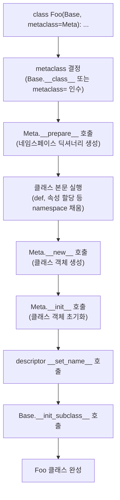

## 정의

**Metaclass**는 "클래스의 클래스"다. 일반 클래스가 인스턴스의 행동을 결정하듯, metaclass는 **클래스 자체의 행동**(생성, 속성, 메서드 추가)을 결정한다. 모든 클래스의 기본 metaclass는 `type`.

```python
class C: pass
print(type(C))         # <class 'type'>
print(type(C()))       # <class 'C'>
print(type(type))      # <class 'type'> (type의 type은 자기자신)
```

> "Metaclasses are deeper magic than 99% of users should ever worry about." - Tim Peters

대부분 `__init_subclass__`나 클래스 데코레이터로 해결 가능하다. metaclass는 정말 필요할 때만.

## 클래스 생성 프로토콜

`class` 문이 실행될 때 Python이 수행하는 단계.



## type 활용 (간단)

`type(name, bases, namespace)`로 클래스를 동적 생성한다.

```python
D = type("D", (), {"x": 1, "greet": lambda self: "hi"})
d = D()
print(d.x, d.greet())    # 1 hi

# 다음과 동등
class D:
    x = 1
    def greet(self): return "hi"
```

## metaclass 정의

`type`을 상속해 metaclass 클래스를 만들고, 클래스 선언 시 `metaclass=` 인자로 지정.

```python
class Logged(type):
    def __new__(mcs, name, bases, namespace):
        print(f"creating class {name}")
        return super().__new__(mcs, name, bases, namespace)

class User(metaclass=Logged):    # 클래스 생성 시 출력
    pass

class Admin(User):                # 출력 (서브클래스도 전파)
    pass
```

`Logged.__new__`는 클래스가 만들어질 때 한 번 호출. 클래스 데코레이터와 비슷하지만 **서브클래스에도 자동 전파**된다는 차이.

## metaclass 메서드의 호출 시점

```python
class Meta(type):
    @classmethod
    def __prepare__(mcs, name, bases, **kwargs):
        # 1. 클래스 본문을 담을 네임스페이스 딕셔너리 반환
        # OrderedDict 등 커스텀 딕셔너리를 반환하면 본문 순서 보존
        return super().__prepare__(name, bases, **kwargs)

    def __new__(mcs, name, bases, namespace, **kwargs):
        # 2. 클래스 객체 생성 (가장 먼저)
        return super().__new__(mcs, name, bases, namespace)

    def __init__(cls, name, bases, namespace, **kwargs):
        # 3. 클래스 객체 초기화 (__new__ 다음)
        super().__init__(name, bases, namespace)

    def __call__(cls, *args, **kwargs):
        # 4. 클래스를 호출해 인스턴스 만들 때 (Cls(...))
        instance = super().__call__(*args, **kwargs)
        return instance
```

## `__init_subclass__` (PEP 487, 3.6+)

대부분의 metaclass 용도는 `__init_subclass__`로 대체 가능. 더 간단하고 사용자 친화적.

```python
class Plugin:
    registry: dict[str, type] = {}

    def __init_subclass__(cls, **kwargs):
        super().__init_subclass__(**kwargs)
        Plugin.registry[cls.__name__] = cls

class AuthPlugin(Plugin): pass
class CachePlugin(Plugin): pass

print(Plugin.registry)
# {'AuthPlugin': <class '__main__.AuthPlugin'>, 'CachePlugin': <class '__main__.CachePlugin'>}
```

서브클래스가 정의될 때마다 부모의 `__init_subclass__`가 호출된다. **자동 등록, 인터페이스 검사, 클래스 변환** 등 대부분의 metaclass 패턴을 커버.

### 키워드 인수로 데이터 전달

```python
class Validated:
    def __init_subclass__(cls, *, max_size: int = 100, **kwargs):
        super().__init_subclass__(**kwargs)
        cls._max_size = max_size

    def validate(self, data):
        if len(data) > self._max_size:
            raise ValueError(f"Size exceeds {self._max_size}")

class SmallBuffer(Validated, max_size=10): pass
class LargeBuffer(Validated, max_size=10000): pass

print(SmallBuffer._max_size)   # 10
print(LargeBuffer._max_size)   # 10000
```

## 실제 metaclass 사용 사례

### 1. ABCMeta (abc.ABC 내부)

```python
from abc import ABC, ABCMeta, abstractmethod

class Shape(ABC):   # ABC = class ABC(metaclass=ABCMeta)
    @abstractmethod
    def area(self) -> float: ...

    @abstractmethod
    def perimeter(self) -> float: ...

class Circle(Shape):
    def __init__(self, radius: float):
        self.radius = radius

    def area(self) -> float:
        import math
        return math.pi * self.radius ** 2

    def perimeter(self) -> float:
        import math
        return 2 * math.pi * self.radius

# Shape() -> TypeError: Can't instantiate abstract class
# Circle() -> OK (abstractmethod 모두 구현)
c = Circle(5)
print(f"area={c.area():.2f}")
```

`ABCMeta`의 `__new__`가 `@abstractmethod`로 마킹된 메서드를 수집해 `__abstractmethods__` frozenset에 저장. `type.__call__`이 이 집합이 비어있지 않으면 `TypeError`.

자세히: [[py-collections-abc]]

### 2. Django ORM `ModelBase`

```python
# Django 내부 (단순화)
class ModelBase(type):
    def __new__(mcs, name, bases, attrs):
        # 1. 클래스 속성에서 Field 인스턴스 수집
        new_class = super().__new__(mcs, name, bases, attrs)
        fields = {k: v for k, v in attrs.items()
                  if isinstance(v, Field)}
        # 2. _meta (Options 객체) 초기화
        new_class._meta = Options(new_class, fields)
        # 3. Manager 생성 (objects)
        new_class.objects = Manager(new_class)
        return new_class

class Model(metaclass=ModelBase):
    pass

# 사용자 코드
class User(models.Model):          # ModelBase.__new__ 호출
    name = models.CharField()
    email = models.EmailField()
# User._meta.fields = {'name': CharField, 'email': EmailField}
# User.objects = Manager(User)
```

`ModelBase`가 `Field` 인스턴스를 스캔해 SQL 컬럼 메타데이터 구성, Manager 자동 생성. `class User(models.Model):` 선언만으로 ORM이 작동하는 이유.

### 3. Singleton

```python
class Singleton(type):
    _instances: dict = {}

    def __call__(cls, *args, **kwargs):
        if cls not in cls._instances:
            cls._instances[cls] = super().__call__(*args, **kwargs)
        return cls._instances[cls]

class Config(metaclass=Singleton):
    def __init__(self, env: str = "production"):
        self.env = env

a = Config("dev")
b = Config("staging")   # 무시됨, 이미 생성된 인스턴스 반환
print(a is b)    # True
print(a.env)     # dev
```

metaclass의 `__call__`은 클래스 호출(`Config(...)`) 자체를 가로챔.

### 4. Enum

`enum.Enum`의 metaclass `EnumMeta`가 클래스 본문의 모든 클래스 속성을 멤버로 변환하고, 인스턴스화를 막고, 이름/값 룩업을 구축.

```python
from enum import Enum

class Color(Enum):
    RED = 1
    GREEN = 2
    BLUE = 3

print(Color.RED)           # Color.RED
print(Color(2))            # Color.GREEN
print(Color["BLUE"])       # Color.BLUE
print(type(Color))         # <class 'EnumType'>
```

자세히: [[py-enum]]

## descriptor와 metaclass

`__set_name__`은 클래스 생성 시(metaclass 처리 후) 각 descriptor에 호출된다.

```python
class Typed:
    def __set_name__(self, owner, name):
        self.name = name        # 'age' 등 필드명 자동 설정

    def __set__(self, obj, value):
        if not isinstance(value, int):
            raise TypeError(f"{self.name} must be int")
        obj.__dict__[self.name] = value

class Person:
    age = Typed()   # __set_name__ 호출: self.name = 'age'

p = Person()
p.age = 25   # OK
p.age = "25" # TypeError: age must be int
```

자세히: [[py-descriptor]]

## metaclass 충돌

다중 상속 시 metaclass가 호환되지 않으면 `TypeError`.

```python
class M1(type): pass
class M2(type): pass

class A(metaclass=M1): pass
class B(metaclass=M2): pass

class C(A, B): pass
# TypeError: metaclass conflict:
#   the metaclass of a derived class must be a (non-strict) subclass
#   of the metaclasses of all its bases
```

해결: 두 metaclass를 묶는 새 metaclass 정의.

```python
class CombinedMeta(M1, M2): pass
class C(A, B, metaclass=CombinedMeta): pass
```

실제로는 `ABCMeta`와 사용자 metaclass 충돌이 흔한 상황. `ABCMeta`를 상속하거나 `__init_subclass__`로 대체해 충돌 자체를 피하는 게 낫다.

## 함정

### metaclass가 적용될 때

```python
class Meta(type):
    def __new__(mcs, name, bases, namespace):
        print(f"Meta.__new__: {name}")
        return super().__new__(mcs, name, bases, namespace)

class Base(metaclass=Meta):    # "Meta.__new__: Base"
    pass

class Sub(Base):               # "Meta.__new__: Sub" (서브클래스도!)
    pass
```

> [!WARNING]
> metaclass는 해당 클래스뿐 아니라 **모든 서브클래스에도 자동 적용**된다. 서드파티 라이브러리 클래스를 상속할 때 예상치 못한 metaclass가 실행될 수 있다.

### `__prepare__` 리턴값의 함정

```python
class OrderedMeta(type):
    @classmethod
    def __prepare__(mcs, name, bases, **kwargs):
        from collections import OrderedDict
        return OrderedDict()   # 3.7+ dict는 이미 순서 보장이라 불필요

    def __new__(mcs, name, bases, namespace, **kwargs):
        # namespace가 OrderedDict임
        return super().__new__(mcs, name, bases, dict(namespace))
```

Python 3.7부터 일반 `dict`가 삽입 순서를 보존하므로 `OrderedDict` 반환은 불필요.

### 클래스 데코레이터로 충분한 경우

```python
# metaclass 불필요
class Meta(type):
    def __new__(mcs, name, bases, ns):
        ns["created"] = True
        return super().__new__(mcs, name, bases, ns)

# 클래스 데코레이터로 동일 효과 (더 단순)
def add_created(cls):
    cls.created = True
    return cls

@add_created
class MyClass: pass
```

> [!CAUTION]
> 클래스 데코레이터로 해결되면 metaclass 대신 데코레이터를 사용하라. metaclass는 서브클래스 전파가 필요하거나, `__prepare__`로 네임스페이스를 제어해야 할 때, 또는 ORM처럼 클래스 본문 파싱이 필요할 때만 정당화된다.

## 언제 쓰면 안 되는가

| 요구사항 | metaclass 대신 |
|:---|:---|
| 단순 데이터 클래스 | `@dataclass` |
| 추상 메서드 강제 | `abc.ABC` |
| 서브클래스 등록 | `__init_subclass__` |
| 클래스 속성 변환 | 클래스 데코레이터 |
| Singleton | 모듈 변수, `__new__` 오버라이드 |
| 인터페이스 검사 (정적) | `typing.Protocol` |

라이브러리 제작자가 사용자의 클래스 선언 문법을 마법처럼 변환할 때(ORM, 직렬화, DSL) 진가를 발휘한다.

## 관련 위키

- [[python]] - Python 언어 개요
- [[py-class-basics]] - 클래스 기초, `__init__`, `__new__`
- [[py-inheritance]] - 다중 상속, MRO (C3 선형화)
- [[py-descriptor]] - `__get__`, `__set__`, `__set_name__`
- [[py-decorator]] - 클래스 데코레이터
- [[py-collections-abc]] - ABCMeta, abstractmethod, Protocol
- [[py-enum]] - EnumMeta 활용
- [[py-dataclass]] - `@dataclass` (metaclass 없이 데이터 클래스)
- [[py-typeddict-protocol]] - Protocol, TypedDict
- [[py-property]] - property descriptor
