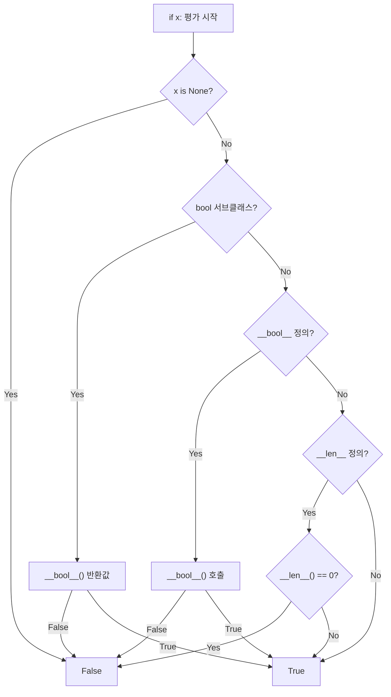

## None

`None`은 **값 없음**을 나타내는 싱글톤 객체다. 타입은 `NoneType`. 모든 함수가 명시적 return 없으면 `None`을 반환한다.

```python
x = None
print(x is None)         # True (관례: 항상 is로 비교)
print(type(None))        # <class 'NoneType'>
print(None == False)     # False (다른 객체)
print(None == 0)         # False
```

### None 비교는 `is`로

```python
# GOOD
if x is None: ...
if x is not None: ...

# BAD: 일부 객체는 __eq__ 오버로딩으로 None과도 같다고 답할 수 있음
if x == None: ...
```

PEP 8이 명시한 규칙. NumPy 배열 같은 객체에선 `==`가 element-wise 비교가 되어 `ValueError`까지 일으킨다.

### None과 기본값 함정

```python
def append_item(item, items=[]):    # WRONG: 기본 인수는 한 번만 평가
    items.append(item)
    return items

print(append_item(1))    # [1]
print(append_item(2))    # [1, 2]  (!?)

# 올바른 패턴
def append_item(item, items=None):
    if items is None:
        items = []
    items.append(item)
    return items
```

## bool

`bool`은 `int`의 서브클래스로 `True == 1`, `False == 0`이다.

<CodeWithOutput
  language="python"
  outputLanguage="text"
  code={`print(True + 1)
print(isinstance(True, int))
print(True == 1, False == 0)
print(sum([True, False, True, True]))    # 카운트로 활용

# bool() 호출 = 진리값 변환
print(bool(0), bool(1), bool(-1))
print(bool(""), bool("0"))
print(bool([]), bool([0]))
print(bool(None))`}
  output={`2
True
True True
3
False True True
False True
False True
False`}
/>

## Truthy / Falsy

Python에서 if/while 조건은 객체의 진리값을 검사한다. **falsy** 값:

- `None`
- `False`
- 수치: `0`, `0.0`, `0j`, `Decimal(0)`, `Fraction(0)`
- 빈 시퀀스/컬렉션: `""`, `()`, `[]`, `{}`, `set()`, `range(0)`
- 빈 bytes/bytearray: `b""`, `bytearray()`
- 사용자 정의 클래스의 `__bool__()`이 `False` 반환 (없으면 `__len__()` 0)

나머지는 모두 **truthy**.

```python
def describe(x):
    if x:                       # Pythonic
        return "non-empty / non-zero"
    return "empty / zero / None"

# 명확한 의도가 필요하면 비교 명시
if x is None: ...              # 정확히 None인지
if len(x) == 0: ...            # 빈 시퀀스인지
if x == 0: ...                 # 정확히 0인지
```

### 함정: 0과 빈 컨테이너

```python
def get_or_default(d, key, default="N/A"):
    return d.get(key) or default

# 의도: 키 없으면 default
# 실제: 값이 0/빈 문자열/[]이어도 default로 대체됨
get_or_default({"x": 0}, "x")    # "N/A" (!!)

# 올바른 코드
def get_or_default(d, key, default="N/A"):
    v = d.get(key)
    return default if v is None else v
```

`a or b`는 a가 falsy면 b. 0이나 ""을 유효값으로 다루는 경우 위험.

## bool 연산자: and, or, not

**short-circuit** 평가하고, **bool이 아닌 피연산자**도 그대로 반환한다.

<CodeWithOutput
  language="python"
  outputLanguage="text"
  code={`print(True and "hello")     # 'hello'
print(False and "hello")    # False (단축)
print("a" or "b")           # 'a' (첫 truthy)
print("" or "default")      # 'default'
print(not 0)                # True
print(not [])               # True

# 활용
config_value = user_value or default
errors = errors or []
greeting = name and f"Hello {name}"`}
  output={`hello
False
a
default
True
True`}
/>

## any / all

`any(iter)`, `all(iter)`는 truthy 기반 검사. 빈 iterable 처리:

```python
all([])      # True   (모든 원소가 참 - 빈 집합은 vacuous truth)
any([])      # False  (참인 원소가 없음)

# 컴프리헨션과 결합
if all(x > 0 for x in nums): ...
if any(name.startswith("admin_") for name in users): ...
```

generator를 받으면 첫 False(any는 첫 True) 발견 즉시 단축.

## 사용자 클래스의 truthy

```python
class Cart:
    def __init__(self):
        self.items = []

    def __bool__(self):
        return bool(self.items)   # 비어 있으면 falsy

cart = Cart()
if cart:
    checkout()
```

`__bool__`이 없으면 `__len__()`이 사용된다. 둘 다 없으면 항상 truthy.

## None 타입 힌트

```python
from typing import Optional

def find_user(uid: int) -> Optional[User]:
    """uid로 유저 조회, 없으면 None"""
    ...

# Python 3.10+
def find_user(uid: int) -> User | None: ...
```

`Optional[X]`는 `X | None`의 별칭.

## Truthiness 결정 흐름

객체의 진리값이 결정되는 순서:



## 패턴 매칭과 None (Python 3.10+)

`match` 문으로 None 을 명시적으로 처리:

```python
def process(value: int | None) -> str:
    match value:
        case None:
            return "값 없음"
        case 0:
            return "영"
        case int(n) if n > 0:
            return f"양수: {n}"
        case int(n):
            return f"음수: {n}"
```

중첩 구조에서도 활용:

```python
def describe_user(user: dict | None) -> str:
    match user:
        case None:
            return "사용자 없음"
        case {"name": str(name), "age": int(age)} if age >= 19:
            return f"{name} (성인)"
        case {"name": str(name)}:
            return f"{name} (미성년자)"
        case _:
            return "알 수 없음"
```

## 왈러스 연산자와 None

`:=` (walrus) 는 None 검사와 값 바인딩을 동시에:

```python
import re

text = "Error code: 42"

# 기존 패턴
m = re.search(r"\d+", text)
if m:
    print(m.group())

# 왈러스로 한 줄
if m := re.search(r"\d+", text):
    print(m.group())    # 42

# 리스트 컴프리헨션에서 None 필터
data = [None, 1, None, 2, 3]
results = [y for x in data if (y := x) is not None]
print(results)    # [1, 2, 3]

# 딕셔너리 get 과 조합
config = {"timeout": 30}
if (val := config.get("retry")) is not None:
    print(f"retry: {val}")
```

> [!WARNING]
> 왈러스는 가독성을 해칠 수 있다. 복잡한 중첩보다는 단순한 경우에만 사용.

## 관련 위키

- [[py-typing]]
- [[py-pattern-matching]]
- [[py-operators]]
- [[py-control-flow]]
- [[py-function-basics]]
