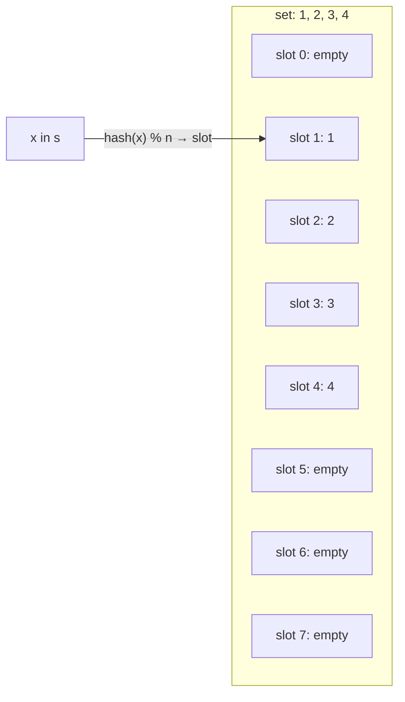
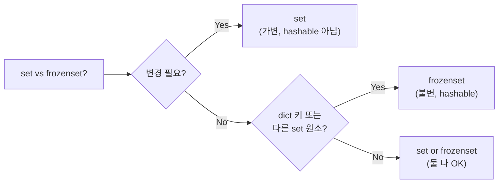

## 정의

`set`은 **중복 없는 해시 가능 원소의 가변 컬렉션**이다. dict의 키 슬롯만 가진 형태로 구현되어 평균 O(1) 멤버십·삽입·삭제를 제공한다. `frozenset`은 그 불변 버전으로 해시 가능하다.

## 생성

```python
empty = set()              # {} 는 dict! 반드시 set()
s = {1, 2, 3}
from_list = set([1, 2, 2, 3])   # {1, 2, 3} 중복 제거
comp = {x ** 2 for x in range(5)}

fs = frozenset([1, 2, 3])
```

**함정**: `{}`는 빈 dict이지 빈 set이 아니다.

## 기본 연산

<CodeWithOutput
  language="python"
  outputLanguage="text"
  code={`s = {1, 2, 3}

s.add(4)
s.add(2)              # 중복 무시
print(s)

s.remove(3)           # 없으면 KeyError
s.discard(99)         # 없어도 조용
print(s)

print(2 in s)         # 멤버십 O(1)
print(len(s))`}
  output={`{1, 2, 3, 4}
{1, 2, 4}
True
3`}
/>

## 집합 연산

| 연산 | 기호 | 메서드 | 의미 |
|------|------|--------|------|
| 합집합 | <code>\|</code> | `.union()` | 둘 중 하나 |
| 교집합 | `&` | `.intersection()` | 둘 다 |
| 차집합 | `-` | `.difference()` | A에만 |
| 대칭차 | `^` | `.symmetric_difference()` | 한쪽에만 |
| 부분집합 | `<=` | `.issubset()` | A ⊆ B |
| 진부분집합 | `<` | | A ⊊ B |
| 상위집합 | `>=` | `.issuperset()` | A ⊇ B |
| 서로소 | | `.isdisjoint()` | 교집합 없음 |

<CodeWithOutput
  language="python"
  outputLanguage="text"
  code={`a = {1, 2, 3, 4}
b = {3, 4, 5, 6}

print(a | b)
print(a & b)
print(a - b)
print(a ^ b)
print({1, 2}.issubset(a))
print(a.isdisjoint({99, 100}))`}
  output={`{1, 2, 3, 4, 5, 6}
{3, 4}
{1, 2}
{1, 2, 5, 6}
True
True`}
/>

## 제자리 갱신

```python
a = {1, 2, 3}
a |= {3, 4}        # 합집합 in-place: {1, 2, 3, 4}
a &= {2, 3, 4}     # 교집합 in-place: {2, 3, 4}
a -= {2}           # 차집합 in-place: {3, 4}
a ^= {3, 99}       # 대칭차 in-place: {4, 99}

# 메서드 버전
a.update({5, 6})         # |=
a.intersection_update()
a.difference_update()
a.symmetric_difference_update()
```

## 메서드와 메서드 인자 차이

연산자(`|`, `&`)는 **양쪽 모두 set 타입**이어야 한다. 메서드는 **어떤 iterable이든 받는다**.

```python
s = {1, 2, 3}

s | [4, 5]             # TypeError
s.union([4, 5])        # OK: {1, 2, 3, 4, 5}
s.intersection_update("abc1")  # 문자열도 iter 가능
```

## frozenset: 해시 가능 set

`frozenset`은 변경 불가라서 dict 키 / 다른 set의 원소로 쓸 수 있다.

<CodeWithOutput
  language="python"
  outputLanguage="text"
  code={`# 그래프 무방향 엣지 표현
edges = {
    frozenset({"A", "B"}),
    frozenset({"B", "C"}),
    frozenset({"A", "B"}),    # 중복
}
print(len(edges))             # 2

# dict 키로
permissions = {
    frozenset({"read"}): "viewer",
    frozenset({"read", "write"}): "editor",
}
print(permissions[frozenset({"read", "write"})])`}
  output={`2
editor`}
/>

## 흔한 활용 패턴

### 중복 제거 (순서 무관)

```python
unique = list(set([1, 2, 2, 3, 1]))    # [1, 2, 3] (순서 보장 X)

# 순서 보장 필요 시 → dict.fromkeys
unique = list(dict.fromkeys([1, 2, 2, 3, 1]))  # [1, 2, 3]
```

### 빠른 멤버십 검사

```python
banned = set(load_blacklist())     # list 대신 set
for user in users:
    if user.id in banned:           # O(1)
        ...
```

### 두 컬렉션 비교

```python
old = {"a", "b", "c"}
new = {"b", "c", "d"}

added = new - old        # {"d"}
removed = old - new      # {"a"}
unchanged = old & new    # {"b", "c"}
```

## set vs dict vs list

| 상황 | 선택 |
|------|------|
| 멤버십 검사 O(1) | `set` |
| 키-값 매핑 | `dict` |
| 순서 보장, 중복 허용 | `list` |
| 해시 가능한 불변 모음 | `frozenset` |
| 순서 + 중복 제거 | `dict.fromkeys()` |

## 시간 복잡도

| 연산 | 평균 | 최악 |
|------|------|------|
| `x in s` | O(1) | O(n) |
| `s.add(x)` | O(1) | O(n) |
| `s.remove(x)` | O(1) | O(n) |
| `s \| t` | O(len(s) + len(t)) | O(len(s) + len(t)) |
| `s & t` | O(min(len(s), len(t))) | O(len(s) * len(t)) |
| `s - t` | O(len(s)) | O(len(s)) |

> [!NOTE]
> 최악(O(n))은 해시 충돌이 극단적으로 많을 때. 실무에서는 거의 O(1).

## 내부 구조: Hash Table



- dict 에서 value 슬롯을 제거한 구조.
- 부하율 2/3 초과 시 *자동 resize* (2배).
- 원소가 해시 불가능 (list, dict) 이면 `TypeError`.

## set vs list 멤버십 성능

```python
import timeit

data = list(range(1_000_000))
as_list = data
as_set  = set(data)

t_list = timeit.timeit(lambda: 999_999 in as_list, number=1000)
t_set  = timeit.timeit(lambda: 999_999 in as_set,  number=1000)

# t_list: ~40ms (선형 탐색)
# t_set:  ~0.05ms (해시 탐색)
```

> [!TIP]
> `in` 연산 반복 사용 시 list 대신 `set`으로 변환 후 사용. 100만 원소 기준 ~800배 차이.

## hashability 규칙

```python
# 해시 가능 (set 원소로 OK)
{1, 3.14, "abc", (1, 2), frozenset({1})}

# 해시 불가 (set 원소로 불가)
{[1, 2]}            # TypeError: unhashable type: 'list'
{{1: 2}}            # TypeError: unhashable type: 'dict'
{{1, 2}}            # TypeError: unhashable type: 'set'

# 커스텀 클래스: __hash__ + __eq__ 구현 필요
class Point:
    def __init__(self, x, y):
        self.x, self.y = x, y
    def __hash__(self):
        return hash((self.x, self.y))
    def __eq__(self, other):
        return (self.x, self.y) == (other.x, other.y)

pts = {Point(1, 2), Point(1, 2)}  # len == 1
```

## 고급 패턴

### 그래프 무방향 엣지 중복 제거

```python
edges = set()
pairs = [(1, 2), (2, 1), (3, 4), (4, 3)]

for u, v in pairs:
    edges.add(frozenset({u, v}))

print(len(edges))  # 2 (중복 제거)
```

### 권한 집합 체크

```python
REQUIRED = frozenset({"read", "write"})
user_perms = frozenset({"read", "write", "admin"})

if REQUIRED.issubset(user_perms):
    print("접근 허용")
```

### 슬라이딩 윈도우 유일 문자 체크

```python
def has_all_unique(s: str, k: int) -> bool:
    """길이 k 의 윈도우가 모두 유일한 문자인지"""
    window = []
    for ch in s:
        window.append(ch)
        if len(window) == k:
            if len(set(window)) == k:
                return True
            window.pop(0)
    return False

has_all_unique("abcadce", 3)  # True ("abc")
```

## set vs frozenset 선택



## 함정 정리

- `{}`는 dict, 빈 set은 `set()`
- set은 **순서 없음** (3.7+ dict와 달리 보장 안 함)
- 원소는 해시 가능해야 함 (list, dict 불가)
- set 자체는 hashable 아님 (frozenset만)
- 연산자 `|`, `&` 등은 양쪽 모두 set 타입 필요; 메서드는 iterable 허용

## 관련 위키

- [[py-dict]]
- [[py-list]]
- [[py-tuple]]
- [[py-collections]]
