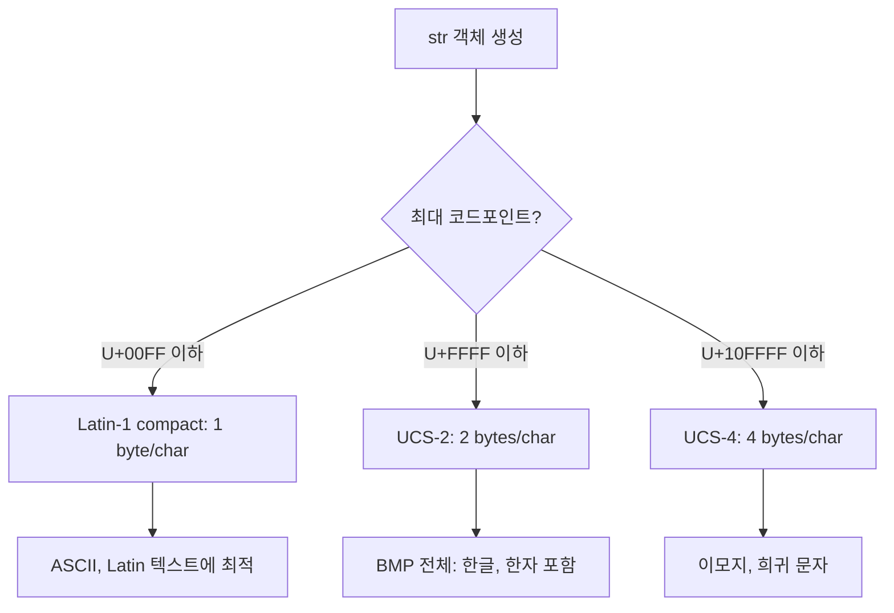

## 정의

Python의 `str`은 **불변(immutable) 유니코드 문자열**이다. 내부는 PEP 393 이후 "유연한 문자열 표현(flexible string representation)"으로, 문자열이 사용하는 최대 코드포인트에 따라 1, 2, 4바이트 폭을 자동 선택한다.

## 리터럴 종류

```python
s1 = 'single quotes'
s2 = "double quotes"
s3 = '''triple
multiline'''
s4 = """triple double"""

# raw string: 이스케이프 미적용
r = r"C:\Users\koa\file.txt"

# bytes (str 아님)
b = b"hello"

# f-string (formatted)
name = "Alice"
f = f"Hello, {name}"
```

## f-string (PEP 498)

Python 3.6+ 의 핵심 포매팅 방식.

<CodeWithOutput
  language="python"
  outputLanguage="text"
  code={`name = "Alice"
age = 30
pi = 3.14159

print(f"Hello, {name}, age {age}")
print(f"{pi:.2f}")           # 소수점 2자리
print(f"{age:05d}")          # 0 패딩 5자리
print(f"{name:>10}")         # 우측 정렬 10폭
print(f"{name!r}")           # repr() 적용
print(f"{age=}")             # 3.8+: 이름과 값 동시 출력`}
  output={`Hello, Alice, age 30
3.14
00030
     Alice
'Alice'
age=30`}
/>

### f-string 안의 표현식

```python
items = [1, 2, 3, 4]
f"합계: {sum(items)}"          # 임의 표현식 가능
f"{'-' * 20}"                  # 연산도 가능
f"{ {1, 2, 3} }"               # 중괄호 충돌은 공백으로 분리
```

Python 3.12+ 에서는 같은 인용부호 중첩, 백슬래시, 멀티라인이 허용되었다(PEP 701).

## 문자열 메서드 핵심

| 메서드 | 동작 | 예시 |
|--------|------|------|
| `.upper() / .lower()` | 대/소문자 변환 | `"abc".upper() == "ABC"` |
| `.strip([chars])` | 양끝 공백/문자 제거 | `"  x  ".strip() == "x"` |
| `.lstrip() / .rstrip()` | 왼쪽/오른쪽만 | |
| `.split(sep)` | 분할 → 리스트 | `"a,b,c".split(",") == ["a", "b", "c"]` |
| `.join(iterable)` | 결합 | `",".join(["a", "b"]) == "a,b"` |
| `.replace(old, new)` | 치환 | `"aaa".replace("a", "b") == "bbb"` |
| `.startswith() / .endswith()` | 접두/접미 검사 | |
| `.find(sub) / .index(sub)` | 위치, -1 / 예외 | |
| `.count(sub)` | 출현 횟수 | |
| `.isdigit() / .isalpha() / .isspace()` | 문자 종류 | |
| `.title() / .capitalize() / .swapcase()` | 케이스 변환 | |
| `.zfill(n)` | 0 패딩 | `"7".zfill(3) == "007"` |
| `.format(*args, **kwargs)` | 구식 포매팅 | |

<CodeWithOutput
  language="python"
  outputLanguage="text"
  code={`s = "Hello, World"
print(s.lower())
print(s.replace("World", "Python"))
print(s.split(", "))
print("-".join(["a", "b", "c"]))
print(s.find("World"))`}
  output={`hello, world
Hello, Python
['Hello', 'World']
a-b-c
7`}
/>

## 슬라이싱과 인덱싱

문자열은 시퀀스라서 정수 인덱스와 슬라이스가 가능하다.

<CodeWithOutput
  language="python"
  outputLanguage="text"
  code={`s = "Python"
print(s[0])
print(s[-1])
print(s[1:4])
print(s[::-1])     # 뒤집기
print(s[::2])      # 2칸씩`}
  output={`P
n
yth
nohtyP
Pto`}
/>

## 불변성과 연결 성능

```python
# BAD: 매번 새 객체 생성, O(n^2)
result = ""
for s in many_strings:
    result += s

# GOOD: join, O(n)
result = "".join(many_strings)

# 또는 io.StringIO
from io import StringIO
buf = StringIO()
for s in many_strings:
    buf.write(s)
result = buf.getvalue()
```

CPython 구현 최적화로 `+=` 누적도 빠를 수 있지만 보장되지 않는다. **`join` 사용이 정석**.

## 인코딩

`str`는 유니코드 추상이고, 실제 바이트는 `bytes`다.

<CodeWithOutput
  language="python"
  outputLanguage="text"
  code={`s = "안녕"
b = s.encode("utf-8")
print(b)
print(len(s), "chars,", len(b), "bytes")

# 다시 str로
print(b.decode("utf-8"))`}
  output={`b'\\xec\\x95\\x88\\xeb\\x85\\x95'
2 chars, 6 bytes
안녕`}
/>

`len(str)`은 **코드포인트 수**, `len(bytes)`는 **바이트 수**다. 한글은 UTF-8에서 코드포인트 1개당 3바이트.

## 문자열 정규화

같은 글자가 다른 코드포인트 조합으로 표현될 수 있다 (macOS NFD 등).

```python
import unicodedata
nfc = unicodedata.normalize("NFC", text)  # 결합형
nfd = unicodedata.normalize("NFD", text)  # 분해형
```

파일명/유저 입력 비교 시 정규화하지 않으면 같은 글자도 다르게 보일 수 있다.

## PEP 393: 유연한 내부 표현

Python 3.3+ 의 `str` 객체는 담긴 문자의 최대 코드포인트에 따라 내부 표현을 자동 선택한다.



```python
import sys
print(sys.getsizeof("A"))          # ~50 bytes (Latin-1)
print(sys.getsizeof("가"))          # ~76 bytes (UCS-2)
print(sys.getsizeof("\U0001F600")) # ~80 bytes (UCS-4, 이모지)
```

`len(str)` 은 항상 **코드포인트 수** 를 반환한다. 내부 바이트 크기와 다를 수 있다.

## textwrap: 긴 텍스트 정리

`textwrap` 모듈은 긴 문자열을 지정 너비로 줄바꿈하거나 들여쓰기를 정규화할 때 사용한다.

```python
import textwrap

text = "Python 의 str 은 불변 유니코드 시퀀스다. PEP 393 이후 코드포인트에 따라 내부 표현이 자동 선택된다."

# 30자 너비로 자동 줄바꿈
print(textwrap.fill(text, width=30))

# docstring 공통 들여쓰기 제거
raw = """
    첫 번째 줄
    두 번째 줄
"""
print(textwrap.dedent(raw).strip())

# 각 줄 앞에 접두어 추가
print(textwrap.indent("foo\nbar", prefix="  >> "))
```

자세히는 [[py-textwrap-locale]] 참고.

## 문자열 인터닝

CPython 은 identifier 처럼 생긴 짧은 문자열 리터럴을 자동으로 인터닝(캐시)한다.

```python
a = "hello"
b = "hello"
print(a is b)       # True (같은 객체, CPython 보장)

a = "hello world"   # 공백 포함: 인터닝 보장 안 됨
b = "hello world"
print(a is b)       # CPython 에서도 False 일 수 있음
```

문자열 동등 비교에는 반드시 `==`. `is` 를 쓰면 `SyntaxWarning` (Python 3.8+).

명시적 인터닝이 필요하면 `sys.intern()`:

```python
import sys
a = sys.intern("hello world")
b = sys.intern("hello world")
print(a is b)   # True
```

같은 문자열 키가 사전에 수백만 번 등장할 때 메모리 절약 목적으로 사용한다.

## 포매팅 방식 비교

| 방식 | 예시 | 비고 |
|---|---|---|
| `%` 연산자 | `"Hello %s" % name` | C 스타일, 구식 |
| `.format()` | `"Hello {}".format(name)` | 3.0+, 유연한 위치/키워드 인자 |
| f-string | `f"Hello {name}"` | 3.6+, 가장 빠름, 권장 |
| `string.Template` | `Template("Hello $name").substitute(...)` | 외부 입력 처리에 안전 |

f-string 은 CPython 3.12 에서 컴파일 타임 추가 최적화되었다.

## 인코딩 오류 처리 전략

```python
bad = b'\xff\xfe'

bad.decode('utf-8', errors='strict')           # UnicodeDecodeError (기본)
bad.decode('utf-8', errors='replace')          # U+FFFD 대체 문자로 치환
bad.decode('utf-8', errors='ignore')           # 무효 바이트 삭제
bad.decode('utf-8', errors='backslashreplace') # \xNN 이스케이프 형식
```

파일 읽기 시 인코딩과 오류 처리 전략을 명시하는 것이 좋은 습관이다:

```python
with open("data.txt", encoding="utf-8", errors="replace") as f:
    content = f.read()
```

## `str` vs `bytes` 구분

Python 3 는 `str` (유니코드 텍스트) 와 `bytes` (바이트열) 를 엄격히 분리한다.

```python
"text" + b"bytes"    # TypeError: 섞어 쓸 수 없음
len("가")             # 1 (코드포인트)
len("가".encode())    # 3 (UTF-8 바이트)
```

네트워크 I/O, 바이너리 파일, 이미지 처리에는 `bytes` / `bytearray` 사용. 자세히는 [[py-bytes-bytearray]] 참고.

## 정규식 연계

복잡한 패턴 매칭, 치환, 분할이 필요하면 `re` 모듈을 사용한다. 자세히는 [[py-re-regex]] 참고.

```python
import re

# 숫자 추출
nums = re.findall(r'\d+', "order-123, item-456")
# ['123', '456']

# 이메일 마스킹
masked = re.sub(r'[\w.]+@[\w.]+', '***', "user@example.com 에 전송")
# '*** 에 전송'
```

## 관련 위키

- [[py-bytes-bytearray]]
- [[py-re-regex]]
- [[py-textwrap-locale]]
- [[py-string-formatting]]
