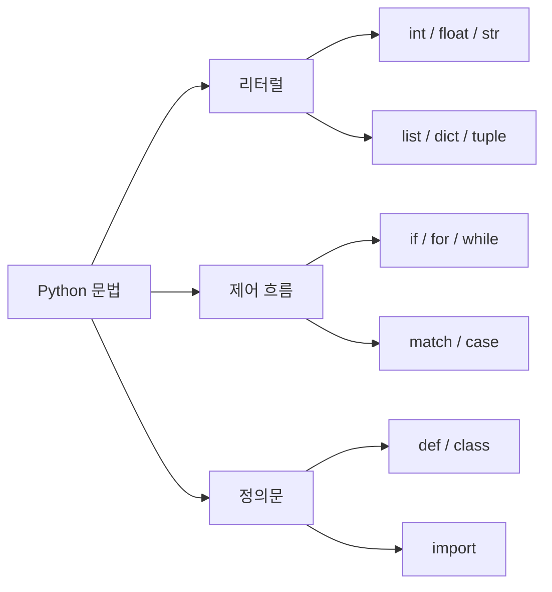

## 정의

Python은 **들여쓰기(indentation)로 블록을 구분**하는 언어다. C/Java의 중괄호 `{}` 대신 일관된 들여쓰기 수준이 블록 스코프를 결정한다. PEP 8은 **공백 4칸**을 권장하며 탭과 공백 혼용은 `TabError`를 발생시킨다.



## 들여쓰기 규칙

<CodeWithOutput
  language="python"
  outputLanguage="text"
  code={`def greet(name):
    if name:           # 4칸 들여쓰기
        print(f"Hello, {name}")
        for _ in range(2):
            print("!")  # 8칸 (중첩)
    else:
        print("Hello, stranger")

greet("Alice")`}
  output={`Hello, Alice
!
!`}
/>

같은 블록 안에서는 들여쓰기 폭이 동일해야 한다. 다음은 `IndentationError`를 던진다.

```python
def bad():
    x = 1
     y = 2   # IndentationError: unexpected indent
```

## 주석과 Docstring

- 한 줄 주석: `#`
- 여러 줄 "주석": 실제로는 docstring(`"""..."""`)을 사용. 문자열 리터럴이라 GC된다.

```python
# 한 줄 주석
def add(a, b):
    """두 수를 더한다.

    이런 형식의 docstring은 help(add)로 확인할 수 있다.
    """
    return a + b
```

### Docstring 형식 비교

| 형식 | 특징 | 사용처 |
|:---|:---|:---|
| **Google Style** | `Args:`, `Returns:` 섹션 | Google, 대부분 오픈소스 |
| **NumPy Style** | 밑줄 구분선 사용 | 과학 라이브러리 (NumPy, SciPy) |
| **Sphinx (reStructuredText)** | `:param x:`, `:type x:` | Python 공식 문서 |

```python
# Google Style (권장)
def divide(a: float, b: float) -> float:
    """두 수를 나눈다.

    Args:
        a: 피제수.
        b: 제수. 0이면 안 된다.

    Returns:
        a를 b로 나눈 결과.

    Raises:
        ZeroDivisionError: b가 0일 때.
    """
    return a / b
```

## 변수와 할당

Python은 **동적 타이핑**이다. 변수 선언이 없고, 할당과 동시에 이름이 객체에 바인딩된다.

<CodeWithOutput
  language="python"
  outputLanguage="text"
  code={`x = 42          # int
x = "hello"     # 같은 이름이 다른 타입 객체를 가리킴
y, z = 1, 2     # 튜플 언패킹
a = b = c = 0   # 체인 할당 (모두 같은 객체)

print(type(x), x)
print(y, z)
print(a is b, b is c)`}
  output={`<class 'str'> hello
1 2
True True`}
/>

`x = 42`는 "x라는 라벨을 정수 객체 42에 붙인다"는 의미. "x라는 메모리 슬롯에 42를 쓴다"가 아니다. 이 차이는 가변/불변 객체 동작을 이해할 때 핵심이다.

## f-string (PEP 498, 3.6+)

`f"..."` 문자열은 중괄호 `{}` 안의 표현식을 평가해 삽입한다.

<CodeWithOutput
  language="python"
  outputLanguage="text"
  code={`name = "Alice"
score = 98.567

# 기본
print(f"이름: {name}")

# 형식 지정자
print(f"점수: {score:.2f}")
print(f"16진수: {255:#010x}")

# 3.8+ 디버깅 표현식 (=)
x = 42
print(f"{x=}")

# 표현식 직접 삽입
print(f"2 ** 10 = {2 ** 10}")`}
  output={`이름: Alice
점수: 98.57
16진수: 0x000000ff
x=42
2 ** 10 = 1024`}
/>

Python 3.12에서 f-string 파서가 PEG 기반으로 완전 재작성 (PEP 701). 중첩 f-string, 백슬래시 내부 사용 가능.

```python
# 3.12+: 중첩 f-string
values = [1, 2, 3]
print(f"{'|'.join(str(v) for v in values)}")   # 1|2|3

# 3.12+: 백슬래시 내부 허용
print(f"{'hello\nworld'!r}")   # 'hello\\nworld'
```

자세히: [[py-string-formatting]]

## 타입 힌트 (PEP 484, 526, 3.5+)

타입 힌트는 런타임에 무시되지만 mypy/pyright 등으로 정적 검증 가능.

```python
# 변수 타입 힌트 (PEP 526, 3.6+)
count: int = 0
name: str

# 함수 시그니처
def greet(name: str, times: int = 1) -> str:
    return (name + " ") * times

# 컬렉션: 3.9+ 내장 제네릭
def process(items: list[int]) -> dict[str, int]:
    return {str(i): i for i in items}

# 유니온: 3.10+ 단축 문법
def parse(value: str | int | None) -> int:
    if value is None:
        return 0
    return int(value)
```

```python
# typing 모듈 고급
from typing import TypeVar, Generic, Protocol

T = TypeVar("T")

class Stack(Generic[T]):
    def __init__(self) -> None:
        self._items: list[T] = []

    def push(self, item: T) -> None:
        self._items.append(item)

    def pop(self) -> T:
        return self._items.pop()
```

자세히: [[py-typing]]

## Walrus Operator `:=` (PEP 572, 3.8+)

expression 자리에서 할당 수행. `while`/comprehension/`if` 조건에서 중복 계산 방지.

```python
import re

# 정규식 매칭 결과를 조건과 본문 양쪽에서 재사용
data = "ID:12345"
if m := re.match(r"ID:(\d+)", data):
    print(f"ID found: {m.group(1)}")   # ID found: 12345

# 대용량 파일 청크 읽기
with open("large.bin", "rb") as f:
    while chunk := f.read(8192):
        process(chunk)

# comprehension에서 비싼 계산 재사용
results = [y for x in data_list if (y := expensive(x)) is not None]
```

자세히: [[py-operators]]

## match/case (PEP 634, 3.10+)

구조적 패턴 매칭. `switch`와 달리 구조체 분해, 타입 검사, guard까지 지원.

<CodeWithOutput
  language="python"
  outputLanguage="text"
  code={`def classify(command):
    match command:
        case "quit":
            return "종료"
        case "hello" | "hi":
            return "인사"
        case str(s) if len(s) > 10:
            return f"긴 명령: {s[:10]}..."
        case _:
            return f"알 수 없음: {command}"

print(classify("quit"))
print(classify("hi"))
print(classify("thisisaverylongcommand"))
print(classify("unknown"))`}
  output={`종료
인사
긴 명령: thisisaver...
알 수 없음: unknown`}
/>

```python
# 구조체 분해 패턴
from dataclasses import dataclass

@dataclass
class Point:
    x: float
    y: float

def describe(obj):
    match obj:
        case Point(x=0, y=0):
            return "원점"
        case Point(x=x, y=0):
            return f"x축 위 ({x})"
        case Point(x=0, y=y):
            return f"y축 위 ({y})"
        case Point(x=x, y=y):
            return f"일반 점 ({x}, {y})"
        case list() as xs if len(xs) == 0:
            return "빈 리스트"
        case _:
            return "기타"

print(describe(Point(3, 0)))   # x축 위 (3)
print(describe(Point(1, 2)))   # 일반 점 (1, 2)
```

자세히: [[py-pattern-matching]]

## 식별자(Identifier) 규칙

- 영문/유니코드 문자, 숫자, `_` 사용 가능 (숫자로 시작 불가)
- 대소문자 구분: `value`와 `Value`는 다른 변수
- 예약어 35개(`if`, `for`, `class`, `True`, `None`, `match`, `case`, …)는 사용 불가
- 관례:
  - `snake_case`: 변수/함수
  - `PascalCase`: 클래스
  - `_leading_underscore`: 내부용 (모듈 외부 노출 방지)
  - `__double_underscore__`: 매직 메서드/속성 (dunder)
  - `__name_mangling`: 클래스 내 이름 맹글링 (서브클래스 충돌 방지)

## 라인 연속

긴 한 줄은 백슬래시 `\` 또는 괄호 안에서 자동으로 연속된다.

```python
total = 1 + 2 + 3 + \
        4 + 5 + 6      # 백슬래시 연속

items = [
    "apple",
    "banana",
    "cherry",          # 괄호/대괄호 안은 자유 줄바꿈
]
```

PEP 8은 **괄호 활용**을 백슬래시보다 권장한다.

## PEP 8 핵심 스타일

- 들여쓰기: 공백 4칸
- 한 줄 최대 79자(주석은 72자)
- 함수/클래스 정의 사이 빈 줄 2줄
- 메서드 사이 빈 줄 1줄
- 연산자 양옆 공백 1칸: `a + b`, `a == b`
- 함수 호출 시 키워드 인수 `=` 양옆 공백 없음: `f(x=1)`
- import는 표준 라이브러리, 서드파티, 로컬 3그룹으로 분리

```python
# import 순서 (PEP 8)
import os
import sys

import numpy as np
import pandas as pd

from myproject import utils
```

`ruff`, `black`, `isort` 등 포매터로 자동 적용 가능.

## 함정

### 탭과 공백 혼용

```python
# 탭 + 공백 혼용 시 Python 3에서 TabError
def mixed():
	x = 1    # 탭
    y = 2    # 공백  -> TabError
```

> [!WARNING]
> Python 3은 탭/공백 혼용을 엄격히 금지한다. 에디터의 "탭을 공백으로 변환" 옵션 활성화 필수.

### 기본 인수의 가변 객체

```python
# WRONG: 기본 인수가 한 번만 평가됨
def append_to(item, lst=[]):
    lst.append(item)
    return lst

print(append_to(1))   # [1]
print(append_to(2))   # [1, 2] (예상: [2])
```

```python
# OK: None 기본값 패턴
def append_to(item, lst=None):
    if lst is None:
        lst = []
    lst.append(item)
    return lst
```

> [!WARNING]
> 기본 인수로 `[]`, `{}`, `set()` 같은 가변 객체를 쓰면 호출 간에 공유된다. 항상 `None`을 사용하고 함수 본문에서 초기화.

## 관련 위키

- [[python]] - Python 언어 개요
- [[py-int]] - 정수 타입 상세
- [[py-string-formatting]] - 문자열 포매팅, f-string 고급
- [[py-operators]] - 연산자 상세 (walrus 포함)
- [[py-control-flow]] - if/for/while/break/continue
- [[py-pattern-matching]] - match/case 심화
- [[py-typing]] - 타입 힌트 시스템
- [[py-function-basics]] - 함수 정의, 인수, 클로저
- [[py-scope-namespace]] - 변수 스코프와 네임스페이스
- [[py-decorator]] - 데코레이터 패턴
