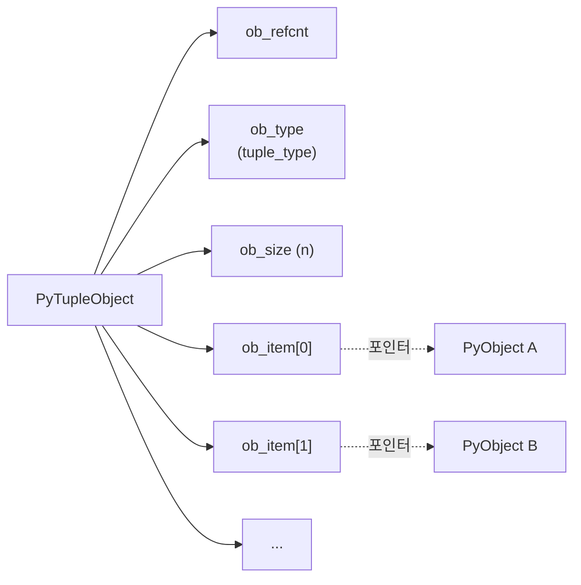

## 정의

`tuple`은 **불변(immutable) 시퀀스**다. `list`와 거의 같은 API를 가지나 생성 후 변경 불가하며, 그 덕에 dict 키나 set 원소로 사용 가능하다(해시 가능). 함수의 다중 반환값, 좌표/레코드 같은 고정 구조에 흔히 쓰인다.

## CPython 내부 구조: PyTupleObject



- `ob_item[]`: `PyObject*` 포인터 배열. 원소 자체가 아닌 참조를 저장
- 불변이라 한 번 생성된 배열은 교체 불가
- **CPython 튜플 캐시**: 빈 `()` 은 싱글턴. 길이 0~20의 튜플은 free list로 재활용

```python
import sys

# 빈 튜플은 싱글턴
a = ()
b = ()
print(a is b)   # True

# 메모리 비교: tuple < list
lst = [1, 2, 3, 4, 5]
tup = (1, 2, 3, 4, 5)
print(sys.getsizeof(lst))   # 104 bytes (over-allocation)
print(sys.getsizeof(tup))   # 80 bytes (딱 필요한 만큼)
```

## 생성

```python
empty = ()
single = (1,)        # 콤마 필수! (1)는 그냥 괄호 묶인 표현식
pair = (1, 2)
triple = 1, 2, 3     # 괄호 없이도 됨 (tuple packing)
from_iter = tuple([1, 2, 3])
```

**함정**: `(1)`은 `int`, `(1,)`만 `tuple`.

<CodeWithOutput
  language="python"
  outputLanguage="text"
  code={`print(type((1)))
print(type((1,)))
print(type(()))`}
  output={`<class 'int'>
<class 'tuple'>
<class 'tuple'>`}
/>

## 불변성

```python
t = (1, 2, 3)
t[0] = 99   # TypeError: 'tuple' object does not support item assignment
```

하지만 내부에 가변 객체가 있으면 그 객체는 변경 가능하다.

```python
t = ([1, 2], [3, 4])
t[0].append(99)        # 리스트 자체는 변경 가능
print(t)               # ([1, 2, 99], [3, 4])
```

따라서 "tuple이 hashable이다"는 항상 참이 아니다. 내부에 list가 들어 있으면 `hash(t)`는 `TypeError`.

```python
hash((1, 2))           # OK
hash((1, [2, 3]))      # TypeError: unhashable type: 'list'
```

## 언패킹 (Tuple Unpacking)

가장 강력하고 흔히 쓰이는 기능.

<CodeWithOutput
  language="python"
  outputLanguage="text"
  code={`a, b = 1, 2
print(a, b)

# 변수 교환 (임시 변수 불필요)
a, b = b, a
print(a, b)

# 다중 반환값
def minmax(xs):
    return min(xs), max(xs)

lo, hi = minmax([3, 1, 4, 1, 5])
print(lo, hi)

# 스타 언패킹
first, *rest = (1, 2, 3, 4)
print(first, rest)

# 중간 스타
head, *middle, tail = range(5)
print(head, middle, tail)`}
  output={`1 2
2 1
1 5
1 [2, 3, 4]
0 [1, 2, 3] 4`}
/>

### 중첩 언패킹

```python
# 행렬 처리
matrix = [(1, 2), (3, 4), (5, 6)]
for x, y in matrix:
    print(f"({x}, {y})")

# 깊은 중첩
((a, b), c) = ((1, 2), 3)
print(a, b, c)   # 1 2 3

# enumerate와 언패킹
for idx, (key, val) in enumerate({"a": 1, "b": 2}.items()):
    print(idx, key, val)
```

## 메서드 (불변이라 단 2개)

```python
t = (1, 2, 3, 2, 1)
t.count(2)     # 2
t.index(3)     # 2 (처음 등장 인덱스)
```

읽기 연산(`len`, `in`, 슬라이스, `min/max/sum`)은 list와 동일.

## NamedTuple: 이름 있는 필드

`collections.namedtuple` 또는 `typing.NamedTuple`로 필드명을 부여한다. 작은 데이터 클래스가 필요할 때 `dataclass`보다 가볍다.

<CodeWithOutput
  language="python"
  outputLanguage="text"
  code={`from collections import namedtuple

Point = namedtuple("Point", ["x", "y"])
p = Point(3, 4)
print(p)
print(p.x, p.y)
print(p[0], p[1])    # 인덱스 접근도 가능
print(p._asdict())   # dict 변환

# 기존 값으로 새 인스턴스 (불변)
q = p._replace(x=99)
print(q)`}
  output={`Point(x=3, y=4)
3 4
3 4
{'x': 3, 'y': 4}
Point(x=99, y=4)`}
/>

타입 힌트가 필요하면 `typing.NamedTuple`:

```python
from typing import NamedTuple

class User(NamedTuple):
    id: int
    name: str
    age: int = 0    # 기본값

u = User(1, "Alice")
print(u.id, u.name)    # 1 Alice
print(u._fields)       # ('id', 'name', 'age')
```

`typing.NamedTuple`은 `collections.namedtuple`을 클래스 문법으로 감싼 것. 내부는 동일한 tuple 서브클래스.

## TypedDict: dict에 타입 구조 부여

`typing.TypedDict`는 특정 키/타입 구조를 가진 dict를 타입 힌트 수준에서 검사한다. 런타임에는 일반 `dict`.

```python
from typing import TypedDict, Required, NotRequired

class UserInfo(TypedDict):
    id: int
    name: str
    email: NotRequired[str]   # 선택 필드 (3.11+)

# 사용
user: UserInfo = {"id": 1, "name": "Alice"}  # OK
user2: UserInfo = {"id": 2}   # mypy 오류: 'name' 필드 누락
```

## tuple vs list vs dataclass vs NamedTuple vs TypedDict

| 타입 | 가변 | 해시 | 필드명 | 타입 힌트 | 메모리 | 용도 |
|:---|:---:|:---:|:---:|:---:|:---|:---|
| `tuple` | X | O | X | - | 최소 | 고정 레코드, 다중 반환 |
| `list` | O | X | X | - | 보통 | 동적 컬렉션 |
| `namedtuple` | X | O | O | 제한적 | 최소+ | 가벼운 불변 레코드 |
| `NamedTuple` | X | O | O | O | 최소+ | 타입 힌트 불변 레코드 |
| `dataclass` | O | X | O | O | 보통 | 일반 데이터 클래스 |
| `dataclass(frozen=True)` | X | O | O | O | 보통 | 메서드/검증이 필요한 불변 |
| `TypedDict` | O | X | O | O (정적만) | dict 동일 | JSON-like dict 타입 표기 |

자세히: [[py-dataclass]], [[py-typeddict-protocol]]

## hashable 활용

```python
# 튜플을 set 원소 / dict 키로
seen = set()
for x, y in points:
    if (x, y) in seen:
        continue
    seen.add((x, y))

# 2D 좌표 grid
grid = {(0, 0): "start", (1, 1): "wall"}
print(grid.get((0, 0)))   # start

# functools.lru_cache: 튜플 인수는 바로 캐시 키
from functools import lru_cache

@lru_cache(maxsize=None)
def shortest_path(start: tuple, end: tuple) -> int:
    ...
```

## 함수 리턴값 관용구

Python 함수는 사실상 항상 튜플을 반환한다(다중 값 = 튜플).

```python
def stats(xs):
    return min(xs), max(xs), sum(xs) / len(xs)

lo, hi, avg = stats([1, 2, 3, 4, 5])
result = stats([1, 2, 3])   # (1, 3, 2.0) 튜플
```

## 메모리 최적화

```python
import dis

# 상수 튜플: 컴파일 타임에 LOAD_CONST 한 번
dis.dis("x = (1, 2, 3)")    # LOAD_CONST  (1, 2, 3)

# 리스트: 매번 BUILD_LIST (3개 로드 + 빌드)
dis.dis("x = [1, 2, 3]")    # BUILD_LIST
```

### `__slots__`와 tuple 조합

```python
class Point:
    __slots__ = ("x", "y")   # dict 없이 고정 슬롯

    def __init__(self, x, y):
        self.x = x
        self.y = y

# vs NamedTuple: 둘 다 메모리 효율적이나 NamedTuple은 불변 + 시퀀스 API
```

### 대용량 데이터 처리

```python
# list보다 tuple 순회가 약간 빠름 (size 고정, over-allocation 없음)
import timeit
n = 1_000_000
xs_list = list(range(n))
xs_tuple = tuple(range(n))

# 순회 속도 거의 동일 (접근 패턴이 동일)
# 생성/메모리 차이가 주요 이점
```

## 함정

### 단일 원소 튜플의 콤마

```python
t = (42)    # int, 튜플 아님!
t = (42,)   # tuple (1,)
t = 42,     # tuple, 괄호 없어도 됨
```

> [!WARNING]
> `(42)`는 `int(42)`와 동일. 단일 원소 튜플은 반드시 뒤에 쉼표 필요. `(42,)` 또는 `42,`.

### 내부 가변 객체와 해시

```python
t = (1, [2, 3])
hash(t)   # TypeError: unhashable type: 'list'

# dict 키나 set 원소로 사용 불가
d = {t: "value"}   # TypeError
```

> [!WARNING]
> 내부 리스트가 있으면 tuple도 unhashable. dict 키/set 원소로 쓰려면 내부 원소까지 모두 hashable이어야 한다.

### `_replace()`는 새 객체 반환

```python
p = Point(x=1, y=2)
p._replace(x=99)   # 새 Point(x=99, y=2) 반환
print(p)           # Point(x=1, y=2) - 원본 변경 없음
```

## 관련 위키

- [[python]] - Python 언어 개요
- [[py-int]] - 정수 타입 내부
- [[py-collections]] - collections 모듈 (defaultdict, Counter, deque)
- [[py-dataclass]] - `@dataclass`, `frozen=True`
- [[py-typeddict-protocol]] - TypedDict, Protocol
- [[py-typing]] - 타입 힌트 시스템
- [[py-comprehension]] - 컴프리헨션 (튜플 생성 포함)
- [[py-iterator-generator]] - 이터레이터와 제너레이터
- [[py-gc]] - 가비지 컬렉터 (불변 객체의 GC 동작)
