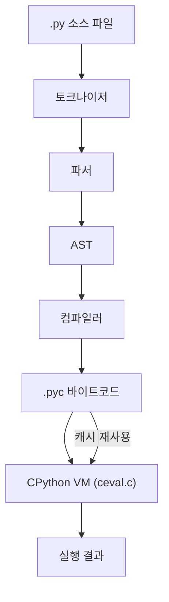
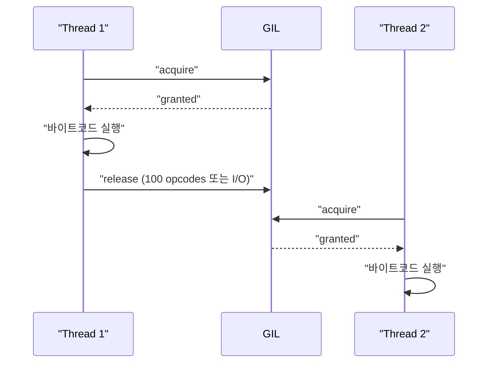

## 정의

**Python**은 Guido van Rossum이 1991년 발표한 인터프리터 방식의 동적 타이핑 언어다. 읽기 쉬운 문법과 방대한 라이브러리 생태계로 웹 백엔드, 데이터 분석, 머신러닝, 스크립팅, DevOps 등 거의 모든 분야에서 쓰인다.

CPython (C로 구현된 공식 구현체) 외에도 PyPy (JIT 컴파일), Jython (JVM), MicroPython (임베디드) 등이 있으나 생태계 대부분은 CPython 기준이다.

## CPython 실행 흐름

소스 코드가 결과로 변환되기까지 5단계.



- **토크나이저**: 소스를 토큰 스트림으로 분해 (`Lib/tokenize.py`)
- **파서**: 문법 규칙으로 Parse Tree 생성 (3.9+부터 PEG 파서)
- **AST**: `ast` 모듈로 검사·변환 가능한 트리
- **컴파일러**: `compile()` → `PyCodeObject` 생성 (`Python/compile.c`)
- **VM**: 스택 기반 인터프리터. `dis` 모듈로 바이트코드 확인 가능

```python
import dis
dis.dis("x = 1 + 2")
#   0 LOAD_CONST   0 (3)
#   2 STORE_NAME   0 (x)
```

3.11부터 Specializing Adaptive Interpreter(SAI)가 바이트코드를 런타임에 특화 최적화한다.

## 구현체 비교

| 구현체 | 기반 | 특징 | 사용처 |
|:---|:---|:---|:---|
| **CPython** | C | 공식 참조 구현, 최고 호환성 | 범용 |
| **PyPy** | RPython/JIT | CPU-bound 코드 5-50배 빠름 | 장기 실행 서버, 수치 계산 |
| **MicroPython** | C (경량) | 마이크로컨트롤러 타깃, 표준 라이브러리 일부 | IoT, RP2040, ESP32 |
| **GraalPy** | GraalVM | JVM 위에서 실행, Java 상호운용 | 엔터프라이즈 |
| **Jython** | Java | JVM, Java 라이브러리 직접 호출 | Java 통합 (레거시) |

> [!IMPORTANT]
> C 확장(`numpy`, `pandas`, `Pillow`)은 CPython ABI에 의존한다. PyPy로 교체하면 C 확장 호환성을 별도로 확인해야 한다.

## 언어 특성

- **인터프리터 방식**: 소스를 bytecode로 컴파일 후 VM에서 실행 (`.pyc` 파일)
- **동적 타이핑**: 변수의 타입을 런타임에 결정. 선언 불필요
- **들여쓰기 문법**: 중괄호 대신 indentation (공백 4칸)으로 블록 구분
- **GIL (Global Interpreter Lock)**: CPython은 한 번에 하나의 스레드만 Python bytecode 실행 가능
- **모든 것이 객체**: 함수, 클래스, 모듈 모두 first-class object

## 핵심 개념

### Duck Typing

"오리처럼 걷고 오리처럼 울면 오리다". 객체의 타입이 아니라 메서드/속성 존재 여부로 동작 결정.

```python
def process(item):
    item.read()  # item이 file-like object이기만 하면 됨
```

[[py-collections-abc]]의 `Protocol`로 덕 타이핑을 정적으로 표현할 수 있다.

### List Comprehension / Generator

```python
squares = [x**2 for x in range(10)]           # list
gen = (x**2 for x in range(10))               # generator (lazy)
filtered = [x for x in data if x > 0]
```

자세히: [[py-comprehension]], [[py-iterator-generator]]

### Decorator

함수를 감싸는 함수. AOP, 권한 검증, 로깅 등에 활용.

```python
@app.route('/users')
def get_users():
    ...
```

자세히: [[py-decorator]]

## GIL과 동시성

CPython의 **Global Interpreter Lock**은 메모리 관리 단순화를 위해 한 번에 한 스레드만 Python bytecode를 실행하게 제한한다.



| 상황 | 권장 방법 | 이유 |
|:---|:---|:---|
| I/O 위주 (네트워크, DB) | `asyncio` / `threading` | I/O 대기 중에는 GIL 해제됨 |
| CPU 위주 (계산, 인코딩) | `multiprocessing` | 별도 프로세스로 GIL 우회 |
| 짧은 스크립트 | 단일 스레드 | 간단함 |

NumPy, Pillow 같은 C extension은 GIL을 해제하고 실행하므로 멀티스레드 효과를 볼 수 있다.

Python 3.13부터 **No-GIL(Free-threaded) 빌드**가 실험적으로 제공된다 (PEP 703). `python3.13t` 바이너리로 활성화.

자세히: [[py-gil]], [[py-asyncio]], [[py-threading]], [[py-multiprocessing]]

## 타입 힌트

Python 3.5+부터 `typing` 모듈로 선택적 타입 표기 가능. 런타임에는 무시되지만 mypy, pyright 같은 정적 분석기로 검증할 수 있다.

```python
def add(a: int, b: int) -> int:
    return a + b

from typing import Optional
def find_user(user_id: int) -> Optional[str]:
    ...

# 3.10+ 유니온 단축 문법
def greet(name: str | None = None) -> str:
    return f"Hello, {name or 'world'}"
```

Pydantic, dataclasses 로 런타임 검증 + 자동 직렬화를 결합하는 패턴이 FastAPI 등에서 표준이다.

자세히: [[py-typing]], [[py-dataclass]]

## 버전별 주요 기능

| 버전 | 주요 추가 |
|:---|:---|
| 3.8 | walrus operator (`:=`), `f`-string `=` 디버깅, `math.prod` |
| 3.9 | `list[int]` 내장 제네릭, `dict | dict` 병합 |
| 3.10 | `match/case` 패턴 매칭, `X | Y` 유니온 타입 힌트 |
| 3.11 | Specializing Adaptive Interpreter, 예외 노트, `tomllib` |
| 3.12 | f-string 완전 재작성, `@override`, `TypeVarTuple` |
| 3.13 | No-GIL 빌드(실험), JIT 컴파일러(실험), 개선된 REPL |

## 표준 라이브러리 주요 카테고리

| 카테고리 | 대표 모듈 |
|:---|:---|
| 데이터 구조 | `collections`, `heapq`, `bisect`, `array` |
| 파일/IO | `pathlib`, `os`, `shutil`, `io` |
| 직렬화 | `json`, `pickle`, `csv`, `tomllib`, `struct` |
| 네트워크 | `urllib`, `http`, `socket`, `ssl` |
| 동시성 | `asyncio`, `threading`, `multiprocessing`, `concurrent.futures` |
| 텍스트 | `re`, `textwrap`, `string`, `difflib` |
| 디버깅/프로파일링 | `tracemalloc`, `cProfile`, `pdb`, `dis` |
| 날짜/시간 | `datetime`, `zoneinfo` |

## 패키지 관리

| 도구 | 용도 | 파일 |
|:---|:---|:---|
| `pip` | 패키지 설치 (PyPI) | `requirements.txt` |
| `venv` | 가상 환경 (프로젝트별 의존성 격리) | - |
| `poetry` | 의존성 + 빌드 + 배포 통합 | `pyproject.toml` |
| `uv` | Rust 기반 초고속 pip/venv 대체 | `pyproject.toml` |

`requirements.txt`는 버전 lock 없이 top-level만 나열. `poetry.lock`이나 `uv.lock`으로 재현 가능한 빌드 보장.

자세히: [[py-venv-packaging]]

## 주요 사용처

- **웹 백엔드**: Django (전통적 MVC), FastAPI (비동기 + 타입 힌트), Flask (경량)
- **데이터/ML**: NumPy, pandas, scikit-learn, PyTorch, TensorFlow
- **스크립팅**: 파일 처리, CLI 도구 (Click, Typer), 자동화
- **DevOps**: Ansible, SaltStack, CI/CD 스크립트

## 함정

### GIL은 스레드 안전성을 보장하지 않는다

```python
counter = 0

def increment():
    global counter
    for _ in range(100000):
        counter += 1   # read-modify-write, GIL 사이에 끊길 수 있음

import threading
threads = [threading.Thread(target=increment) for _ in range(10)]
for t in threads: t.start()
for t in threads: t.join()
print(counter)   # 1000000 아닐 수 있음
```

> [!WARNING]
> `counter += 1`은 `LOAD/ADD/STORE` 3개 바이트코드로 GIL이 각 사이에서 양보 가능. 원자적 연산이 필요하면 `threading.Lock` 또는 `queue.Queue` 사용.

### 정수 비교는 `==` 사용

```python
a = 1000
b = 1000
print(a is b)   # CPython에서 False (캐시 범위 밖)
print(a == b)   # True (항상)
```

`is`는 객체 동일성. [[py-int]] 참조.

### 동적 임포트 순환

A가 B를 임포트하고 B가 A를 임포트하면 `ImportError`. 인터페이스를 분리하거나 함수 내부로 임포트를 이동하라.

자세히: [[py-import-system]]

## 관련 위키

- [[py-syntax-basics]] - 들여쓰기, 변수, f-string, match/case
- [[py-int]] - 임의 정밀도 정수, CPython 내부
- [[py-tuple]] - 불변 시퀀스, NamedTuple
- [[py-metaclass]] - type, metaclass, `__init_subclass__`
- [[py-gil]] - GIL 상세, Free-threaded 빌드
- [[py-asyncio]] - 비동기 I/O
- [[py-comprehension]] - list/dict/set 컴프리헨션
- [[py-decorator]] - 데코레이터 패턴
- [[py-dataclass]] - `@dataclass`
- [[py-typing]] - 타입 힌트 시스템
- [[py-bytecode-dis]] - 바이트코드 분석
- [[py-venv-packaging]] - 패키지 관리
