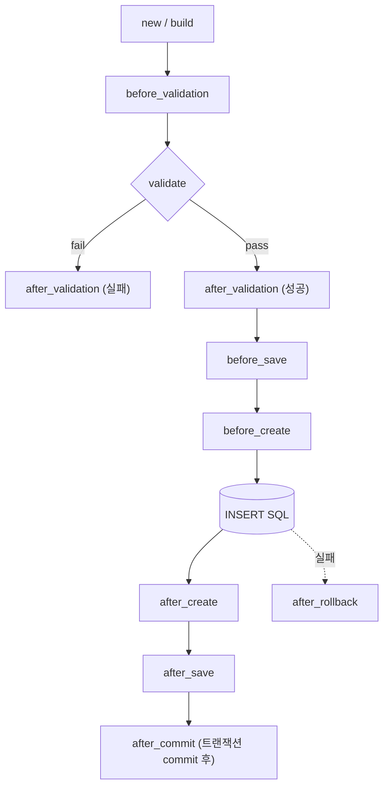
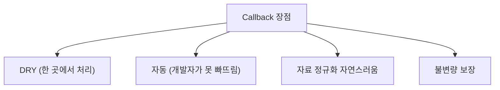
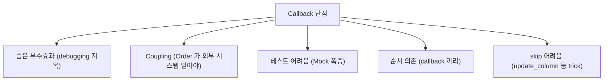
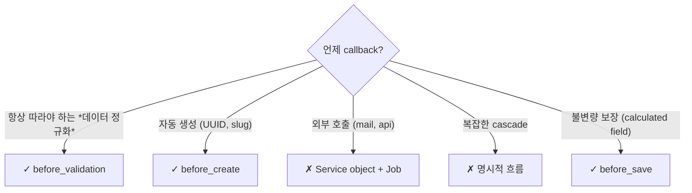

## 정의

**ActiveRecord Callbacks** = 모델의 *라이프사이클 이벤트* (생성, 갱신, 삭제) 에 *훅* 을 거는 메커니즘. *DRY + 자동화* 가 매력이지만 *암묵적 부수효과* 의 함정이 큼.

> [!IMPORTANT]
> Rails 의 *철학적 선물 + 저주*. 2026 시점 *큰 코드베이스에서 callback 줄이고 Service object 로 옮기는* 추세.

## 콜백 순서 (Create 시)



## 콜백 종류

| 단계 | callback |
|---|---|
| **Validation** | `before_validation`, `after_validation` |
| **Save (create + update 공통)** | `before_save`, `around_save`, `after_save` |
| **Create only** | `before_create`, `around_create`, `after_create` |
| **Update only** | `before_update`, `around_update`, `after_update` |
| **Destroy** | `before_destroy`, `around_destroy`, `after_destroy` |
| **Transaction** | `after_commit`, `after_rollback`, `after_save_commit`, `after_create_commit`, `after_update_commit`, `after_destroy_commit` |
| **Initialization** | `after_initialize`, `after_find` |
| **Touch** | `after_touch` |

## 사용

```ruby
class Order < ApplicationRecord
  # 정규화
  before_validation :normalize_email

  # 비즈니스 로직
  before_create :generate_order_number

  # 외부 호출 (after_commit 만!)
  after_commit :send_confirmation_email, on: :create
  after_commit :enqueue_analytics, on: :create

  # 갱신 시 cascade
  after_save :update_total

  private

  def normalize_email
    self.email = email&.downcase&.strip
  end

  def generate_order_number
    self.order_number = "ORD-#{SecureRandom.hex(6).upcase}"
  end

  def send_confirmation_email
    OrderMailer.confirmation(self).deliver_later
  end

  def update_total
    total = items.sum(&:price)
    update_column(:total, total)   # callback 회피
  end
end
```

## 장점



### 1. DRY

```ruby
# Without callback
class OrdersController
  def create
    order = Order.new(params)
    order.normalize_email   # 잊기 쉬움
    order.generate_order_number
    if order.save
      OrderMailer.confirmation(order).deliver_later
      AnalyticsJob.perform_later(order)
    end
  end
end

# Controller 5개 다 똑같이 반복...

# With callback
class OrdersController
  def create
    Order.create(params)
    # 자동으로 정규화 + 번호 + 메일 + 분석
  end
end
```

### 2. 깜빡임 방지

새 개발자가 *Order.create* 만 호출해도 *모든 부수효과 자동*. 비즈니스 룰 누락 X.

## 단점



### 1. 숨은 부수효과

```ruby
order.update(status: 'paid')
# 무슨 일이?
# - before_validation
# - after_validation
# - before_save
# - before_update
# - SQL UPDATE
# - after_update
# - after_save
# - after_commit
#   - send_confirmation_email → SMTP 호출 (느림, 실패 가능)
#   - update_inventory → 재고 system 호출
#   - notify_admin → Slack webhook
#   - enqueue_loyalty_points → Sidekiq job
#   - ...

# 디버깅: order.update 한 줄이 뭘 하는지 *몰라*. 코드 trace 필요.
```

### 2. 테스트 어려움

```ruby
# 단위 테스트
it "updates total" do
  order.update(items: [...])
  expect(order.total).to eq(100)
end

# 실패: SMTP 가 stub 안 되어서 에러
# → 매번 callback mock 해야 함
allow(OrderMailer).to receive_message_chain(:confirmation, :deliver_later)
allow(AnalyticsJob).to receive(:perform_later)
# ... 5개 더
```

### 3. 순서 의존성

```ruby
class Order
  after_create :send_email    # 1
  after_create :charge_card   # 2

  # 정의 순서대로 실행. send_email 이 먼저!
  # 결제 실패해도 이메일 발송됨
end
```

### 4. Cascade 폭발

```ruby
class Order
  after_save :update_user_stats
end

class User
  after_save :recalculate_loyalty
end

class Loyalty
  after_save :send_tier_change_email
end

# Order.update → User.save → Loyalty.save → Email!
# 의도치 않은 chain reaction
```

## 안전 가이드

### `after_commit` 만 외부 호출

```ruby
# ❌ 트랜잭션 중에 외부 호출
after_save :send_email   # 트랜잭션 rollback 시 이메일 이미 갔음

# ✓ 커밋 후
after_commit :send_email, on: :create
```

### 동기 vs 비동기

```ruby
# ❌ 콜백에서 동기 호출
after_commit :fetch_from_external_api   # 외부 API 다운 → save 실패

# ✓ 비동기 Job 으로 위임
after_commit :enqueue_external_fetch
def enqueue_external_fetch
  ExternalFetchJob.perform_later(self.id)
end
```

### 패턴: Service Object 권장

```ruby
# ❌ Fat callbacks
class Order
  after_create :send_email
  after_create :update_inventory
  after_create :charge_card
  after_create :notify_admin
  # 비즈니스 로직이 모델 안
end

# ✓ Service object
class OrdersController
  def create
    result = OrderCreationService.call(order_params)
    if result.success?
      render json: result.order
    else
      render json: result.errors, status: 422
    end
  end
end

class OrderCreationService
  def self.call(params)
    ActiveRecord::Base.transaction do
      order = Order.create!(params)
      InventoryUpdateService.call(order)
      PaymentService.call(order)
    end
    EmailService.send_confirmation(order)   # 트랜잭션 밖
    AdminNotificationService.call(order)
    Result.success(order)
  rescue => e
    Result.failure(e.message)
  end
end
```

## Callbacks 우회

```ruby
order.update_column(:status, 'paid')           # callback skip!
order.update_columns(status: 'paid', total: 100)
Order.update_all(status: 'archived')           # callback skip!
order.touch(:viewed_at)                          # after_touch 만 (다른 callback skip)
```

> [!CAUTION]
> *callback skip = 의도적이지만 위험*. callback 의존하는 로직이 안 돌아감. 데이터 무결성 깨질 수 있음.

## 결정 가이드



## 흔한 함정

> [!WARNING]
> 1. **after_save 에 외부 호출** = 트랜잭션 rollback 시 이미 호출됨. `after_commit` 으로.
> 2. **Cascade callback** = 한 save 가 *수십 callback chain*. 디버깅 지옥.
> 3. **`update_column` 으로 callback skip 의존** = 다른 곳에서 일반 `update` 사용 → callback 발동 → 다른 결과.
> 4. **Polymorphic + callback** = `delegate :save, to: :parent` 같이 우회 시 *callback 빠짐*.

## 관련 위키

- [[ruby-on-rails]]
- [[rails-activerecord-basics]]
- [[rails-activerecord-validations]]
- [[rails-concerns]]
- [[rails-active-job-patterns]]
