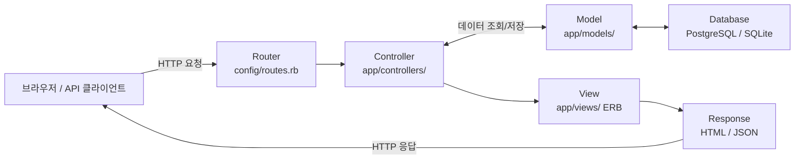

## 정의

**Ruby on Rails** (또는 Rails)는 Ruby 언어 기반의 풀스택 웹 프레임워크다. David Heinemeier Hansson (DHH)이 2004년 Basecamp 개발 중 추출했으며, "Convention over Configuration"을 핵심 철학으로 빠른 개발과 생산성을 강조한다.

[[Django]]와 함께 대표적인 "batteries-included" 철학의 웹 프레임워크로, ORM, 라우팅, 템플릿, 마이그레이션, 테스트 등 웹 개발에 필요한 모든 요소를 제공한다.

## 핵심 철학

- **Convention over Configuration (CoC)**: 설정보다 관습. 디렉토리 구조, 파일명 규칙을 따르면 설정 파일 작성을 최소화할 수 있다.
- **DRY (Don't Repeat Yourself)**: 중복 제거. 같은 로직을 여러 곳에 반복하지 않는다.
- **Omakase (お任せ)**: "주방장에게 맡기기". DHH가 선택한 도구와 패턴을 그대로 받아들이는 것을 권장한다.

## MVC 구조

Rails는 Model-View-Controller 패턴을 따른다.



| 계층 | 역할 | 주요 클래스 |
|:---|:---|:---|
| Model | 비즈니스 로직, 데이터베이스 접근 | ActiveRecord::Base |
| View | HTML, JSON 렌더링 | ERB, Slim, Haml, ViewComponent |
| Controller | 요청 처리, 흐름 제어 | ActionController::Base |

## 주요 구성 요소

### ActiveRecord (ORM)

데이터베이스 테이블과 Ruby 클래스를 1:1 매핑. `users` 테이블은 `User` 모델로, `created_at`은 자동 timestamp.

```ruby
class User < ApplicationRecord
  has_many :posts
  validates :email, presence: true, uniqueness: true
end

User.where(active: true).order(:created_at).limit(10)
```

### ActionPack (라우팅, 컨트롤러)

RESTful 라우팅을 기본 제공.

```ruby
# config/routes.rb
resources :posts  # 7개 RESTful route 자동 생성 (index, show, new, create, edit, update, destroy)

# app/controllers/posts_controller.rb
class PostsController < ApplicationController
  def index
    @posts = Post.all
  end
end
```

### ActionView (템플릿)

ERB (Embedded Ruby) 또는 ViewComponent를 사용. 레이아웃, 파셜, 헬퍼로 중복 제거.

### ActiveJob (백그라운드 작업)

비동기 작업 처리. Sidekiq, Resque, DelayedJob 등 백엔드와 연동.

### ActionCable (WebSocket)

실시간 양방향 통신. 채팅, 알림 등에 사용.

### ActionMailer (이메일)

이메일 발송. 템플릿과 컨트롤러처럼 작성.

## 마이그레이션

데이터베이스 스키마를 버전 관리한다. `db/migrate/` 아래 타임스탬프 파일로 순차 실행.

```ruby
# db/migrate/20260615123456_create_users.rb
class CreateUsers < ActiveRecord::Migration[7.0]
  def change
    create_table :users do |t|
      t.string :email, null: false
      t.timestamps
    end
    add_index :users, :email, unique: true
  end
end
```

`rails db:migrate` 실행 시 `schema_migrations` 테이블에 기록, 롤백은 `rails db:rollback`.

## Hotwire (Turbo + Stimulus)

SPA (Single Page Application) 없이 반응성을 확보하는 Rails 7 기본 스택.

- **Turbo**: 페이지 전환 시 `<body>`만 교체 (Turbo Drive), 부분 렌더링 (Turbo Frames), WebSocket 스트리밍 (Turbo Streams)
- **Stimulus**: 최소한의 JavaScript 컨트롤러로 DOM 이벤트 처리

## 에코시스템

| 도구 | 역할 |
|:---|:---|
| Bundler | gem 의존성 관리 |
| RSpec | 테스트 프레임워크 (minitest는 기본 포함) |
| FactoryBot | 테스트 fixture 생성 |
| Devise | 인증 (로그인, 회원가입) |
| Sidekiq | 백그라운드 작업 (Redis 기반) |
| Puma | 웹 서버 (Rails 기본) |
| Capistrano | 배포 자동화 |

## 약점과 주의점

- **메모리 사용량**: Ruby 프로세스당 50~200MB 이상. 멀티 프로세스 (Puma worker) 사용 시 메모리 부담 큼.
- **CPU 집약 작업**: GIL (Global Interpreter Lock)로 인해 멀티코어 활용 제한. CPU 집약 작업은 별도 서비스 (Go, Rust)로 분리 권장.
- **N+1 쿼리**: ActiveRecord의 편리함 뒤에 숨은 성능 문제. `includes`, `joins` 로 eager loading 필수.
- **Scaling**: Monolith 구조로 시작하기 쉽지만, 트래픽 증가 시 수평 확장 (horizontal scaling) 전략 필요. 세션 관리는 Redis 등 외부 저장소 권장 ([[Sticky Session]] 회피).
- **Monolith vs Microservice**: Rails는 monolith에 강점. 마이크로서비스로 전환 시 API 모드 (rails new --api) 사용 가능하지만, Rails의 장점 (CoC, 생산성)이 반감될 수 있음.

## 디렉토리 구조

```
app/
├── controllers/    ← 요청 처리 로직
├── models/         ← ActiveRecord 모델 + 비즈니스 로직
├── views/          ← ERB 템플릿
├── helpers/        ← 뷰 헬퍼
├── mailers/        ← ActionMailer
├── jobs/           ← ActiveJob
└── channels/       ← ActionCable WebSocket

config/
├── routes.rb       ← 라우팅 정의
├── database.yml    ← DB 연결 설정
└── environments/   ← 환경별 설정 (dev/test/prod)

db/
├── migrate/        ← 마이그레이션 파일들
├── schema.rb       ← 현재 스키마 스냅샷
└── seeds.rb        ← 초기 데이터

test/ (또는 spec/)  ← 테스트 (minitest 또는 RSpec)
```

## Rails 버전별 주요 변화

| 버전 | 출시 | 주요 변화 |
|:---|:---|:---|
| Rails 7.0 | 2021.12 | Hotwire 기본 포함, importmap 도입, encrypted attributes |
| Rails 7.1 | 2023.10 | Solid Queue/Cache/Cable 도입, Devcontainer 지원, `generate migration --json` |
| Rails 7.2 | 2024.08 | Puma thread count 자동화, DEV container 기본 포함 |
| Rails 8.0 | 2024.11 | Solid trio 기본 포함, Kamal 2 배포, SQLite 프로덕션 준비 완료 |

### Rails 7 핵심: Hotwire

SPA 없이 반응성을 확보하는 Rails 7 기본 스택:

- **Turbo Drive**: `<body>`만 교체해 페이지 전환 (풀 리로드 없음)
- **Turbo Frames**: 페이지 일부만 업데이트
- **Turbo Streams**: WebSocket/SSE로 실시간 부분 렌더링
- **Stimulus**: 최소한의 JS 컨트롤러로 DOM 이벤트 처리

```ruby
# Turbo Stream 응답 예시
# app/controllers/posts_controller.rb
def create
  @post = Post.create!(post_params)
  respond_to do |format|
    format.turbo_stream  # app/views/posts/create.turbo_stream.erb
    format.html { redirect_to @post }
  end
end
```

```erb
<%# app/views/posts/create.turbo_stream.erb %>
<%= turbo_stream.prepend "posts", partial: "post", locals: { post: @post } %>
```

### Rails 8 핵심: Solid 스택

Redis / Sidekiq 없이 SQLite로 대체:

| 기존 | Rails 8 기본 |
|:---|:---|
| Redis + Sidekiq | Solid Queue |
| Redis Cache | Solid Cache |
| Action Cable + Redis | Solid Cable |

소규모 서비스는 Redis 없이도 완전한 비동기 처리가 가능해졌다.

## Convention over Configuration 예시

Rails의 관습 덕분에 설정 없이도 동작하는 것들:

```ruby
# 테이블명 자동 매핑
class User < ApplicationRecord; end   # → 'users' 테이블
class OrderItem < ApplicationRecord; end # → 'order_items' 테이블

# FK 자동 추론
class Post < ApplicationRecord
  belongs_to :user   # → user_id 컬럼 자동
end

# URL 헬퍼 자동 생성
resources :posts
# → posts_path, post_path(@post), edit_post_path(@post), ...

# 파일 자동 로드 (Zeitwerk)
# app/models/user.rb → User 클래스 자동
# app/models/admin/user.rb → Admin::User 클래스 자동
```

## 사용 사례

- **GitHub**: 초기 Rails로 구축, 현재도 일부 코어 로직 유지
- **Shopify**: Rails monolith + modular monolith 전략
- **Basecamp**: DHH의 회사, Rails 탄생지
- **Airbnb**: 초기 Rails로 성장, 이후 일부 서비스 분리
- **Cookpad, Freee**: 일본 대형 서비스, Rails 기반 유지

## 대안

Rails 외의 Ruby 웹 프레임워크와 비교:

| 프레임워크 | 특징 | 선택 기준 |
|:---|:---|:---|
| Sinatra | 초경량 DSL, 미니멀리즘 | API 서버, 마이크로서비스 |
| Hanami | 함수형, 명시적 의존성, 느린 매직 | 대규모 앱, 테스트 중심 |
| Grape | REST API 전용 DSL | API 전용 엔드포인트 빠른 구현 |
| Padrino | Sinatra 위의 full-stack | Rails 대안, 소규모 앱 |

다른 언어의 유사 프레임워크:

| 언어 | 프레임워크 | Rails와의 유사도 |
|:---|:---|:---|
| Python | [[django]] | 매우 유사 (CoC, ORM, Admin) |
| PHP | Laravel | 유사 (Eloquent = ActiveRecord) |
| JavaScript | Adonis.js | 유사 (MVC, CLI, ORM) |
| Java | Grails | Groovy + Spring 기반 Rails 대응 |

## 함정

> [!WARNING]
> **N+1 쿼리**: ActiveRecord의 편리함 뒤에 N+1이 숨어 있다. bullet gem + `strict_loading`으로 개발 중 조기 발견. [[rails-query-optimization]] 참고.

> [!CAUTION]
> **`before_action` 남용**: 필터로 공통 로직 추출은 편하지만, 과하면 실행 흐름이 불명확해진다. 명시적 메서드 호출과 균형 유지.

> [!WARNING]
> **Fat Model**: "Skinny Controller, Fat Model" 권장이지만, 모델이 너무 비대해지면 유지보수가 어려워진다. Service Object, Form Object, Concern으로 분리 고려.

> [!IMPORTANT]
> **Rails Callback 순서 복잡성**: `before_save`, `before_validation`, `after_commit` 등 콜백 실행 순서가 복잡하다. 특히 트랜잭션과 `after_commit` 타이밍을 혼동하지 않도록 주의. [[rails-callbacks]] 참고.

> [!CAUTION]
> **메모리 사용량**: Ruby 프로세스당 50-200MB. 대규모 요청 처리 시 Puma worker 수와 메모리 상한을 조정해야 한다.

## 관련 위키

- [[rails-activerecord-basics]] - ActiveRecord 기초
- [[rails-activerecord-associations]] - 연관 관계 (belongs_to, has_many)
- [[rails-query-optimization]] - N+1 해결, 쿼리 최적화
- [[rails-controllers]] - 컨트롤러 패턴
- [[rails-routes]] - 라우팅 설정
- [[rails-hotwire-turbo]] - Turbo / Stimulus
- [[rails-testing-rspec]] - RSpec 테스트
- [[rails-rails8-solid]] - Rails 8 Solid 스택
- [[django]] - Python 유사 프레임워크 비교
